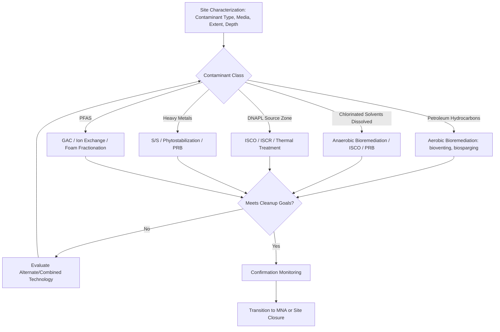

## Pollution Remediation Approaches

### Definition and Scope

Pollution remediation encompasses the engineered and natural processes used to remove, destroy, immobilize, or reduce the concentration of contaminants in environmental media (soil, groundwater, surface water, sediment, air) to protective levels. This field draws on environmental engineering, chemistry, and microbiology to select and design site-specific treatment strategies based on contaminant properties, media characteristics, and cleanup objectives.

### Remediation Strategy Framework

**Treatment Location Classification**

- **In-situ remediation**: Treatment applied directly in place without excavation or extraction, generally preferred for large contaminated volumes or deep contamination due to lower cost and reduced disturbance, though it typically requires longer timeframes and more complex performance monitoring than ex-situ approaches. [Inference: general trade-off widely recognized in remediation engineering practice; specifics are site-dependent]
- **Ex-situ remediation**: Treatment requiring excavation (soil) or extraction (groundwater) before treatment occurs, generally offering more control over treatment conditions and faster implementation but at higher cost and with greater site disturbance.

**Treatment Mechanism Classification**

- **Destruction**: Chemical or biological transformation that breaks down the contaminant into less harmful products (ideally complete mineralization to $\text{CO}_2$, $\text{H}_2\text{O}$, and innocuous byproducts).
- **Extraction/Removal**: Physical separation of the contaminant from the media without necessarily altering its chemical form (e.g., soil vapor extraction, pump-and-treat).
- **Immobilization**: Reducing contaminant mobility/bioavailability without necessarily removing or destroying it (e.g., solidification/stabilization, in-situ capping).
- **Containment**: Physical or hydraulic barriers preventing contaminant migration without treating the contamination itself (e.g., slurry walls, hydraulic containment via pumping).

### Physical/Chemical Remediation Technologies

**Soil Vapor Extraction (SVE)**

Applies vacuum to the unsaturated (vadose) zone to volatilize and extract volatile organic contaminants, particularly effective for compounds with sufficiently high vapor pressure and Henry's Law constant. Extracted vapor typically requires above-ground treatment (activated carbon adsorption or thermal/catalytic oxidation) before atmospheric discharge.

**Pump-and-Treat**

Extraction of contaminated groundwater via wells, followed by ex-situ treatment (air stripping, activated carbon, advanced oxidation) and either discharge or reinjection. Widely used historically but recognized to have significant limitations for achieving complete restoration, particularly at sites with DNAPL source zones, due to rate-limited desorption from low-permeability zones and matrix diffusion effects that cause "tailing" and "rebound" in contaminant concentrations. [Inference: well-documented limitation in the remediation engineering literature across numerous long-term pump-and-treat sites]

**In-Situ Chemical Oxidation (ISCO)**

Injection of strong oxidants directly into the contaminated zone to chemically destroy organic contaminants:

- **Permanganate ($\text{MnO}_4^-$)**: Effective against chlorinated ethenes; relatively stable and long-lasting in the subsurface, allowing extended contact time.
- **Persulfate ($\text{S}_2\text{O}_8^{2-}$)**: Often activated (by heat, iron, or peroxide) to generate sulfate radicals; effective against a broad range of organic contaminants.
- **Fenton's Reagent (hydrogen peroxide + iron catalyst)**: Generates hydroxyl radicals via the classic Fenton reaction:

$$\text{Fe}^{2+} + \text{H}_2\text{O}_2 \rightarrow \text{Fe}^{3+} + \cdot\text{OH} + \text{OH}^-$$

producing highly reactive, non-selective oxidation capable of degrading a wide range of organic contaminants, though the reaction is typically fast and exothermic, requiring careful injection design to manage heat and gas generation.

**In-Situ Chemical Reduction (ISCR)**

Injection of reductants (commonly zero-valent iron, ZVI) to promote reductive dechlorination or immobilization of redox-sensitive metals (e.g., reducing soluble $\text{Cr}^{6+}$ to less mobile, less toxic $\text{Cr}^{3+}$).

**Permeable Reactive Barriers (PRBs)**

Passive in-situ treatment walls installed perpendicular to groundwater flow, typically filled with zero-valent iron or other reactive media, treating the plume as it passively flows through the barrier without requiring active pumping. Well-suited for shallow, well-characterized plumes with predictable flow direction.

**Solidification/Stabilization (S/S)**

Mixing of contaminated soil/waste with binding agents (Portland cement, lime, fly ash, or proprietary reagents) to physically encapsulate contaminants and/or chemically reduce their leachability, most commonly applied to metal-contaminated soils and sludges prior to disposal or as a final in-place remedy.

**Thermal Remediation**

- **Steam-enhanced extraction**: Injection of steam to volatilize and mobilize contaminants for recovery, effective for both LNAPL and some DNAPL source zones.
- **Electrical resistance heating (ERH) / thermal conductive heating**: In-situ heating of soil to volatilize contaminants, often achieving rapid, aggressive source zone treatment but at relatively high energy cost.

### Biological Remediation Technologies

**Bioremediation Fundamentals**

Relies on microbial metabolism to degrade organic contaminants, requiring adequate electron donor/acceptor availability, nutrients, and favorable environmental conditions (temperature, pH, moisture) for microbial activity.

**Enhanced Aerobic Bioremediation**

- **Bioventing**: Injection of air into the unsaturated zone to stimulate aerobic biodegradation of petroleum hydrocarbons and similar compounds.
- **Biosparging**: Air injection below the water table to stimulate aerobic biodegradation in the saturated zone.

**Enhanced Anaerobic Bioremediation**

- **Reductive dechlorination**: Sequential microbial removal of chlorine atoms from chlorinated solvents (e.g., $\text{PCE} \rightarrow \text{TCE} \rightarrow \text{DCE} \rightarrow \text{VC} \rightarrow \text{ethene}$), typically requiring an electron donor amendment (e.g., lactate, vegetable oil, molasses) to create the strongly reducing conditions favorable to dechlorinating organisms, notably *Dehalococcoides* species capable of complete dechlorination to non-toxic ethene.
- **Bioaugmentation**: Direct addition of specialized microbial cultures (e.g., commercially available *Dehalococcoides*-containing consortia) to sites lacking the native microbial populations capable of complete degradation.

**Monitored Natural Attenuation (MNA)**

A remediation approach relying on naturally occurring physical, chemical, and biological processes (dilution, dispersion, sorption, volatilization, biodegradation) to reduce contaminant mass, concentration, or toxicity over time. MNA requires a robust monitoring program to demonstrate that attenuation is occurring at a rate protective of downgradient receptors, and is typically applied as a component of a broader remedy rather than a standalone approach for higher-risk sites. [Inference: regulatory acceptance criteria for MNA as primary remedy varies by jurisdiction and site risk profile]

**Phytoremediation**

Use of plants to extract, degrade, stabilize, or volatilize contaminants:

- **Phytoextraction**: Plant uptake and accumulation of contaminants (notably metals) into harvestable biomass.
- **Phytodegradation**: Plant or plant-associated microbial degradation of organic contaminants.
- **Phytostabilization**: Plant-mediated immobilization of contaminants in the root zone, reducing erosion and leaching.
- **Rhizofiltration**: Root-mediated uptake of contaminants from water.

Phytoremediation generally offers lower cost and reduced site disturbance compared to engineered alternatives but requires substantially longer timeframes and is generally limited to shallow contamination within root zone depth and low-to-moderate contaminant concentrations that are not phytotoxic. [Inference: general limitations documented in remediation literature; applicability is contaminant- and site-specific]

**Constructed Wetlands**

Engineered systems mimicking natural wetland processes (sedimentation, filtration, microbial degradation, plant uptake) for treatment of contaminated water, including acid mine drainage, agricultural runoff, and some industrial wastewaters, typically requiring larger land area than conventional treatment but offering lower operating cost and ecological co-benefits.

### Emerging and Advanced Technologies

**Nanoremediation**

Use of engineered nanoparticles, notably nanoscale zero-valent iron (nZVI), injected directly into the subsurface to achieve more effective distribution and reactivity compared to conventional granular ZVI, an area of active research and growing field application with ongoing investigation into particle mobility, longevity, and potential ecotoxicological effects of nanoparticles themselves. [Inference: reflects an active area of technology development; field-scale performance and long-term environmental behavior remain subjects of ongoing study]

**PFAS-Specific Treatment**

Given PFAS resistance to conventional biological and chemical treatment, remediation approaches focus predominantly on:

- **Granular activated carbon (GAC) and ion exchange resins**: Sorptive removal from water, requiring eventual media regeneration or disposal.
- **Foam fractionation**: Exploits PFAS surfactant properties to concentrate the contaminant at an air-water interface for separation.
- **Destructive technologies**: Supercritical water oxidation, electrochemical oxidation, and plasma-based treatment are under active development to achieve true PFAS destruction rather than phase transfer, though large-scale commercial deployment remains an evolving area as of this writing. [Unverified: technology readiness levels and commercial availability change rapidly; current status should be verified against recent literature]

### Remediation Technology Selection Matrix

| Contaminant Type | Preferred In-Situ Options | Preferred Ex-Situ Options |
| --- | --- | --- |
| Petroleum hydrocarbons | Bioventing, biosparging, MNA | Excavation, land farming |
| Chlorinated solvents (dissolved) | ISCO, enhanced anaerobic bioremediation, PRB | Pump-and-treat with air stripping/GAC |
| Chlorinated solvent DNAPL | ISCO, ISCR, thermal treatment | Excavation (if shallow/accessible) |
| Heavy metals (soil) | Phytostabilization, in-situ S/S | Excavation + S/S or disposal |
| Heavy metals (groundwater) | PRB (ZVI), in-situ precipitation | Pump-and-treat with precipitation |
| PFAS | Limited in-situ options (active research area) | GAC, ion exchange, foam fractionation |

### Remediation Technology Selection Diagram

### Worked Example

**Problem**: A site has a dissolved TCE plume in groundwater at 5,000 µg/L, with strongly reducing geochemical conditions already present (elevated dissolved iron and methane detected) but low natural organic carbon. Recommend an appropriate remediation approach and justify the selection.

**Solution**:

The presence of strongly reducing conditions (elevated dissolved iron, methane) suggests some degree of anaerobic reductive dechlorination may already be occurring naturally, but low native organic carbon indicates the electron donor supply may be insufficient to sustain complete dechlorination at a rate protective of downgradient receptors. Given this reasoning:

1. **Primary recommendation**: Enhanced anaerobic bioremediation via electron donor injection (e.g., emulsified vegetable oil or lactate) to boost the existing reducing conditions and ensure adequate electron donor supply for sustained reductive dechlorination.
2. **Consider bioaugmentation**: If site-specific molecular biological tools (e.g., quantitative PCR for *Dehalococcoides*) indicate insufficient native dechlorinating populations, bioaugmentation with a commercial dechlorinating culture should be added to the remedy.
3. **Monitoring**: Implement a robust performance monitoring program tracking daughter product formation (cis-DCE, vinyl chloride, ethene) to confirm complete dechlorination is occurring, since accumulation of vinyl chloride without further degradation would indicate an incomplete/stalled dechlorination pathway requiring remedy adjustment.

This recommendation is based on general remediation design principles; an actual site remedy selection would require full review of site-specific geochemical data, hydrogeological characterization, and regulatory cleanup goals. [Inference: represents standard practice reasoning, not a substitute for site-specific engineering design]

### Applied Contexts

- **Brownfield redevelopment**: Remediation technology selection directly determines project cost, timeline, and feasibility for converting contaminated industrial sites to productive reuse.
- **Superfund/CERCLA remedy selection**: Formal feasibility studies systematically compare remediation alternatives against criteria including effectiveness, implementability, and cost under structured regulatory frameworks.
- **Vapor intrusion mitigation**: SVE and related technologies address the pathway by which subsurface volatile contaminants migrate into overlying building indoor air.
- **Agricultural and mining legacy site restoration**: Phytoremediation and constructed wetlands are frequently favored for large-area, lower-concentration legacy contamination where cost-effective, longer-timeframe solutions are acceptable.
- **PFAS emerging contaminant response**: Water utilities and industrial dischargers are rapidly adopting GAC and ion exchange systems in response to evolving regulatory standards, while destructive technology development continues. [Inference: reflects a rapidly evolving regulatory and technology landscape as of this writing]

### Key Points

- Remediation technology selection depends fundamentally on contaminant class, phase (dissolved, sorbed, NAPL), and site hydrogeology, with no universal "best" technology across all conditions.
- In-situ approaches generally offer lower cost and disturbance but longer timeframes; ex-situ approaches offer more control and speed at higher cost.
- Destruction technologies (bioremediation, ISCO) are generally preferred over containment/immobilization when feasible, since they address contaminant mass rather than simply limiting mobility.
- Chlorinated solvent remediation has evolved significantly from purely physical pump-and-treat approaches toward in-situ chemical and biological destruction technologies with generally improved long-term outcomes.
- PFAS remediation remains an area of active technological development, currently dominated by sorptive removal technologies pending broader commercial deployment of destructive alternatives.

**Related Topics**

- DNAPL/LNAPL characterization and source zone delineation
- Reductive dechlorination microbiology and bioaugmentation culture selection
- Vapor intrusion assessment and mitigation
- Superfund/CERCLA feasibility study process
- PFAS treatment technology development
- Nanoremediation and engineered nanoparticle applications
- Constructed wetland design for water treatment
- Brownfield redevelopment financing and regulatory programs
- Long-term monitoring and remedy optimization
- Green and sustainable remediation practices