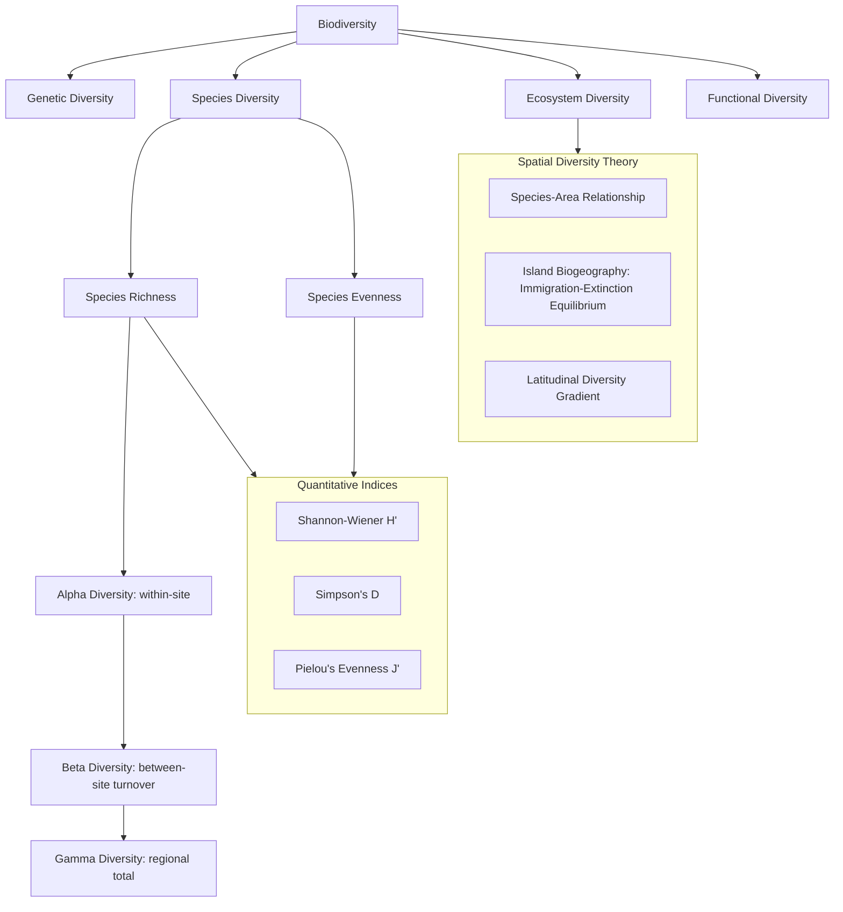

## Principles of Biodiversity

### Definition and Scope

Biodiversity refers to the variety of life at all levels of biological organization, encompassing genetic variation within species, the diversity of species within communities, and the diversity of ecosystems across landscapes. As a foundational concept in conservation biology, biodiversity is both a descriptive measure of biological variety and a normative target underlying most conservation policy and ecosystem management frameworks.

### Levels of Biodiversity

**Genetic Diversity**

Variation in genetic makeup among individuals within a species or population, arising from mutation, recombination, and gene flow, and maintained or eroded by selection, genetic drift, and mating patterns. Genetic diversity underpins a population's capacity to adapt to environmental change and is commonly assessed via measures such as allelic richness, heterozygosity, and nucleotide diversity.

**Species Diversity**

The variety of species within a given area, typically decomposed into two complementary components:

- **Species richness**: The simple count of distinct species present in a defined area, without regard to their relative abundance.
- **Species evenness**: The relative abundance distribution among species; a community where abundance is evenly distributed across species is considered more "even" than one dominated by a few numerically superior species.

**Ecosystem Diversity**

The variety of habitats, biotic communities, and ecological processes occurring within a region or across the biosphere, encompassing variation in structure (e.g., forest strata), composition (species assemblages), and function (nutrient cycling, energy flow patterns).

**Functional Diversity**

An increasingly emphasized dimension describing the range and value of species traits that influence ecosystem functioning (e.g., body size, feeding strategy, dispersal mode, nitrogen-fixing capability), recognized as often more directly predictive of ecosystem process rates than species richness alone. [Inference: reflects current consensus in functional ecology literature, though the relative predictive power of functional vs. taxonomic diversity remains an active research area]

### Quantitative Diversity Indices

**Species Richness (S)**

The simplest diversity metric: a direct count of species present. Sensitive to sampling effort, requiring standardized sampling protocols or rarefaction techniques for valid comparison across sites of differing sample sizes.

**Shannon-Wiener Diversity Index (H')**

Incorporates both richness and evenness, derived from information theory:

$$H' = -\sum_{i=1}^{S} p_i \ln(p_i)$$

where $p_i$ is the proportional abundance of species $i$ and $S$ is total species richness. Higher $H'$ values indicate greater diversity (more species, more evenly distributed); the index is sensitive to the presence of rare species.

**Simpson's Diversity Index (D)**

Represents the probability that two individuals randomly selected from a community belong to different species:

$$D = 1 - \sum_{i=1}^{S} p_i^2$$

Simpson's index is generally considered less sensitive to rare species and more heavily weighted toward dominant species compared to the Shannon index, making the choice between indices dependent on whether rare or common species are of greater interest to the specific research question. [Inference: reflects standard ecological statistics guidance]

**Pielou's Evenness Index (J')**

Standardizes Shannon diversity against the maximum possible diversity for the observed richness, isolating the evenness component:

$$J' = \frac{H'}{\ln(S)}$$

Values range from 0 (maximal dominance by a single species) to 1 (perfectly even abundance distribution).

**Alpha, Beta, and Gamma Diversity**

A hierarchical framework (Whittaker, 1960) for partitioning diversity across spatial scales:

- **Alpha diversity ($\alpha$)**: Diversity within a single site or local community.
- **Beta diversity ($\beta$)**: The degree of turnover in species composition between sites or along an environmental gradient, quantifying how distinct communities are from one another.
- **Gamma diversity ($\gamma$)**: Total diversity across a larger region encompassing multiple sites/communities.

The multiplicative relationship is expressed as:

$$\gamma = \alpha \times \beta$$

(alternative additive partitioning formulations, $\gamma = \alpha + \beta$, are also used depending on the specific analytical framework). [Inference: choice between multiplicative and additive partitioning is a documented methodological distinction in biodiversity statistics literature]

### Patterns of Biodiversity Distribution

**Latitudinal Diversity Gradient**

One of the most well-documented large-scale ecological patterns: species richness generally increases from the poles toward the equator across a broad range of taxonomic groups. Multiple, non-mutually-exclusive hypotheses have been proposed to explain this pattern, including greater available energy/productivity in tropical regions, longer evolutionary time for diversification (tropics as both a "cradle" and "museum" of diversity), higher rates of speciation in warm, stable climates, and reduced extinction rates in climatically stable regions. The relative contribution of each mechanism remains an active area of ecological and evolutionary research, and the explanation likely varies by taxonomic group and region. [Inference: reflects the current state of scientific debate; no single mechanism has been established as universally dominant]

**Species-Area Relationship**

Species richness increases with sampled area, commonly described by the power-law relationship:

$$S = cA^z$$

where $S$ is species richness, $A$ is area, $c$ is a constant related to taxon and region, and $z$ is the slope exponent (typically ranging 0.2–0.35 for mainland areas, often higher for oceanic islands). This relationship underlies both biogeographic theory and the design of protected area networks, since larger reserves generally support greater species richness. [Inference: exponent ranges are widely cited approximations in the biogeography literature; site-specific values vary]

**Island Biogeography Theory**

The MacArthur-Wilson (1967) theory of island biogeography models species richness on islands (or habitat "islands" more broadly) as a dynamic equilibrium between immigration and extinction rates:

- **Immigration rate**: Decreases with distance from the mainland source pool (more distant islands are harder to colonize) and decreases as the island fills toward saturation.
- **Extinction rate**: Increases with decreasing island size (smaller islands support smaller, more extinction-prone populations) and increases as species richness approaches saturation (competition intensifies).

The equilibrium species number occurs where immigration and extinction curves intersect, predicting that larger, less isolated islands support higher equilibrium diversity than smaller, more isolated ones. This theoretical framework directly informs modern reserve design principles, including the debated "SLOSS" (Single Large Or Several Small) question in conservation planning. [Inference: SLOSS debate remains genuinely unresolved in conservation biology, with outcomes depending on species-specific dispersal ability and habitat fragmentation patterns]

### Biodiversity Hotspots

A **biodiversity hotspot**, as formally defined by Conservation International, is a region meeting two strict criteria: containing at least 1,500 endemic vascular plant species (0.5% of the world's total), and having lost at least 70% of its original native habitat. This dual criterion identifies regions of both exceptional irreplaceability and exceptional threat, making hotspots a widely used prioritization tool for global conservation resource allocation. [Inference: specific numeric thresholds and hotspot count may be periodically revised by Conservation International; current figures should be verified against their published materials]

### Taxonomic and Phylogenetic Diversity

**Phylogenetic Diversity (PD)**

An alternative diversity measure that accounts for evolutionary relationships among species rather than treating all species as equivalent units, typically calculated as the sum of branch lengths on a phylogenetic tree connecting a set of taxa. Phylogenetic diversity is increasingly used in conservation prioritization because it can capture evolutionary distinctiveness that simple species counts miss—for example, prioritizing the conservation of an evolutionarily isolated lineage (with few close relatives) may preserve more unique evolutionary history than protecting an equivalent number of closely related species. [Inference: reflects growing but not universal adoption in conservation prioritization frameworks]

### Biodiversity Hierarchy and Measurement Framework Diagram

### Worked Example

**Problem**: Two forest plots each contain 100 individuals across 4 species. Plot A: 25, 25, 25, 25 individuals per species. Plot B: 91, 3, 3, 3 individuals per species. Calculate the Shannon-Wiener index for both plots and interpret the difference.

**Solution**:

**Plot A** ($p_i = 0.25$ for all four species):

$$H'_A = -\sum p_i \ln(p_i) = -4 \times (0.25 \times \ln(0.25)) = -4 \times (0.25 \times -1.386) = -4 \times (-0.3466) = 1.386$$

**Plot B** ($p_1 = 0.91$, $p_2=p_3=p_4=0.03$):

$$H'_B = -[0.91\ln(0.91) + 3 \times (0.03\ln(0.03))]$$

$$= -[0.91 \times (-0.0943) + 3 \times (0.03 \times -3.507)]$$

$$= -[-0.0858 + 3 \times (-0.1052)]$$

$$= -[-0.0858 - 0.3156] = 0.4014$$

**Interpretation**: Despite identical species richness ($S=4$) in both plots, Plot A has substantially higher Shannon diversity (1.386 vs. 0.401) due to its perfectly even abundance distribution, while Plot B is heavily dominated by a single species. This demonstrates why richness alone is an incomplete diversity descriptor, and why evenness-sensitive indices such as Shannon-Wiener provide meaningfully different ecological information. [Inference: calculation is a standard textbook application of the Shannon-Wiener formula]

### Applied Contexts

- **Protected area network design**: Species-area relationships and island biogeography theory directly inform reserve size, shape, and connectivity planning decisions.
- **Conservation prioritization**: Biodiversity hotspots and phylogenetic diversity metrics guide global and national resource allocation for conservation investment.
- **Environmental impact assessment**: Diversity indices (Shannon, Simpson) are standard tools for quantifying and comparing biological community condition before and after development projects or restoration interventions.
- **Climate change vulnerability assessment**: Understanding drivers of the latitudinal diversity gradient informs projections of how species distributions and community composition may shift under changing climate conditions.
- **Agricultural biodiversity management**: Genetic diversity principles underpin crop wild relative conservation and seed bank strategies to maintain resilience against pests, disease, and climate stress.

### Key Points

- Biodiversity operates across genetic, species, ecosystem, and functional levels of biological organization, each requiring distinct measurement approaches.
- Quantitative diversity indices (Shannon-Wiener, Simpson's, Pielou's evenness) capture different aspects of community structure, particularly the trade-off between richness and evenness sensitivity.
- The alpha-beta-gamma framework partitions diversity across spatial scales, distinguishing local diversity from regional turnover and total regional diversity.
- Island biogeography theory and the species-area relationship provide the theoretical foundation for modern protected area network design.
- Biodiversity hotspots combine measures of irreplaceability (endemism) and vulnerability (habitat loss) to prioritize global conservation investment.

**Related Topics**

- Population genetics and conservation genetics
- Community ecology and species interaction networks
- Habitat fragmentation and landscape connectivity
- Extinction risk assessment and IUCN Red List criteria
- Protected area design and reserve network planning
- Ecosystem services valuation
- Phylogenetics and evolutionary conservation prioritization
- Invasive species impacts on native biodiversity
- Climate change and species range shifts
- Restoration ecology and biodiversity recovery metrics