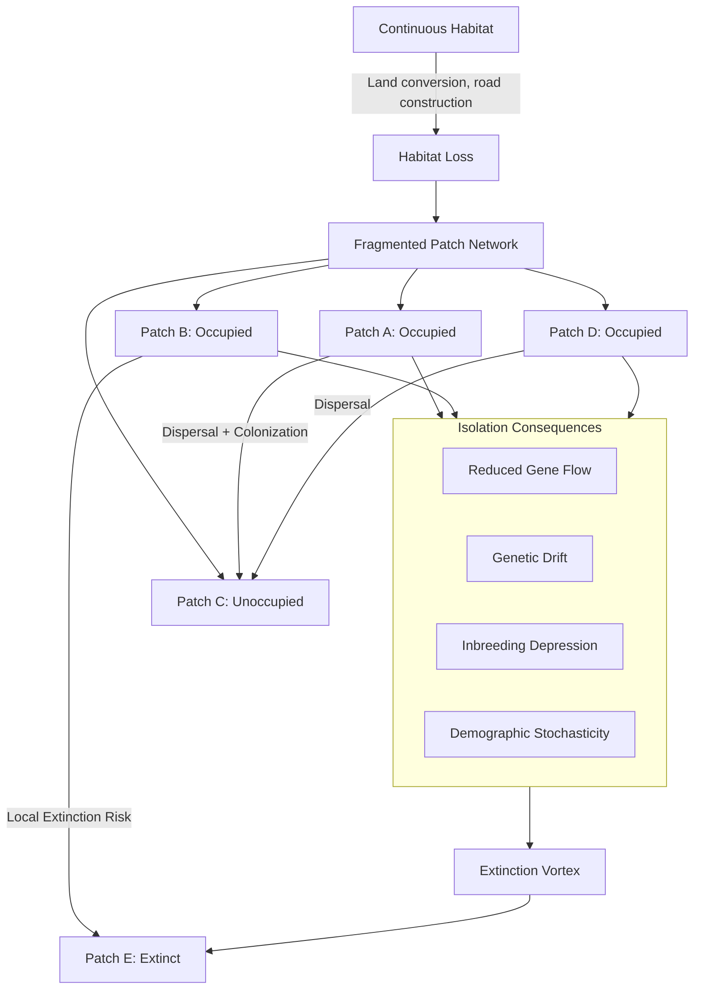

## Habitat Fragmentation and Connectivity

### Definition and Scope

Habitat fragmentation is the process by which a large, continuous habitat area is subdivided into smaller, more isolated patches, typically driven by anthropogenic land conversion (agriculture, urbanization, road construction) or, less commonly, natural processes. Connectivity refers to the degree to which the landscape facilitates or impedes movement of organisms, genes, and ecological processes between habitat patches. Together, these concepts form a central framework in landscape ecology and conservation biology for understanding and mitigating biodiversity loss in human-modified landscapes.

### Components of Fragmentation

Habitat fragmentation is conventionally understood as comprising several distinct but related landscape changes, which is important because they can have different, sometimes opposing, ecological consequences:

- **Habitat loss**: The outright reduction in total habitat area, generally recognized as having the most consistently negative effect on biodiversity among fragmentation components.
- **Reduced patch size**: Remaining habitat is distributed among smaller patches rather than fewer, larger ones.
- **Increased patch isolation**: Greater distance between remaining habitat patches, impeding dispersal and gene flow.
- **Increased edge-to-area ratio**: A greater proportion of remaining habitat lies near a patch boundary, exposing it to edge effects.

A significant and still-debated point in landscape ecology is the distinction between habitat loss and habitat fragmentation *per se* (the spatial arrangement of remaining habitat, independent of total area lost). Some researchers argue fragmentation per se can have effects independent of, and sometimes opposite to, habitat loss effects, while habitat loss itself is consistently identified as more strongly negative; this remains an area of active scientific debate. [Unverified: the "fragmentation per se" debate, associated with researchers including Lenore Fahrig, has not reached full scientific consensus regarding the direction and consistency of fragmentation-independent effects]

### Edge Effects

**Definition and Mechanisms**

Edge effects are the altered biotic and abiotic conditions that occur near the boundary between two different habitat types (e.g., forest-agricultural edge), including changes in microclimate (light, temperature, humidity, wind exposure), increased predation and nest parasitism pressure for certain taxa, altered vegetation structure and species composition, and increased invasive species establishment.

**Edge Depth**

The distance from a patch edge over which edge effects are measurably detectable, which varies substantially by the specific ecological variable measured and taxonomic group, ranging from a few meters (for some microclimate variables) to hundreds of meters (for some faunal community responses). [Inference: wide reported range is well-documented across the landscape ecology literature; exact values are highly context- and taxon-dependent]

**Patch Shape and Edge Proportion**

Patch shape strongly influences the proportion of habitat subject to edge effects; a circular patch minimizes edge-to-area ratio for a given area, while elongated or irregularly shaped patches maximize edge exposure. This principle directly informs reserve design guidance favoring compact patch shapes where edge-sensitive species are a conservation priority.

### Population and Genetic Consequences

**Metapopulation Dynamics**

Fragmented landscapes are often conceptualized using **metapopulation theory** (Levins, 1969), which models a species as a network of spatially discrete local populations (subpopulations) connected by occasional dispersal, where local extinction and recolonization events occur asynchronously across patches. The classic Levins metapopulation model describes patch occupancy dynamics as:

$$\frac{dp}{dt} = cp(1-p) - ep$$

where $p$ is the proportion of occupied patches, $c$ is the colonization rate coefficient, and $e$ is the extinction rate coefficient. Equilibrium patch occupancy is given by:

$$p^* = 1 - \frac{e}{c}$$

This simplified model assumes patches are identical and ignores spatial arrangement explicitly; more sophisticated spatially explicit metapopulation models (e.g., incorporating patch-specific area and isolation) are commonly used in applied conservation contexts. [Inference: the basic Levins model is a foundational but simplified theoretical construct; real-world applications typically require more complex extensions]

**Genetic Consequences of Isolation**

Reduced connectivity restricts gene flow between populations, leading to:

- **Genetic drift**: Increased in small, isolated populations, causing random loss of genetic variation over generations.
- **Inbreeding depression**: Reduced fitness resulting from increased mating among genetically related individuals in small, isolated populations.
- **Reduced adaptive capacity**: Diminished genetic variation limits a population's capacity to adapt to future environmental change (including climate change), representing a longer-term conservation concern beyond immediate demographic viability.

**Minimum Viable Population (MVP) and Extinction Vortex**

Small, isolated populations resulting from fragmentation are vulnerable to an **extinction vortex**: a self-reinforcing feedback loop in which small population size drives genetic and demographic deterioration (inbreeding depression, genetic drift, demographic stochasticity, Allee effects), which in turn further reduces population size, increasing extinction risk in an accelerating spiral. [Inference: extinction vortex is a well-established conceptual model in conservation biology, though the precise dynamics and thresholds are species- and context-specific]

### Landscape Connectivity Concepts

**Structural vs. Functional Connectivity**

- **Structural connectivity**: The physical arrangement and contiguity of habitat elements in the landscape, assessed purely from spatial pattern (e.g., patch adjacency, corridor presence) without reference to organism behavior.
- **Functional connectivity**: The degree to which landscape structure actually facilitates or impedes organism movement, incorporating species-specific behavioral responses to the landscape matrix; functional connectivity can differ substantially between species even within an identical physical landscape structure, since a barrier for one species (e.g., a road for a small mammal) may be a negligible obstacle for another (e.g., a bird).

**Landscape Matrix**

The land cover type(s) surrounding habitat patches, historically treated as uniformly "hostile" but increasingly recognized to vary substantially in its permeability to different species, with matrix quality itself now considered an important, actively managed component of landscape connectivity strategy rather than simply the inert background against which patches are studied. [Inference: reflects a documented shift in landscape ecology thinking over recent decades toward "matrix-sensitive" conservation approaches]

**Corridors and Stepping Stones**

- **Habitat corridors**: Continuous linear habitat features connecting otherwise isolated patches, intended to facilitate movement, gene flow, and recolonization.
- **Stepping stone patches**: Smaller, discontinuous patches that, while not forming a continuous corridor, provide intermediate resting/foraging points facilitating movement between larger patches.

The effectiveness of corridors remains a topic of ongoing empirical investigation and some debate, with documented benefits for many taxa (increased movement, gene flow, recolonization) but also potential risks (facilitating disease or invasive species spread, or predator movement into previously isolated prey populations), meaning corridor design benefits and risks should be evaluated on a case-by-case, species-specific basis. [Inference: reflects genuine ongoing debate and mixed empirical findings in the corridor effectiveness literature]

### Quantifying Landscape Connectivity

**Graph-Theoretic Connectivity Metrics**

Modern landscape connectivity analysis frequently applies graph theory, representing habitat patches as nodes and potential dispersal pathways as edges, enabling metrics such as:

- **Integral Index of Connectivity (IIC)** and **Probability of Connectivity (PC)**: Composite metrics incorporating patch area, inter-patch distance, and dispersal probability to quantify overall landscape connectivity and identify critical patches/links whose removal would most degrade connectivity.

**Least-Cost Path and Circuit Theory Models**

- **Least-cost path analysis**: Models the "cost" of movement across a landscape based on resistance values assigned to different land cover types, identifying the lowest-cost (most likely) movement pathway between two points.
- **Circuit theory (e.g., Circuitscape software)**: Models landscape connectivity analogously to electrical current flow, treating the landscape as a resistive surface and identifying not just a single optimal path but the full distribution of likely movement routes, providing a probabilistic rather than deterministic view of connectivity.

### Fragmentation Process and Connectivity Diagram (svg_diagram)

<svg xmlns="http://www.w3.org/2000/svg" viewBox="0 0 800 420">
<text x="400" y="25" font-size="16" font-weight="bold" text-anchor="middle" fill="#1a1a1a">Habitat Fragmentation Progression and Connectivity Elements (svg_diagram)</text>

<text x="130" y="55" font-size="12" font-weight="bold" text-anchor="middle" fill="`#1a1a1a`">1. Continuous</text>

<rect x="40" y="65" width="180" height="120" fill="`#68d391`" />

<text x="360" y="55" font-size="12" font-weight="bold" text-anchor="middle" fill="`#1a1a1a`">2. Perforation</text>

<rect x="270" y="65" width="180" height="120" fill="`#68d391`" />

<circle cx="320" cy="100" r="15" fill="`#faf089`" />

<circle cx="400" cy="140" r="18" fill="`#faf089`" />

<circle cx="340" cy="160" r="10" fill="`#faf089`" />

<text x="590" y="55" font-size="12" font-weight="bold" text-anchor="middle" fill="`#1a1a1a`">3. Fragmentation</text>

<rect x="500" y="65" width="60" height="50" fill="`#68d391`" />

<rect x="590" y="80" width="45" height="40" fill="`#68d391`" />

<rect x="650" y="65" width="50" height="60" fill="`#68d391`" />

<rect x="520" y="140" width="55" height="45" fill="`#68d391`" />

<rect x="620" y="150" width="60" height="35" fill="`#68d391`" />

<rect x="500" y="65" width="200" height="120" fill="`#faf089`" opacity="0.3" />

<text x="400" y="225" font-size="13" font-weight="bold" text-anchor="middle" fill="`#1a1a1a`">Connectivity Elements in Fragmented Landscape</text>

<rect x="60" y="250" width="70" height="70" fill="#68d391" />
<text x="95" y="335" font-size="10" text-anchor="middle">Core Patch A</text>
<rect x="600" y="250" width="70" height="70" fill="#68d391" />
<text x="635" y="335" font-size="10" text-anchor="middle">Core Patch B</text>

<rect x="130" y="275" width="100" height="20" fill="#48bb78" opacity="0.7" />
<text x="180" y="270" font-size="9" text-anchor="middle" fill="#22543d">Corridor</text>

<circle cx="280" cy="285" r="12" fill="#48bb78" />
<circle cx="340" cy="280" r="10" fill="#48bb78" />
<circle cx="400" cy="290" r="12" fill="#48bb78" />
<circle cx="460" cy="283" r="10" fill="#48bb78" />
<text x="370" y="315" font-size="9" text-anchor="middle" fill="#22543d">Stepping Stones</text>

<path d="M 230 285 L 600 285" stroke="#a0aec0" stroke-width="1.5" stroke-dasharray="4,3" />

<rect x="500" y="245" width="100" height="80" fill="#fbd38d" opacity="0.4" />
<text x="550" y="240" font-size="9" text-anchor="middle" fill="#744210">Matrix (low permeability)</text>
</svg>

### Metapopulation Dynamics Diagram

### Worked Example

**Problem**: Using the Levins metapopulation model, a species has a colonization rate coefficient $c = 0.4$ and extinction rate coefficient $e = 0.15$. Calculate the equilibrium proportion of occupied patches. If habitat fragmentation increases isolation and reduces $c$ to 0.2 while increasing patch-level extinction risk such that $e$ rises to 0.25, recalculate.

**Solution**:

**Pre-fragmentation**:

$$p^* = 1 - \frac{e}{c} = 1 - \frac{0.15}{0.4} = 1 - 0.375 = 0.625$$

**Post-fragmentation**:

$$p^* = 1 - \frac{e}{c} = 1 - \frac{0.25}{0.2} = 1 - 1.25 = -0.25$$

Since $p^*$ cannot be negative, the negative result indicates that $e > c$, meaning the species is predicted to go regionally extinct across the patch network under these post-fragmentation parameters, as extinction rate exceeds colonization rate at all patch occupancy levels. This illustrates the qualitative prediction of the Levins model: fragmentation-driven reductions in effective colonization ability (via increased isolation) combined with increased local extinction risk (via reduced patch size/quality) can shift a metapopulation from a stable equilibrium to a trajectory toward regional extinction. [Inference: this is a simplified illustrative application of the Levins model; the model's core assumptions (patch identically, no spatial structure) limit its direct quantitative applicability to specific real-world conservation decisions]

### Applied Contexts

- **Protected area network design**: Connectivity analysis directly informs corridor placement and reserve network configuration to counteract fragmentation effects.
- **Climate change adaptation planning**: Connectivity is increasingly prioritized to facilitate species range shifts in response to changing climate conditions, since isolated populations may be unable to track suitable climate space without functional dispersal pathways.
- **Road ecology and infrastructure mitigation**: Wildlife crossing structures (overpasses, underpasses) are designed using connectivity modeling to counteract the fragmenting effect of transportation infrastructure.
- **Urban and agricultural landscape planning**: Green infrastructure and hedgerow retention policies apply connectivity principles to mitigate fragmentation in human-dominated landscapes.
- **Species recovery planning**: Metapopulation modeling directly informs recovery planning for fragmentation-sensitive endangered species by identifying critical patches and connectivity gaps.

### Key Points

- Habitat fragmentation comprises multiple distinct landscape changes (habitat loss, reduced patch size, increased isolation, increased edge exposure), with habitat loss generally recognized as having the most consistently negative biodiversity impact.
- Edge effects alter microclimate, species composition, and predation/competition dynamics near patch boundaries, with edge depth varying substantially by taxon and ecological variable.
- Metapopulation theory provides the foundational framework for understanding population persistence in fragmented landscapes through colonization-extinction dynamics.
- Functional connectivity, which incorporates species-specific behavioral responses to landscape structure, is distinct from and generally more ecologically meaningful than purely structural connectivity.
- Modern connectivity analysis increasingly relies on graph-theoretic and circuit-theory approaches to quantify and prioritize landscape connections for conservation planning.

**Related Topics**

- Metapopulation modeling and spatially explicit population viability analysis
- Corridor design and wildlife crossing infrastructure
- Landscape resistance mapping and circuit theory (Circuitscape)
- Edge effect ecology and patch shape optimization
- Conservation genetics and effective population size
- Climate change-driven species range shifts and connectivity planning
- Protected area network design (SLOSS debate)
- Road ecology and transportation infrastructure mitigation
- Green infrastructure planning in urban landscapes
- Extinction vortex dynamics and minimum viable population analysis