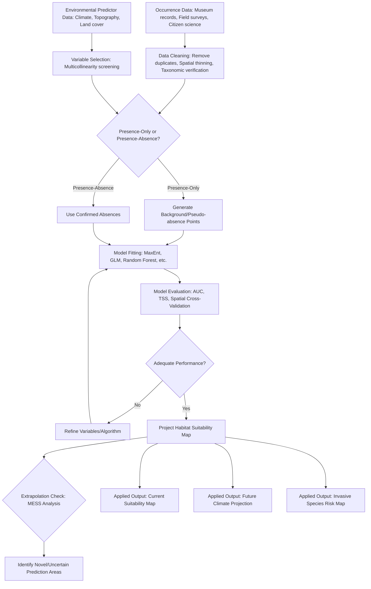

## Species Distribution Modeling

### Definition and Scope

Species Distribution Modeling (SDM), also termed ecological niche modeling (ENM) or habitat suitability modeling, is a quantitative approach that uses statistical or machine-learning algorithms to relate known species occurrence records to environmental variables, producing spatial predictions of habitat suitability or occurrence probability. SDMs are foundational tools in conservation biology, invasive species management, climate change impact assessment, and reserve design.

### Theoretical Foundations

**Ecological Niche Concept**

SDMs are grounded in niche theory, distinguishing between:

- **Fundamental niche**: The full range of environmental conditions under which a species could theoretically persist in the absence of biotic interactions (competition, predation) and dispersal limitation.
- **Realized niche**: The subset of the fundamental niche actually occupied by a species once biotic interactions and dispersal constraints are accounted for.

Most correlative SDMs estimate an approximation of the realized niche (since they are built from actual occurrence data reflecting where the species is currently found), which has important implications for interpreting model predictions, particularly when transferring predictions to novel environments or time periods (e.g., future climate scenarios) where biotic interactions and dispersal constraints may differ from those reflected in the training data. [Inference: this distinction and its implications for model transferability are well-established in the SDM methodological literature]

**BAM Diagram Framework**

The Soberón and Peterson (2005) BAM framework conceptualizes a species' actual distribution as the intersection of three factors: **B**iotic conditions (suitable species interactions), **A**biotic conditions (suitable climate/environment), and **M**ovement/dispersal (accessibility). Correlative SDMs based on environmental variables alone primarily capture the abiotic (A) component, meaning model predictions represent potential suitable habitat rather than a direct prediction of realized occurrence, unless dispersal and biotic constraints are separately incorporated. [Inference: reflects a well-established conceptual framework in the SDM literature]

### Modeling Approaches

**Presence-Only vs. Presence-Absence Methods**

- **Presence-only methods**: Use only confirmed occurrence records, typically contrasted against background or "pseudo-absence" points sampled from the broader study area (rather than confirmed absences). Required when true absence data is unavailable or unreliable (a common situation, since failure to detect a species does not confirm true absence).
- **Presence-absence methods**: Use confirmed presence and confirmed absence records, generally providing stronger statistical power and enabling a broader range of modeling techniques, but requiring rigorous survey effort to establish reliable absences.

**Common Algorithms**

| Algorithm | Data Requirement | Key Characteristics |
| --- | --- | --- |
| Generalized Linear Models (GLM) | Presence-absence | Parametric, interpretable, assumes specified response shape |
| Generalized Additive Models (GAM) | Presence-absence | Flexible non-linear response curves, more data-intensive |
| MaxEnt (Maximum Entropy) | Presence-only | Widely used for presence-only data; estimates the probability distribution of maximum entropy subject to environmental constraints |
| Random Forest | Presence-absence or presence-pseudoabsence | Machine learning ensemble method, handles non-linear interactions well, less interpretable |
| Boosted Regression Trees (BRT) | Presence-absence or presence-pseudoabsence | Machine learning ensemble combining regression trees with boosting |
| Ensemble/Consensus modeling | Varies | Combines predictions across multiple algorithms to reduce single-model bias and characterize prediction uncertainty |

**MaxEnt: A Closer Look**

MaxEnt remains one of the most widely used SDM algorithms in conservation practice due to its strong performance with presence-only data, which is the most commonly available data type from museum collections, citizen science databases, and opportunistic field observations. [Inference: widespread adoption is well-documented; relative performance compared to alternative algorithms varies by dataset and application, an active area of methodological comparison research] MaxEnt estimates the probability distribution of species presence across environmental space that has maximum entropy (is as close to uniform as possible) while satisfying constraints derived from the environmental conditions at known occurrence locations.

### Environmental Predictor Variables

**Common Predictor Categories**

- **Climate variables**: Temperature (mean, seasonality, extremes), precipitation (mean, seasonality), often sourced from standardized global climate datasets such as WorldClim or CHELSA, which provide bioclimatic variables (commonly denoted "BIO1" through "BIO19") summarizing temperature and precipitation patterns and their seasonality.
- **Topographic variables**: Elevation, slope, aspect, terrain ruggedness.
- **Land cover/land use**: Vegetation type, habitat classification, anthropogenic land conversion.
- **Soil variables**: Soil type, pH, nutrient content (particularly relevant for plant SDMs).
- **Biotic variables**: Presence of competitors, prey, or mutualists, increasingly incorporated in more advanced models but historically underrepresented due to data availability constraints.

**Variable Selection and Multicollinearity**

Environmental predictors are commonly screened for multicollinearity prior to model fitting, since highly correlated predictors can destabilize parameter estimation (in parametric models) and complicate ecological interpretation. Variance Inflation Factor (VIF) thresholds and pairwise correlation coefficient cutoffs (commonly a Pearson correlation of |r| > 0.7 or 0.8) are frequently applied to identify and remove redundant variables prior to modeling. [Inference: specific threshold values are common conventions in the SDM literature rather than universal statistical requirements]

### Model Evaluation

**Discrimination Metrics**

- **Area Under the Receiver Operating Characteristic Curve (AUC)**: Measures the model's ability to discriminate between presence and (pseudo-)absence/background locations across all possible classification thresholds; values range from 0.5 (no better than random) to 1.0 (perfect discrimination). AUC has been critiqued in the SDM literature, particularly for presence-background models, because it can be sensitive to the extent of the study area and does not directly assess calibration (how well predicted probabilities match observed frequencies). [Inference: this critique, associated with researchers such as Lobo et al., is documented in the methodological literature but AUC remains widely reported alongside complementary metrics]
- **True Skill Statistic (TSS)**: An alternative metric less sensitive to prevalence, calculated as sensitivity + specificity - 1, ranging from -1 to 1.

**Spatial Cross-Validation**

Standard random cross-validation can substantially overestimate model performance for spatial data due to spatial autocorrelation between training and test points; spatial block cross-validation (partitioning data into spatially separated blocks for training/testing) is increasingly recommended as a more rigorous evaluation approach, particularly when the model will be used to predict into geographically distant or environmentally novel regions. [Inference: reflects a documented and growing methodological recommendation in the SDM literature, particularly for applications involving spatial or temporal transfer]

### Model Transferability and Extrapolation

**Environmental Novelty**

A critical caveat when applying SDMs to future climate scenarios or geographically distant regions: if the target conditions fall outside the range of environmental conditions present in the training data (**extrapolation** beyond the training envelope), model predictions become substantially less reliable, since the fitted response curve is unconstrained by data in that region of environmental space. Tools such as **Multivariate Environmental Similarity Surfaces (MESS)** are used to explicitly map where and how much a projection area's environmental conditions diverge from the training data's environmental envelope, flagging regions of high extrapolation risk. [Inference: this is a standard, well-documented caveat in the climate change SDM literature]

### Species Distribution Modeling Workflow Diagram

### Worked Example (Conceptual)

**Problem**: A researcher builds a MaxEnt model for a montane amphibian species using 50 occurrence records and 6 bioclimatic variables, achieving an AUC of 0.91 under standard random cross-validation. The researcher wants to project the model onto a 2070 climate change scenario. What key methodological steps and cautions should be applied?

**Solution**:

1. **Re-evaluate with spatial cross-validation**: Given the amphibian's likely restricted, spatially clustered distribution (typical of montane species), the AUC of 0.91 under random cross-validation may be inflated due to spatial autocorrelation between nearby training and test points; re-running evaluation using spatial block cross-validation would provide a more robust performance estimate. [Inference: standard methodological recommendation for spatially clustered species data]
2. **Assess sample size adequacy**: With only 50 occurrence records, the model may be data-limited, particularly if using a flexible algorithm with many predictor variables (risk of overfitting); simplifying the model (e.g., reducing predictor count, using a regularization parameter appropriate to sample size) may improve generalizability.
3. **Conduct MESS analysis for the 2070 projection**: Given that future climate conditions may fall outside the range observed in the current training data (especially for temperature variables under significant warming scenarios), a MESS analysis should be performed to identify areas of environmental novelty in the projection, and predictions in high-novelty areas should be interpreted with substantial additional caution.
4. **Consider biotic and dispersal constraints**: Since the correlative model captures only the abiotic niche component (per the BAM framework), the 2070 projection represents potential future suitable climate space, not a prediction that the species will actually occupy that space, since dispersal ability (montane species often have limited dispersal capacity across unsuitable lowland habitat) and future biotic interactions are not directly modeled.

This response outlines standard methodological best practices; the specific choices for a given study would depend on additional site-specific and data-specific considerations. [Inference]

### Applied Contexts

- **Climate change vulnerability assessment**: SDMs projected under future climate scenarios are a primary tool for identifying species and regions at high risk of habitat loss or range contraction.
- **Invasive species risk assessment**: SDMs trained on a species' native range distribution are used to predict potential invasive range in new regions, informing biosecurity prioritization.
- **Reserve design and gap analysis**: Habitat suitability predictions inform identification of conservation priority areas and gaps in existing protected area networks.
- **Reintroduction site selection**: SDMs help identify potentially suitable habitat for species reintroduction or assisted migration programs.
- **Rare and data-deficient species assessment**: Presence-only methods (e.g., MaxEnt) are particularly valuable for species with limited occurrence data, a common situation for threatened and poorly studied taxa.

### Key Points

- Species distribution models statistically relate known occurrence records to environmental predictor variables to predict habitat suitability across geographic space.
- Correlative SDMs estimate an approximation of the realized niche and primarily capture abiotic suitability, requiring careful interpretation regarding dispersal and biotic interaction constraints (per the BAM framework).
- Algorithm choice (MaxEnt, GLM, Random Forest, ensemble approaches) depends heavily on data type (presence-only vs. presence-absence) and study objectives.
- Model evaluation should incorporate spatial cross-validation rather than relying solely on random cross-validation, particularly for spatially clustered data or when projecting to new regions/times.
- Model transferability to future climate scenarios or new geographic regions requires explicit assessment of environmental novelty/extrapolation risk.

**Related Topics**

- Ecological niche theory and the BAM framework
- Climate change range shift projections
- Invasive species risk mapping
- MaxEnt algorithm mechanics and regularization
- Spatial autocorrelation and cross-validation methods
- Protected area gap analysis
- Citizen science data in biodiversity modeling (e.g., GBIF, iNaturalist)
- Ensemble species distribution modeling frameworks
- Dispersal modeling and connectivity-constrained SDMs
- Joint species distribution models and biotic interaction modeling