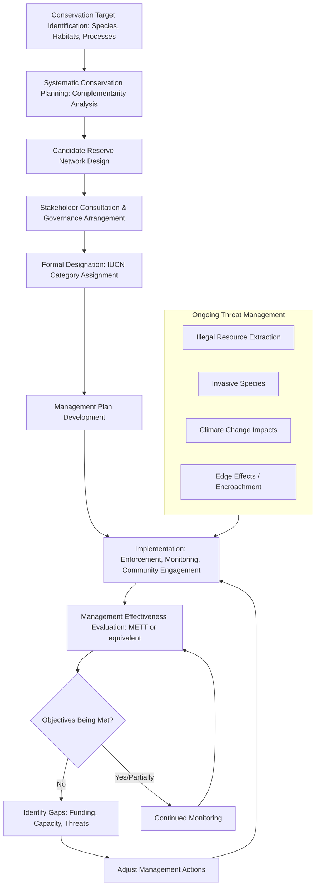

## Protected Area Planning and Management

### Definition and Scope

Protected area planning and management encompasses the scientific, policy, and operational frameworks used to designate, design, and sustain geographic areas dedicated to biodiversity conservation and associated ecosystem services. This field integrates conservation biology, spatial planning, governance theory, and adaptive management to balance biodiversity protection with, where applicable, sustainable resource use and human wellbeing objectives.

### Protected Area Classification

**IUCN Protected Area Categories**

The International Union for Conservation of Nature (IUCN) maintains a widely adopted global classification system based on management objective, spanning a gradient from strict protection to sustainable multiple use:

- **Category Ia (Strict Nature Reserve)**: Areas managed primarily for science, with minimal human intervention.
- **Category Ib (Wilderness Area)**: Large unmodified areas managed to preserve natural character, typically without permanent habitation.
- **Category II (National Park)**: Large natural/near-natural areas protecting large-scale ecological processes, with visitor access for education/recreation compatible with conservation.
- **Category III (Natural Monument or Feature)**: Areas protecting a specific natural feature (e.g., a landform, cave system, or living feature).
- **Category IV (Habitat/Species Management Area)**: Areas requiring active intervention to maintain habitat or meet species-specific requirements.
- **Category V (Protected Landscape/Seascape)**: Areas where human-nature interaction over time has produced significant ecological, biological, or cultural value, managed to maintain that interaction.
- **Category VI (Protected Area with Sustainable Use of Natural Resources)**: Areas conserving ecosystems while allowing sustainable, typically low-impact, natural resource use.

**Governance Types**

Independent of IUCN management category, protected areas are also classified by governance authority: government-managed, co-managed (shared governance), privately protected, and Indigenous and Community Conserved Areas (ICCAs), the latter increasingly recognized as making substantial contributions to global conservation targets. [Inference: growing formal recognition of ICCAs and Indigenous-led conservation is a documented trend in recent international conservation policy, e.g., under the Kunming-Montreal Global Biodiversity Framework]

### Global Conservation Targets

International conservation targets have evolved through successive frameworks under the Convention on Biological Diversity (CBD), with the most recent global target being the **30x30 target** under the 2022 Kunming-Montreal Global Biodiversity Framework, calling for effective conservation and management of at least 30% of terrestrial, inland water, and coastal/marine areas by 2030. [Inference: reflects the framework as adopted; ongoing national implementation status and progress toward the target should be verified against current reporting, as this is an actively evolving policy area]

### Reserve Design Principles

**Theoretical Foundations**

Reserve design draws directly on island biogeography theory and metapopulation theory (see Habitat Fragmentation and Connectivity), yielding a set of widely taught, though not universally applicable, design guidelines:

- **Size**: Larger reserves generally support more species and more viable populations, following species-area relationship predictions, though the relationship between reserve size and conservation effectiveness also depends heavily on the specific species and threats involved.
- **Shape**: Compact shapes (lower edge-to-area ratio) reduce edge effect exposure relative to elongated or irregular shapes of equivalent area.
- **Connectivity**: Reserves connected via corridors or close proximity generally support higher metapopulation persistence than equivalent isolated reserves, though see the ongoing corridor effectiveness debate discussed in landscape connectivity content.
- **Buffer zones**: Areas of reduced-intensity use surrounding a core protected zone can reduce edge effects and human-wildlife conflict at the reserve boundary while allowing some compatible human activity.

**SLOSS Debate**

The "Single Large Or Several Small" reserve debate remains a genuinely unresolved question in conservation biology: a single large reserve may better support wide-ranging or area-sensitive species and buffer against catastrophic events, while several small reserves may capture greater habitat heterogeneity, spread extinction risk across independent events, and protect more total species when habitat types are highly heterogeneous. The optimal choice is now generally understood to be context- and species-dependent rather than resolvable by a single universal rule. [Inference: reflects the current state of the debate as documented across decades of reserve design literature; no universal resolution has been established]

### Systematic Conservation Planning

**Complementarity and Irreplaceability**

Modern reserve network design has moved substantially away from ad hoc site selection toward **systematic conservation planning**, which uses optimization algorithms to identify sets of sites that collectively (complementarily) represent conservation targets (species, habitats, ecological processes) at minimum cost or area, rather than selecting sites purely by individual richness or rarity. Key concepts include:

- **Complementarity**: The principle that an efficient reserve network should prioritize sites that add unrepresented features, rather than simply the richest individual sites, since the richest sites may substantially overlap in the species/features they protect.
- **Irreplaceability**: A measure of how essential a given site is to achieving overall conservation targets, i.e., the degree to which its conservation value cannot be substituted by protecting alternative sites.

**Marxan and Systematic Planning Software**

Software tools such as Marxan implement systematic conservation planning algorithms (typically simulated annealing) to identify near-optimal reserve networks meeting specified conservation targets while minimizing cost (area, acquisition cost, or opportunity cost), widely used in both terrestrial and marine spatial planning applications globally. [Inference: Marxan's widespread global adoption is well-documented; specific algorithmic details continue to be refined by the developing research community]

### Protected Area Management Effectiveness

**Management Effectiveness Evaluation**

A substantial and growing body of research indicates that formal protected area designation alone does not guarantee effective conservation outcomes; many protected areas suffer from inadequate funding, staffing, enforcement capacity, or management planning, leading to the concept of "paper parks"—areas with legal protection status but minimal effective on-the-ground conservation impact. [Inference: the "paper park" phenomenon and associated management effectiveness gaps are well-documented across the global conservation literature, though the prevalence varies substantially by region and governance context] Standardized management effectiveness evaluation frameworks (e.g., the IUCN-WCPA Management Effectiveness Tracking Tool, METT) have been developed to systematically assess and improve protected area performance.

**Threats Requiring Active Management**

- **Illegal resource extraction**: Poaching, illegal logging, and unauthorized harvesting requiring enforcement capacity.
- **Invasive species**: Requiring active detection and control programs, particularly critical on islands and in isolated ecosystems with historically low exposure to non-native species.
- **Edge effects and encroachment**: Requiring buffer zone management and boundary demarcation/enforcement.
- **Climate change**: Increasingly requiring adaptive management approaches as historical baseline conditions shift, potentially altering which areas remain suitable for target conservation features over time.

### Adaptive Management Framework

Protected area management increasingly follows an **adaptive management** cycle, treating management actions as ongoing experiments subject to monitoring, evaluation, and iterative adjustment rather than fixed, static plans, given the substantial uncertainty inherent in ecological systems and the dynamic nature of threats (including climate change).

### Protected Area Planning and Adaptive Management Cycle Diagram

### Worked Example

**Problem**: A conservation planning team must select a reserve network to protect 10 vegetation types across a 50-site study region, using a systematic conservation planning approach. Site A contains vegetation types 1-4 (4 types) and has high acquisition cost. Site B contains vegetation types 1, 2, 5, 6 (4 types) at moderate cost. Explain, using complementarity principles, why Site B may be preferred over an otherwise richness-equivalent alternative site that duplicates Site A's types.

**Solution**:

Although both Site A and a hypothetical alternative site (containing types 1-4, identical to Site A) have equal species/type richness (4 types each), from a complementarity perspective, selecting Site A plus Site B captures 6 unique vegetation types (1, 2, 3, 4, 5, 6) in total, whereas selecting Site A plus the duplicate alternative site would capture only 4 unique types (1, 2, 3, 4) despite representing 8 total type-occurrences across the two sites. This demonstrates the core principle of systematic conservation planning: the marginal conservation value of a site should be assessed based on the *unrepresented* features it adds to the existing network, not its standalone richness. Site B, despite having identical raw richness to the duplicate alternative, contributes significantly greater complementary value (2 novel types: 5 and 6) to an existing Site A selection. [Inference: this worked example is a standard, simplified illustration of the complementarity principle central to systematic conservation planning methodology]

### Applied Contexts

- **National park system expansion**: Systematic conservation planning tools inform government decisions on where to expand protected area networks to meet international commitments (e.g., 30x30).
- **Marine Protected Area (MPA) network design**: Marxan and related tools are extensively applied to marine spatial planning, balancing biodiversity protection with fisheries and other ocean-use considerations.
- **Private land conservation**: Conservation easements and land trust acquisition strategies apply complementarity and irreplaceability principles to prioritize limited acquisition funding.
- **Transboundary conservation planning**: Connectivity and reserve design principles inform international conservation corridor initiatives spanning multiple countries.
- **Climate-adaptive protected area planning**: Increasingly incorporates climate change projections and species range shift modeling (see Species Distribution Modeling) to ensure reserve networks remain effective under future climate conditions.

### Key Points

- The IUCN protected area category system classifies reserves along a gradient from strict protection to sustainable multiple-use, independent of governance type (government, co-managed, private, or Indigenous/community-led).
- Reserve design principles derived from island biogeography theory (size, shape, connectivity) provide general guidance, though the unresolved SLOSS debate illustrates that no single design rule universally applies.
- Systematic conservation planning, built on complementarity and irreplaceability principles, has largely superseded ad hoc, richness-based site selection as the standard methodology for reserve network design.
- Formal protection designation does not guarantee effective conservation outcomes; management effectiveness evaluation frameworks address the well-documented "paper parks" phenomenon.
- Adaptive management, treating conservation actions as subject to ongoing monitoring and iterative adjustment, is increasingly the standard operating paradigm given ecological uncertainty and dynamic threats such as climate change.

**Related Topics**

- IUCN protected area governance and category assignment criteria
- Marine spatial planning and MPA network design
- Indigenous and Community Conserved Areas (ICCAs)
- Global Biodiversity Framework and 30x30 target implementation
- Marxan and systematic conservation planning software
- Management effectiveness evaluation frameworks (METT)
- Climate-adaptive conservation planning
- Transboundary conservation and peace parks
- Conservation finance and land acquisition strategy
- Human-wildlife conflict management in buffer zones