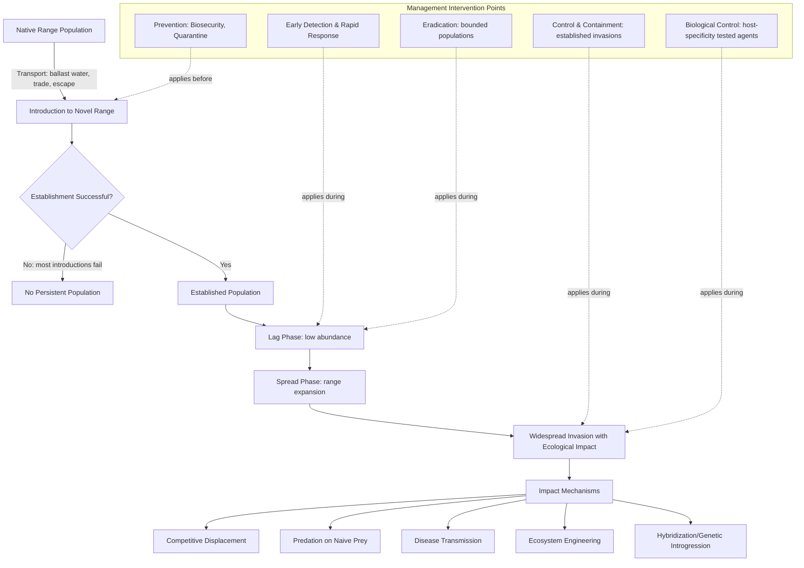

## Invasive Species and Ecological Threats

### Definition and Scope

Invasive species and ecological threats encompass the study of non-native organisms that establish, spread, and cause ecological or economic harm in introduced ranges, alongside the broader suite of anthropogenic pressures driving biodiversity decline. This field integrates population biology, community ecology, and risk assessment to understand invasion mechanisms and inform prevention, early detection, and management strategies.

### Terminology and Definitions

**Non-Native vs. Invasive**

Precise terminology matters in this field: a **non-native (alien/exotic) species** is simply one occurring outside its native range due to human-mediated introduction, whether intentional or accidental. An **invasive species** is a subset of non-native species that additionally establishes self-sustaining populations, spreads beyond the introduction site, and causes demonstrable ecological, economic, or human health harm. Not all non-native species become invasive; the proportion that successfully establish and subsequently become invasive follows a widely cited but approximate rule of thumb (the "tens rule"): roughly 10% of introduced species establish, and roughly 10% of established species become invasive, though these percentages vary substantially by taxon and system and should be treated as a general heuristic rather than a precise predictive law. [Inference: the "tens rule" (Williamson) is a well-known heuristic in invasion biology, explicitly acknowledged by its originators and subsequent researchers as an approximation with substantial variability]

### Stages of the Invasion Process

Biological invasion is conventionally modeled as a sequential process, with each stage representing a filter that most introduced organisms fail to pass:

1. **Transport**: Movement of an organism (intentionally or accidentally) beyond its native range, via pathways including ballast water, horticultural trade, pet trade, agricultural commodities, and packing material.
2. **Introduction**: Release or escape of the organism into a novel environment.
3. **Establishment**: Formation of a self-sustaining population capable of surviving and reproducing without continued introduction, often the most demographically challenging stage due to Allee effects at low population density.
4. **Spread**: Geographic expansion of the established population, often following an initial lag phase before entering a period of more rapid range expansion.
5. **Impact**: Measurable ecological, economic, or health effects in the invaded range.

**Lag Phase**

Many invasive species exhibit an extended **lag phase**—a period of low abundance and limited spread following establishment, sometimes lasting years to decades, before entering a phase of rapid population growth and range expansion. Explanations for lag phases include the time required for genetic adaptation to the novel environment, gradual habitat modification creating more favorable conditions, or simple exponential population growth dynamics that appear negligible until a threshold population size is reached. The relative importance of each mechanism is generally understood to be species- and context-specific. [Inference: multiple non-mutually-exclusive explanations are documented in the invasion biology literature; no single universal mechanism has been established]

### Mechanisms of Invasion Success

**Propagule Pressure**

The number, frequency, and size of introduction events strongly predicts establishment success; higher propagule pressure increases the likelihood of establishment even for species with otherwise marginal suitability, by buffering against demographic and environmental stochasticity during the vulnerable establishment phase.

**Enemy Release Hypothesis**

Proposes that invasive species benefit from the absence of co-evolved natural enemies (predators, parasites, pathogens) present in their native range, allowing greater resource allocation to growth and reproduction rather than defense. Empirical support for enemy release varies across study systems, and it is now generally regarded as one of several contributing (rather than universally dominant) mechanisms of invasion success. [Inference: reflects a documented shift in invasion biology from earlier strong endorsement toward a more nuanced, context-dependent view of enemy release as a partial explanatory factor]

**Novel Weapons Hypothesis**

Proposes that some invasive species succeed via biochemical mechanisms (e.g., allelopathic compounds) that native competitors in the invaded range have not evolved defenses against, providing a competitive advantage absent in the species' native range where co-evolved competitors possess such defenses.

**Empty Niche / Biotic Resistance**

Invasion success can be enhanced by ecological opportunity (an underutilized resource or niche in the recipient community) or reduced by "biotic resistance" from a diverse, well-established native community that more fully occupies available niche space, limiting the availability of resources for invaders. The relationship between native diversity and invasion resistance is complex and scale-dependent, with some studies finding negative diversity-invasibility relationships at fine spatial scales but positive relationships at broader scales, an apparent paradox attributed to differing underlying drivers operating at each scale. [Inference: this scale-dependence and its explanation reflect a well-documented pattern in invasion ecology literature]

### Ecological Impacts of Invasive Species

**Competitive Displacement**

Direct resource competition (space, light, nutrients, prey) between invasive and native species, potentially leading to native species decline or local extirpation.

**Predation and Herbivory**

Invasive predators can have severe impacts on native prey populations lacking evolved anti-predator responses (naive prey), particularly well-documented on islands where native fauna often evolved in the absence of mammalian predators.

**Hybridization and Genetic Introgression**

Interbreeding between invasive and closely related native species/subspecies can lead to genetic swamping, reducing the genetic distinctiveness of native lineages and potentially threatening native species through genetic assimilation rather than direct mortality.

**Ecosystem Engineering and Habitat Alteration**

Some invasive species fundamentally alter physical habitat structure or ecosystem processes (e.g., invasive plants altering fire regimes, invasive earthworms altering soil nutrient cycling and structure in previously earthworm-free northern forests), producing cascading effects throughout the ecological community that extend well beyond direct competitive or predatory interactions.

**Disease Transmission**

Invasive species can introduce novel pathogens to which native species have no evolved resistance (e.g., avian malaria in Hawaiian honeycreepers, chytrid fungus in amphibians globally), sometimes causing more severe population-level impacts than direct competition or predation from the invasive species itself.

### Broader Ecological Threats to Biodiversity

While invasive species represent one of the recognized major drivers of global biodiversity loss, they operate alongside several other principal threat categories, commonly summarized in conservation biology as interacting, cumulative pressures:

- **Habitat loss and fragmentation**: Generally identified as the leading driver of biodiversity decline globally across most assessments (see Habitat Fragmentation and Connectivity).
- **Overexploitation**: Unsustainable harvesting (hunting, fishing, logging) exceeding population replacement capacity.
- **Climate change**: Altering species distributions, phenology, and ecosystem processes, with impacts increasingly interacting with and compounding other threat categories.
- **Pollution**: Chemical contamination affecting individual and population-level fitness (see Environmental Toxicology).
- **Invasive species**: As detailed above.

These threats frequently interact synergistically rather than acting independently—for example, climate change can facilitate invasive species range expansion into previously climatically unsuitable areas, while habitat fragmentation can increase edge exposure that favors invasive species establishment over native community resistance. [Inference: synergistic threat interaction is well-documented in conservation biology literature, though the specific magnitude of interaction effects is system-dependent]

### Invasive Species Management Approaches

**Prevention**

Widely regarded as the most cost-effective management stage, focusing on biosecurity measures (ballast water treatment, import inspection, quarantine protocols) to prevent introduction before it occurs, since post-establishment control is typically far more costly and less likely to achieve complete eradication. [Inference: the cost-effectiveness hierarchy favoring prevention is well-established and widely cited across invasion biology and biosecurity economics literature]

**Early Detection and Rapid Response (EDRR)**

Systematic monitoring programs designed to detect new invasions while population size remains small and geographically limited, when eradication is most feasible; EDRR effectiveness diminishes substantially once a species has progressed beyond the establishment/early spread stage into widespread distribution.

**Eradication**

Complete removal of an invasive population, generally only feasible for populations that are still spatially limited, typically on islands or other bounded systems where reinvasion risk can be controlled; eradication becomes progressively less feasible (and disproportionately more costly) as population size and range increase.

**Control and Containment**

For established, widespread invasions where eradication is no longer feasible, management shifts to ongoing population control (mechanical, chemical, or biological) to limit density and spread, and containment strategies to prevent further range expansion into currently uninvaded areas.

**Biological Control**

Introduction of a natural enemy (predator, parasite, or pathogen) from the invasive species' native range to suppress its population in the invaded range. Modern biological control programs require extensive host-specificity testing prior to release to minimize the risk of non-target impacts, a lesson learned from historical biological control introductions that themselves became invasive or caused unintended ecological harm. [Inference: modern rigorous host-specificity testing protocols represent a well-documented methodological improvement over historical biological control practice]

### Invasion Process and Management Intervention Diagram

### Worked Example

**Problem**: A newly detected invasive aquatic plant is found in a single 2-hectare pond, with no evidence of spread to connected waterways. Using the invasion stage framework and management principles discussed, outline the most appropriate management response and justify the approach relative to alternative later-stage interventions.

**Solution**:

Given the population is spatially limited (single 2-hectare pond) and detected early with no evidence of spread beyond the initial site, this scenario represents an early establishment/pre-spread stage invasion, for which **eradication** is the most appropriate and cost-effective management response, consistent with the general principle that eradication feasibility declines sharply as population size and range increase.

Recommended actions would include: (1) immediate containment measures to prevent spread to connected waterways (e.g., physical barriers, restricted equipment movement to prevent propagule transport), (2) complete physical or chemical removal of the plant population from the pond, and (3) a sustained post-treatment monitoring program to detect and address any regrowth from residual propagules (seeds, fragments, or root structures), since many aquatic invasive plants can regenerate from small plant fragments.

This approach is preferable to delaying action until the population spreads further, since later-stage control/containment interventions for widespread aquatic invasions are typically far more costly, less likely to achieve complete removal, and carry ongoing management costs indefinitely rather than the one-time cost of successful early eradication. [Inference: this recommendation applies standard, well-established invasion management sequencing principles to a generic illustrative scenario; an actual case would require species-specific eradication protocol guidance]

### Applied Contexts

- **Biosecurity policy**: Border inspection, ballast water treaties (e.g., the International Convention for the Control and Management of Ships' Ballast Water and Sediments), and import restrictions directly apply prevention-stage invasion management principles.
- **Island conservation**: Invasive predator eradication (particularly rodents and other mammalian predators) has become a major global island restoration strategy, given islands' disproportionate vulnerability to invasive species impacts.
- **Agricultural and forestry pest management**: Biological control programs and integrated pest management strategies directly apply invasion biology principles to manage invasive agricultural pests and forest pathogens.
- **Climate-invasion interaction planning**: Conservation planning increasingly incorporates projected climate-driven range shifts of both native and invasive species to anticipate future invasion risk under changing conditions.
- **Citizen science monitoring**: Public reporting platforms increasingly support early detection networks for newly emerging invasive species across large geographic areas.

### Key Points

- Invasive species represent a subset of non-native species that establish, spread, and cause demonstrable harm, with most introduced species failing to progress through all invasion stages.
- Invasion success is driven by multiple, often interacting mechanisms including propagule pressure, enemy release, novel weapons, and ecological opportunity, none of which is universally dominant across all invasion contexts.
- Ecological impacts of invasive species span competitive displacement, predation on naive prey, disease introduction, hybridization, and ecosystem engineering.
- Management effectiveness follows a strong cost and feasibility gradient favoring earlier intervention: prevention is most cost-effective, followed by early detection/rapid response and eradication for spatially limited populations, with control/containment as the primary option for widespread established invasions.
- Invasive species operate alongside habitat loss, overexploitation, climate change, and pollution as interacting drivers of global biodiversity decline, frequently compounding one another's impacts.

**Related Topics**

- Island restoration and invasive predator eradication
- Biological control host-specificity testing protocols
- Ballast water management and biosecurity policy
- Climate change and invasive species range expansion
- Naive prey vulnerability and island biogeography
- Disease ecology and wildlife pathogen introduction
- Early detection and rapid response network design
- Citizen science biodiversity monitoring platforms
- Ecosystem engineering and novel ecosystem formation
- Integrated pest management in agricultural systems