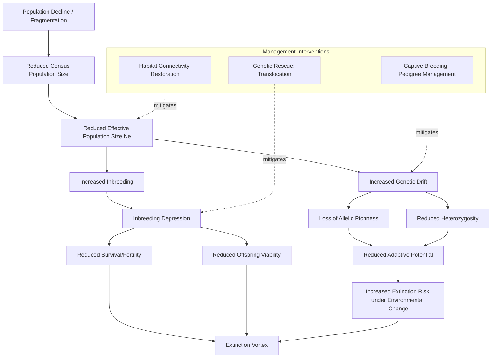

## Conservation Genetics Basics

### Definition and Scope

Conservation genetics is the application of genetic theory and molecular techniques to the conservation of species, populations, and genetic diversity. It addresses the genetic consequences of population decline, fragmentation, and small population size, providing tools to inform management decisions including captive breeding, translocation, population monitoring, and taxonomic delineation for conservation prioritization.

### Genetic Diversity and Its Measurement

**Sources of Genetic Variation**

Genetic diversity arises from mutation (the ultimate source of new genetic variants), recombination (reshuffling existing variation during sexual reproduction), and gene flow (introduction of variants from other populations), and is subsequently shaped by natural selection and genetic drift.

**Common Diversity Metrics**

- **Heterozygosity**: The proportion of individuals in a population that are heterozygous at a given locus, commonly reported as observed heterozygosity ($H_o$) or expected heterozygosity ($H_e$, calculated from allele frequencies under Hardy-Weinberg assumptions).
- **Allelic richness**: The number of distinct alleles present at a locus, often standardized via rarefaction to allow comparison across populations of differing sample sizes.
- **Nucleotide diversity ($\pi$)**: The average number of nucleotide differences per site between two randomly chosen DNA sequences from a population, commonly used with genomic-scale sequence data.

### Genetic Drift and Small Population Effects

**Genetic Drift**

Random fluctuation in allele frequencies from generation to generation due to chance sampling of gametes, with effects inversely proportional to population size: drift causes more rapid and pronounced allele frequency change (and loss of genetic variation) in small populations than in large ones. Over time, genetic drift in small, isolated populations tends to reduce heterozygosity and can lead to fixation (loss of all but one allele) at a given locus.

**Effective Population Size ($N_e$)**

A central concept in conservation genetics, $N_e$ represents the size of an idealized population that would experience the same rate of genetic drift, inbreeding, or loss of genetic variation as the actual (census) population under study. Critically, $N_e$ is very frequently substantially smaller than the census population size ($N_c$), often cited as commonly falling in the range of roughly 10-30% of census size across many studied species, though the ratio varies enormously depending on factors including unequal sex ratio, variance in reproductive success among individuals, and fluctuating population size over time. [Inference: the commonly cited $N_e/N_c$ ratio range is a widely referenced approximation across the conservation genetics literature, but documented values vary substantially by species and by the specific factors driving the discrepancy in each case]

**Factors Reducing $N_e$ Below $N_c$**

- **Unequal sex ratio**: A skewed breeding sex ratio reduces $N_e$ according to the relationship:

$$N_e = \frac{4 N_m N_f}{N_m + N_f}$$

where $N_m$ and $N_f$ are the number of breeding males and females, respectively. This formula demonstrates that $N_e$ is maximized when $N_m = N_f$ and declines sharply as the sex ratio becomes increasingly skewed (e.g., in polygynous mating systems with few dominant breeding males).

- **Variance in reproductive success**: When some individuals contribute disproportionately more offspring than others (higher variance in reproductive success than expected under random/Poisson mating), $N_e$ is reduced relative to $N_c$.
- **Fluctuating population size**: $N_e$ over multiple generations is more strongly influenced by periods of low population size (bottlenecks) than by periods of high abundance, following a harmonic mean relationship:

$$\frac{1}{N_e} = \frac{1}{t}\sum_{i=1}^{t}\frac{1}{N_i}$$

meaning that even a single severe generational bottleneck can substantially depress the long-term effective population size, disproportionate to its brief duration.

### Inbreeding and Its Consequences

**Inbreeding Coefficient (F)**

Quantifies the probability that two alleles at a locus in an individual are identical by descent (inherited from a common ancestor), ranging from 0 (no inbreeding, under specified reference population assumptions) to 1 (complete homozygosity by descent).

**Inbreeding Depression**

The reduction in fitness-related traits (survival, fertility, offspring viability) observed in inbred individuals, arising primarily from two genetic mechanisms:

- **Expression of deleterious recessive alleles**: Inbreeding increases homozygosity, increasing the probability that individuals are homozygous for rare, typically recessive, deleterious alleles that would otherwise be masked in heterozygous carriers.
- **Loss of heterozygote advantage (overdominance)**: At loci where the heterozygous genotype confers higher fitness than either homozygous genotype, inbreeding-driven loss of heterozygosity directly reduces mean population fitness.

Inbreeding depression has been documented across a very wide range of taxa in both captive and wild populations, though its magnitude varies substantially by species, population history, and the specific fitness trait measured. [Inference: broad documentation of inbreeding depression is well-established in the conservation genetics literature; magnitude and mechanism weighting are context-dependent]

**Genetic Purging**

A debated phenomenon in which sustained inbreeding over many generations can, in some cases, reduce the frequency of severely deleterious recessive alleles through selection against homozygous carriers, potentially partially offsetting inbreeding depression over the longer term. The reliability, generality, and management relevance of purging as a conservation strategy remain actively contested in the scientific literature, and purging is not generally considered a sufficient justification for permitting inbreeding in conservation management. [Unverified: genetic purging efficacy and its practical conservation implications remain a genuinely unresolved and actively debated topic]

### Genetic Bottlenecks and Founder Effects

**Population Bottleneck**

A sharp, typically temporary reduction in population size that disproportionately reduces genetic diversity relative to the reduction in population size itself, since the surviving individuals represent only a random (and potentially non-representative) subsample of the original population's genetic variation. Classic examples cited in the conservation genetics literature include severely bottlenecked species such as the northern elephant seal and cheetah, both showing markedly reduced genetic diversity attributed at least partly to historical population bottlenecks. [Inference: while these bottleneck case studies are widely cited, some more recent genomic research has proposed alternative or additional contributing explanations for observed low diversity in specific cases, an evolving area of research]

**Founder Effect**

A specific type of bottleneck occurring when a new population is established by a small number of founding individuals (e.g., colonization of an island, or establishment of a captive breeding population from few wild-caught individuals), resulting in the new population carrying only a subset of the genetic variation present in the source population, with allele frequencies potentially substantially different from the source population due to the small, non-random founding sample.

### Conservation Genetic Applications

**Taxonomic Delineation and Evolutionarily Significant Units (ESUs)**

Genetic data increasingly informs conservation taxonomy, including identification of **Evolutionarily Significant Units (ESUs)**—populations or population groups that are genetically distinct and represent significant components of a species' evolutionary legacy, potentially warranting separate conservation management even below the formal species or subspecies level. The precise criteria for ESU designation (e.g., reciprocal monophyly for mitochondrial DNA versus broader criteria incorporating nuclear genetic divergence and ecological distinctiveness) vary across proposed frameworks and remain a topic of ongoing methodological discussion. [Inference: multiple competing ESU definition frameworks exist in the literature; no single universally adopted standard has been established]

**Genetic Rescue**

The deliberate introduction of new genetic material (via translocation of individuals) into a small, inbred, or genetically depauperate population to restore genetic diversity and potentially reverse or mitigate inbreeding depression. Genetic rescue has documented successes (e.g., the well-known Florida panther case, where introduction of Texas cougars significantly improved population fitness indicators) but also carries risks, notably **outbreeding depression**—reduced fitness resulting from disruption of locally adapted gene complexes or co-adapted gene combinations when crossing genetically or ecologically divergent populations—making careful assessment of source population compatibility an important precondition. [Inference: the Florida panther case is a well-documented conservation genetics success story; outbreeding depression risk is a recognized general caveat requiring case-specific evaluation before genetic rescue interventions]

**Population and Landscape Genetics**

Molecular markers (microsatellites, single nucleotide polymorphisms/SNPs, and increasingly whole-genome sequencing) are used to assess population structure, estimate gene flow and connectivity between populations, identify hybridization, and detect cryptic population subdivision not evident from morphological or geographic data alone, directly informing management unit delineation and connectivity conservation priorities (see Habitat Fragmentation and Connectivity).

**Non-Invasive Genetic Sampling**

Increasingly used for monitoring elusive or sensitive species, extracting DNA from shed hair, feces, feathers, or shed skin rather than requiring direct capture, enabling population size estimation (via genetic mark-recapture using individual genetic identification) and genetic diversity monitoring with substantially reduced handling stress and logistical difficulty compared to traditional capture-based sampling.

### Genetic Consequences of Small Population Size Diagram

### Worked Example

**Problem**: A population has 40 breeding males and 10 breeding females (highly polygynous mating system). Calculate the effective population size due to unequal sex ratio, and compare it to the census breeding population size of 50 individuals.

**Solution**:

$$N_e = \frac{4 N_m N_f}{N_m + N_f} = \frac{4 \times 40 \times 10}{40 + 10} = \frac{1600}{50} = 32$$

Comparing to the census breeding population of 50 individuals, the effective population size (32) is substantially lower—approximately 64% of the census size—purely as a consequence of the skewed sex ratio, before accounting for any additional reduction from variance in reproductive success or population fluctuation over time. This demonstrates why census population counts alone can substantially overstate a population's genetic health and resilience to drift and inbreeding, since $N_e$ (not $N_c$) is the parameter that actually governs the rate of genetic diversity loss. [Inference: standard textbook application of the sex-ratio effective population size formula; a full $N_e$ estimate for this population would additionally require accounting for reproductive variance and any historical population fluctuation]

### Applied Contexts

- **Captive breeding program management**: Studbook-based pedigree management explicitly aims to minimize mean kinship and maximize retained genetic diversity across generations in ex-situ populations.
- **Translocation and genetic rescue planning**: Genetic assessment of source and recipient population compatibility is now standard practice prior to translocation-based conservation interventions.
- **Wildlife forensics and law enforcement**: Genetic techniques (species identification, individual identification, population-of-origin assignment) support enforcement of wildlife trade and poaching regulations.
- **Endangered species listing and management unit designation**: ESU and distinct population segment determinations directly inform legal conservation status and management boundaries under frameworks such as the U.S. Endangered Species Act.
- **Non-invasive population monitoring**: Genetic mark-recapture using non-invasively collected samples is increasingly applied to estimate population size and trend for elusive or low-density species where traditional survey methods are impractical.

### Key Points

- Effective population size ($N_e$), not census size, is the key parameter governing the rate of genetic drift and inbreeding, and is typically substantially smaller than census size due to unequal sex ratio, reproductive variance, and population fluctuation.
- Inbreeding depression, arising from expression of deleterious recessive alleles and/or loss of heterozygote advantage, is well-documented across taxa though its magnitude is context-dependent.
- Genetic bottlenecks and founder effects disproportionately reduce genetic diversity relative to the magnitude of population size reduction, with lasting consequences for adaptive potential.
- Genetic rescue can effectively counteract inbreeding depression in small populations but carries a documented risk of outbreeding depression, requiring careful source population compatibility assessment.
- Conservation genetic tools increasingly inform taxonomic and management unit delineation (ESUs), non-invasive population monitoring, and captive breeding pedigree management.

**Related Topics**

- Effective population size estimation methods
- Captive breeding and studbook pedigree management
- Genetic rescue and outbreeding depression risk assessment
- Evolutionarily Significant Units and conservation taxonomy
- Non-invasive genetic sampling and genetic mark-recapture
- Landscape genetics and gene flow modeling
- Wildlife forensic genetics
- Genomics applications in conservation (SNP arrays, whole-genome sequencing)
- Minimum viable population analysis
- Hybridization and genetic introgression in threatened species