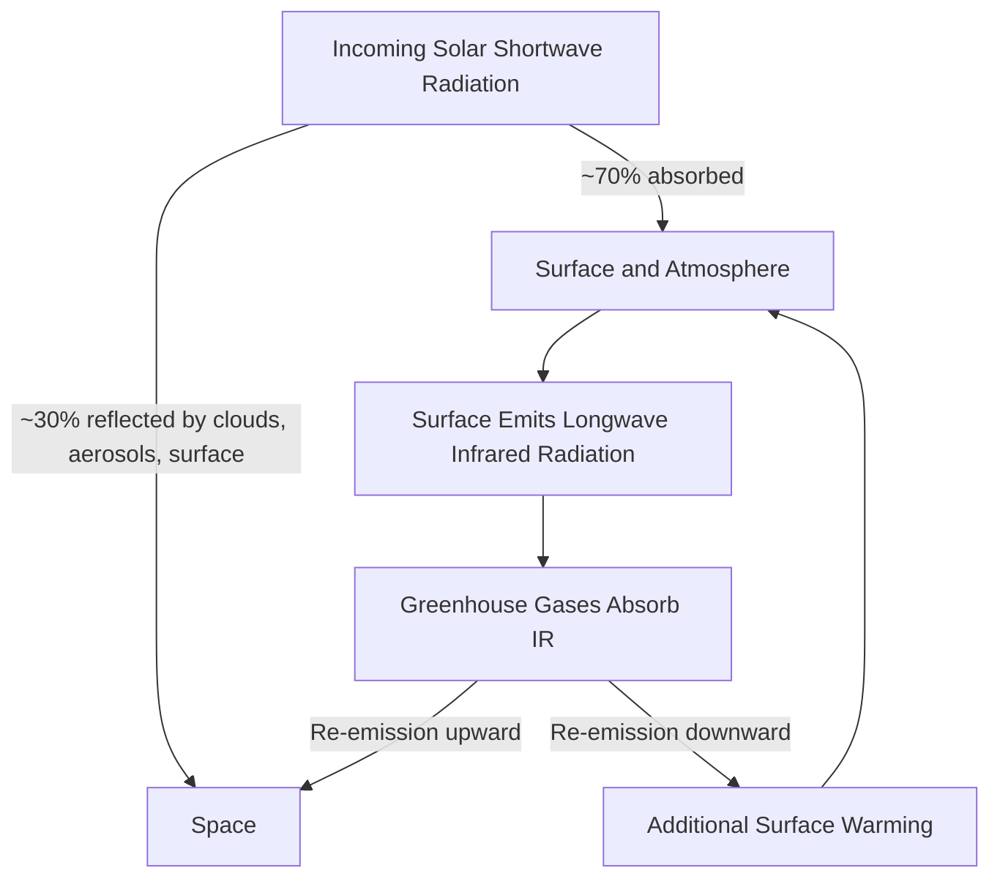

## Physical Basis of Climate Change


### Overview

The physical basis of climate change rests on well-established principles of radiative transfer, thermodynamics, and atmospheric physics. The Earth's climate system maintains a radiative equilibrium between incoming solar shortwave radiation and outgoing terrestrial longwave radiation. Anthropogenic and natural forcings perturb this balance, producing measurable changes in global temperature, circulation patterns, and the hydrological cycle.

### Earth's Energy Balance

#### The Radiative Equilibrium Model

At the simplest level, Earth's effective temperature is derived by balancing absorbed solar radiation against emitted longwave radiation, treating the planet as a blackbody (or graybody) radiator.

The solar constant $S_0 \approx 1361$ W/m² represents the incoming solar flux at Earth's mean distance from the Sun. Because Earth is a sphere intercepting sunlight across a disk of area $\pi r^2$ but radiating from its full surface area $4\pi r^2$, the average incoming flux is divided by 4.

$$E_{in} = \frac{S_0 (1 - \alpha)}{4}$$

where $\alpha$ is Earth's albedo (~0.30).

Outgoing longwave radiation follows the Stefan-Boltzmann law:

$$E_{out} = \varepsilon \sigma T^4$$

where $\sigma = 5.67 \times 10^{-8}$ W/m²K⁴ is the Stefan-Boltzmann constant, $\varepsilon$ is emissivity, and $T$ is temperature in Kelvin.

Setting $E_{in} = E_{out}$ and solving for a blackbody ($\varepsilon = 1$) yields an effective radiating temperature of approximately 255 K (-18°C), substantially colder than Earth's observed mean surface temperature of ~288 K (15°C). This ~33°C discrepancy is attributable to the greenhouse effect.

#### The Greenhouse Effect Mechanism

Greenhouse gases (GHGs) are selectively transparent to incoming shortwave (visible) radiation but absorb and re-emit outgoing longwave (infrared) radiation. This occurs because GHG molecules — water vapor (H₂O), carbon dioxide (CO₂), methane (CH₄), nitrous oxide (N₂O), ozone (O₃), and halocarbons — have vibrational and rotational modes with energy transitions matching infrared photon energies, while symmetric diatomic molecules like N₂ and O₂ (which comprise ~99% of the atmosphere) are largely IR-inactive.

Absorption occurs because these molecules are non-symmetric or possess a changing dipole moment during vibration, allowing them to couple with the IR photon's oscillating electric field. Absorbed energy is re-radiated isotropically, meaning a fraction is returned toward the surface, producing additional surface warming beyond what solar input alone would sustain.



### Radiative Forcing

Radiative forcing (RF) quantifies the change in net energy flux (W/m²) at the tropopause caused by a perturbation to the climate system, measured before surface temperature adjusts. It is the standard metric (IPCC) for comparing the relative climatic influence of different agents.

#### Forcing from CO₂

The relationship between CO₂ concentration and radiative forcing is logarithmic rather than linear, because CO₂'s primary absorption bands (notably the 15 μm band) are already largely saturated at current concentrations; additional forcing comes primarily from band broadening and weaker secondary bands.

$$\Delta F = \alpha \ln\left(\frac{C}{C_0}\right)$$

where $\alpha \approx 5.35$ W/m² (commonly cited simplified constant), $C$ is the current concentration, and $C_0$ is the reference (pre-industrial) concentration.

**Example**: For a doubling of CO₂ from a pre-industrial 280 ppm to 560 ppm:

$$\Delta F = 5.35 \ln(2) \approx 3.7 \text{ W/m}^2$$

This 3.7 W/m² figure is the canonical forcing value associated with a CO₂ doubling (2×CO₂), used as the reference case for climate sensitivity calculations.

#### Forcing from Other Gases

Methane and nitrous oxide have approximately square-root and linear forcing relationships respectively at atmospheric concentrations relevant to the industrial era, reflecting different degrees of absorption band saturation:

$$\Delta F_{CH_4} \propto \sqrt{M} - \sqrt{M_0}$$

Halocarbons (e.g., CFCs) typically exhibit near-linear forcing since their concentrations are low and absorption bands are far from saturation.

### Climate Sensitivity

Equilibrium Climate Sensitivity (ECS) is the equilibrium global mean surface temperature increase resulting from a sustained doubling of atmospheric CO₂ relative to pre-industrial levels.

$$\Delta T_{eq} = \lambda \Delta F$$

where $\lambda$ (K per W/m²) is the climate sensitivity parameter, and $\Delta F$ is the radiative forcing (3.7 W/m² for 2×CO₂).

The IPCC AR6 assessment gives a likely ECS range of 2.5–4°C, with a best estimate around 3°C. [Inference: exact bounds are periodically revised across assessment reports as models and paleoclimate constraints improve].

Transient Climate Response (TCR) is a related, typically lower-magnitude metric, representing the temperature change at the time of CO₂ doubling under a gradual 1%/year increase scenario, capturing ocean thermal inertia effects not reflected in equilibrium metrics.

### Feedback Mechanisms

Climate feedbacks amplify (positive) or dampen (negative) the initial radiative forcing response.

#### Water Vapor Feedback

Governed by the Clausius-Clapeyron relation, warmer air holds exponentially more water vapor:

$$\frac{de_s}{dT} = \frac{L_v e_s}{R_v T^2}$$

where $e_s$ is saturation vapor pressure, $L_v$ is latent heat of vaporization, and $R_v$ is the specific gas constant for water vapor. Since water vapor is itself a potent greenhouse gas, initial warming increases atmospheric moisture, which further amplifies warming — the strongest positive feedback in the climate system.

#### Ice-Albedo Feedback

Reduced snow and sea-ice cover lowers surface albedo, increasing solar absorption and further warming, particularly pronounced at high latitudes (Arctic amplification).

#### Lapse Rate Feedback

Typically negative in the tropics: enhanced warming aloft (due to moist adiabatic processes) increases outgoing longwave emission more than surface-only warming would, partially offsetting forcing.

#### Cloud Feedback

The largest source of uncertainty among feedbacks. Low clouds generally exert a net cooling (high albedo, modest greenhouse trapping), while high cirrus clouds exert net warming (low albedo impact, strong IR trapping). Changes in cloud fraction, altitude, and optical properties under warming remain an active research area. [Inference: net cloud feedback sign was historically debated; current assessments favor a weak-to-moderate net positive feedback].

### Carbon Cycle and Anthropogenic Perturbation

#### Carbon Reservoirs and Fluxes

The global carbon cycle involves exchange among the atmosphere, ocean (surface and deep), terrestrial biosphere, and lithosphere. Pre-industrial atmospheric CO₂ was in approximate steady state (~280 ppm). Fossil fuel combustion, cement production, and land-use change (primarily deforestation) introduce a net flux exceeding natural sequestration capacity.

$$\frac{dC_{atm}}{dt} = E_{FF} + E_{LUC} - F_{ocean} - F_{land}$$

where $E_{FF}$ is fossil fuel emissions, $E_{LUC}$ is land-use change emissions, and $F_{ocean}$, $F_{land}$ are net ocean and land sink uptake fluxes.

Approximately half of anthropogenic CO₂ emissions are absorbed by ocean and terrestrial sinks; the remainder accumulates in the atmosphere, driving the observed rise from 280 ppm to over 420 ppm today.

#### Ocean Carbonate Chemistry

Oceanic CO₂ uptake follows:

$$\text{CO}_2 + \text{H}_2\text{O} \rightleftharpoons \text{H}_2\text{CO}_3 \rightleftharpoons \text{H}^+ + \text{HCO}_3^- \rightleftharpoons 2\text{H}^+ + \text{CO}_3^{2-}$$

Increased dissolved CO₂ shifts this equilibrium, increasing $H^+$ concentration (ocean acidification) and reducing carbonate ion availability, with implications for calcifying marine organisms.

### Isotopic and Empirical Fingerprints

Multiple independent lines of physical evidence attribute observed CO₂ increase to fossil fuel combustion rather than natural sources:

- **Carbon isotope ratios**: Fossil fuels are depleted in ¹³C (from plant photosynthetic fractionation) and contain no ¹⁴C (radioactively decayed over geologic time). Observed atmospheric ¹³C/¹²C decline (the "¹³C Suess effect") and ¹⁴C dilution match fossil-fuel-sourced carbon.
- **Stratospheric cooling concurrent with tropospheric warming**: A signature specifically consistent with enhanced greenhouse trapping (which reduces upward IR flux reaching the stratosphere) rather than solar-forcing-driven warming (which would warm the stratosphere too).
- **Nighttime warming exceeding daytime warming**: Consistent with greenhouse trapping of outgoing longwave radiation rather than increased solar (daytime-only) input.
- **Declining outgoing longwave radiation at CO₂ absorption wavelengths**: Directly measured via satellite spectroscopy (e.g., IRIS, IMG, AIRS missions), showing reduced outgoing radiation precisely at CO₂ and CH₄ absorption bands over multi-decadal periods.

### Energy Imbalance and Ocean Heat Uptake

The Earth's Energy Imbalance (EEI) — the net positive difference between absorbed solar and emitted longwave radiation — is currently estimated at approximately 0.7–1.0 W/m². [Unverified: precise contemporary value depends on measurement platform (CERES satellite radiometry vs. ocean heat content inference) and reporting period].

Over 90% of this excess energy accumulates in the ocean as heat content, measurable via Argo float networks, rather than manifesting primarily as atmospheric temperature rise, due to the ocean's vastly greater heat capacity.

$$\Delta OHC = \int \rho c_p \Delta T \, dV$$

where $\rho$ is seawater density, $c_p$ is specific heat capacity, and the integral is taken over ocean volume and depth.

### Simplified Energy Balance Diagram



```
Top of Atmosphere Energy Balance (svg_diagram)
```

<svg xmlns="http://www.w3.org/2000/svg" viewBox="0 0 720 420">
<text x="360" y="24" text-anchor="middle" font-size="16" font-weight="bold" fill="#1a1a1a">Top of Atmosphere Energy Balance (svg_diagram)</text>
<line x1="40" y1="340" x2="680" y2="340" stroke="#2b5f3e" stroke-width="4" />
<text x="360" y="365" text-anchor="middle" font-size="13" fill="#1a1a1a">Earth's Surface</text>
<rect x="40" y="60" width="640" height="4" fill="#7fa8d9" />
<text x="360" y="50" text-anchor="middle" font-size="13" fill="#1a1a1a">Top of Atmosphere</text>
<line x1="150" y1="60" x2="150" y2="340" stroke="#f4a300" stroke-width="5" marker-end="url(#arrowOrange)" />
<text x="120" y="200" font-size="12" fill="#a56d00">Incoming Solar 341 W/m²</text>
<line x1="230" y1="340" x2="230" y2="60" stroke="#888" stroke-width="4" stroke-dasharray="6,4" marker-end="url(#arrowGray)" />
<text x="235" y="120" font-size="12" fill="#555">Reflected ~102 W/m²</text>
<line x1="400" y1="340" x2="400" y2="60" stroke="#c1440e" stroke-width="5" marker-end="url(#arrowRed)" />
<text x="405" y="240" font-size="12" fill="#c1440e">Outgoing Longwave 239 W/m²</text>
<line x1="500" y1="300" x2="500" y2="120" stroke="#8b1e1e" stroke-width="3" marker-end="url(#arrowDarkRed)" />
<line x1="530" y1="120" x2="530" y2="300" stroke="#8b1e1e" stroke-width="3" stroke-dasharray="3,3" marker-end="url(#arrowDarkRedDown)" />
<text x="470" y="100" font-size="11" fill="#8b1e1e">GHG Absorption / Re-emission</text>
<rect x="470" y="130" width="150" height="150" fill="#f0c9c9" opacity="0.3" stroke="#8b1e1e" stroke-dasharray="4,2" />
<text x="545" y="215" text-anchor="middle" font-size="11" fill="#8b1e1e">Greenhouse</text>
<text x="545" y="230" text-anchor="middle" font-size="11" fill="#8b1e1e">Gas Layer</text>
</svg>

### Natural vs. Anthropogenic Forcings

| Forcing Agent | Typical Sign | Timescale | Notes |
| --- | --- | --- | --- |
| Solar irradiance variation | Small positive/negative | 11-year cycle, secular trends | Contribution to post-1950 warming assessed as minor relative to GHGs |
| Volcanic aerosols | Negative (transient) | Months to ~2-3 years | Stratospheric SO₂ → sulfate aerosols reflect sunlight |
| Anthropogenic CO₂ | Positive | Centuries to millennia (atmospheric lifetime) | Dominant long-term forcing |
| Anthropogenic aerosols | Negative (net, regional) | Days to weeks (short atmospheric residence) | Masks a portion of GHG warming; direct and indirect (cloud) effects |
| Land-use albedo change | Variable | Persistent while land use persists | Deforestation, urbanization |
| Orbital (Milankovitch) cycles | Positive/negative | 10⁴–10⁵ years | Governs glacial-interglacial cycles; negligible on centennial timescales |

### Key Points

- Earth's radiative equilibrium sets a baseline effective temperature (~255 K); the greenhouse effect elevates actual surface temperature by ~33°C.
- Radiative forcing from CO₂ scales logarithmically with concentration; a doubling produces ~3.7 W/m² forcing.
- Climate sensitivity ($\lambda$) translates forcing into equilibrium temperature change, with feedbacks (water vapor, ice-albedo, lapse rate, cloud) modulating the net response.
- Water vapor and ice-albedo feedbacks are positive (amplifying); lapse rate feedback is generally negative; cloud feedback carries the largest uncertainty.
- Isotopic fingerprints, stratospheric cooling, and diurnal asymmetry in warming provide independent physical attribution of observed warming to greenhouse gas increases rather than solar forcing.
- The ocean absorbs the large majority of Earth's current energy imbalance, acting as the dominant buffer against atmospheric temperature rise.

**Related Topics**

- Global Carbon Cycle and Biogeochemical Feedbacks
- Paleoclimate Proxies and Reconstruction Methods
- General Circulation Models (GCMs) and Earth System Models (ESMs)
- Climate Sensitivity: Equilibrium vs. Transient Metrics
- Ocean-Atmosphere Coupling and Heat Transport (THC/AMOC)
- Aerosol-Cloud Interactions and Indirect Radiative Effects
- Attribution Science and Detection Methodologies (D&A)
- Milankovitch Cycles and Orbital Forcing
- IPCC Assessment Report Frameworks and Scenario Pathways (SSPs/RCPs)