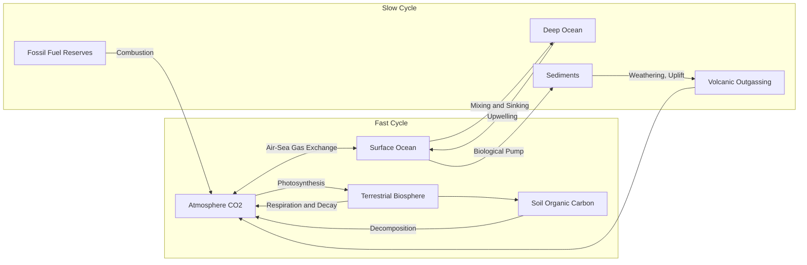

## Greenhouse Gas Dynamics and the Carbon Cycle

### Overview

Greenhouse gas (GHG) dynamics describe the sources, sinks, atmospheric lifetimes, and radiative properties of radiatively active trace gases, while the carbon cycle describes the exchange of carbon among atmospheric, oceanic, terrestrial, and geological reservoirs. Together these systems govern the atmospheric concentration trajectories that determine anthropogenic radiative forcing.

### Major Greenhouse Gases

#### Carbon Dioxide (CO₂)

CO₂ is the dominant anthropogenic forcing agent by cumulative effect, primarily from fossil fuel combustion, cement production, and land-use change. Its atmospheric lifetime is not characterized by a single exponential decay constant; instead, removal occurs across multiple timescales via distinct processes — rapid air-sea gas exchange and terrestrial uptake (years to decades), slower ocean mixing to depth (centuries), and geological weathering/carbonate sedimentation (10⁴–10⁵ years). A commonly cited simplification is that roughly 50% of an emitted pulse is removed within ~30 years, with a long tail persisting for millennia.

#### Methane (CH₄)

Methane has a much shorter atmospheric lifetime (~9–12 years), governed primarily by oxidation via the hydroxyl radical (OH):

$$\text{CH}_4 + \text{OH} \rightarrow \text{CH}_3 + \text{H}_2\text{O}$$

Despite its shorter lifetime, CH₄ has a substantially higher instantaneous radiative efficiency per molecule than CO₂ due to strong absorption in atmospheric-window wavelengths not saturated by CO₂ or water vapor. Sources include enteric fermentation (livestock), rice paddies, wetlands, fossil fuel extraction (fugitive emissions), and landfills.

#### Nitrous Oxide (N₂O)

N₂O has an atmospheric lifetime of roughly 109–120 years, removed primarily via stratospheric photolysis and reaction with excited oxygen atoms. Dominant anthropogenic sources are agricultural soil management (synthetic nitrogen fertilizer application) and biomass burning.

#### Halocarbons and Fluorinated Gases

CFCs, HCFCs, HFCs, PFCs, and SF₆ are synthetic compounds with high radiative efficiency and, in many cases, extremely long atmospheric lifetimes (SF₆: ~3,200 years). CFCs are additionally regulated under the Montreal Protocol due to stratospheric ozone depletion, distinct from their independent greenhouse forcing role.

#### Water Vapor and Tropospheric Ozone

Water vapor is the largest natural contributor to the greenhouse effect by mass and forcing but is treated as a feedback rather than a forcing agent, since its atmospheric concentration is set by temperature (Clausius-Clapeyron relation) rather than direct emission accumulation. Tropospheric ozone (O₃) is a secondary pollutant formed photochemically from NOx and volatile organic compound (VOC) precursors, with a short and spatially heterogeneous lifetime (days to weeks).

### Global Warming Potential and Global Temperature Potential

Because gases differ in both radiative efficiency and atmospheric lifetime, cross-gas comparison requires a common metric.

#### Global Warming Potential (GWP)

GWP integrates the time-dependent radiative forcing of a pulse emission of a gas relative to CO₂, over a specified time horizon (commonly 20 or 100 years):

$$GWP_x(TH) = \frac{\int_0^{TH} RF_x(t)\,dt}{\int_0^{TH} RF_{CO_2}(t)\,dt}$$

Approximate IPCC AR6 100-year GWP values: CH₄ (fossil) ≈ 29.8, CH₄ (non-fossil) ≈ 27.2, N₂O ≈ 273, SF₆ ≈ 25,200. [Inference: exact values are periodically revised between assessment reports as radiative efficiency and lifetime estimates are refined].

Methane's GWP is markedly higher on a 20-year horizon (~80-83×) than a 100-year horizon (~30×) because its forcing is concentrated in the near term before atmospheric removal, making time-horizon choice a substantive methodological decision rather than a neutral convention.

#### Global Temperature Potential (GTP)

An alternative metric estimating the change in global mean surface temperature at a specific future time resulting from a pulse emission, rather than cumulative integrated forcing. GTP better reflects endpoint temperature outcomes but is more model-dependent and less commonly used in policy accounting than GWP.

### The Carbon Cycle: Reservoirs and Fluxes

#### Major Reservoirs (approximate, gigatons of carbon, GtC)

| Reservoir | Approximate Size (GtC) | Residence Timescale |
| --- | --- | --- |
| Atmosphere | ~870 | — |
| Surface ocean | ~900 | Years to decades |
| Deep ocean | ~37,000 | Centuries to millennia |
| Terrestrial vegetation | ~450–650 | Years to decades |
| Soils and permafrost | ~1,500–1,700 (plus large permafrost stock) | Decades to millennia |
| Fossil fuel reserves | ~5,000+ | Geological (10⁶+ years without extraction) |
| Sedimentary rocks/lithosphere | >60,000,000 | 10⁵–10⁶+ years |

[Unverified: precise reservoir sizes vary across sources depending on methodology and reporting year; figures above represent commonly cited approximate ranges].

#### Fast vs. Slow Carbon Cycles

The fast carbon cycle operates on timescales of years to centuries, involving photosynthesis, respiration, air-sea gas exchange, and ocean mixing. The slow carbon cycle operates on geological timescales (10⁴–10⁶ years), involving silicate weathering, volcanic outgassing, and carbonate/organic carbon burial in sediments. Anthropogenic emissions extract carbon from the slow cycle's geological reservoir (fossil fuels) and inject it into the fast cycle, overwhelming natural fast-cycle equilibration capacity.

### Biological and Physical Pumps in the Ocean

#### Solubility Pump

CO₂ solubility increases with decreasing temperature and increasing pressure. Cold, high-latitude surface waters absorb atmospheric CO₂, which is then transported to depth via thermohaline circulation (deep water formation in the North Atlantic and Southern Ocean).

#### Biological Pump

Phytoplankton fix dissolved inorganic carbon into organic matter via photosynthesis in the euphotic zone. A fraction sinks as particulate organic carbon (marine snow) upon death, exporting carbon to depth before remineralization by heterotrophic bacteria. The efficiency of this export (the "export ratio" or "e-ratio") governs how much fixed carbon is sequestered versus recycled near the surface.

$$\text{Net Primary Production (NPP)} = \text{Gross Primary Production} - \text{Autotrophic Respiration}$$

#### Carbonate Pump

Calcifying organisms (coccolithophores, foraminifera, corals) precipitate calcium carbonate shells/skeletons:

$$\text{Ca}^{2+} + 2\text{HCO}_3^- \rightarrow \text{CaCO}_3 + \text{CO}_2 + \text{H}_2\text{O}$$

Notably, calcification releases CO₂ locally (reducing surface-water alkalinity's buffering capacity), even as the organic carbon component of the same organisms sequesters carbon — a frequently misunderstood distinction in carbon budget accounting.

### Terrestrial Carbon Fluxes

#### Photosynthesis and Respiration

Gross Primary Production (GPP) represents total carbon fixation via photosynthesis; a substantial fraction is returned to the atmosphere via autotrophic (plant) and heterotrophic (microbial/soil) respiration, with the residual representing Net Ecosystem Production (NEP):

$$NEP = GPP - R_{auto} - R_{hetero}$$

#### Permafrost Carbon Feedback

High-latitude permafrost soils store large quantities of organic carbon accumulated over millennia under frozen conditions. Warming-induced thaw exposes this material to microbial decomposition, releasing CO₂ and CH₄ (the latter particularly from anaerobic wetland conditions), constituting a potential positive feedback of substantial but poorly constrained magnitude. [Speculation: the precise magnitude and timing of large-scale permafrost carbon release remains an active area of scientific uncertainty, with published estimates spanning a wide range depending on thaw-rate assumptions and decomposition pathway partitioning].

### Anthropogenic Perturbation and the Global Carbon Budget

The IPCC/Global Carbon Project framework partitions the annual carbon budget as:

$$E_{FF} + E_{LUC} = G_{ATM} + S_{OCEAN} + S_{LAND} + B_{IM}$$

where $E_{FF}$ is fossil fuel and industrial emissions, $E_{LUC}$ is land-use change emissions, $G_{ATM}$ is the observed atmospheric growth rate, $S_{OCEAN}$ and $S_{LAND}$ are ocean and land carbon sinks, and $B_{IM}$ is a budget imbalance term reflecting the net of unresolved uncertainties across the other terms.

Approximately 44–50% of annual anthropogenic CO₂ emissions remain in the atmosphere (the "airborne fraction"), with the remainder partitioned roughly evenly between ocean and land sinks, though interannual variability is substantial and driven largely by terrestrial sink fluctuation (e.g., ENSO-related drought/growth variability).

### Atmospheric Lifetime and the Adjustment Time Concept

Distinguishing "turnover time" from "adjustment time" is a frequent source of confusion:

- **Turnover time**: Reservoir size divided by one-way flux (e.g., atmospheric CO₂ mass ÷ gross exchange flux), typically only a few years for CO₂ — reflecting rapid two-way exchange with ocean and biosphere.
- **Adjustment time**: The timescale over which an emitted pulse perturbation decays back toward equilibrium, accounting for the fact that removal processes slow as sinks approach saturation. For CO₂, this is far longer (centuries to millennia for full removal) because the fast reservoirs (surface ocean, biosphere) approach a new quasi-equilibrium with elevated atmospheric CO₂, leaving slow deep-ocean and geological processes to remove the remainder.

This distinction explains why CO₂ is often described as having no single "atmospheric lifetime" in the same sense as CH₄ or N₂O, but rather a multi-exponential decay response function (e.g., the Bern carbon cycle model formulation used in IPCC reporting).

### Key Points

- CO₂, CH₄, N₂O, and halocarbons differ substantially in radiative efficiency and atmospheric lifetime, requiring standardized metrics (GWP, GTP) for cross-gas comparison.
- The carbon cycle comprises a fast cycle (years–centuries: atmosphere, biosphere, surface ocean) and a slow cycle (10⁴–10⁶ years: sediments, volcanism, weathering); anthropogenic emissions transfer carbon from the slow geological reservoir into the fast cycle.
- Ocean carbon uptake operates via solubility, biological, and carbonate pumps, each with distinct mechanisms and, in the carbonate pump's case, a counterintuitive local CO₂ release during calcification.
- CO₂'s atmospheric decay is multi-exponential (Bern-model style), distinct from single-lifetime gases like CH₄ and N₂O, due to progressive saturation of fast sinks.
- Permafrost carbon feedback represents a substantial but poorly constrained potential amplifying feedback on anthropogenic warming.

**Related Topics**

- Physical Basis of Climate Change (radiative forcing fundamentals)
- Ocean Acidification and Carbonate Chemistry
- Terrestrial Ecosystem Carbon Flux Modeling (eddy covariance, remote sensing)
- Permafrost Thaw Dynamics and Arctic Amplification
- Global Carbon Budget Accounting Methodologies (Global Carbon Project)
- Paleoclimate CO₂ Reconstruction (ice cores, proxy records)
- Carbon Capture, Utilization, and Storage (CCUS) Technologies
- IPCC Emission Scenario Frameworks (SSP/RCP Pathways)