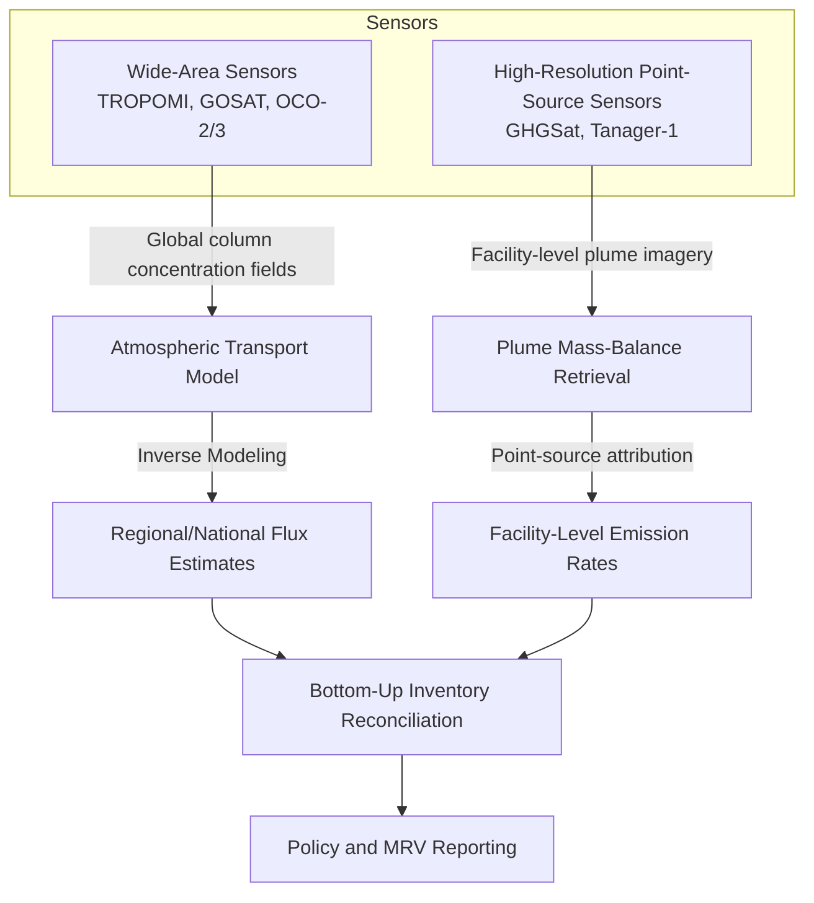
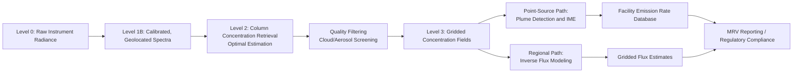

## Satellite-Based Emissions Detection and Monitoring

### Overview

Satellite-based emissions detection uses orbital remote sensing instruments to measure atmospheric concentrations of greenhouse gases and pollutants, enabling top-down (observation-derived) estimation of emission fluxes that complement traditional bottom-up (activity-based inventory) accounting. This field spans government-operated wide-area monitoring missions, commercial high-resolution facility-attribution constellations, and the inverse modeling frameworks that convert atmospheric concentration measurements into flux estimates.

### Measurement Principles

#### Spectroscopic Detection

Satellite GHG sensors are predominantly passive shortwave-infrared (SWIR) or thermal-infrared (TIR) spectrometers that measure sunlight reflected from Earth's surface after it has passed through the atmospheric column, or thermal emission from the surface/atmosphere. Trace gases absorb radiation at characteristic wavelengths corresponding to their molecular vibrational-rotational transitions — CO₂ near 1.6 and 2.0 μm, CH₄ near 1.65 and 2.3 μm. The depth and shape of these absorption features in the measured spectrum are inverted to retrieve column-averaged dry-air mole fractions, typically reported as XCO₂ or XCH₄.

$$X_{gas} = \frac{\int n_{gas}(z)\,dz}{\int n_{dry\,air}(z)\,dz}$$

where $n_{gas}(z)$ is the number density of the target gas as a function of altitude $z$, and the denominator normalizes by total dry-air column to reduce sensitivity to surface pressure and water vapor variability.

#### Retrieval Algorithms

Concentration retrieval from raw spectral radiance is an ill-posed inverse problem, typically solved via optimal estimation:

$$\hat{x} = x_a + (K^T S_\epsilon^{-1} K + S_a^{-1})^{-1} K^T S_\epsilon^{-1}(y - Kx_a)$$

where $\hat{x}$ is the retrieved state vector, $x_a$ is the a priori state estimate, $K$ is the Jacobian (weighting function) matrix relating state to measurement, $S_\epsilon$ is measurement error covariance, $S_a$ is a priori error covariance, and $y$ is the observed radiance spectrum. This Bayesian optimal estimation framework (Rodgers formalism) is standard across most operational atmospheric trace-gas retrieval algorithms.

### Mission Classes

#### Wide-Area / Global Flux Monitoring Missions

Designed for global coverage at moderate spatial resolution (kilometers), supporting regional and national-scale flux inversion rather than individual facility attribution.

- **GOSAT/GOSAT-2 (JAXA)**: Japan launched the first such satellite in 2009, the Greenhouse Gases Observing Satellite "IBUKI", using Fourier-transform spectrometry across multiple bands. [Icef](https://icef.go.jp/wp-content/themes/icef_new/pdf/roadmap/2024/12_ICEF2.0%20GHG%20Emissions%20Monitoring_stand%20alone.pdf)
- **GOSAT-GW (Ibuki GW, JAXA)**: Launched 28 June 2025, combining greenhouse gas monitoring with water-cycle observation via the TANSO-3 instrument, with a planned 7-year mission duration. [Wikipedia](https://en.wikipedia.org/wiki/Global_Observing_Satellite_for_Greenhouse_gases_and_Water_cycle)
- **OCO-2/OCO-3 (NASA)**: Orbiting Carbon Observatory missions providing high-precision XCO₂ retrievals; among NASA's core CO2 monitoring missions alongside Landsat, EMIT, and GOES. [Icef](https://icef.go.jp/wp-content/themes/icef_new/pdf/roadmap/2024/12_ICEF2.0%20GHG%20Emissions%20Monitoring_stand%20alone.pdf)
- **Sentinel-5P/TROPOMI (ESA/Copernicus)**: Provides daily global CH₄ and NO₂ column measurements at approximately 5.5 km × 5.5 km resolution, well suited to regional hotspot detection though not individual-facility attribution , in contrast to higher-resolution commercial data used to pinpoint emissions from individual facilities. [GHGSAT](https://www.ghgsat.com/en/case-studies/satellite-greenhouse-gas-monitoring/)
- **CO2M (Copernicus CO2 Monitoring, ESA/EU)**: The main satellite component of a new European CO2 monitoring and verification support capacity (CO2MVS) for tracking global anthropogenic CO2 and CH4 emissions, with the first of three platforms scheduled for delivery by the end of 2027 and a minimum 7.5-year operational life; the second and third satellites are planned for delivery in 2028 and 2029. The mission is expected to provide unprecedented global coverage, resolution, and accuracy for CO2 monitoring. [CO2M | EUMETSAT +2](https://www.eumetsat.int/co2m)

#### Facility-Level / High-Resolution Point-Source Missions

Designed to attribute emissions to individual industrial facilities, requiring high spatial resolution (tens of meters) at the cost of narrower swath and less frequent global coverage.

- **GHGSat constellation**: Currently consists of 16 satellites — the GHGSat-D technology demonstrator launched in June 2016, and a commercial fleet GHGSat-C1 through C17 launched between 2020 and 2026. Operating at approximately 25m × 25m spatial resolution, the constellation can pinpoint emissions from individual industrial sources including oil and gas facilities, landfills, and power generation sites, in contrast to lower-resolution wide-area missions suited to broader hotspot detection. Spire Global manufactures and operates several of these satellites (including Juba, Vanguard, and Elliot) under a Space-as-a-Service model, with Vanguard noted as the first commercial high-resolution CO2 monitoring satellite capable of pinpointing site-level emissions. [GHGSat - Earth Online +2](https://earth.esa.int/eogateway/missions/ghgsat)
- **Tanager-1 (Carbon Mapper / Planet Labs)**: An Earth observation satellite launched 16 August 2024 aboard a Falcon 9 from Vandenberg Space Force Base, designed to detect and measure methane and carbon dioxide emissions at the level of individual facilities, operated by the Carbon Mapper coalition. [Wikipedia](https://en.wikipedia.org/wiki/Tanager-1)
- **Other contributing missions**: EnMAP (DLR), PRISMA (ASI), and China's Gaofen, Ziyuan, and Huanjing missions contribute hyperspectral imaging capable of supplementary methane plume detection, alongside Maxar's WorldView program on the commercial side. [Icef](https://icef.go.jp/wp-content/themes/icef_new/pdf/roadmap/2024/12_ICEF2.0%20GHG%20Emissions%20Monitoring_stand%20alone.pdf)[Icef](https://icef.go.jp/wp-content/themes/icef_new/pdf/roadmap/2024/12_ICEF2.0%20GHG%20Emissions%20Monitoring_stand%20alone.pdf)

#### Historical / Legacy Instruments

SCIAMACHY, aboard the Envisat satellite, operated from 2002 to 2012 and provided tropospheric and stratospheric profiles of trace gases including CH4 and CO2, serving as a foundational precursor to current operational missions. [Eohandbook](https://database.eohandbook.com/ghg/)

### Plume Detection and Quantification

#### Facility-Level Quantification: Integrated Mass Enhancement (IME) Method

For point-source plume detection, retrieved methane column enhancement above background is integrated spatially and combined with wind speed to estimate an emission rate:

$$Q = \frac{U_{eff} \times IME}{L}$$

where $Q$ is the estimated emission rate, $U_{eff}$ is effective wind speed at plume height, $IME$ is the integrated mass enhancement (total excess mass of gas in the plume above background), and $L$ is an effective plume length scale. Wind speed and direction are typically obtained from co-located meteorological reanalysis products (e.g., ECMWF ERA5) rather than the satellite itself, introducing this as a significant source of retrieval uncertainty.

#### Regional/Global Flux Inversion

For wide-area missions, atmospheric chemical transport models (CTMs) combined with Bayesian inverse methods relate observed concentration fields to underlying surface fluxes:

$$\hat{s} = s_a + S_a H^T (H S_a H^T + S_o)^{-1}(y - H s_a)$$

where $\hat{s}$ is the posterior flux estimate, $s_a$ is the prior flux estimate (often derived from bottom-up inventories), $H$ is the transport operator (from a CTM such as GEOS-Chem or TM5), and $S_a$, $S_o$ are prior and observation error covariances respectively. This framework structurally parallels the optimal estimation retrieval equation but operates at the flux-inversion rather than spectral-retrieval stage of the processing chain.

### Data Processing Pipeline (Representative Architecture)

### Key Technical Challenges

#### Cloud and Aerosol Interference

SWIR retrievals require clear-sky conditions with the light path traversing the full atmospheric column to the surface and back; cloud contamination (even sub-pixel) introduces systematic retrieval bias, necessitating aggressive quality filtering that substantially reduces usable data yield, particularly in persistently cloudy regions.

#### Surface Albedo and Bidirectional Reflectance Effects

Retrieval accuracy depends on accurate characterization of surface reflectance, which varies with viewing geometry, surface type (vegetation, water, urban, desert), and season. Dark surfaces (open ocean in non-glint geometry) and heterogeneous land cover introduce additional retrieval error requiring dedicated surface reflectance correction algorithms.

#### Attribution Uncertainty in Wide-Area Inversions

Inverse flux estimates from coarse-resolution missions are sensitive to prior flux assumptions, transport model errors (boundary layer mixing schemes, vertical transport parameterization), and the sparsity of independent validation data, particularly over regions with limited ground-based reference network (TCCON, COCCON) coverage. [Inference: quantitative uncertainty bounds vary substantially by region, inversion system, and gas species, and are actively refined across model intercomparison exercises].

#### Revisit Frequency vs. Spatial Resolution Trade-off

High-resolution point-source sensors (narrow swath) trade off frequent revisit for spatial detail, meaning individual facilities may only be imaged every several days to weeks, creating gaps in continuous monitoring and limiting detection of intermittent or short-duration emission events.

### Applications

- **Regulatory Monitoring, Reporting, and Verification (MRV)**: Independent, measurement-based verification of self-reported emissions inventories, increasingly incorporated into national GHG reporting frameworks and voluntary carbon market protocols , providing independent, measurement-based evidence as governments tighten emissions reporting requirements. [GHGSAT](https://www.ghgsat.com/en/case-studies/satellite-greenhouse-gas-monitoring/)
- **Super-emitter identification**: Detection of anomalously large point-source methane releases (e.g., pipeline leaks, well blowouts, landfill anomalies) enabling rapid operator notification and mitigation.
- **National inventory reconciliation**: Comparing top-down satellite-derived flux estimates against bottom-up national inventory submissions under UNFCCC reporting frameworks, highlighting discrepancies for investigation.
- **Carbon market and ESG verification**: Third-party emissions verification supporting corporate climate disclosure and carbon offset project validation.

### Key Points

- Satellite GHG sensors retrieve column-averaged concentrations (XCO₂, XCH₄) via passive SWIR/TIR spectroscopy, inverted using Bayesian optimal estimation.
- Missions bifurcate into wide-area/global flux monitoring (GOSAT, TROPOMI, OCO-2/3, upcoming CO2M) and high-resolution facility-attribution missions (GHGSat, Tanager-1), with a fundamental spatial-resolution-versus-coverage trade-off.
- Facility-level quantification uses plume mass-balance methods (IME) combined with external wind data; regional/global flux estimation uses atmospheric transport model inversion.
- Cloud/aerosol screening, surface reflectance characterization, and prior-flux sensitivity in inversions remain primary sources of retrieval and attribution uncertainty.
- The field is rapidly expanding, with next-generation missions (CO2M, GOSAT-GW, expanded GHGSat fleet) improving global coverage, resolution, and CO2-specific detection capability alongside established methane-focused systems.

**Related Topics**

- Greenhouse Gas Dynamics and the Carbon Cycle (flux context for inversion priors)
- Atmospheric Chemical Transport Modeling (GEOS-Chem, TM5)
- Remote Sensing Fundamentals: Passive vs. Active Sensors
- Hyperspectral Imaging and Spectral Unmixing Techniques
- Ground-Based Validation Networks (TCCON, COCCON)
- Methane Super-Emitter Detection and Rapid Response Systems
- Carbon Market MRV (Monitoring, Reporting, Verification) Frameworks
- Inverse Modeling and Bayesian Data Assimilation in Earth Science