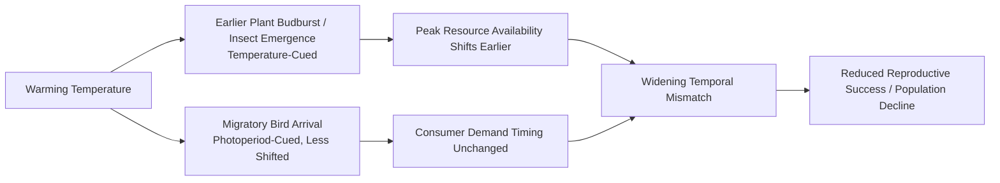

## Climate Change Impacts on Ecosystems

### Overview

Climate change alters ecosystems through shifts in temperature, precipitation, extreme event frequency, and ocean chemistry, propagating through physiological, phenological, distributional, and community-level responses. These impacts are typically studied through the lens of species-level physiological tolerance, range dynamics, phenological mismatch, and cascading trophic effects, with quantitative attribution increasingly supported by long-term observational networks and process-based ecological models.

### Physiological Mechanisms of Climate Sensitivity

#### Thermal Performance Curves

Organismal fitness (growth rate, metabolic efficiency, reproductive output) as a function of temperature typically follows an asymmetric unimodal curve, rising gradually from a critical minimum, peaking at a thermal optimum, then declining sharply beyond a critical maximum due to protein denaturation and enzymatic dysfunction:

$$P(T) = P_{max} \exp\left(-\left(\frac{T - T_{opt}}{\sigma}\right)^2\right) \quad \text{for } T \leq T_{opt}$$

with a steeper decline function typically applied above $T_{opt}$, reflecting the asymmetric thermal sensitivity commonly observed in ectotherm physiology. Species currently living near their thermal optimum in warm environments (particularly tropical ectotherms) are disproportionately vulnerable to further warming, since they operate closer to their upper critical threshold with less margin than temperate species.

#### Metabolic Theory of Ecology

Metabolic rate scaling with temperature follows an Arrhenius-type relationship:

$$B = B_0 M^{3/4} e^{-E_a/kT}$$

where $B$ is metabolic rate, $M$ is body mass, $E_a$ is activation energy, $k$ is Boltzmann's constant, and $T$ is absolute temperature. This framework underlies predictions that warming disproportionately accelerates metabolic demand relative to resource availability in ectotherms, with cascading effects on growth, reproduction, and trophic interaction strength.

### Phenological Shifts

#### Mechanism

Phenology — the timing of recurring biological events (flowering, migration, breeding, emergence from dormancy) — is frequently cued by temperature accumulation (growing degree-days) or photoperiod. Because photoperiod is climate-invariant while temperature is shifting, species relying primarily on temperature cues shift phenology at different rates than those relying on photoperiod, creating differential response rates across trophic levels and taxa.

$$GDD = \sum_{i=1}^{n} \max(0, T_i - T_{base})$$

where $GDD$ is accumulated growing degree-days, $T_i$ is daily mean temperature, and $T_{base}$ is a species-specific developmental threshold temperature.

#### Trophic Mismatch

When interacting species (e.g., a herbivorous insect and its host plant, or a migratory bird and its peak food resource) shift phenology at different rates, the temporal overlap between resource availability and consumer demand narrows or disappears — a well-documented phenomenon termed phenological or trophic mismatch, with the magnitude of mismatch varying substantially by system and having been empirically demonstrated in several long-term study systems (e.g., great tit-caterpillar synchrony studies).

### Species Range Shifts

#### Climate Velocity

Climate velocity quantifies the speed and direction at which a species would need to migrate to track its climatic niche as isotherms shift spatially:

$$v_{clim} = \frac{\partial T / \partial t}{\partial T / \partial x}$$

where the numerator is the local rate of temperature change over time and the denominator is the spatial temperature gradient. Regions with shallow spatial temperature gradients (e.g., flat terrain, high latitudes) exhibit high climate velocities, requiring species to migrate rapidly to track suitable conditions, whereas topographically complex regions (mountains) offer shorter required migration distances due to steep elevational gradients.

#### Observed Range Shift Patterns

Meta-analyses of range shift studies have documented systematic poleward and upslope shifts across many taxonomic groups, though shift rates vary substantially by taxon, dispersal capacity, and habitat fragmentation context. Elevational shifts are frequently constrained by "mountaintop extinction" risk, where high-elevation specialist species have no further upslope habitat available as isotherms shift upward, a dynamic sometimes termed the "escalator to extinction."

#### Range Shift Lags and Disequilibrium

Observed range shifts frequently lag behind the pace of climatic change due to dispersal limitation, habitat fragmentation (reducing connectivity between suitable patches), biotic interactions (competition, predation) constraining realized versus fundamental niche expansion, and generation time constraints in long-lived species. This produces a "climate debt" — a growing gap between a species' current distribution and where its climatic niche is located.

### Species Interactions and Community Restructuring

#### Novel Community Assembly

Differential rates of range shift and phenological change among interacting species can produce novel species combinations lacking co-evolutionary history, potentially disrupting established competitive hierarchies, predator-prey dynamics, and mutualistic relationships (e.g., pollinator-plant networks).

#### Coral Bleaching as a Case Study in Thermal Threshold Dynamics

Coral bleaching results from the breakdown of the symbiotic relationship between coral hosts and endosymbiotic zooxanthellae (Symbiodinium) under thermal stress, in which the coral expels its symbiotic algae. Sustained sea surface temperature anomalies of approximately 1°C above the local historical maximum for several weeks typically induce bleaching, quantified operationally via NOAA's Degree Heating Week (DHW) metric:

$$DHW = \sum_{i=1}^{84} \max(0, SST_i - MMM - 1°C)$$

where $SST_i$ is daily sea surface temperature, $MMM$ is the maximum monthly mean climatological temperature, and the summation covers a rolling 12-week (84-day) window. A DHW value exceeding approximately 4°C-weeks is associated with significant bleaching risk, and values exceeding 8°C-weeks with mortality risk, though exact thresholds vary by reef region and coral species. [Inference: precise DHW thresholds are regionally calibrated and subject to refinement as bleaching response data accumulates].

### Biome-Level and Ecosystem-Scale Impacts

#### Terrestrial Biome Shifts

Climate envelope models project poleward and upslope shifts in biome boundaries (e.g., boreal forest encroachment into tundra, savanna expansion into forest margins under altered fire-precipitation regimes), though transition dynamics are mediated by disturbance regimes, soil development lag times, and dispersal constraints that can delay observed biome shifts well behind projected climatic suitability shifts.

#### Marine Ecosystem Impacts

- **Ocean acidification**: Declining pH reduces carbonate ion availability, impairing calcification in shell-forming organisms (mollusks, some plankton, corals) and altering marine food web base productivity.
- **Marine heatwaves**: Discrete, prolonged anomalously warm ocean temperature events (formally defined via a percentile-based threshold relative to a climatological baseline) have been linked to mass mortality events, harmful algal blooms, and species distribution shifts in documented case studies (e.g., the Northeast Pacific "The Blob" event).
- **Deoxygenation**: Warming-driven reduction in oxygen solubility combined with increased stratification (reduced vertical mixing) is expanding hypoxic "dead zones," particularly compounding coastal eutrophication effects.

#### Freshwater Ecosystem Impacts

Altered precipitation timing and intensity affect streamflow regimes, thermal stratification duration in lakes, and drought/flood frequency, with downstream effects on aquatic species phenology (e.g., salmonid migration timing) and water quality (altered nutrient cycling, harmful algal bloom frequency).

### Extreme Events and Disturbance Regimes

#### Wildfire Regime Change

Increased temperature, altered precipitation seasonality, and vegetation fuel load changes interact to shift wildfire frequency, intensity, and season length in fire-adapted and non-fire-adapted ecosystems alike, with documented expansion of fire season length and burned area in multiple regions, though attribution to climate change versus land management and fuel accumulation history requires careful disentangling in any specific case.

#### Drought and Heat Stress Interactions

Compound drought-heatwave events exert disproportionate ecosystem stress relative to either factor alone, driving documented forest dieback events in several regions (attributed to a combination of hydraulic failure and carbon starvation mechanisms in tree physiology), with the relative contribution of each mechanism varying by species and event. [Inference: the precise mechanistic partitioning between hydraulic failure and carbon starvation in specific dieback events remains an active research question].

### Ecosystem Feedbacks to Climate

Ecosystem responses are not purely passive; several constitute feedbacks to the climate system itself:

- **Albedo feedback via vegetation shift**: Boreal forest expansion into tundra reduces surface albedo (dark canopy versus snow-covered tundra), amplifying regional warming.
- **Carbon sink/source transitions**: Forest dieback, permafrost thaw, and peatland drying can convert historically net carbon-sink ecosystems into net carbon sources, constituting a positive feedback to atmospheric CO₂ concentration.
- **Methane emission from wetland expansion/contraction**: Altered precipitation and permafrost thaw affect wetland extent and anaerobic decomposition rates, modulating CH₄ flux to the atmosphere.

### Key Points

- Ecosystem climate impacts operate through nested mechanisms: individual physiological thermal tolerance, population-level phenological timing, species range distribution, and emergent community/ecosystem restructuring.
- Phenological mismatch arises when interacting species respond to different environmental cues (temperature versus photoperiod) at different rates, decoupling previously synchronized resource-consumer timing.
- Climate velocity and range-shift lag concepts explain why observed species distributions frequently trail behind climatic suitability shifts, producing a measurable "climate debt."
- Coral bleaching (via Degree Heating Week thresholds) exemplifies a well-quantified thermal-threshold ecosystem response with direct management application.
- Ecosystems are not solely impact recipients — vegetation, permafrost, and wetland responses feed back onto the climate system via albedo and greenhouse gas flux changes.

**Related Topics**

- Physical Basis of Climate Change (forcing and feedback fundamentals)
- Greenhouse Gas Dynamics and the Carbon Cycle (ecosystem carbon sink/source dynamics)
- Ocean Acidification and Carbonate Chemistry
- Species Distribution Modeling and Climate Envelope Approaches
- Conservation Planning Under Climate Change (assisted migration, protected area design)
- Extreme Event Attribution Science
- Biodiversity Loss Metrics and the IPBES Framework
- Ecosystem-Based Adaptation and Nature-Based Climate Solutions