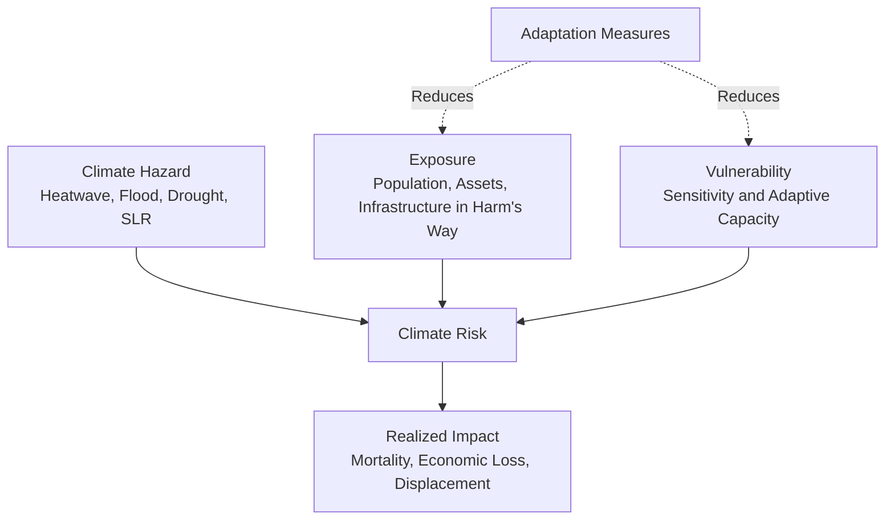

## Climate Change Impacts on Human Systems

### Overview

Climate change affects human systems through direct physical exposure pathways (heat, extreme weather, sea-level rise) and through cascading effects on the systems societies depend upon — agriculture, water resources, health, infrastructure, and economic productivity. Impact assessment in this domain typically combines climate hazard projections, exposure/vulnerability characterization, and damage function modeling to produce quantitative risk estimates used in adaptation planning and economic policy.

### Conceptual Framework: Hazard, Exposure, Vulnerability

The IPCC risk framework decomposes climate-related risk into three interacting components:

$$Risk = f(Hazard, Exposure, Vulnerability)$$

- **Hazard**: The physical climate event or trend (heatwave, flood, drought, sea-level rise).
- **Exposure**: The presence of people, assets, or systems in places that could be adversely affected.
- **Vulnerability**: The propensity or predisposition to be adversely affected, encompassing sensitivity and adaptive capacity.

This framework explains why identical physical hazards produce vastly different human impacts across locations — a heatwave of equal magnitude produces different mortality outcomes depending on housing quality, air conditioning prevalence, healthcare access, and outdoor labor exposure, all vulnerability and exposure factors independent of the hazard itself.

### Agricultural Impacts

#### Crop Yield Response Modeling

Crop yield sensitivity to climate is commonly represented through process-based crop models (e.g., DSSAT, APSIM) or statistical panel regression approaches relating yield to temperature and precipitation exposure. A widely used statistical specification captures nonlinear temperature response via degree-day binning:

$$Yield = \beta_0 + \beta_1 GDD + \beta_2 EDD + \beta_3 Precip + \beta_4 Precip^2 + \gamma_i + \delta_t + \epsilon$$

where $GDD$ is growing degree-days below a threshold, $EDD$ is "extreme degree-days" (exposure above a harmful temperature threshold, often found to depress yields sharply beyond ~29-32°C for maize), $\gamma_i$ are location fixed effects, and $\delta_t$ are year fixed effects controlling for common shocks. This nonlinear, threshold-based response — modest sensitivity to moderate warming, sharp sensitivity beyond a crop-specific threshold — is a robust empirical finding across multiple staple crop econometric studies, though exact threshold values and yield-loss magnitudes vary by crop, cultivar, and region. [Inference: point estimates of yield loss per degree of warming vary considerably across studies and are sensitive to model specification, CO2 fertilization assumptions, and adaptation assumptions].

#### CO₂ Fertilization Effect

Elevated atmospheric CO₂ can enhance photosynthetic rates and water-use efficiency in C3 plants (wheat, rice, soybeans) more than in C4 plants (maize, sorghum, sugarcane), due to differences in carbon-fixation biochemistry. This effect partially offsets temperature-driven yield losses in C3 crops under moderate warming scenarios, though its magnitude under field (as opposed to controlled chamber) conditions remains a source of ongoing scientific debate, and the effect diminishes or reverses under co-occurring heat and water stress.

#### Livestock and Fisheries

Heat stress reduces livestock feed intake, growth rates, and reproductive performance, with quantifiable relationships to the Temperature-Humidity Index (THI) used in animal science. Marine fisheries face redistribution driven by species range shifts (see ecosystem impacts) alongside declining maximum sustainable yield in warming, increasingly stratified waters, with disproportionate impact on tropical, subsistence-dependent fishing communities that have limited capacity to follow shifting stocks.

### Water Resources

#### Hydrological Cycle Intensification

Thermodynamic constraints (Clausius-Clapeyron scaling, ~7% increase in atmospheric moisture-holding capacity per °C warming) drive intensification of the hydrological cycle: wet regions and seasons tend toward increased precipitation intensity, while dry regions and seasons tend toward increased evaporative demand and drought severity — a pattern often summarized as "wet gets wetter, dry gets drier," though regional deviations from this generalization are common and depend heavily on shifting atmospheric circulation patterns, not moisture availability alone.

#### Streamflow and Snowpack Dynamics

In snow-dominated basins, warming shifts precipitation from snow to rain and advances snowmelt timing, altering the seasonal streamflow hydrograph — reducing summer baseflow (historically sustained by gradual snowmelt) while increasing winter/early-spring flood risk. This has direct implications for water storage infrastructure designed around historical seasonal flow assumptions.

$$Q(t) = P_{rain}(t) + M_{snow}(t) - ET(t) - \Delta S(t)$$

where $Q(t)$ is streamflow, $P_{rain}$ is rainfall input, $M_{snow}$ is snowmelt contribution, $ET$ is evapotranspiration, and $\Delta S$ is change in storage (soil moisture, groundwater, reservoir).

#### Groundwater Depletion Interactions

Increased reliance on groundwater as a drought-coping buffer, combined with reduced natural recharge under shifted precipitation patterns, has been documented to accelerate aquifer depletion in several major agricultural regions, creating a long-term water security risk that operates on timescales extending well beyond any single drought event.

### Human Health Impacts

#### Heat-Related Mortality

Heat-mortality relationships are typically characterized via non-linear exposure-response functions estimated from epidemiological time-series data, commonly showing a U- or J-shaped curve with minimum mortality at a location-specific optimal temperature and rising mortality risk at both cold and hot extremes:

$$RR(T) = \exp\left(\beta_1(T - T_{MMT}) + \beta_2(T-T_{MMT})^2\right) \quad \text{for } T > T_{MMT}$$

where $RR$ is relative mortality risk and $T_{MMT}$ is the minimum mortality temperature, which varies by population acclimatization (populations in historically warmer climates exhibit higher heat tolerance thresholds than those in historically cooler climates, reflecting both physiological acclimatization and infrastructure adaptation such as air conditioning prevalence).

#### Vector-Borne and Infectious Disease Range Shifts

Temperature and precipitation govern vector (mosquito, tick) reproductive rates, biting frequency, and pathogen incubation period, producing documented poleward and upward-elevation expansion of transmission-suitable zones for diseases including malaria, dengue, and Lyme disease in multiple studied regions. [Inference: the magnitude of future disease burden shift depends substantially on co-occurring factors — vector control investment, land-use change, and population immunity — that are not purely climate-determined].

#### Air Quality Interactions

Climate change interacts with air pollution through multiple pathways: higher temperatures accelerate ground-level ozone formation (a photochemical reaction sensitive to temperature and sunlight), and increased wildfire frequency elevates particulate matter (PM2.5) exposure, compounding respiratory and cardiovascular health burdens independent of direct temperature effects.

### Sea-Level Rise and Coastal Impacts

#### Coastal Flooding Exposure

Relative sea-level rise (combining global mean sea-level rise, local land subsidence, and vertical land motion) elevates baseline water levels, converting previously rare extreme storm-surge flood events into progressively more frequent occurrences — a dynamic quantified via extreme value statistics:

$$P(H > h) = \left(1 + \xi \frac{h - \mu}{\sigma}\right)^{-1/\xi}$$

using a Generalized Pareto or Generalized Extreme Value distribution fit to historical water-level records, where $\mu$, $\sigma$, $\xi$ are location, scale, and shape parameters. As baseline sea level ($\mu$) rises, a flood event with a historical "100-year" return period can become substantially more frequent, without any change in storm characteristics themselves.

#### Coastal Land Loss and Salinization

Beyond direct inundation, sea-level rise drives saltwater intrusion into coastal aquifers and agricultural soils, and accelerates coastal erosion, with particularly acute documented impacts in low-lying river deltas and small island states where adaptive capacity and land availability for managed retreat are limited.

### Economic Impacts

#### Damage Function Approaches in Integrated Assessment Models

Climate-economy Integrated Assessment Models (IAMs) such as DICE (Dynamic Integrated Climate-Economy) represent aggregate economic damage as a function of global mean temperature anomaly:

$$D(T) = \frac{1}{1 + a_1 T + a_2 T^2}$$

representing the fraction of output preserved under a given temperature anomaly $T$, with $a_1$, $a_2$ calibrated to sector-specific damage estimates. This highly aggregated approach has drawn substantial methodological criticism for potentially understating tail risks (catastrophic, non-marginal damages) and for the difficulty of calibrating quadratic damage functions against limited historical analog data. [Inference: the appropriate functional form and parameterization of aggregate climate damage functions remains one of the most actively debated areas of climate economics, with published estimates of the "social cost of carbon" varying by more than an order of magnitude across studies depending on damage function choice, discount rate, and tail-risk treatment].

#### Labor Productivity

Physiological heat-stress constraints on safe sustained physical exertion (captured via metrics like Wet-Bulb Globe Temperature, WBGT) impose direct limits on outdoor and non-climate-controlled indoor labor productivity, with documented productivity losses concentrated in agriculture, construction, and manufacturing sectors in already-hot regions, representing a channel of economic damage distinct from capital destruction or output-market disruption.

#### Sectoral and Regional Heterogeneity

Economic damage estimates consistently show pronounced heterogeneity: tropical and already-hot, lower-income regions face disproportionately larger projected GDP losses per degree of warming than higher-latitude, higher-income regions — a pattern driven by both greater physical hazard exposure (proximity to physiological/agronomic thermal thresholds) and lower baseline adaptive capacity.

### Migration and Displacement

Climate-related displacement is increasingly recognized as operating through multiple distinct pathways: sudden-onset disaster displacement (storms, floods), slow-onset environmental degradation (desertification, sea-level rise, prolonged drought) driving gradual out-migration, and displacement mediated through climate's effect on conflict and resource competition risk. Attribution of migration decisions specifically to climate factors, as distinct from co-occurring economic and social drivers, remains methodologically challenging, since climate stressors typically interact with pre-existing economic and political vulnerability rather than acting as an independent, isolable cause. [Inference: quantitative global projections of future "climate migrants" vary enormously across studies depending on modeling assumptions about adaptation, mobility constraints, and destination absorption capacity].

### Infrastructure and the Built Environment

Infrastructure designed around historical climate statistics (design storms, flood elevations, thermal expansion tolerances) faces a growing performance gap as climate statistics shift — a phenomenon termed "non-stationarity" in engineering design standards, since traditional infrastructure design has historically assumed a statistically stationary climate. Sectors with long-lived, climate-sensitive assets (transportation, energy transmission, water/wastewater systems) face particular exposure to this design-assumption mismatch, motivating growing adoption of forward-looking, scenario-based design standards in place of purely historical-record-based approaches.

### Key Points

- Human system climate risk is conventionally decomposed into hazard, exposure, and vulnerability, explaining why identical physical hazards produce divergent human impacts across contexts.
- Agricultural yield response to warming is characteristically nonlinear, with sharp yield losses beyond crop-specific extreme-heat thresholds, partially offset in C3 crops by CO2 fertilization under field-condition uncertainty.
- Heat-mortality and hydrological responses both exhibit strong nonlinearity and threshold behavior, requiring nonlinear statistical or process-based modeling rather than linear climate-impact extrapolation.
- Sea-level rise converts historically rare coastal flood events into progressively more frequent occurrences via extreme-value statistical shifts, independent of any change in storm characteristics.
- Aggregate economic damage function calibration (as used in IAMs) remains one of the most actively debated areas of climate economics, with substantial implications for social cost of carbon estimates and policy design.
- Regional and sectoral heterogeneity is a persistent theme: lower-income, already-hot regions face disproportionate projected damages relative to higher-latitude, higher-income regions.

**Related Topics**

- Climate Change Impacts on Ecosystems (biophysical foundations for agricultural/fisheries impacts)
- Physical Basis of Climate Change (hazard-side forcing fundamentals)
- Climate Adaptation Planning and Resilience Frameworks
- Social Cost of Carbon and Climate-Economy Integrated Assessment Models
- Extreme Event Attribution Science
- Climate-Induced Migration and Displacement Governance
- Heat-Health Early Warning Systems
- Coastal Zone Management and Managed Retreat Strategies