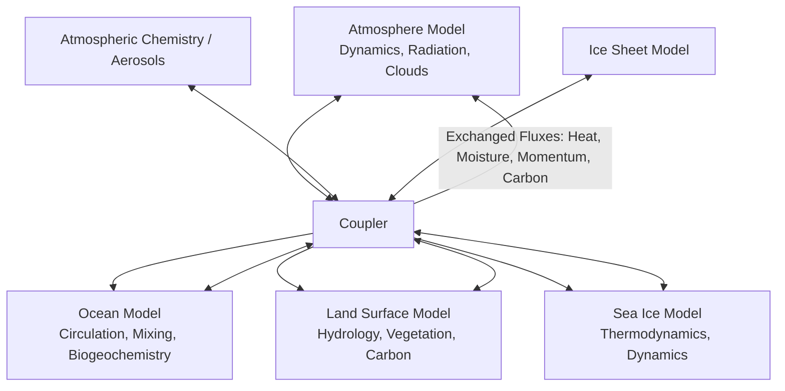
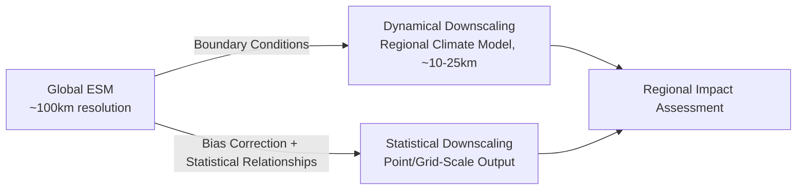

## Climate Projections and Scenario Modeling

### Overview

Climate projections translate assumptions about future greenhouse gas emissions, land use, and socioeconomic development into quantitative estimates of future climate states, using coupled numerical models of the atmosphere, ocean, land surface, and cryosphere. Scenario modeling provides the structured input pathways (emissions, forcing, socioeconomic context) that drive these physical models, and the combination underpins the projections reported in IPCC assessments and used for adaptation and mitigation planning.

### General Circulation Models and Earth System Models

#### Core Architecture

General Circulation Models (GCMs), now more commonly termed Earth System Models (ESMs) when they include biogeochemical cycling, numerically solve the governing equations of fluid dynamics and thermodynamics on a discretized three-dimensional grid spanning the atmosphere and ocean. Core governing equations include the Navier-Stokes equations (momentum), the continuity equation (mass conservation), the first law of thermodynamics (energy conservation), and the ideal gas law, solved subject to boundary conditions including solar insolation, surface topography, and prescribed or interactive greenhouse gas concentrations.

$$\frac{D\vec{v}}{Dt} = -\frac{1}{\rho}\nabla p - 2\vec{\Omega} \times \vec{v} + \vec{g} + F_{friction}$$

representing the momentum equation with pressure gradient, Coriolis, gravitational, and frictional forcing terms — the foundational dynamical core equation underlying atmospheric and oceanic circulation modeling.

#### Model Components and Coupling

Modern ESMs couple multiple component models via a central coupler that exchanges fluxes (heat, moisture, momentum, carbon) at each timestep:

Each component operates at its own native timescale and grid resolution, with the coupler handling spatial regridding and temporal synchronization — a nontrivial numerical challenge given the disparate characteristic timescales of atmospheric (hours-days), oceanic (years-centuries), and ice-sheet (centuries-millennia) processes.

#### Parameterization of Sub-Grid Processes

Processes occurring at spatial scales smaller than the model grid resolution (typically tens to hundreds of kilometers) — notably convection, cloud microphysics, and boundary-layer turbulence — cannot be explicitly resolved and instead require parameterization: simplified statistical or empirical representations of their aggregate grid-cell-averaged effect. Parameterization choices are a major source of inter-model spread, particularly for cloud feedback processes, and represent one of the primary reasons different ESMs produce different climate sensitivity estimates despite solving fundamentally similar governing equations.

### Emission Scenario Frameworks

#### Representative Concentration Pathways (RCPs)

Developed for IPCC AR5, RCPs are defined by their approximate 2100 radiative forcing level (W/m²) relative to pre-industrial conditions, without an embedded socioeconomic narrative:

| Pathway | Approx. 2100 Forcing | General Character |
| --- | --- | --- |
| RCP2.6 | ~2.6 W/m² | Strong mitigation; peak-and-decline emissions |
| RCP4.5 | ~4.5 W/m² | Intermediate stabilization |
| RCP6.0 | ~6.0 W/m² | Higher stabilization pathway |
| RCP8.5 | ~8.5 W/m² | High-emissions, limited mitigation pathway |

RCP8.5 has been frequently characterized in the literature as a "business-as-usual" baseline in earlier usage, though subsequent analysis has noted its emissions trajectory implies coal-intensive growth assumptions increasingly viewed as a high-end rather than central scenario relative to observed and projected energy-system trends. [Inference: appropriate characterization of RCP8.5's likelihood remains subject to ongoing discussion in the scenario literature].

#### Shared Socioeconomic Pathways (SSPs)

Developed for IPCC AR6, SSPs pair a socioeconomic narrative (demographic, economic, technological, and governance assumptions) with a radiative forcing target, denoted SSPx-y (narrative x, forcing y W/m²):

- **SSP1**: "Sustainability" — low challenges to mitigation and adaptation
- **SSP2**: "Middle of the Road" — moderate challenges to both
- **SSP3**: "Regional Rivalry" — high challenges to both
- **SSP4**: "Inequality" — low mitigation challenge, high adaptation challenge
- **SSP5**: "Fossil-Fueled Development" — high mitigation challenge, low adaptation challenge

Common combinations used in CMIP6 include SSP1-2.6, SSP2-4.5, SSP3-7.0, and SSP5-8.5, allowing researchers to disentangle the effects of socioeconomic development pathway from radiative forcing outcome — a key advance over the RCP framework, in which a given forcing level was not tied to a specific socioeconomic narrative.

### Model Intercomparison Projects

#### CMIP Structure

The Coupled Model Intercomparison Project (CMIP) coordinates standardized experimental protocols across dozens of independently developed ESMs from modeling centers worldwide, enabling systematic comparison of model spread and supporting IPCC assessment synthesis. CMIP6 (supporting IPCC AR6) introduced the SSP-based scenario framework alongside a substantially expanded set of Model Intercomparison Projects (MIPs) targeting specific process questions (e.g., aerosol effects, permafrost, ice sheets).

#### Ensemble Approaches and Uncertainty Characterization

Because no single model perfectly represents all relevant physical processes, projections are typically presented as multi-model ensembles, with inter-model spread serving as one (imperfect) proxy for structural uncertainty. Three distinct uncertainty sources are conventionally decomposed in climate projection studies:

$$\sigma^2_{total} = \sigma^2_{scenario} + \sigma^2_{model} + \sigma^2_{internal\,variability}$$

- **Scenario uncertainty**: Dependent on future emissions pathway choice, dominant at longer (multi-decadal to century) timescales.
- **Model (structural) uncertainty**: Arising from differences in model formulation, parameterization, and resolution across the ensemble.
- **Internal variability**: Natural, chaotic climate system variability (e.g., ENSO-related fluctuations) that is irreducible even given a perfect model and known forcing, typically dominant at near-term (annual to decadal) timescales and characterized via large initial-condition ensembles run from a single model.

### Downscaling for Regional Application

#### Dynamical Downscaling

Nests a higher-resolution Regional Climate Model (RCM) within a coarser-resolution global ESM, using the global model output as boundary conditions, enabling explicit resolution of regional-scale processes (topographic precipitation enhancement, coastal effects) not captured at native GCM grid resolution, at substantially higher computational cost.

#### Statistical Downscaling

Establishes empirical relationships between coarse-resolution large-scale climate variables (predictors) and local-scale observed climate variables (predictands) using historical data, then applies these relationships to future GCM output. Common approaches include bias-correction and spatial disaggregation (BCSD), quantile mapping, and regression-based statistical downscaling. This approach is computationally inexpensive relative to dynamical downscaling but assumes the historical predictor-predictand relationship remains stationary under future climate conditions — an assumption of uncertain validity under conditions substantially outside the historical training range.

### Model Evaluation and Validation

#### Hindcast and Historical Simulation Skill

Model credibility is assessed partly through hindcasting — running the model over the historical period with observed forcing and comparing simulated versus observed climate statistics (mean state, variability, trends). Strong historical performance is a necessary but not sufficient condition for future projection reliability, since a model can reproduce historical trends through compensating errors in different physical processes.

#### Emergent Constraints

A methodology that uses an observable relationship across the model ensemble between a present-day, measurable quantity and a future projected quantity (typically climate sensitivity or a related metric) to narrow projection uncertainty using real-world observations of the measurable quantity. This approach has been applied to constrain equilibrium climate sensitivity estimates using observed present-day quantities such as tropical marine boundary-layer cloud properties, though the statistical robustness and physical basis of individual emergent constraint relationships remains subject to ongoing methodological scrutiny. [Inference: the reliability of any specific emergent constraint depends on the ensemble sample size and the strength of the underlying physical mechanism linking predictor and predictand, both of which vary considerably across published constraints].

### Projection Outputs and Their Application

#### Time-of-Emergence

The time at which a climate change signal becomes statistically distinguishable from the range of natural internal variability, calculated using signal-to-noise ratio thresholds applied to model ensemble output. Time-of-emergence varies substantially by variable (temperature signals typically emerge earlier than precipitation signals, given precipitation's higher natural variability-to-signal ratio) and by region (tropical regions often show earlier temperature signal emergence than mid-latitude regions, due to comparatively lower baseline temperature variability).

#### Committed Warming and Pathway Dependence

Due to ocean thermal inertia, a portion of eventual equilibrium warming remains "committed" even if emissions were to cease immediately — a quantity distinct from, and smaller than, the additional warming that would occur under continued emissions. This distinction underlies the important but frequently conflated concepts of "committed warming" (from past emissions and current atmospheric composition) versus "additional warming" (avoidable through future mitigation choices).

### Key Points

- ESMs numerically solve coupled fluid-dynamical and thermodynamic equations across atmosphere, ocean, land, and ice components, with sub-grid processes (especially clouds) requiring parameterization that drives much of the inter-model spread in climate sensitivity.
- The SSP framework (AR6) improves on the RCP framework (AR5) by decoupling and then explicitly re-pairing socioeconomic narrative and radiative forcing outcome, rather than specifying forcing alone.
- Projection uncertainty decomposes into scenario, model/structural, and internal variability components, with internal variability dominating near-term projections and scenario choice dominating long-term projections.
- Dynamical downscaling explicitly resolves regional processes at high computational cost; statistical downscaling is computationally cheap but relies on a stationarity assumption of uncertain validity under novel future conditions.
- Emergent constraints attempt to narrow projection uncertainty using observable present-day relationships, though individual constraint robustness varies and remains an active area of methodological development.

**Related Topics**

- Physical Basis of Climate Change (forcing and feedback fundamentals underlying model formulation)
- Climate Change Impacts on Human Systems (scenario-driven impact assessment applications)
- Paleoclimate Model Validation and Proxy Reconstruction
- Extreme Event Attribution Science
- Regional Climate Risk Assessment and Downscaled Product Selection
- IPCC Assessment Report Synthesis Processes
- Machine Learning Emulators for Climate Model Acceleration
- Ice Sheet and Sea-Level Rise Projection Modeling