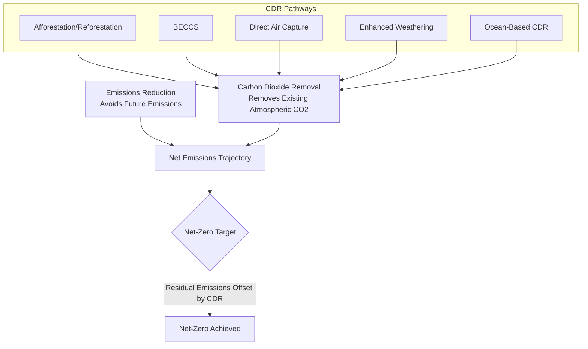
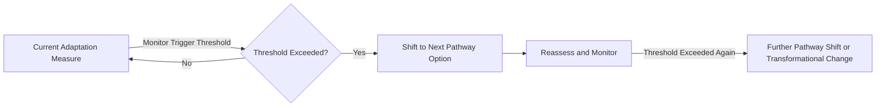

## Mitigation and Adaptation Strategies

### Overview

Climate response strategies bifurcate into mitigation — reducing the magnitude of future climate change by limiting greenhouse gas emissions or enhancing removal — and adaptation — reducing vulnerability and building resilience to climate impacts that are already occurring or considered unavoidable. These are complementary rather than substitutable strategies: mitigation reduces long-term risk magnitude while adaptation manages near- and medium-term exposure, with insufficient mitigation increasing the eventual adaptation burden.

### Mitigation: Decarbonization Pathways

#### Sectoral Emission Sources and Abatement Levers

Global anthropogenic GHG emissions are conventionally attributed across major sectors, each requiring distinct technical abatement strategies:

| Sector | Primary Abatement Levers |
| --- | --- |
| Power generation | Renewable deployment, nuclear, CCS retrofit, grid decarbonization |
| Industry (cement, steel, chemicals) | Electrification, hydrogen reduction routes, CCS, material efficiency |
| Transportation | Electrification, modal shift, sustainable aviation/marine fuels |
| Buildings | Efficiency retrofits, heat pump electrification, embodied carbon reduction |
| Agriculture | Enteric fermentation reduction, fertilizer efficiency, soil carbon management |
| Land use / forestry | Avoided deforestation, afforestation/reforestation, improved forest management |

#### Marginal Abatement Cost Curves

A standard analytical tool for comparing abatement options ranks measures by cost-effectiveness (cost per unit of emissions avoided), constructing a stepped curve where each segment's width represents abatement potential and height represents marginal cost:

$$MAC_i = \frac{\Delta Cost_i}{\Delta Emissions_i}$$

Measures with negative marginal cost (net cost savings, e.g., certain efficiency measures) appear before the zero-cost line, historically termed the "low-hanging fruit," though the persistent existence of profitable-yet-unadopted measures (the "energy efficiency gap") has motivated substantial behavioral and market-failure-based economic literature examining why such measures are not automatically adopted despite apparent net benefit.

#### Carbon Pricing Mechanisms

Carbon pricing internalizes the external cost of emissions via either a carbon tax (fixing price, allowing quantity to adjust) or a cap-and-trade system (fixing aggregate quantity, allowing price to adjust via permit trading):

$$MC_{abatement}(Q) = P_{carbon}$$

Under either instrument, economically efficient abatement occurs where each emitter's marginal abatement cost equals the carbon price, theoretically equalizing marginal costs across all covered emitters and thereby minimizing aggregate abatement cost for a given total emissions target — a standard result from environmental economics theory, subject in practice to coverage gaps, allocation method effects, and market design details that can meaningfully affect real-world efficiency outcomes.

#### Carbon Dioxide Removal (CDR)

Distinct from emissions reduction, CDR technologies actively remove CO₂ already present in the atmosphere:

- **Afforestation/Reforestation**: Biological carbon sequestration via tree growth; constrained by land availability competition with agriculture and biodiversity considerations, and subject to permanence risk (fire, disease, land-use reversal).
- **Bioenergy with Carbon Capture and Storage (BECCS)**: Combines biomass energy generation with CO2 capture and geological storage, theoretically achieving net-negative emissions since the biomass feedstock's growth-phase carbon uptake exceeds the combustion-phase release once captured; constrained by land-use competition and capture infrastructure buildout requirements.
- **Direct Air Capture (DAC)**: Chemical sorption/absorption processes extract CO2 directly from ambient air, typically followed by geological storage or utilization; currently characterized by relatively high per-ton cost and substantial energy input requirements relative to point-source capture, with cost trajectories dependent on technology learning-curve progression. [Inference: DAC cost projections vary considerably across sources depending on assumed deployment scale, energy price assumptions, and technology maturation rate].
- **Enhanced Weathering**: Accelerates natural silicate rock weathering (which naturally sequesters atmospheric CO2 over geological timescales) by spreading finely ground reactive minerals, most commonly on agricultural land, though the technology remains at a comparatively early stage of large-scale field validation relative to more established CDR pathways.
- **Ocean-based CDR**: Includes ocean alkalinity enhancement and blue carbon (coastal wetland/seagrass) restoration approaches, both at an earlier stage of technical and governance maturity, with monitoring, reporting, and verification (MRV) methodologies still under active development.

### Mitigation: Technology and Systems Transition

#### Renewable Energy Integration Fundamentals

Variable renewable energy (VRE) sources — wind and solar — require complementary system flexibility (storage, demand response, transmission expansion, dispatchable backup) to manage intermittency, with the technical and economic challenge of integration increasing nonlinearly as VRE penetration share rises, due to increasing curtailment risk and reduced marginal value of additional VRE capacity at high penetration levels (a phenomenon termed "value deflation").

#### Electrification and Sector Coupling

Electrifying end-uses historically served by direct fossil fuel combustion (space heating via heat pumps, transportation via battery-electric vehicles, certain industrial processes) shifts emissions accounting to the power sector, making electrification's net climate benefit directly contingent on simultaneous power-sector decarbonization — a coupling that requires coordinated rather than independent sectoral planning.

#### Hard-to-Abate Sectors

Certain sectors face particular technical decarbonization difficulty due to high-temperature process heat requirements (cement, steel, some chemicals), energy density constraints (aviation, long-haul shipping), or process emissions inherent to the chemical reaction itself rather than the energy source (cement calcination, which releases CO2 from limestone independent of the fuel used to heat the kiln). These sectors are disproportionately dependent on emerging pathways such as green hydrogen, carbon capture, and novel low-carbon material chemistries.

### Adaptation: Conceptual Framework

#### Adaptive Capacity and Limits to Adaptation

Adaptive capacity — the ability of a system to adjust to climate impacts — is shaped by financial resources, institutional capacity, technology access, social capital, and governance quality. The IPCC framework distinguishes "soft" limits to adaptation (currently binding due to resource, knowledge, or institutional constraints, but potentially surmountable) from "hard" limits (where no adaptive actions are available to avoid intolerable risk, such as physiological thermal tolerance limits or the loss of low-lying island territory to sea-level rise beyond a certain threshold).

#### Adaptation Pathways Approach

A planning methodology that sequences adaptation actions over time as a decision tree, with pre-defined monitoring thresholds ("triggers" or "adaptation tipping points") indicating when a shift to the next pathway branch becomes necessary — explicitly designed to manage deep uncertainty about future climate trajectories by preserving flexibility rather than committing to a single static long-term design.

### Adaptation: Sectoral Strategies

#### Infrastructure and Engineering Adaptation

Includes upgrading design standards to reflect non-stationary future climate statistics (rather than historical-record-based design), hard engineering measures (sea walls, levees), and increasingly, nature-based or hybrid approaches (living shorelines, wetland restoration) that can provide comparable protection with additional ecosystem co-benefits and greater adaptive flexibility than fixed hard infrastructure, though with different performance characteristics under extreme events.

#### Agricultural Adaptation

Includes drought- and heat-tolerant crop variety development, shifted planting calendars, precision irrigation technology, crop diversification, and index-based agricultural insurance mechanisms that use an objective proxy metric (e.g., rainfall or satellite-derived vegetation index) rather than individually assessed loss, reducing verification costs and moral hazard relative to traditional indemnity insurance.

#### Water Resource Adaptation

Includes demand management, water storage and conveyance infrastructure diversification, managed aquifer recharge, and integrated water resource management approaches that explicitly account for projected shifts in seasonal availability rather than relying solely on historical hydrological records.

#### Health System Adaptation

Includes heat-health early warning systems (triggering public health interventions at forecast temperature thresholds), vector-borne disease surveillance expansion into newly suitable transmission zones, and healthcare infrastructure resilience to extreme events.

#### Coastal Adaptation and Managed Retreat

A spectrum of responses to sea-level rise ranging from protection (engineered defenses), to accommodation (elevating structures, flood-resistant design), to managed retreat (planned relocation from high-risk areas) — with the appropriate strategy generally shifting toward accommodation and retreat as protection costs escalate relative to protected asset value, though retreat decisions carry substantial social, cultural, and equity dimensions beyond pure cost-benefit calculation.

### Interactions Between Mitigation and Adaptation

#### Synergies

Certain interventions provide both mitigation and adaptation benefit simultaneously — nature-based solutions such as mangrove and wetland restoration sequester carbon while providing coastal protection; urban tree canopy expansion sequesters carbon while reducing urban heat island intensity and associated heat-mortality risk.

#### Trade-offs and Maladaptation

Some adaptation responses can inadvertently increase emissions (e.g., expanded air conditioning demand as a heat-adaptation response, absent parallel power-sector decarbonization) or increase long-term vulnerability despite near-term risk reduction (e.g., hard coastal engineering that encourages continued development in high-risk zones, increasing eventual exposure when protection infrastructure is exceeded or fails) — a phenomenon termed maladaptation, which adaptation planning frameworks increasingly seek to explicitly screen against.

### Governance and Policy Instruments

Beyond carbon pricing, mitigation policy instruments include renewable portfolio standards, technology-specific subsidies and tax credits, fuel economy/emissions standards, and border carbon adjustment mechanisms designed to address competitiveness and carbon leakage concerns under asymmetric international climate policy stringency. Adaptation governance operates substantially through national adaptation plans, sub-national and municipal resilience planning, and international finance mechanisms (e.g., dedicated adaptation funds under the UNFCCC framework) directed disproportionately toward lower-income, higher-vulnerability nations with limited independent adaptation finance capacity.

### Key Points

- Mitigation and adaptation are complementary, not substitutable: mitigation reduces the eventual scale of climate risk, while adaptation manages exposure to impacts already locked in or unavoidable.
- Sectoral decarbonization requires distinct technical pathways per sector, with "hard-to-abate" sectors (cement, steel, aviation, shipping) facing particular technical constraints beyond straightforward electrification.
- Carbon Dioxide Removal is distinct from emissions reduction and spans a range of technology maturity levels, from established (afforestation) to early-stage (ocean-based CDR, enhanced weathering).
- Adaptive capacity has both soft limits (resource/institutional, potentially surmountable) and hard limits (physiological/physical, not surmountable through adaptation alone), a distinction central to adaptation planning under deep uncertainty.
- Adaptation pathways methodology explicitly sequences decisions with monitored triggers, managing uncertainty through planned flexibility rather than single-point static design.
- Maladaptation risk — where near-term adaptation actions increase long-term vulnerability or emissions — is an increasingly explicit consideration in adaptation planning frameworks.

**Related Topics**

- Climate Projections and Scenario Modeling (scenario basis for mitigation pathway analysis)
- Climate Change Impacts on Human Systems (vulnerability context for adaptation prioritization)
- Carbon Pricing Design and Emissions Trading Systems
- Nature-Based Solutions and Ecosystem-Based Adaptation
- Climate Finance and International Adaptation Funding Mechanisms
- Carbon Capture, Utilization, and Storage (CCUS) Technologies
- Just Transition and Climate Policy Equity Considerations
- Social Cost of Carbon and Climate-Economy Integrated Assessment Models