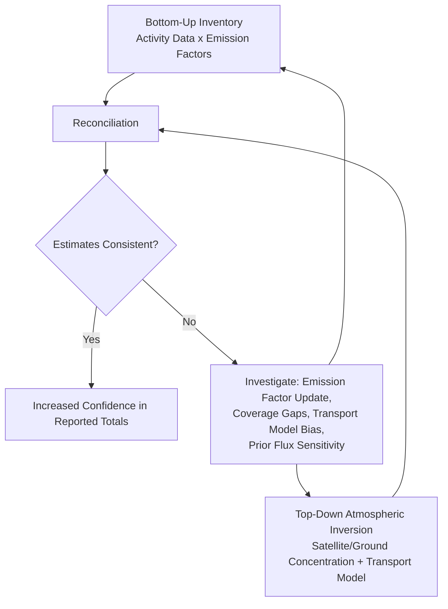
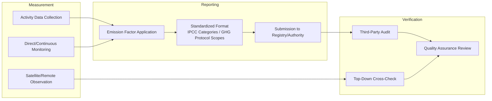

## Carbon Monitoring, Reporting, and Verification

### Overview

Monitoring, Reporting, and Verification (MRV) refers to the integrated set of methodologies used to quantify greenhouse gas emissions and removals, document them in standardized formats, and independently verify their accuracy. MRV underpins national GHG inventory reporting under the UNFCCC, corporate emissions disclosure, and the integrity of carbon markets, and increasingly integrates satellite-based top-down observation with traditional bottom-up activity-based accounting.

### Bottom-Up Inventory Methodology

#### Tiered Emission Factor Approach

The IPCC Guidelines for National Greenhouse Gas Inventories establish a standardized activity-data-times-emission-factor framework:

$$E = \sum_i AD_i \times EF_i$$

where $E$ is total emissions, $AD_i$ is activity data for source category $i$ (e.g., tons of fuel combusted, head of livestock), and $EF_i$ is the corresponding emission factor (emissions per unit activity). The IPCC framework defines three methodological tiers of increasing complexity and data specificity:

- **Tier 1**: Default global or regional emission factors applied to readily available activity data; lowest data requirement, highest uncertainty.
- **Tier 2**: Country- or region-specific emission factors reflecting local technology, fuel composition, or management practices; moderate data requirement and uncertainty reduction.
- **Tier 3**: Facility-level or process-specific models/direct measurement, often incorporating continuous emissions monitoring; highest data requirement, lowest uncertainty, but not always feasible at national inventory scale across all source categories.

#### Source Category Structure

National inventories are organized by standardized sector categories: Energy, Industrial Processes and Product Use (IPPU), Agriculture, Forestry and Other Land Use (AFOLU), and Waste — a structure (commonly abbreviated IPPU/AFOLU framework) designed to enable consistent cross-country comparison and aggregation while avoiding double-counting across sectors.

### Top-Down Observational Verification

#### Atmospheric Inversion as Independent Check

As covered in satellite-based emissions detection, top-down flux estimates derived from atmospheric concentration observations combined with transport modeling provide an independent check on bottom-up inventory totals, operating on a fundamentally different methodological basis (physical atmospheric measurement rather than activity-based accounting) and therefore subject to different, largely uncorrelated sources of error.

#### Reconciling Top-Down and Bottom-Up Estimates

Discrepancies between top-down and bottom-up estimates can arise from inventory-side sources (outdated emission factors, incomplete source coverage, underreporting) or observation-side sources (transport model error, prior flux assumption sensitivity, measurement retrieval uncertainty, and the difficulty of attributing a given atmospheric signal to a specific anthropogenic versus natural source in mixed-source regions). Systematic reconciliation exercises comparing the two approaches have become a standard component of inventory quality assurance in jurisdictions with adequate observational coverage, though the diagnostic value of any specific comparison depends heavily on local network density and source-sector complexity. [Inference: the relative contribution of inventory error versus observational/methodological error in any specific top-down/bottom-up discrepancy is generally not resolvable without additional independent evidence].

### Corporate and Facility-Level GHG Accounting

#### GHG Protocol Scope Framework

The widely adopted corporate accounting standard categorizes emissions into three scopes:

- **Scope 1**: Direct emissions from owned or controlled sources (on-site combustion, company vehicle fleets, process emissions).
- **Scope 2**: Indirect emissions from purchased electricity, heat, or steam consumption, calculated via either a location-based method (grid-average emission factor) or a market-based method (reflecting contractual instruments such as renewable energy certificates).
- **Scope 3**: All other indirect emissions occurring in a company's value chain (upstream and downstream), spanning fifteen defined categories including purchased goods and services, business travel, and use of sold products — typically the largest and most methodologically uncertain scope for most companies, given its dependence on supply-chain data availability and boundary-setting judgment calls.

#### Scope 3 Estimation Challenges

Because Scope 3 emissions frequently cannot be directly measured, they are commonly estimated via spend-based methods (applying an emission-factor-per-dollar-of-spend to procurement data, generally the lowest-precision approach), average-data methods (applying industry-average emission factors to physical activity quantities), or supplier-specific methods (using actual supplier-reported emissions data, the highest-precision but highest-data-burden approach) — with method choice representing a direct precision-versus-feasibility trade-off across a company's full value chain.

### Carbon Market MRV

#### Offset Project Quantification Principles

Carbon offset projects (e.g., afforestation, methane capture, renewable energy) must demonstrate emission reductions or removals relative to a counterfactual baseline scenario, governed by several core integrity principles central to voluntary and compliance carbon market standards:

- **Additionality**: The claimed reduction would not have occurred in the absence of the carbon credit revenue/incentive — assessed via barrier analysis, common practice analysis, or regulatory surplus tests, and widely regarded as among the most methodologically contentious aspects of offset quantification given its inherently counterfactual (unobservable) nature.
- **Permanence**: For removal-based credits (particularly biological sequestration), the risk that stored carbon may later be released (fire, land-use reversal, disease) is addressed via buffer pools (a reserved credit percentage held back to cover reversal risk) or insurance mechanisms.
- **Leakage**: The risk that emission-reducing activity in the project boundary displaces emissions-generating activity to outside the boundary (e.g., protecting one forest parcel while logging shifts to an adjacent unprotected parcel), requiring either boundary expansion or discount factors in credit issuance.
- **Baseline setting**: Establishing a credible counterfactual emissions/removal trajectory against which project performance is measured, commonly critiqued in the literature for systematic over-crediting risk when baselines are set using historical rather than dynamically updated, performance-based reference levels.

#### Third-Party Verification and Registries

Independent verification bodies (accredited under standards such as Verra's VCS or the Gold Standard) audit project documentation and monitoring data against the applicable methodology before credit issuance, with registries providing public serialized credit tracking intended to prevent double-counting or double-issuance of the same emission reduction.

### Measurement, Reporting, and Verification Architecture

### Uncertainty Quantification in MRV

Inventory uncertainty propagates from both activity data uncertainty and emission factor uncertainty, commonly combined via error propagation formulas under an assumption of independence between sources:

$$U_{total} = \sqrt{\sum_i (U_{AD,i}^2 + U_{EF,i}^2) \times w_i^2}$$

where $U$ terms represent relative uncertainty percentages and $w_i$ reflects each source category's proportional contribution to total emissions — a simplified representation of the error propagation approach used in IPCC inventory uncertainty guidance, with more rigorous treatments employing Monte Carlo simulation over full source-category correlation structures rather than the simplified independence assumption.

### Emerging Integration: Satellite-Enhanced MRV

The growing operational capability of facility-level satellite monitoring (as detailed in satellite-based emissions detection) is increasingly integrated directly into MRV workflows, particularly for methane, enabling more frequent, independently verifiable emission estimates for point sources such as oil and gas facilities — a development actively reshaping regulatory MRV frameworks (e.g., enhanced facility-level reporting requirements incorporating remote sensing data) and carbon market methodology design, since it reduces reliance on self-reported activity data for a growing subset of source categories.

### Key Points

- Bottom-up inventory accounting follows a standardized activity-data-times-emission-factor structure across three IPCC methodological tiers of increasing data specificity and decreasing uncertainty.
- Top-down atmospheric-observation-based verification provides a methodologically independent check on bottom-up totals, with discrepancies requiring careful attribution to inventory-side versus observation-side error sources.
- Corporate GHG accounting under the GHG Protocol's three-scope framework faces its greatest methodological uncertainty in Scope 3 (value chain) emissions, where estimation method choice directly trades off precision against data feasibility.
- Carbon offset MRV integrity rests on four core, frequently contested principles: additionality, permanence, leakage, and credible baseline-setting.
- Satellite-based facility-level monitoring is increasingly integrated into both regulatory and voluntary-market MRV frameworks, reducing dependence on self-reported activity data for select emission source categories.

**Related Topics**

- Satellite-Based Emissions Detection and Monitoring (top-down observational input to MRV)
- Greenhouse Gas Dynamics and the Carbon Cycle (emission factor and atmospheric lifetime foundations)
- Mitigation and Adaptation Strategies (carbon market context for offset-based mitigation)
- Carbon Pricing Design and Emissions Trading Systems
- IPCC National Greenhouse Gas Inventory Guidelines
- Corporate Climate Disclosure and ESG Reporting Standards
- Blockchain and Digital MRV Infrastructure for Carbon Markets
- Additionality and Baseline Methodology Design in Offset Markets