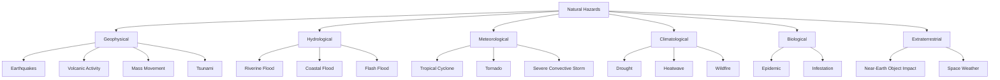
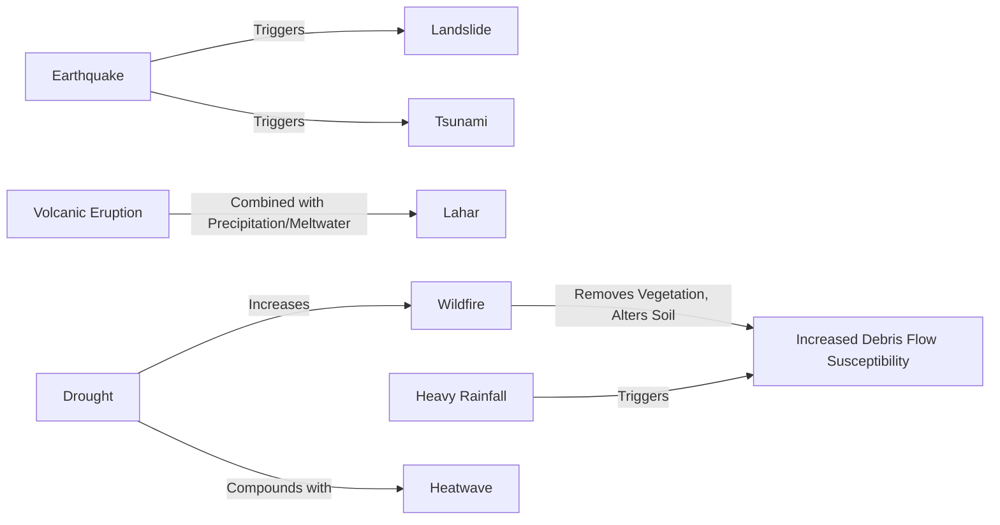

## Classification of Natural Hazards

### Overview

Natural hazard classification provides a structured framework for organizing the wide diversity of physical processes capable of causing harm to human life, property, and ecosystems. Classification schemes typically organize hazards by originating process (geophysical, hydrometeorological, biological), by onset speed, by spatial and temporal scale, or by underlying causal mechanism — each framework serving different purposes in risk assessment, early warning system design, and disaster management planning.

### Process-Based Classification

The most widely used classification scheme, adopted in variants by international disaster databases (e.g., EM-DAT) and national hazard agencies, organizes hazards by their originating physical process:

#### Geophysical Hazards

Originating from solid-earth processes: earthquakes, volcanic activity, mass movements (landslides, rockfalls, subsidence not directly triggered by precipitation), and tsunamis (though tsunamis are sometimes separately classified given their distinct propagation mechanism and typically oceanic/coastal impact pathway).

#### Hydrological Hazards

Originating from the occurrence, movement, and distribution of water: riverine (fluvial) flooding, coastal flooding, flash flooding, and precipitation-triggered landslides/debris flows (positioned at the geophysical-hydrological boundary given their dual triggering mechanism).

#### Meteorological Hazards

Originating from short-lived atmospheric processes: tropical cyclones, extratropical storms, tornadoes, hailstorms, and severe convective storms.

#### Climatological Hazards

Originating from longer-duration or extreme-value atmospheric/climate processes: drought, extreme temperature events (heatwaves, cold waves), and wildfire (though wildfire is frequently treated as a compound hazard given its dependence on both climatological preconditioning and an ignition trigger, discussed further below).

#### Biological Hazards

Originating from exposure to living organisms or their toxic byproducts: epidemics, insect infestations, and animal-related hazards — included in comprehensive disaster hazard taxonomies though addressed by a distinct professional and scientific community (public health, epidemiology) relative to physical/environmental hazards.

#### Extraterrestrial Hazards

Originating outside Earth's atmosphere: near-Earth object impacts and space weather events (geomagnetic storms affecting satellite/grid infrastructure) — a comparatively low-probability but potentially high-consequence category increasingly incorporated into comprehensive national risk registers.

### Classification by Onset Speed

A functionally significant classification axis for emergency management planning, distinguishing hazards by the time available between detectability and impact:

- **Rapid-onset hazards**: Earthquakes, tsunamis, flash floods, tornadoes — characterized by warning times ranging from effectively zero (earthquakes, at least for the initiating rupture itself) to minutes-to-hours, placing a premium on pre-positioned response capacity and automated/rapid warning dissemination systems rather than warning-triggered evacuation alone.
- **Slow-onset hazards**: Drought, sea-level rise, desertification — characterized by warning times of months to years, enabling anticipatory risk-reduction planning but often receiving comparatively less acute public and institutional attention than rapid-onset events due to their gradual, less visually dramatic progression, a phenomenon documented in disaster risk perception literature.

This onset-speed distinction has direct implications for early warning system design: rapid-onset hazard warning systems prioritize detection-to-dissemination latency minimization, while slow-onset hazard monitoring prioritizes trend detection and threshold-based triggering of anticipatory action protocols.

### Classification by Spatial and Temporal Scale

#### Spatial Extent

Hazards range from highly localized (a single landslide or sinkhole, affecting a discrete site) to regional (drought, heatwave, affecting large multi-state or multi-country areas) to potentially global in indirect consequence (a sufficiently large volcanic eruption's stratospheric aerosol injection affecting global climate for months to years).

#### Temporal Duration and Recurrence

Hazard events vary from seconds (earthquake ground shaking duration) to minutes-hours (tornado, flash flood) to weeks-months (drought, prolonged flooding) to years (multi-year drought episodes). Return period — the average time interval between events of a given magnitude at a specific location — is a standard statistical framework for characterizing recurrence, typically derived from extreme value statistical distributions fit to historical event records (as discussed in the sea-level rise/coastal flooding context of climate impacts on human systems).

### Single, Multiple, and Compound Hazard Classification

#### Single Hazards

A discrete hazard process considered in isolation, useful for hazard-specific engineering design standards and early warning system development, but potentially understating aggregate risk where multiple hazard types affect a given location.

#### Multi-Hazard Frameworks

Recognize that many locations face exposure to several distinct hazard types, requiring integrated rather than siloed risk assessment — for example, a coastal region may face independent exposure to tropical cyclones, coastal flooding, and earthquake/tsunami risk, each requiring distinct but potentially overlapping mitigation infrastructure and emergency response protocols.

#### Compound and Cascading Hazards

Distinguished from simple multi-hazard co-location by involving causal or statistical dependence between hazard processes:

- **Compound hazards**: Multiple hazard drivers or events combine to produce an impact exceeding what either would produce independently — for example, concurrent drought and heatwave conditions (compound drought-heatwave events, discussed in the ecosystem impacts context), or a storm surge coinciding with high astronomical tide and heavy rainfall-driven riverine discharge (compound coastal-fluvial flooding).
- **Cascading hazards**: A primary hazard triggers one or more secondary hazards in causal sequence — for example, an earthquake triggering landslides and/or a tsunami, or a volcanic eruption triggering lahars (volcanic mudflows) when eruptive material combines with precipitation or glacial meltwater, or a wildfire increasing subsequent debris-flow/landslide susceptibility on burned slopes due to loss of vegetative slope stabilization and altered soil hydrophobicity.

Wildfire exemplifies the difficulty of rigid single-category classification: it requires a climatological/meteorological precondition (fuel dryness, wind), a triggering ignition source (natural lightning or anthropogenic), and its own consequences frequently cascade into subsequent geophysical hazards (post-fire debris flows) — illustrating why modern comprehensive hazard taxonomies increasingly supplement primary process-based categories with explicit compound/cascading hazard annotation rather than treating classification as mutually exclusive.

### Natural vs. Technological and Anthropogenic Hazard Boundaries

#### Natech Hazards

"Natural hazard triggering technological disaster" (Natech) events occur when a natural hazard triggers a secondary technological/industrial failure — for example, an earthquake damaging a chemical storage facility and causing a hazardous material release, or a flood inundating an electrical substation causing cascading infrastructure failure. This hybrid category sits explicitly at the boundary between natural hazard and technological hazard taxonomies, requiring integrated assessment approaches distinct from either category considered independently.

#### Anthropogenic Influence on "Natural" Hazard Frequency and Magnitude

Several ostensibly "natural" hazard categories have documented or hypothesized anthropogenic modification pathways: climate change alters the frequency/intensity distribution of meteorological and climatological hazards (as detailed in climate projections and impacts content); land-use change (deforestation, urbanization, impervious surface expansion) alters flood and landslide susceptibility; and in specific documented cases, industrial fluid injection/extraction activities have been linked to induced seismicity, distinct from purely natural tectonic earthquake generation. This blurring has prompted some hazard classification frameworks to explicitly flag hazard categories with significant anthropogenic modification potential, rather than treating "natural" hazards as entirely independent of human activity.

### Classification by Measurement and Intensity Scale

Different hazard types employ distinct, process-specific intensity/magnitude scales reflecting their underlying physical measurement basis — for example, the Richter/moment magnitude scale for earthquake energy release, the Saffir-Simpson scale for tropical cyclone wind intensity, the Volcanic Explosivity Index for eruption magnitude, and the Modified Mercalli Intensity scale for earthquake shaking impact (as distinct from earthquake source energy). These scale differences reflect the distinct underlying physical processes and are generally not directly convertible or comparable across hazard types without a common risk or damage-based normalization framework.

### Key Points

- Process-based classification (geophysical, hydrological, meteorological, climatological, biological, extraterrestrial) is the most widely used organizing framework, though individual hazards (notably wildfire) frequently resist clean single-category placement.
- Onset-speed classification (rapid versus slow) has direct, distinct implications for early warning system design and institutional/public risk perception.
- Compound hazards (concurrent, mutually reinforcing drivers) and cascading hazards (sequential causal triggering) represent an increasingly emphasized classification dimension beyond simple process-type or multi-hazard co-location.
- Natech events and anthropogenically modified hazard frequency/magnitude illustrate that the natural/technological and natural/anthropogenic hazard boundaries are increasingly treated as permeable rather than strictly categorical in modern risk frameworks.
- Hazard-specific intensity scales (magnitude, wind speed category, eruption explosivity index) reflect distinct underlying physical measurement bases and are not directly cross-comparable without a common damage or risk-based normalization.

**Related Topics**

- Earthquake Hazard and Seismic Risk Assessment
- Volcanic Hazard Assessment and Eruption Forecasting
- Flood Hazard Mapping and Hydrological Risk Modeling
- Tropical Cyclone Formation, Intensity, and Track Forecasting
- Wildfire Behavior Modeling and Fire Weather Indices
- Compound and Cascading Disaster Risk Assessment Methodologies
- Early Warning System Design and Last-Mile Communication
- Disaster Risk Reduction Frameworks (Sendai Framework)