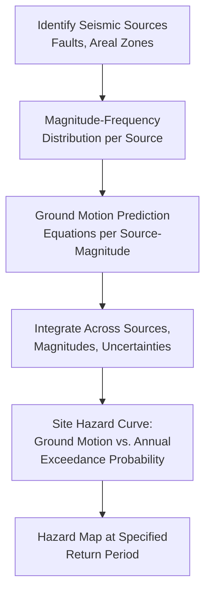

## Hazard Mapping and Risk Assessment

### Overview

Hazard mapping and risk assessment translate hazard science into spatially explicit products that support land-use planning, engineering design, emergency preparedness, and insurance/financial risk management. The field integrates hazard characterization (where, how often, how severe), exposure inventory (what is present), and vulnerability assessment (how susceptible exposed elements are to harm) into quantified, mappable risk metrics.

### Foundational Risk Equation

Building on the hazard-exposure-vulnerability framework introduced in the climate impacts context, quantitative risk assessment formalizes this relationship as an expected loss calculation:

$$Risk = \sum_i P(H_i) \times E_i \times V_i \times C_i$$

where $P(H_i)$ is the annual probability of hazard scenario $i$ occurring, $E_i$ is the value of exposed elements under that scenario, $V_i$ is the vulnerability (fractional loss given exposure, typically 0-1), and $C_i$ is asset or population value/consequence. Summing across the full range of plausible hazard scenarios (varying in magnitude and corresponding probability) yields a metric commonly termed Average Annual Loss (AAL) or Expected Annual Damage (EAD), a standard basis for risk-informed investment prioritization and insurance pricing.

### Hazard Characterization and Mapping

#### Probabilistic Hazard Mapping

Represents hazard intensity (ground shaking, flood depth, wind speed) as a function of exceedance probability or return period, typically derived from either physical process modeling (hydraulic/hydrologic simulation for flood, ground-motion simulation for seismic hazard) or statistical extreme-value analysis of historical records (as introduced in the sea-level rise context):

$$P(X > x) = 1 - F(x)$$

where $F(x)$ is the cumulative distribution function of the hazard intensity variable, fit using distributions appropriate to the hazard type (e.g., Generalized Extreme Value for flood peak discharge, or a magnitude-frequency Gutenberg-Richter relation combined with ground-motion attenuation modeling for seismic hazard).

#### Deterministic vs. Probabilistic Approaches

- **Deterministic (scenario-based) mapping**: Represents the consequences of a specific, defined hazard scenario (e.g., a magnitude 7.0 earthquake on a named fault, or a Category 4 hurricane on a specific track), useful for emergency response planning and public communication given its intuitive single-scenario framing, but not directly informative of overall long-term risk level across the full range of possible events.
- **Probabilistic mapping**: Integrates across the full range of possible hazard magnitudes and their respective probabilities (e.g., Probabilistic Seismic Hazard Analysis, PSHA; Probabilistic Flood Hazard Analysis), producing hazard maps expressed in terms of a specified return period or annual exceedance probability, forming the basis for most modern engineering design codes and risk-based land-use regulation.

#### Probabilistic Seismic Hazard Analysis (PSHA) as a Representative Methodology

PSHA exemplifies the general probabilistic hazard mapping workflow and is structured around four core steps: (1) identification and characterization of all seismic sources (faults, areal source zones) capable of generating damaging ground motion at the site of interest; (2) development of a magnitude-frequency distribution for each source (commonly a truncated Gutenberg-Richter relation); (3) application of ground-motion prediction equations (GMPEs, also termed attenuation relationships) to estimate the ground-motion intensity produced at the site by each possible source-magnitude combination, incorporating GMPE-specific uncertainty; and (4) integration across all sources, magnitudes, and associated uncertainties to produce a hazard curve relating ground-motion intensity to annual exceedance probability at the site.

### Geospatial Methods in Hazard Mapping

#### GIS-Based Susceptibility Modeling

For hazards strongly conditioned by terrain and land-surface characteristics (landslides, flooding, wildfire), susceptibility mapping combines multiple spatial predictor layers — slope, aspect, geology/soil type, land cover, drainage density, distance to fault or stream — within a GIS environment, using either expert-weighted overlay methods, statistical models (logistic regression relating historical event locations to predictor variables), or machine learning classifiers (random forest, support vector machines) trained on historical hazard inventories.

$$P(susceptible) = \frac{1}{1 + e^{-(\beta_0 + \sum \beta_i X_i)}}$$

representing a standard logistic regression susceptibility model, where $X_i$ are terrain/environmental predictor variables and the output is interpreted as relative susceptibility likelihood rather than an absolute annual probability, requiring a separate frequency analysis step (linking mapped susceptibility to a temporal hazard rate) to convert susceptibility into fully probabilistic hazard terms.

#### Digital Elevation Models and Hydraulic Modeling

Flood hazard mapping relies heavily on Digital Elevation Model (DEM) quality, since flood extent and depth are highly sensitive to fine-scale topographic representation, particularly in flat floodplain terrain where small elevation errors translate to large mapped-extent errors. Two-dimensional hydraulic models (solving depth-averaged shallow water equations across the DEM-derived terrain surface) are the current standard for detailed flood hazard mapping, superseding earlier one-dimensional (channel cross-section based) approaches for most riverine and coastal applications, given their capacity to represent complex floodplain flow patterns including flow around obstacles and overland flow paths not aligned with the main channel.

$$\frac{\partial h}{\partial t} + \frac{\partial (hu)}{\partial x} + \frac{\partial (hv)}{\partial y} = 0$$

representing the depth-averaged continuity equation component of the shallow water equations, where $h$ is water depth and $u$, $v$ are depth-averaged velocity components in the two horizontal directions.

### Exposure Assessment

Exposure inventory quantifies the population, buildings, infrastructure, and economic assets located within hazard-affected areas, typically compiled from cadastral/property records, census data, building footprint datasets (increasingly derived from satellite/aerial imagery via automated feature extraction), and critical infrastructure databases. Exposure data quality and completeness is frequently a binding constraint on overall risk assessment accuracy in lower-resource settings, often exceeding the uncertainty contributed by the hazard characterization component itself. [Inference: the relative contribution of exposure-data versus hazard-model uncertainty to total risk assessment error varies substantially by region and hazard type, and is generally not quantified with the same rigor as hazard-side uncertainty in most published assessments].

### Vulnerability Assessment

#### Physical Vulnerability and Fragility Functions

Physical vulnerability is commonly represented through fragility functions (also termed vulnerability curves), relating hazard intensity to expected damage or loss ratio for a given asset class or building typology:

$$DR = f(I, Typology)$$

where $DR$ is damage ratio (fraction of replacement value lost) and $I$ is hazard intensity (e.g., peak ground acceleration for seismic, flood depth for flood hazard). Fragility functions are typically developed via a combination of engineering structural analysis, post-disaster damage survey data, and expert judgment, and vary substantially by construction type, building age, and adherence to (or absence of) applicable building codes — a major driver of differential risk even under identical hazard exposure.

#### Social Vulnerability

Complements physical vulnerability by capturing factors affecting a population's capacity to anticipate, cope with, and recover from hazard impacts — commonly operationalized through composite social vulnerability indices incorporating variables such as poverty rate, age structure (very young and elderly populations generally exhibiting higher vulnerability), disability prevalence, housing tenure, language/social isolation, and access to transportation, most prominently formalized in the widely used Social Vulnerability Index (SoVI) methodology and its various regional/national adaptations.

### Risk Communication and Mapping Products

#### Regulatory Flood Hazard Maps

Exemplified by FEMA Flood Insurance Rate Maps (FIRMs) in the United States, which designate flood zones based on the 1%-annual-exceedance-probability ("100-year") flood extent for regulatory and insurance purposes — a single-threshold regulatory convention that has drawn methodological criticism for creating a discontinuous binary in/out-of-floodplain distinction at an essentially arbitrary probability threshold, rather than communicating the continuous risk gradient that actually exists both within and beyond the mapped boundary.

#### Multi-Hazard Risk Platforms

Increasingly, national and international risk assessment platforms integrate multiple hazard layers into unified risk visualization and analysis tools, reflecting the multi-hazard and compound-hazard considerations introduced in hazard classification, and supporting cross-hazard comparison for prioritizing risk-reduction investment across a jurisdiction's full hazard profile rather than hazard-by-hazard in isolation.

### Uncertainty in Risk Assessment

Risk assessment uncertainty propagates through each component of the hazard-exposure-vulnerability chain: hazard-model uncertainty (source characterization, ground-motion/hydraulic model error), exposure-data uncertainty (completeness, valuation accuracy), and vulnerability-model uncertainty (fragility function applicability to the specific building stock assessed). Comprehensive risk assessments increasingly employ Monte Carlo simulation approaches, propagating uncertainty distributions through the full risk equation rather than relying on single deterministic point estimates at each stage, to produce output loss distributions (rather than single AAL point values) that better communicate the genuine range of plausible risk outcomes.

### Key Points

- Quantitative risk assessment formalizes the hazard-exposure-vulnerability framework into an expected-loss calculation (Average Annual Loss), integrating probability, exposed value, and vulnerability across the full range of plausible hazard scenarios.
- Probabilistic hazard mapping (e.g., PSHA) integrates across all possible source-magnitude combinations and associated uncertainties, in contrast to deterministic scenario-based mapping, which represents a single defined event.
- GIS-based susceptibility modeling and increasingly high-resolution DEM-driven hydraulic modeling represent the current geospatial standard for terrain-conditioned hazards (landslide, flood), superseding coarser historical approaches.
- Vulnerability assessment spans both physical vulnerability (fragility functions tied to construction typology) and social vulnerability (composite indices capturing differential population coping/recovery capacity), both essential to translating hazard exposure into realistic loss estimates.
- Regulatory single-threshold hazard maps (e.g., 100-year floodplain designations) face documented criticism for obscuring the continuous risk gradient that exists both within and beyond a binary mapped boundary.

**Related Topics**

- Classification of Natural Hazards (foundational hazard taxonomy)
- Climate Change Impacts on Human Systems (climate-driven hazard frequency/intensity shifts)
- Earthquake Hazard and Seismic Risk Assessment
- Flood Hazard Mapping and Hydrological Risk Modeling
- GIS and Spatial Analysis Fundamentals
- Digital Elevation Models and Terrain Analysis
- Catastrophe Modeling in Insurance and Reinsurance
- Disaster Risk Reduction Frameworks (Sendai Framework)