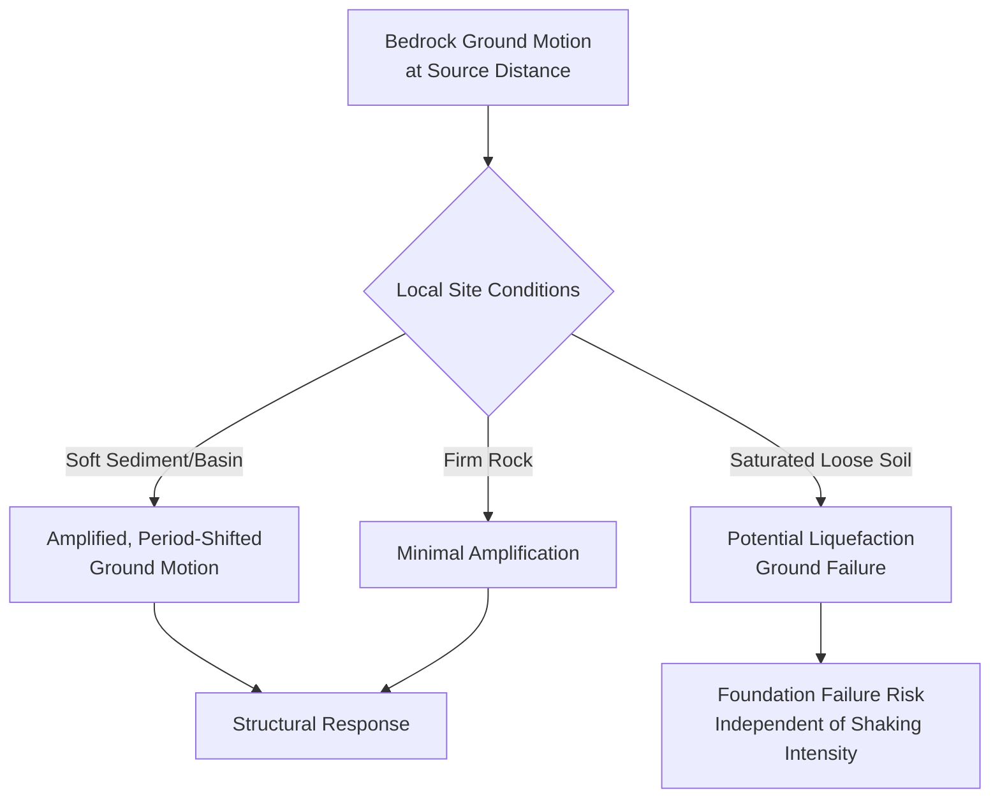

## Earthquake and Seismic Hazard Modeling

### Overview

Seismic hazard modeling quantifies the likelihood and severity of future ground shaking at a given location, providing the scientific foundation for building codes, land-use planning, and emergency preparedness in earthquake-prone regions. The field draws on structural geology (fault characterization), seismology (earthquake source physics and wave propagation), and statistics (magnitude-frequency and probabilistic hazard integration) to translate the physics of fault rupture into actionable, spatially explicit hazard products.

### Earthquake Source Physics

#### Elastic Rebound Theory and the Seismic Cycle

Earthquakes result from the sudden release of elastic strain energy accumulated along a fault as tectonic plates move relative to one another while the fault remains locked by friction. Elastic rebound theory describes this as a cyclic process: gradual strain accumulation during the interseismic period, followed by sudden rupture (coseismic slip) when accumulated stress exceeds frictional resistance, followed by afterslip and stress redistribution (postseismic period) before the cycle resumes.

#### Fault Rupture Parameters and Seismic Moment

The size of an earthquake is fundamentally characterized by seismic moment, a physical quantity directly tied to the rupture's physical dimensions rather than an empirically calibrated intensity scale:

$$M_0 = \mu \times A \times D$$

where $M_0$ is seismic moment, $\mu$ is the shear modulus of the rupturing rock, $A$ is rupture area, and $D$ is average slip displacement across the rupture. Moment magnitude, the modern standard replacing the original Richter local magnitude scale (which saturates and becomes unreliable for large earthquakes), is derived from seismic moment via:

$$M_w = \frac{2}{3}\log_{10}(M_0) - 10.7$$

(using $M_0$ in dyne-cm; equivalent SI-unit formulations use a correspondingly adjusted constant), providing a physically grounded magnitude scale that does not saturate at high magnitudes, unlike earlier amplitude-based scales.

#### Fault Types and Rupture Geometry

Fault mechanism (normal, reverse/thrust, strike-slip, or oblique combinations) is determined by the relative orientation of the regional stress field and existing fault plane geometry, and directly influences the radiation pattern of seismic energy and the resulting ground-motion characteristics at a given azimuth from the rupture — a first-order input to ground-motion prediction alongside magnitude and distance.

### Magnitude-Frequency Relationships

#### The Gutenberg-Richter Relation

Describes the statistical relationship between earthquake magnitude and the frequency of occurrence within a given source region:

$$\log_{10}N(M) = a - bM$$

where $N(M)$ is the cumulative number of earthquakes with magnitude greater than or equal to $M$ per unit time, $a$ reflects overall seismic productivity of the source region, and $b$ (the "b-value") describes the relative frequency of large versus small earthquakes — commonly close to 1.0 across many tectonic regions, though systematic regional and source-type variation is well documented and used as a diagnostic parameter in some hazard and induced-seismicity studies. In practice this power-law relation is truncated at a source-specific maximum magnitude ($M_{max}$), reflecting the physical constraint that rupture area cannot exceed the dimensions of the causative fault or source zone.

#### Characteristic Earthquake Model

An alternative to the pure Gutenberg-Richter relation for well-studied individual faults, proposing that a given fault segment tends to repeatedly rupture at a characteristic magnitude close to its maximum capacity (governed by fault segment length) rather than following a smooth power-law distribution down to arbitrarily small magnitudes — a model supported by paleoseismic trenching evidence on some well-studied faults, though the degree to which it generalizes across all fault systems remains an area of ongoing seismological research. [Inference: the relative applicability of characteristic-earthquake versus pure Gutenberg-Richter behavior varies by fault system and is not fully resolved as a universal model].

### Ground Motion Prediction

#### Ground Motion Prediction Equations (GMPEs)

Empirical or semi-empirical relationships (also termed attenuation relationships) predicting ground-motion intensity measures (peak ground acceleration, peak ground velocity, spectral acceleration at various periods) as a function of magnitude, source-to-site distance, site condition (local soil/rock properties), and often fault mechanism:

$$\ln(Y) = f(M, R, Site, Mechanism) + \epsilon$$

where $Y$ is the ground-motion intensity measure, and $\epsilon$ represents both between-event and within-event residual variability — explicitly incorporated into modern GMPEs and subsequently propagated through Probabilistic Seismic Hazard Analysis (PSHA) as an essential uncertainty component, since ground motion at a given magnitude and distance exhibits substantial natural scatter beyond what any median prediction curve captures.

#### Site Response and Local Amplification

Local geological conditions substantially modify ground-motion amplitude and frequency content relative to bedrock motion, with soft sedimentary basins characteristically amplifying shaking (particularly at longer periods matching the basin's resonant characteristics) relative to firm rock sites. Site amplification is commonly parameterized via the average shear-wave velocity in the uppermost 30 meters ($V_{S30}$), a standard site-classification proxy incorporated into building codes and GMPEs, alongside more detailed basin-response and nonlinear soil-response modeling for critical facilities where simplified $V_{S30}$-based classification is considered insufficient.

### Secondary Seismic Hazards

#### Liquefaction

Occurs when saturated, loosely packed granular soil (typically sandy) temporarily loses shear strength under cyclic seismic loading, as pore water pressure builds toward the overburden stress, causing the soil to behave as a fluid rather than a solid. Liquefaction susceptibility depends on soil grain size distribution, relative density, groundwater depth, and shaking intensity/duration, and is commonly assessed via standardized empirical procedures relating in-situ soil test measurements (Standard Penetration Test or Cone Penetration Test resistance) to cyclic stress ratio thresholds.

#### Earthquake-Triggered Landsliding

Ground shaking can trigger slope failure on susceptible terrain independent of any precipitation trigger, commonly assessed via Newmark's sliding-block analysis, which estimates cumulative permanent slope displacement by integrating the portion of the ground-motion time history exceeding a slope's critical (yield) acceleration threshold — providing a physically grounded displacement-based hazard metric rather than a binary stable/unstable classification.

#### Surface Fault Rupture

For shallow, near-surface earthquake sources, the fault rupture itself can propagate to the ground surface, producing direct surface offset — a hazard distinct from and not mitigated by conventional ground-shaking-resistant structural design, requiring instead avoidance-based mitigation (fault setback zoning) for structures sited directly across mapped active fault traces.

### Probabilistic Seismic Hazard Analysis (PSHA) — Detailed Treatment

Building on the PSHA overview introduced in hazard mapping and risk assessment, the full analysis integrates across all identified seismic sources, their magnitude-frequency distributions, and GMPE-based ground-motion uncertainty to produce a site-specific hazard curve:

$$\lambda(Y > y) = \sum_{sources} \nu_i \int\int P(Y>y \mid m,r) \, f_M(m) \, f_R(r) \, dm \, dr$$

where $\lambda(Y>y)$ is the annual rate of exceeding ground-motion level $y$, $\nu_i$ is the source's annual rate of earthquakes above a minimum magnitude of engineering interest, and $f_M(m)$, $f_R(r)$ are the magnitude and distance probability density functions for that source. Deaggregation of this hazard integral — identifying which magnitude-distance combinations contribute most to hazard exceedance at a specified return period — is a standard PSHA output used to select realistic ground-motion time histories for detailed structural time-history analysis of critical facilities.

### Induced Seismicity

Distinct from natural tectonic earthquakes, induced seismicity results from human activities that alter subsurface stress or pore pressure conditions — most prominently documented in connection with wastewater injection associated with oil and gas operations, geothermal reservoir stimulation, and large reservoir impoundment. Induced seismicity hazard assessment methodologically differs from natural tectonic PSHA in requiring time-varying (rather than stationary Poissonian) seismicity rate models that respond to the operational parameters (injection volume, rate, pressure) driving the induced activity, an active area of applied seismological research given its direct relevance to regulatory frameworks governing injection operations.

### Earthquake Early Warning Systems

Operate on the physical principle that faster-traveling but lower-amplitude P-waves precede the more damaging, slower S-waves and surface waves, providing a warning window (seconds to tens of seconds, scaling with source-to-site distance) between initial detection and the arrival of strong shaking — sufficient for automated protective actions (halting trains, opening elevator doors at the nearest floor, triggering industrial process shutdowns) though generally insufficient for large-scale human evacuation given the typically short available warning time, particularly for sites near the earthquake epicenter.

### Key Points

- Earthquake size is fundamentally characterized by seismic moment (a direct physical rupture-area-times-slip quantity), with moment magnitude serving as the modern non-saturating magnitude scale derived from it.
- The Gutenberg-Richter relation describes regional magnitude-frequency statistics, while the characteristic earthquake model offers an alternative, fault-specific framework supported by paleoseismic evidence on some well-studied faults.
- Ground Motion Prediction Equations translate magnitude, distance, site condition, and mechanism into predicted shaking intensity with explicitly modeled uncertainty, forming a core input to PSHA.
- Secondary hazards — liquefaction, earthquake-triggered landsliding, and surface fault rupture — require distinct assessment methodologies from primary ground-shaking hazard and are not mitigated by conventional shaking-resistant structural design alone.
- Induced seismicity requires time-varying seismicity rate modeling distinct from the stationary assumptions underlying natural tectonic PSHA, reflecting its direct dependence on evolving human operational activity.

**Related Topics**

- Hazard Mapping and Risk Assessment (PSHA overview and general risk framework)
- Classification of Natural Hazards (geophysical hazard category context)
- Structural Engineering for Seismic Design and Building Codes
- Tsunami Generation and Coastal Hazard Modeling
- Volcanic Hazard Assessment and Eruption Forecasting
- Paleoseismology and Fault Trenching Methods
- GIS and Spatial Analysis Fundamentals
- Earthquake Early Warning System Architecture and Sensor Networks