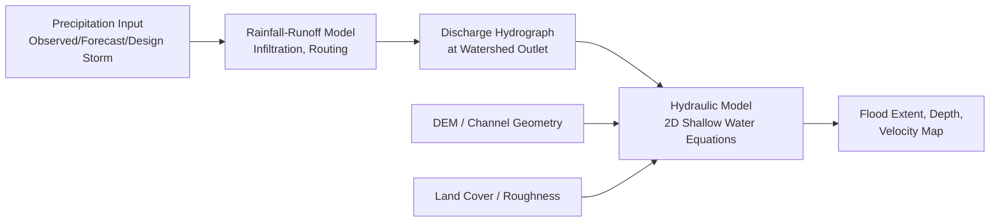
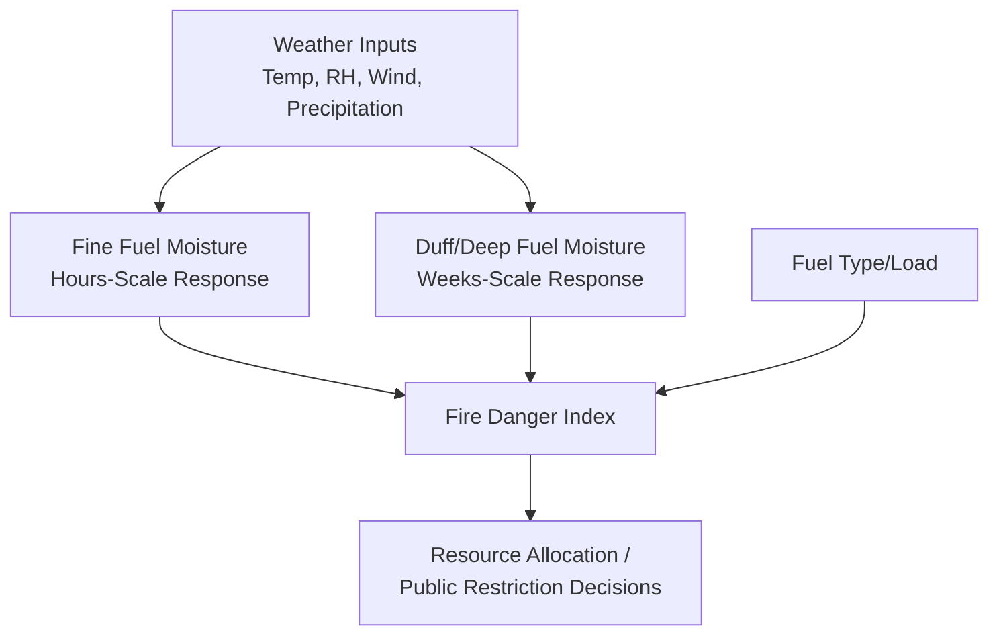

## Flood and Wildfire Hazard Modeling

### Overview

Flood and wildfire hazard modeling share a common methodological foundation despite governing distinct physical processes: both integrate meteorological/hydrological or fuel/weather drivers with terrain and land-cover characteristics to predict spatial and temporal patterns of hazard occurrence and intensity. Both hazards are also strongly modulated by land-use and land-management decisions, distinguishing them from hazards (like earthquakes) whose underlying driving process is largely independent of human land-surface modification.

### Flood Hazard Modeling

#### Flood Hazard Typology

Flooding is commonly subdivided by generating mechanism, each requiring distinct modeling approaches:

- **Riverine (fluvial) flooding**: Overbank flow resulting from precipitation/snowmelt-driven discharge exceeding channel capacity, modeled via watershed hydrology combined with channel/floodplain hydraulics.
- **Flash flooding**: Rapid-onset flooding typically in steep, small watersheds or urban areas with high impervious surface coverage, characterized by very short lag time between rainfall and peak flow, placing a premium on high-resolution, short-duration rainfall forecasting and monitoring.
- **Coastal flooding**: Driven by storm surge, astronomical tide, and wave setup, modeled via coupled meteorological-oceanic approaches (as introduced in the sea-level rise context of climate impacts on human systems).
- **Pluvial (surface water) flooding**: Occurs when rainfall intensity exceeds local drainage capacity independent of river channel overflow, particularly significant in urban areas with engineered stormwater systems that can be overwhelmed by rainfall exceeding their design capacity.
- **Compound flooding**: Co-occurrence of multiple mechanisms (e.g., storm surge coinciding with heavy riverine discharge, discussed as a compound hazard in the natural hazard classification context), producing water levels exceeding what any single mechanism's independent analysis would predict.

#### Hydrological Modeling: From Precipitation to Discharge

Rainfall-runoff models transform precipitation input into a discharge hydrograph at a watershed outlet, representing the cascade of hydrological processes (interception, infiltration, surface and subsurface flow routing) governing how precipitation becomes streamflow:

$$Q(t) = \int_0^t P_{eff}(\tau) \, U(t-\tau) \, d\tau$$

representing a unit hydrograph convolution approach, where $Q(t)$ is discharge, $P_{eff}$ is effective (runoff-producing) precipitation after infiltration losses, and $U$ is the watershed's characteristic unit hydrograph response function. Infiltration loss is commonly estimated via empirical methods such as the Natural Resources Conservation Service Curve Number method, which relates runoff generation to a composite parameter reflecting soil type, land cover, and antecedent moisture condition:

$$Q = \frac{(P - 0.2S)^2}{P + 0.8S}, \quad S = \frac{25400}{CN} - 254$$

where $Q$ is runoff depth, $P$ is precipitation depth, $S$ is a potential maximum retention parameter, and $CN$ is the Curve Number (0-100, with higher values indicating greater runoff-generating potential, such as impervious urban surfaces).

#### Hydraulic Modeling: From Discharge to Inundation Extent

Building on the two-dimensional shallow-water-equation approach introduced in hazard mapping and risk assessment, hydraulic models route the discharge hydrograph through channel and floodplain geometry (derived from DEM data) to produce time-varying water depth and velocity across the modeled domain, forming the basis for spatially explicit flood extent and depth mapping.

#### Urban Flood Modeling Considerations

Urban environments require explicit representation of engineered drainage infrastructure (storm sewers, culverts, detention basins) alongside surface flow pathways, commonly via coupled 1D (pipe network) and 2D (surface overland flow) modeling, since surface flooding occurs specifically when the piped drainage system's capacity is exceeded — a dual-domain interaction not present in purely riverine flood modeling contexts.

### Wildfire Hazard Modeling

#### Fire Behavior Fundamentals

Wildfire spread and intensity are governed by the interaction of three factors conventionally termed the "fire behavior triangle": fuel (type, load, moisture content, and continuity), weather (wind speed/direction, temperature, relative humidity), and topography (slope, which accelerates upslope fire spread through radiative and convective preheating of uphill fuels).

#### Fire Spread Modeling

The Rothermel surface fire spread model, a foundational semi-empirical formulation still underlying many operational fire behavior prediction systems, expresses fire spread rate as a function of fuel and environmental parameters:

$$R = \frac{I_R \xi (1 + \phi_w + \phi_s)}{\rho_b \epsilon Q_{ig}}$$

where $R$ is the rate of spread, $I_R$ is reaction intensity (energy release rate within the fire front), $\xi$ is a propagating flux ratio, $\phi_w$ and $\phi_s$ are wind and slope coefficients (both increasing predicted spread rate), $\rho_b$ is fuel bulk density, and $Q_{ig}$ is heat of preignition. This physically based but empirically parameterized model remains widely used in operational fire behavior prediction systems, though its original formulation is generally considered less reliable for crown fire (canopy-level) spread, extreme fire weather conditions, and spotting (ember transport ahead of the main fire front) — limitations that have motivated development of supplementary and alternative modeling approaches for these specific behaviors.

#### Fire Danger Rating Systems

Operational fire danger indices integrate current and antecedent weather conditions into standardized indices supporting resource allocation and public fire-restriction decisions, with different national systems (e.g., the US National Fire Danger Rating System, the Canadian Forest Fire Weather Index System) using somewhat different component structures but a broadly similar underlying logic: tracking fuel moisture depletion across multiple timescales (fine dead fuel responding to hours-scale weather fluctuation, versus deep duff/organic layer moisture responding to weeks-scale drought conditions) to estimate overall fire potential.

#### Fuel Characterization and Mapping

Fire behavior modeling requires spatially explicit fuel characterization, typically via standardized fuel model classification systems (assigning discrete fuel-type categories to landscape units based on vegetation type, load, and structure) derived from remote sensing (satellite land-cover classification, and increasingly LiDAR-derived canopy structure metrics for crown fire potential assessment) combined with field validation.

#### Wildland-Urban Interface (WUI) Risk Assessment

The Wildland-Urban Interface — areas where structures intermingle with or abut wildland vegetation — requires risk assessment approaches distinct from pure wildland fire behavior modeling, incorporating structure ignitability factors (roofing material, defensible space vegetation management, ember-resistant vent design) alongside landscape-scale fire behavior potential, since WUI structure loss is frequently driven more by ember-cast ignition of vulnerable structures than by direct flame-front contact — a distinction with direct implications for effective mitigation strategy (structure hardening and defensible space) versus landscape-scale fuel treatment alone.

### Shared Modeling Considerations

#### Land Cover and Land Management Sensitivity

Both hazards exhibit strong sensitivity to land-use and management decisions independent of climate/weather drivers: impervious surface expansion increases flood runoff generation (via the Curve Number relationship above), while fire suppression policy history, fuel treatment (prescribed burning, mechanical thinning), and vegetation type conversion directly alter fuel loads and continuity — meaning hazard model projections require explicit land-cover/management scenario assumptions alongside climate/weather scenario assumptions, rather than climate drivers alone.

#### Climate Change Interactions

Both hazards show documented sensitivity to climate change through mechanisms introduced in the climate change impacts content: precipitation intensification affects flood magnitude and frequency (per Clausius-Clapeyron scaling), while temperature increase and altered precipitation timing affect fuel moisture and fire season length — though in both cases, attributing any specific event to climate change as distinct from natural variability and land-management history requires formal extreme event attribution methodology rather than direct inference from a single event or short observational record.

#### Post-Event Hazard Cascading

Both hazard types generate documented cascading secondary hazard risk: post-fire landscapes exhibit substantially elevated debris-flow and flash-flood susceptibility (due to loss of vegetative interception/root stabilization and development of soil hydrophobicity from fire-altered organic compounds), while major flood events can trigger levee/dam failure cascading hazards distinct from the primary inundation event itself — both illustrating the cascading-hazard concept introduced in natural hazard classification.

### Key Points

- Flood hazard modeling proceeds through a two-stage hydrological (precipitation-to-discharge) and hydraulic (discharge-to-inundation-extent) modeling chain, with urban applications requiring additional coupled drainage-infrastructure representation.
- Flood typology (riverine, flash, coastal, pluvial, compound) requires distinct modeling approaches reflecting each mechanism's characteristic spatial scale and response time.
- Wildfire spread modeling rests on physically-informed but empirically parameterized formulations (e.g., the Rothermel model), integrating fuel, weather, and topography, with documented limitations for crown fire, extreme conditions, and spotting behavior.
- Both hazards are strongly and directly modulated by land-use/land-management decisions (impervious surface, fuel treatment), requiring explicit management-scenario assumptions in hazard projections alongside climate/weather drivers alone.
- Post-event cascading hazards (post-fire debris flows, post-flood infrastructure failure) illustrate the broader cascading-hazard framework and require integrated rather than siloed single-hazard risk assessment.

**Related Topics**

- Hazard Mapping and Risk Assessment (general probabilistic hazard framework)
- Classification of Natural Hazards (compound/cascading hazard context)
- Climate Change Impacts on Human Systems (hydrological cycle intensification, fire weather trends)
- Digital Elevation Models and Terrain Analysis
- Remote Sensing for Land Cover and Vegetation Fuel Mapping
- Debris Flow and Post-Fire Landslide Hazard Assessment
- Urban Stormwater Infrastructure Design
- Disaster Risk Reduction Frameworks (Sendai Framework)