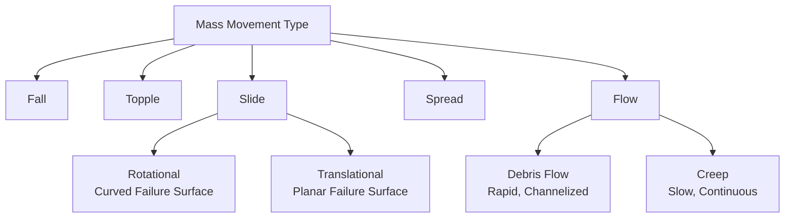
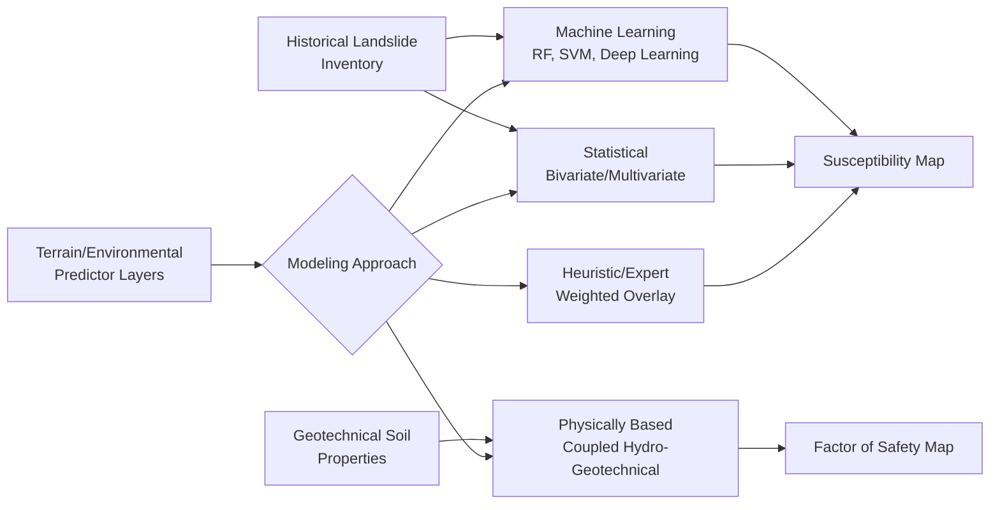

## Landslide Susceptibility Mapping

### Overview

Landslide susceptibility mapping identifies terrain zones prone to slope failure based on the spatial relationship between terrain/environmental characteristics and historical landslide occurrence, providing a foundational input to landslide hazard and risk assessment. The field distinguishes susceptibility (relative spatial likelihood of occurrence, independent of timing) from hazard (which incorporates temporal probability and often triggering-event magnitude) and risk (which further incorporates exposure and vulnerability), a terminological distinction carried forward from the general hazard mapping framework but with particular methodological significance in landslide studies given the field's characteristic reliance on spatial-predictor-based statistical modeling.

### Landslide Classification and Mechanisms

#### Movement Type Classification

The Varnes classification system, the most widely adopted landslide taxonomy, organizes mass movements by movement type and material:

- **Falls**: Detachment and free-fall/bouncing/rolling of rock or debris from steep slopes.
- **Topples**: Forward rotation of a rock/soil mass about a pivot point.
- **Slides**: Downslope movement along one or more discrete failure surfaces, further subdivided into rotational slides (curved failure surface, characteristic slump morphology) and translational slides (planar failure surface, often along a pre-existing structural discontinuity or bedding plane).
- **Spreads**: Lateral extension of a fractured mass, often associated with liquefaction of an underlying weaker layer.
- **Flows**: Continuous, fluid-like downslope movement, spanning debris flows (rapid, water-saturated, channelized) to creep (extremely slow, continuous deformation).

#### Material Classification

Combined with movement type, material is classified as rock, debris (coarse-grained), or earth (fine-grained), yielding compound descriptive terms (e.g., "rock fall," "debris flow," "earth slide") that jointly capture both the kinematic mechanism and the material involved — directly relevant to susceptibility mapping since different movement-material combinations exhibit distinct terrain and triggering relationships.

### Triggering Mechanisms

#### Precipitation-Triggered Landslides

The most common global trigger, operating through increased pore water pressure within the slope material, which reduces effective stress and correspondingly reduces shear strength along a potential failure surface, per the Mohr-Coulomb failure criterion:

$$\tau_f = c' + (\sigma_n - u)\tan\phi'$$

where $\tau_f$ is shear strength at failure, $c'$ is effective cohesion, $\sigma_n$ is total normal stress, $u$ is pore water pressure, and $\phi'$ is effective friction angle. As pore pressure $u$ rises during intense or prolonged rainfall infiltration, effective normal stress ($\sigma_n - u$) declines, directly reducing available shear strength until it falls below the driving shear stress imposed by gravity on the slope — the fundamental physical mechanism underlying rainfall-induced slope failure.

#### Seismic Triggering

As introduced in earthquake and seismic hazard modeling, ground shaking can trigger landslides independent of precipitation, commonly assessed via Newmark's sliding-block displacement analysis, and is a documented major secondary hazard source in strong earthquakes on susceptible terrain.

#### Other Triggers

Rapid snowmelt, volcanic activity (both direct ground shaking and edifice destabilization from magmatic intrusion), and anthropogenic slope modification (cut-and-fill construction, vegetation removal, irrigation-induced pore pressure increase, mining) represent additional documented triggering mechanisms, with anthropogenic triggers increasingly significant in rapidly urbanizing, topographically constrained regions.

### Susceptibility Mapping Methodologies

#### Heuristic (Expert-Based) Methods

Assign susceptibility ratings through expert judgment applied to weighted overlay of relevant terrain factor maps (slope, geology, land cover, etc.), historically valuable in data-scarce settings but subject to inter-expert variability and limited objective reproducibility relative to statistically calibrated approaches.

#### Statistical Bivariate and Multivariate Methods

Relate historical landslide inventory locations to terrain/environmental predictor variables through statistically calibrated relationships:

- **Bivariate statistical methods** (e.g., Frequency Ratio, Weight of Evidence): Evaluate each predictor variable's individual statistical association with historical landslide occurrence, then combine individual variable weights into a composite susceptibility index — computationally simple and interpretable, but not accounting for inter-variable correlation or interaction effects.
- **Multivariate statistical methods** (most commonly logistic regression): Model landslide occurrence probability as a joint function of multiple predictor variables simultaneously, as introduced in the general susceptibility modeling context of hazard mapping and risk assessment:

$$P(landslide) = \frac{1}{1 + e^{-(\beta_0 + \beta_1 Slope + \beta_2 Geology + \beta_3 LandCover + ... )}}$$

accounting for inter-variable correlation structure and providing statistically interpretable coefficient estimates, at the cost of requiring a sufficiently large and representative historical landslide inventory for reliable model calibration.

#### Machine Learning Methods

Increasingly applied methods (random forest, support vector machines, artificial neural networks, and more recently deep learning approaches) that can capture complex nonlinear relationships and interaction effects among predictor variables without requiring an explicit parametric functional form, generally reported to outperform traditional statistical methods on predictive accuracy metrics in comparative studies, though at some cost to model interpretability and with performance strongly dependent on inventory data quality and completeness — a general machine-learning limitation rather than one specific to landslide applications. [Inference: the magnitude of accuracy improvement from machine learning over traditional statistical methods varies considerably across published comparative studies, depending on study area, data quality, and validation methodology].

#### Physically Based (Process) Models

Directly model the slope stability physics via a coupled hydrological-geotechnical approach, most commonly combining an infinite-slope stability formulation with a hydrological model simulating pore-pressure response to rainfall infiltration:

$$FS = \frac{c' + (\gamma z \cos^2\beta - u)\tan\phi'}{\gamma z \sin\beta \cos\beta}$$

representing the infinite-slope Factor of Safety, where $FS$ is factor of safety (failure predicted when $FS < 1$), $\gamma$ is soil unit weight, $z$ is slope-normal soil depth, $\beta$ is slope angle, and other terms as defined in the Mohr-Coulomb relation above. This approach requires substantially more detailed input data (geotechnical soil properties, spatially distributed) than statistical methods but offers the advantage of not requiring a historical landslide inventory and providing more directly interpretable physical output (a distributed factor-of-safety map) — a meaningful advantage in data-scarce settings lacking adequate landslide inventory records, though its accuracy is correspondingly sensitive to the quality of the geotechnical parameter inputs, which are themselves frequently uncertain or spatially sparse.

### Key Predictor Variables

Across methodological approaches, a broadly consistent set of terrain and environmental factors is commonly incorporated: slope angle (the single strongest and most universally included predictor, given its direct role in the driving-shear-stress term of slope stability equations), slope aspect (influencing solar exposure, vegetation, and soil moisture regime), curvature (plan and profile curvature affecting water convergence/divergence), lithology and geological structure (rock/soil strength and discontinuity orientation relative to slope), land cover (vegetation root reinforcement effects, and land-cover change as a susceptibility-modifying anthropogenic factor), distance to drainage network and to roads (the latter reflecting anthropogenic slope-cutting disturbance), and soil depth/type.

### Landslide Inventory Development

Model training and validation for statistical and machine-learning approaches fundamentally depends on landslide inventory quality and completeness, typically compiled through a combination of historical records/field surveys, aerial photograph interpretation, and increasingly automated or semi-automated remote-sensing-based mapping (optical satellite change detection, and radar interferometry for detecting slow-moving landslide surface deformation, discussed further below). Inventory incompleteness (particularly under-detection of small landslides and landslides in historically less-monitored remote areas) is a well-recognized source of systematic bias in susceptibility model training and validation, generally considered among the primary limiting factors on model accuracy and transferability across regions.

### Remote Sensing Applications

#### Optical and LiDAR-Derived Terrain Analysis

High-resolution DEMs, particularly LiDAR-derived, enable detailed terrain-derivative calculation (slope, curvature, and more advanced morphometric indices) at spatial resolution sufficient to resolve individual landslide-relevant terrain features not captured by coarser-resolution DEM sources, and support direct visual identification of landslide morphological signatures (scarps, hummocky terrain, deposits) even beneath partial vegetation canopy where the LiDAR return can penetrate to bare-earth surface.

#### Interferometric Synthetic Aperture Radar (InSAR)

A satellite radar technique measuring ground surface displacement between repeat satellite passes with millimeter-scale precision, enabling detection and monitoring of slow-moving landslides (creep-rate deformation, generally below the threshold of visual or optical-imagery detectability) over wide areas — an increasingly significant input to both susceptibility mapping (identifying previously unrecognized slow-moving landslide-prone areas) and active hazard monitoring (tracking acceleration trends that may precede more rapid failure) as satellite radar constellation coverage and processing capability have expanded.

### Validation and Model Performance Assessment

Susceptibility model performance is commonly assessed via Receiver Operating Characteristic (ROC) curve analysis and the associated Area Under the Curve (AUC) metric, evaluating the model's ability to discriminate landslide from non-landslide terrain using a portion of the inventory withheld from model training (spatial or temporal data partitioning) — with the choice of validation partitioning strategy itself a methodologically significant decision, since purely random partitioning can produce optimistically biased performance estimates when nearby training and validation points are spatially autocorrelated.

### Key Points

- The Varnes classification (movement type × material) provides the standard landslide taxonomy, with different type-material combinations exhibiting distinct terrain and triggering-mechanism relationships relevant to susceptibility modeling.
- Precipitation-triggered failure operates through pore-pressure-driven effective-stress reduction per the Mohr-Coulomb failure criterion, while seismic triggering operates through direct dynamic loading, requiring distinct assessment approaches (infiltration modeling versus Newmark displacement analysis).
- Susceptibility mapping methods span a spectrum from heuristic expert-weighted overlay, through statistical (bivariate/multivariate) and machine-learning approaches requiring a historical inventory, to physically based coupled hydro-geotechnical models that instead require detailed geotechnical parameter data.
- Landslide inventory completeness is a primary limiting factor on statistical/ML model accuracy and transferability, given well-documented systematic under-detection biases, particularly for small and remote-area landslides.
- InSAR-based slow-motion deformation detection is an increasingly significant remote-sensing input, identifying creeping landslide-prone terrain not detectable through optical imagery or field survey alone.

**Related Topics**

- Hazard Mapping and Risk Assessment (general susceptibility/hazard/risk terminology framework)
- Earthquake and Seismic Hazard Modeling (Newmark displacement analysis for seismic triggering)
- Flood and Wildfire Hazard Modeling (post-fire debris flow susceptibility)
- Digital Elevation Models and Terrain Analysis
- InSAR and Satellite Geodesy for Ground Deformation Monitoring
- Geotechnical Engineering and Slope Stability Analysis
- Remote Sensing for Land Cover and Vegetation Fuel Mapping
- Debris Flow and Post-Fire Landslide Hazard Assessment