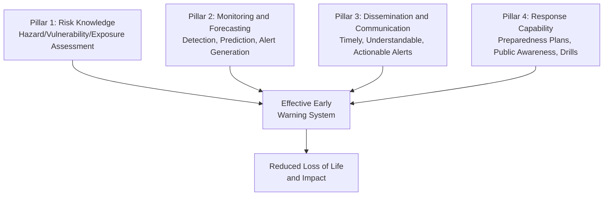
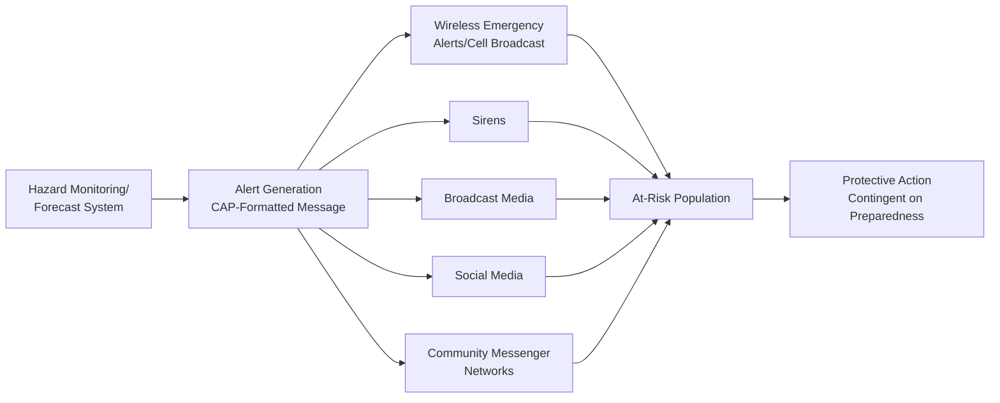

## Early Warning Systems

### Overview

Early warning systems (EWS) integrate hazard monitoring, forecasting, risk knowledge, communication, and response capability into an end-to-end chain designed to reduce loss of life and impact by enabling timely protective action ahead of hazardous events. The field draws on the UNDRR/WMO "four pillars" framework — risk knowledge, monitoring and forecasting, dissemination and communication, and response capability — recognizing that technical detection capability alone is insufficient without effective translation into protective action by at-risk populations and institutions.

### The Four-Pillar Framework

A frequently emphasized principle in EWS design and post-event review is that failures often occur not in the monitoring/forecasting pillar but in the dissemination or response-capability pillars — a technically accurate detection or forecast delivering no protective benefit if it does not reach at-risk populations in an understandable, actionable, and trusted form, or if response plans and public preparedness are inadequate to act on the warning received.

### Monitoring and Detection Infrastructure

#### Hazard-Specific Sensor Networks

Different hazard types rely on distinct physical monitoring infrastructure reflecting their characteristic precursor signals and propagation physics:

- **Seismic/tsunami**: Seismometer networks for earthquake detection, combined with coastal tide gauges and deep-ocean pressure sensors (DART buoys) for direct tsunami wave-height confirmation, since seismic magnitude alone provides only a probabilistic tsunami-generation estimate requiring in-situ or satellite altimetry confirmation for higher-confidence warning issuance.
- **Meteorological/hydrological**: Weather radar, satellite imagery, rain gauge networks, and streamflow gauges feeding numerical weather prediction and hydrological forecast models for flood, tropical cyclone, and severe convective storm warning.
- **Volcanic**: Seismometers (detecting magma movement via characteristic volcanic tremor and earthquake swarm signatures), ground deformation monitoring (tiltmeters, GPS/GNSS, InSAR as introduced in landslide susceptibility mapping), gas emission monitoring (SO2 flux as a magma ascent indicator), and thermal satellite imagery.
- **Landslide**: In-situ instrumentation (inclinometers, extensometers, piezometers) for site-specific monitoring of known unstable slopes, combined with rainfall threshold monitoring (triggering alerts when accumulated or intensity-based rainfall exceeds empirically or physically derived landslide-triggering thresholds) for regional-scale warning.

#### Multi-Hazard Monitoring Integration

Given the compound and cascading hazard relationships introduced in natural hazard classification, monitoring infrastructure increasingly integrates across hazard types at shared institutional platforms, both for efficiency and because certain sensor networks (weather radar, satellite imagery) provide relevant precursor information across multiple hazard categories simultaneously (e.g., a single intense rainfall event being relevant to flood, flash flood, and landslide warning systems concurrently).

### Forecast-to-Warning Translation

#### Threshold-Based Alerting

Many operational EWS convert continuous forecast/monitoring output into discrete categorical alert levels via predefined thresholds — for example, tiered heat-health warnings triggered at specified forecast temperature/heat-index thresholds (as introduced in climate change impacts on human systems), or rainfall-intensity-duration thresholds for flash flood and landslide warning. Threshold calibration involves an inherent trade-off between false-alarm rate (thresholds set too sensitively, eroding public trust and response compliance over repeated non-events, a documented phenomenon termed "warning fatigue" or "cry wolf" effect) and missed-detection rate (thresholds set too conservatively, failing to warn ahead of genuinely hazardous events) — a trade-off requiring context-specific calibration reflecting the relative societal cost of each error type for the hazard and population in question.

#### Probabilistic and Impact-Based Forecasting

An evolving paradigm shift from purely hazard-intensity-based warning (e.g., "20cm of rainfall expected") toward impact-based forecasting explicitly communicating anticipated consequences (e.g., "flooding expected to affect low-lying residential areas in district X"), integrating hazard forecast with pre-existing exposure and vulnerability information to more directly support protective decision-making — reflecting growing recognition that hazard-intensity information alone frequently does not translate into appropriate public risk perception or action, particularly among populations unfamiliar with technical hazard-intensity units or local exposure context.

### Dissemination and Communication

#### Multi-Channel Redundancy

Effective dissemination systems employ redundant communication channels (cell broadcast/wireless emergency alerts, sirens, broadcast media, social media, community-based messenger networks) recognizing that no single channel reaches the full at-risk population reliably, particularly across demographic groups with differential access to specific communication technologies, and that channel redundancy also provides resilience against infrastructure damage or overload during the hazardous event itself.

#### "Last Mile" Communication Challenges

The final link connecting official warning issuance to individual protective action at the household or community level is widely recognized in the EWS literature as the most persistent point of system failure, particularly in remote, low-connectivity, or linguistically diverse populations — motivating substantial emphasis on community-based early warning approaches (trained local volunteers, community alert networks) as a complement to centralized technical warning systems, rather than centralized systems being considered sufficient on their own.

#### Common Alerting Protocol (CAP)

A widely adopted international standard (OASIS CAP) providing a structured, interoperable data format for emergency alert messages, enabling a single alert to be simultaneously distributed across multiple heterogeneous dissemination channels (broadcast media, cell broadcast, web feeds) without requiring hazard-specific or agency-specific custom integration for each channel — a technical standardization advance supporting the multi-channel redundancy principle above.

### Response Capability and the Human Factors Dimension

#### Warning Comprehension and Behavioral Response

Empirical warning-response research consistently finds that receiving a warning does not automatically translate into appropriate protective action; response is mediated by warning message characteristics (source credibility/trust, specificity, consistency across sources, perceived personal relevance), individual/household factors (prior disaster experience, risk perception, social network confirmation-seeking behavior — individuals frequently seek to confirm a warning's validity through secondary sources or social contacts before acting, a well-documented behavioral pattern termed "milling"), and structural factors (physical capacity to evacuate or shelter, such as transportation access or shelter proximity).

#### Preparedness Planning and Exercising

Response capability requires pre-established evacuation routes and shelter locations, clearly defined institutional roles and responsibilities across agencies, and regular exercising/drilling to maintain institutional readiness and public familiarity — components frequently under-resourced relative to the technical monitoring/forecasting pillar in EWS investment, despite evidence that this pillar is commonly the binding constraint on overall system effectiveness.

### Case Study: Tsunami Early Warning as a Representative Multi-Pillar System

Tsunami warning exemplifies the integration challenge across all four pillars: seismic detection provides rapid (within minutes) but only probabilistic hazard assessment, requiring either rapid ocean-based confirmation (DART buoys, tide gauges) or pre-computed tsunami propagation scenario databases (enabling rapid scenario-matching against detected earthquake parameters without requiring real-time hydrodynamic simulation) to generate an actionable warning within the limited time window available before wave arrival at nearby coastlines — a time window that, for near-source coastal communities, may be too short for warning-triggered evacuation entirely, placing particular emphasis on public education enabling self-initiated evacuation directly triggered by strong ground shaking itself, independent of any official warning dissemination.

### Emerging Directions

#### Machine Learning-Enhanced Forecasting

Increasing application of machine learning approaches to hazard forecasting — including rapid earthquake ground-motion estimation, short-term precipitation nowcasting, and flood forecasting in ungauged or sparsely-instrumented basins — offers potential improvements in forecast lead time and spatial resolution, though operational deployment requires careful validation given the safety-critical nature of warning-triggering forecasts and generally benefits from combination with physically based approaches rather than pure data-driven substitution. [Inference: the operational reliability and appropriate role of machine-learning forecast components within safety-critical EWS pipelines remains an active area of methodological development and institutional evaluation].

#### Early Warnings for All Initiative

A UN-led global initiative (announced 2022, targeting universal EWS coverage by 2027) explicitly framed around addressing the substantial global gap in EWS coverage, particularly in least-developed countries and small island developing states, reflecting persistent global disparity in early warning system access despite EWS being widely recognized as among the most cost-effective disaster risk reduction investments available. [Unverified: the initiative's specific coverage-gap metrics and implementation progress are subject to ongoing tracking and reporting, and current status should be verified against the latest UNDRR/WMO reporting for time-sensitive figures].

### Key Points

- The four-pillar EWS framework (risk knowledge, monitoring/forecasting, dissemination/communication, response capability) emphasizes that system effectiveness depends on the full chain, not technical detection capability alone.
- Hazard-specific monitoring infrastructure (seismometers, tide gauges, weather radar, InSAR, in-situ slope instrumentation) reflects each hazard's characteristic precursor signal and propagation physics.
- Threshold-based alerting requires explicit calibration of the false-alarm-versus-missed-detection trade-off, with over-sensitive thresholds risking "warning fatigue" that erodes future response compliance.
- The "last mile" connecting official warning to individual protective action is widely identified as the most persistent point of system failure, motivating community-based warning approaches as a necessary complement to centralized technical systems.
- Warning response is behaviorally mediated by message credibility, social confirmation-seeking ("milling"), and structural capacity to act — meaning warning receipt does not automatically produce appropriate protective action.

**Related Topics**

- Classification of Natural Hazards (compound/cascading hazard monitoring integration)
- Earthquake and Seismic Hazard Modeling (tsunami and earthquake early warning physics)
- Flood and Wildfire Hazard Modeling (flash flood and fire weather forecasting linkage)
- Landslide Susceptibility Mapping (rainfall-threshold landslide warning)
- Disaster Risk Reduction Frameworks (Sendai Framework)
- Risk Communication and Behavioral Response to Hazard Warnings
- Satellite-Based Emissions Detection and Monitoring (satellite monitoring infrastructure parallels)
- Community-Based Disaster Risk Management