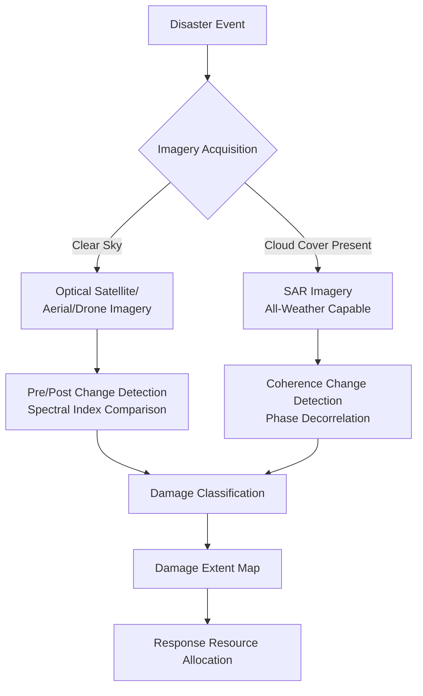
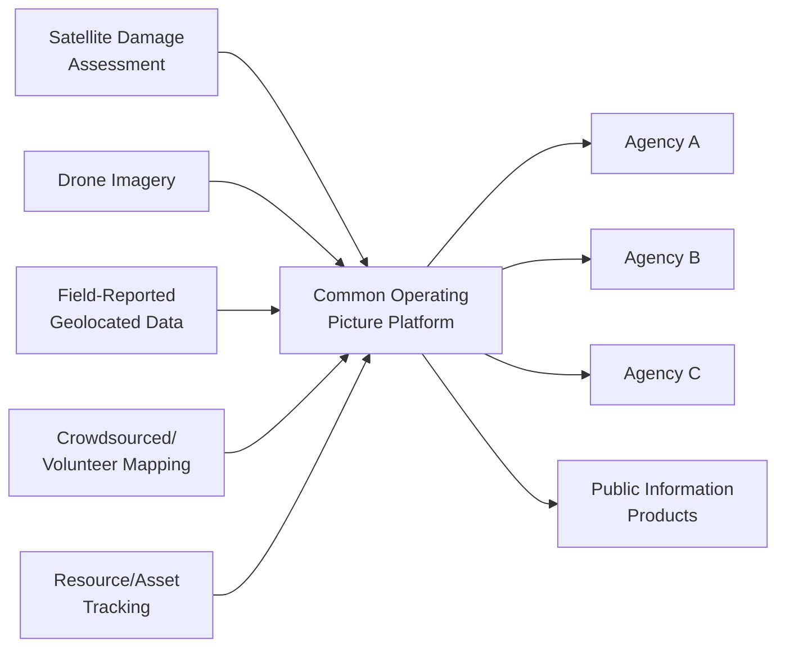

## Geospatial Technology in Disaster Response

### Overview

Geospatial technology supports disaster response across the full emergency management cycle — pre-event preparedness, rapid post-event damage assessment, coordinated response operations, and recovery monitoring — by providing spatially explicit situational awareness derived from satellite and aerial remote sensing, GIS analysis, and field-collected geolocated data. The field has evolved substantially with the proliferation of high-revisit commercial satellite constellations, drone/UAS platforms, and crowdsourced/volunteered geographic information, expanding both the speed and resolution of post-disaster geospatial products relative to earlier single-agency, lower-cadence satellite tasking.

### Damage Assessment Methodologies

#### Pre/Post-Event Change Detection

The foundational technique for rapid damage assessment compares satellite or aerial imagery acquired before and after a disaster event to identify changed areas indicative of structural damage, flooding extent, or landscape disturbance:

$$\Delta = f(I_{post}) - f(I_{pre})$$

where $f$ represents a derived spectral index or classification applied to each image (e.g., NDVI for vegetation damage assessment, or a water-extraction index for flood mapping), with the difference image highlighting change areas requiring further classification into damage severity categories. Effective change detection requires careful radiometric and geometric co-registration between pre- and post-event imagery to avoid false-change artifacts arising from sensor, illumination, or seasonal differences unrelated to actual disaster impact.

#### Building Damage Classification

Structural damage assessment from overhead imagery is commonly categorized using standardized multi-tier damage scales (ranging from no visible damage through destroyed), assessed via visual interpretation by trained analysts, semi-automated classification using spectral/textural imagery features, or increasingly deep-learning-based automated classification trained on labeled pre/post-disaster imagery datasets — with automated approaches generally offering substantially faster processing at scale but requiring careful validation against ground-truth field assessment, since imagery-based classification cannot always distinguish between damage severity categories that appear visually similar from a purely overhead perspective (e.g., certain roof damage levels versus complete structural collapse).

#### Synthetic Aperture Radar for All-Weather Damage Assessment

Unlike optical sensors, SAR can acquire imagery through cloud cover and at night, a significant operational advantage given that many disaster events (tropical cyclones, severe storms) are accompanied by extensive cloud cover that can delay optical satellite tasking by days. SAR-based damage assessment commonly employs coherence change detection — comparing the phase coherence between pre- and post-event SAR image pairs, where structural damage or debris disrupts the consistent radar backscatter pattern characteristic of intact, unchanged structures, producing a decorrelation signal usable as a damage proxy independent of weather conditions at the time of post-event acquisition.

### Flood Extent Mapping in Response Context

Building on flood hazard modeling's hydraulic simulation approach, near-real-time operational flood mapping during an active event relies predominantly on direct satellite observation rather than forward simulation, given the time-critical nature of response operations: optical imagery water-extraction indices (e.g., Normalized Difference Water Index) where cloud-free conditions permit, and SAR-based flood mapping (exploiting the characteristically low, smooth backscatter return from open water surfaces relative to land) as the operationally dominant approach given flood events' frequent association with persistent cloud cover from the same storm systems generating the flooding.

### Rapid Mapping Coordination Mechanisms

#### International Charter and Copernicus Emergency Management Service

Established international mechanisms coordinate rapid satellite tasking and derived-product generation following major disasters: the International Charter "Space and Major Disasters" (activated by authorized national disaster management agencies to trigger coordinated free satellite imagery tasking across member space agencies), and the Copernicus Emergency Management Service (providing on-demand rapid mapping products for both sudden-onset and slower-developing crises within the EU's broader Copernicus program) — both exemplifying institutionalized multi-agency coordination mechanisms designed to overcome single-agency tasking and processing capacity limitations during major events.

#### Volunteer and Crowdsourced Mapping

Platforms such as OpenStreetMap's Humanitarian OpenStreetMap Team (HOT) coordinate distributed volunteer mapping efforts, where globally distributed volunteers trace building footprints, roads, and other infrastructure from freely available or specially released satellite imagery to rapidly populate baseline geographic data in disaster-affected areas — particularly valuable in regions with previously sparse or outdated baseline mapping data, since accurate damage assessment and response routing requires an adequate pre-event baseline map, which does not exist by default in many lower-resource or rapidly-changing urban areas.

### Unmanned Aerial Systems (UAS/Drone) Applications

Drone platforms provide a complementary capability tier between satellite imagery (wide-area coverage, lower resolution, tasking/revisit constraints) and ground-based field assessment (highest detail, but slow and potentially hazardous access), offering rapid, high-resolution, on-demand imagery acquisition over specific areas of interest — particularly valuable for detailed structural damage assessment of individual critical facilities, search-and-rescue support (thermal imaging for person detection), and access-denied area assessment (structurally compromised areas unsafe for direct ground-team entry). Regulatory and airspace coordination constraints (particularly in the presence of manned aircraft response operations, such as helicopter search-and-rescue) represent an operational consideration distinct from the imagery-processing methodology itself, requiring coordinated airspace management protocols during active response operations.

### GIS-Based Coordination and Common Operating Picture

#### Common Operating Picture (COP) Concept

A shared, continuously updated geospatial situational-awareness platform integrating multiple data streams (damage assessment products, resource/asset locations, infrastructure status, population displacement data) accessible to multiple responding agencies simultaneously, addressing a historically persistent disaster-response coordination challenge in which different agencies previously maintained separate, non-interoperable situational awareness products, hindering coordinated resource allocation across the responding agency ecosystem.

#### Web-Based GIS and Mobile Data Collection

Cloud-hosted GIS platforms enable real-time collaborative mapping accessible to distributed response teams via web browser or mobile application, while mobile data collection applications allow field responders to capture geolocated damage reports, needs assessments, and resource status directly into the shared geospatial database, substantially reducing the latency between field observation and centrally available situational awareness relative to earlier paper-based or delayed-transcription reporting workflows.

### Population Displacement and Movement Tracking

#### Satellite-Based Settlement and Population Estimation

Pre-event population distribution estimates (increasingly derived from high-resolution satellite-based settlement mapping combined with census data, rather than census enumeration alone, given census data's typically coarser spatial resolution and temporal staleness between enumeration periods) provide the baseline against which post-event displacement magnitude can be estimated.

#### Mobile Network and Aggregated Movement Data

Aggregated, privacy-preserving mobile phone location data has been applied in various documented humanitarian response contexts to estimate population movement patterns following major disasters, offering near-real-time displacement flow estimation at a temporal resolution generally unavailable through traditional field-survey-based displacement tracking, subject to important methodological caveats regarding representativeness (dependent on mobile phone penetration and network coverage, which may itself be disrupted by the disaster event) and the privacy/data-governance frameworks required for appropriate use of such sensitive location data in humanitarian contexts.

### Standardization and Interoperability Frameworks

Interoperability across the many organizations involved in disaster geospatial response depends on standardized data formats and protocols (e.g., OGC standards for geospatial web services) and common damage-classification taxonomies, enabling data sharing across the international, national, and local organizations typically involved in a major disaster response without requiring bilateral custom data-format negotiation between each pair of organizations — a practical necessity given the frequently large and shifting set of organizations involved in any major disaster response.

### Key Points

- Rapid damage assessment relies on pre/post-event change detection using either optical spectral indices or SAR coherence change detection, with SAR's all-weather/day-night capability providing a critical operational advantage given frequent cloud-cover association with major disaster events.
- International coordination mechanisms (the International Charter, Copernicus EMS) and crowdsourced volunteer mapping (HOT/OpenStreetMap) address single-agency tasking and baseline-data limitations that would otherwise constrain rapid response mapping capability.
- Drone/UAS platforms fill a resolution-versus-coverage gap between satellite imagery and ground-based field assessment, particularly valuable for detailed facility assessment and access-denied area evaluation.
- Common Operating Picture platforms address the historically persistent multi-agency situational-awareness fragmentation problem by integrating diverse geospatial data streams into a shared, continuously updated platform.
- Population displacement estimation increasingly combines satellite-derived settlement/population baselines with aggregated mobile network movement data, subject to representativeness and privacy-governance considerations distinct from purely technical accuracy questions.

**Related Topics**

- Flood and Wildfire Hazard Modeling (relationship between forward hydraulic simulation and real-time observational flood mapping)
- Early Warning Systems (pre-event monitoring infrastructure parallels)
- Satellite-Based Emissions Detection and Monitoring (SAR and optical sensor methodology parallels)
- Remote Sensing Fundamentals: Passive vs. Active Sensors
- SAR Interferometry and Coherence-Based Change Detection
- Humanitarian Data Standards and OGC Interoperability
- UAS/Drone Regulatory Frameworks for Emergency Response
- Population Mapping and High-Resolution Settlement Data