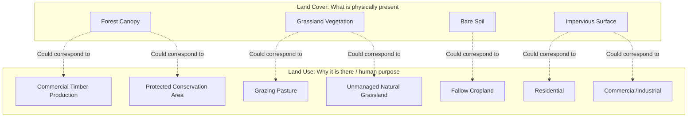
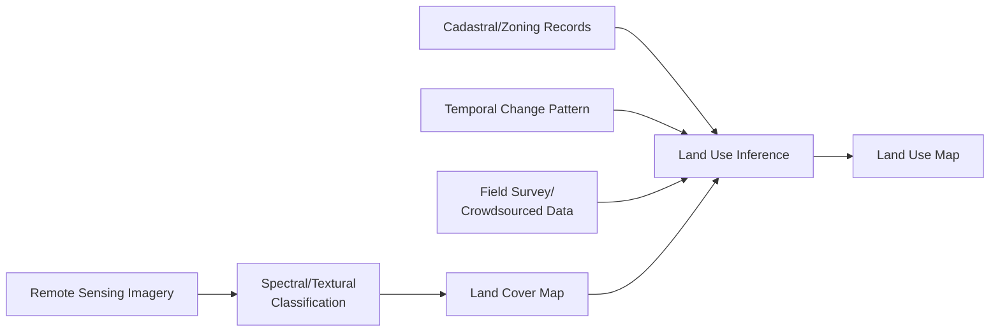

## Land Use Versus Land Cover Concepts

### Overview

Land use and land cover are foundational, frequently conflated concepts in geospatial and environmental science that describe distinct but related aspects of the terrestrial surface: land cover refers to the observable biophysical material present at the surface, while land use refers to the human purpose or socioeconomic activity associated with a given parcel of land. This distinction has direct methodological consequences for remote sensing classification (which fundamentally observes cover, not use) and for how land change is interpreted, monitored, and modeled.

### Defining Land Cover

#### Core Definition

Land cover describes the physical and biological material covering the Earth's surface — vegetation type, bare soil, water, snow/ice, built structures, and other biophysical categories — that is, in principle, directly observable and physically measurable through remote sensing, since it corresponds to the actual material present at the surface reflecting or emitting electromagnetic radiation captured by a sensor.

#### Standard Land Cover Classification Schemes

Multiple standardized classification schemes exist to ensure consistency and comparability across mapping efforts:

- **IPCC Land Cover Categories**: A relatively coarse six-category scheme (Forest Land, Cropland, Grassland, Wetlands, Settlements, Other Land) designed specifically for greenhouse gas inventory and carbon accounting purposes, directly connecting land cover classification to the AFOLU sector framework introduced in carbon monitoring and reporting content.
- **FAO Land Cover Classification System (LCCS)**: A hierarchical, globally applicable classification system using a structured set of classifiers (life form, cover density, height, spatial arrangement) to build up increasingly specific land cover classes, designed for cross-country and cross-study comparability.
- **USGS/Anderson Land Use and Land Cover Classification System**: A historically influential hierarchical scheme (despite its name including "land use") originally designed for use with remote sensing data at multiple detail levels, illustrating the long-standing practical entanglement between the two concepts even in scheme nomenclature.

### Defining Land Use

#### Core Definition

Land use describes the human purpose, management practice, or socioeconomic function associated with a parcel of land — for example, whether a grassland cover class corresponds to unmanaged natural grassland, actively grazed pasture, or fallow agricultural land awaiting a future crop rotation. Land use is fundamentally a socioeconomic and institutional category, generally not directly observable from spectral reflectance alone, and typically requires ancillary information (cadastral/parcel records, zoning designations, field survey, or contextual inference from surrounding land-cover pattern and temporal change signature) to determine reliably.

#### The Many-to-Many Relationship Between Cover and Use

A single land cover class can correspond to multiple distinct land uses, and conversely a single land use category can be associated with multiple land cover classes across its operational cycle or spatial extent:

$$LandCover \not\Leftrightarrow LandUse$$

**Example**: A "cropland" land cover classification (based on spectral signature characteristic of cultivated vegetation) could correspond to land uses including commercial agricultural production, subsistence farming, or even land temporarily repurposed for biofuel feedstock cultivation — uses with substantially different socioeconomic and policy implications despite an identical or near-identical land cover classification. Conversely, "urban residential" land use encompasses land cover ranging from impervious built structures to maintained lawn vegetation to street-tree canopy, all within a single land use category.

### Methodological Implications for Remote Sensing

#### What Sensors Actually Observe

Passive optical and radar remote sensing sensors fundamentally measure the electromagnetic reflectance or backscatter properties of surface materials, meaning direct sensor-based classification output is intrinsically a land cover product, not a land use product, regardless of how the classification legend is labeled — a distinction with important consequences for interpreting the accuracy and applicability of any "land use map" that claims to be directly derived from spectral classification alone.

#### Inferring Land Use from Land Cover and Ancillary Data

Because land use cannot be directly observed spectrally, land use mapping requires combining land cover classification with additional information sources: cadastral and property boundary data, zoning and administrative records, temporal land-cover change patterns (e.g., a regular crop rotation cycle inferred from multi-year cover-class time series is diagnostic of active agricultural use, distinct from a similarly-classified but temporally static grassland cover class), spatial context and pattern analysis (parcel geometry, proximity to infrastructure), and increasingly, integration of crowdsourced or survey-based ground-truth data, machine learning approaches trained on labeled use-cover correspondence examples, and points-of-interest or building-footprint attribute data in urban contexts.

### Land Use and Land Cover Change (LULCC) as a Combined Concept

#### Why the Distinction Matters for Change Analysis

Land Use and Land Cover Change (LULCC) analysis, a central methodology in environmental and geospatial science, requires careful attention to this distinction because the two change types have different drivers, different detectability, and different environmental/policy implications:

- **Land cover change**: Directly detectable via remote sensing time-series analysis (e.g., forest-to-bare-soil conversion, water body extent change), reflecting an actual physical transformation of the surface material.
- **Land use change**: May or may not involve a corresponding land cover change — for example, agricultural land converting from one crop type to another (a land use intensity or type change) may leave the broad "cropland" land cover classification unchanged, while conversely, land cover can change without any land use change (e.g., natural succession or disturbance-recovery cycles within a consistently forested/protected land use designation).

#### Land Use Intensity as a Distinct Dimension

Beyond the categorical use classification itself, land use intensity — the degree and frequency of human management input and resource extraction applied to land under a given use category (e.g., low-intensity extensive grazing versus high-intensity confined feeding operations, both technically "livestock" land use) — represents an important additional dimension frequently underrepresented in standard land use classification schemes but increasingly incorporated into modern land system science frameworks, since intensity substantially affects associated environmental outcomes (carbon flux, biodiversity impact, water use) independent of the broad use category itself.

### Data Sources and Products

#### Global Land Cover Products

Multiple satellite-derived global land cover products are maintained at varying resolution and update frequency by different agencies and research consortia (e.g., ESA WorldCover, USGS/NASA National Land Cover Database for the United States, Copernicus Global Land Cover), each using somewhat different classification legends, source imagery, and algorithmic approaches — meaning direct cross-product comparison requires attention to legend harmonization rather than assuming direct class-for-class equivalence between different products' category systems.

#### Land Use Data Sources

Given land use's non-remotely-sensed nature, authoritative land use data more commonly derives from administrative and survey sources: agricultural census data, cadastral/parcel-level zoning records, national land use surveys, and increasingly, integration with remote-sensing-derived land cover as one input among several rather than as a standalone sufficient source.

### Key Points

- Land cover describes the observable physical/biological surface material (directly measurable via remote sensing); land use describes the human socioeconomic purpose associated with that land (generally not directly observable spectrally).
- The relationship between cover and use is fundamentally many-to-many, not one-to-one, meaning a spectral classification output cannot be assumed to directly and uniquely determine land use without additional ancillary information.
- Remote sensing classification products are intrinsically land cover products regardless of legend labeling; land use mapping requires combining cover classification with cadastral, temporal, contextual, or survey-based ancillary data.
- LULCC analysis must account for the distinct possibility of cover change without use change (natural succession within a stable use category) and use change without cover change (crop-type rotation, use-intensity shift within a stable cover classification).
- Land use intensity represents an additional, frequently underrepresented dimension beyond categorical use classification, with substantial independent relevance to environmental outcome assessment.

**Related Topics**

- Remote Sensing for Land Cover and Vegetation Fuel Mapping
- Greenhouse Gas Dynamics and the Carbon Cycle (AFOLU sector classification linkage)
- Land Use and Land Cover Change Detection Methods
- Urban Growth Modeling and Impervious Surface Mapping
- Agricultural Land Use Intensity and Global Land System Science
- Cadastral and Property Data Integration in GIS
- Deforestation and Forest Cover Change Monitoring
- GIS and Spatial Analysis Fundamentals