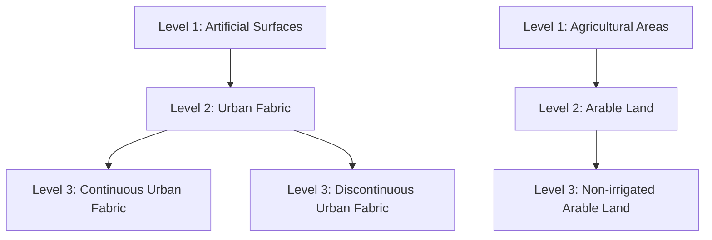
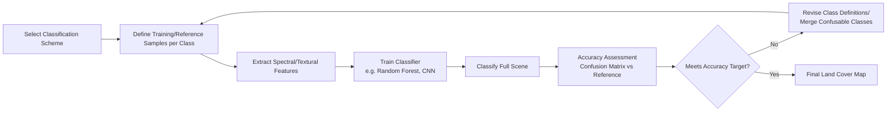

## Land Cover Classification Schemes


### Overview

Land cover classification schemes are standardized systems for categorizing the Earth's surface into discrete classes based on physical and biophysical characteristics (vegetation type, soil, water, built structures) as opposed to land use, which describes human socioeconomic function. A well-designed classification scheme provides the taxonomic backbone for remote sensing classification, change detection, and cross-study comparability. Scheme selection directly affects classification accuracy, class separability, and interoperability with other datasets.

**Key Points**

- Land cover describes *what physically covers the surface* (biophysical); land use describes *how humans use that surface* (functional). A single land cover class (e.g., grassland) can correspond to multiple land uses (pasture, golf course, park).
- Classification schemes are hierarchical, nested, or flat, and the choice affects both classification difficulty and downstream analytical utility.
- Interoperability across schemes requires documented crosswalks/legends, since class definitions are not always directly translatable.

### Land Cover vs. Land Use

| Aspect | Land Cover | Land Use |
| --- | --- | --- |
| Defines | Physical/biophysical surface material | Human functional purpose |
| Example | Forest, water, bare soil | Agriculture, residential, conservation |
| Primary data source | Remote sensing (spectral, structural) | Cadastral records, surveys, ancillary GIS layers |
| Change driver | Natural processes + anthropogenic conversion | Policy, economics, zoning |

### Major International Classification Schemes

#### 1. IPCC Land Use Categories

Used primarily for greenhouse gas inventory and carbon accounting under UNFCCC reporting. Six broad categories: Forest Land, Cropland, Grassland, Wetlands, Settlements, Other Land. Despite the "land use" naming, IPCC categories function largely as a simplified land cover scheme for carbon stock estimation purposes.

#### 2. FAO Land Cover Classification System (LCCS)

Developed by the UN Food and Agriculture Organization, LCCS is a hierarchical, parametric system rather than a fixed class list. Classification is built from a standardized set of diagnostic criteria (life form, cover density, height, spatial arrangement, water regime) combined algorithmically to generate class labels. This allows consistent, comparable classification across highly diverse landscapes without forcing a rigid predefined taxonomy.

**Key Points**

- LCCS Level 1 splits into eight major categories: cultivated/managed terrestrial areas, natural/semi-natural terrestrial vegetation, cultivated aquatic/regularly flooded areas, natural/semi-natural aquatic vegetation, artificial surfaces, bare areas, artificial waterbodies/snow/ice, and natural waterbodies/snow/ice.
- LCCS underlies several global products, including the ESA CCI Land Cover maps.

#### 3. USGS Anderson Land Use/Land Cover Classification System

A widely used legacy scheme (Anderson et al., 1976) developed for use with remote sensing, structured as a four-level hierarchy of increasing detail, where Level I is derivable from low-resolution satellite data and Level IV requires high-resolution aerial imagery.

| Level | Example (Urban Class) | Typical Data Requirement |
| --- | --- | --- |
| I | Urban or Built-up Land | Coarse-resolution satellite (e.g., Landsat) |
| II | Residential | Medium-resolution imagery |
| III | Single-family residential | High-resolution imagery |
| IV | Specific housing density class | Very high-resolution / cadastral data |

#### 4. CORINE Land Cover (Europe)

A European Environment Agency (EEA) standard using a three-level hierarchical nomenclature with 44 classes at Level 3, minimum mapping unit of 25 hectares, updated approximately every 6 years (1990, 2000, 2006, 2012, 2018).



#### 5. National Land Cover Database (NLCD) — United States

Produced by the Multi-Resolution Land Characteristics (MRLC) Consortium, based on Landsat imagery at 30m resolution, using a modified Anderson-style legend with 16 classes (e.g., Open Water, Developed Low/Medium/High Intensity, Deciduous Forest, Cultivated Crops). Updated on a multi-year cycle since 2001.

#### 6. ESA WorldCover / Copernicus Global Land Cover

Modern satellite-derived global products at 10m (WorldCover, Sentinel-based) and 100m (Copernicus Global Land Service) resolution, using simplified flat legends (11 classes for WorldCover: tree cover, shrubland, grassland, cropland, built-up, bare/sparse vegetation, snow/ice, permanent water bodies, herbaceous wetland, mangroves, moss/lichen) optimized for global consistency and machine-learning-based automated classification.

#### 7. IGBP / MODIS Land Cover Classification

The International Geosphere-Biosphere Programme (IGBP) scheme, used in the MODIS MCD12Q1 product, defines 17 classes (11 natural vegetation types, 3 developed/mosaic land types, and 3 non-vegetated types), widely used in global climate and ecosystem modeling due to consistent annual global coverage since 2001.

### Comparative Summary

| Scheme | Hierarchy Type | Typical Resolution | Primary Domain |
| --- | --- | --- | --- |
| Anderson USGS | Fixed 4-level hierarchy | 30m–1m (level-dependent) | US national mapping |
| FAO LCCS | Parametric/modular | Variable | Global, FAO/ESA products |
| CORINE | Fixed 3-level hierarchy | 25 ha MMU | Europe |
| NLCD | Flat (Anderson-derived) | 30m | United States |
| IGBP/MODIS | Flat, 17 classes | 500m | Global climate modeling |
| ESA WorldCover | Flat, 11 classes | 10m | Global, ML-based |

### Designing or Selecting a Classification Scheme

**Key Points**

- **Mutual exclusivity and exhaustiveness**: every pixel/parcel must map to exactly one class, with no ambiguous overlaps.
- **Minimum Mapping Unit (MMU)**: the smallest area a scheme resolves—directly tied to sensor resolution and class generalization; smaller MMU increases detail but reduces classification stability.
- **Separability**: classes should be spectrally/structurally distinguishable given the sensor and method used; overly fine-grained schemes reduce classifier accuracy when spectral signatures overlap (e.g., distinguishing pasture from low-intensity cropland from Landsat alone).
- **Hierarchical vs. flat design**: hierarchical schemes (Anderson, CORINE, LCCS) allow accuracy assessment and aggregation at coarser levels when fine-level classification is unreliable; flat schemes are simpler for automated ML pipelines but less flexible.

### Crosswalking Between Schemes

Combining datasets built on different schemes (e.g., merging NLCD with CORINE for a transboundary study) requires an explicit **class crosswalk/legend translation table**, since class definitions rarely align one-to-one.

**Example**

```python
crosswalk = {
    "NLCD_41": "Deciduous Forest",       # NLCD class
    "CORINE_311": "Broad-leaved forest",  # CORINE equivalent
    "IGBP_4": "Deciduous Broadleaf Forest"
}

import pandas as pd

df["harmonized_class"] = df["nlcd_class"].map(crosswalk)
```

**Caution**: crosswalks are rarely perfectly bijective—some source classes may split across multiple target classes or vice versa, requiring probabilistic reassignment or manual review of boundary cases. [Inference: the degree of mismatch is scheme- and region-specific and should be validated against reference data before use in change detection workflows.]

### Application to Remote Sensing Classification Workflows



### Practical Workflow Summary

1. Determine the analytical objective (carbon accounting → IPCC/LCCS; national mapping → Anderson/NLCD; global comparability → IGBP/WorldCover).
2. Match scheme granularity to available sensor resolution and classifier capability.
3. Verify class definitions are mutually exclusive and exhaustive for the study area.
4. If integrating multiple data sources, build and validate an explicit class crosswalk table.
5. Assess classification accuracy per class using a confusion matrix, and consider hierarchical aggregation if fine classes are unreliable.
6. Document the scheme, version, and legend explicitly in metadata for reproducibility and cross-study comparability.

**Related Topics**

- Land Cover vs. Land Use Change Detection Methods
- Supervised Classification Algorithms (Random Forest, SVM, CNN)
- Accuracy Assessment and Confusion Matrix Analysis
- ESA CCI and Copernicus Global Land Cover Products
- Minimum Mapping Unit and Generalization Effects
- Time-Series Land Cover Change Analysis (LandTrendr, CCDC)
- Object-Based Image Analysis (OBIA) for Land Cover Mapping
- Carbon Accounting and IPCC Land Use Reporting