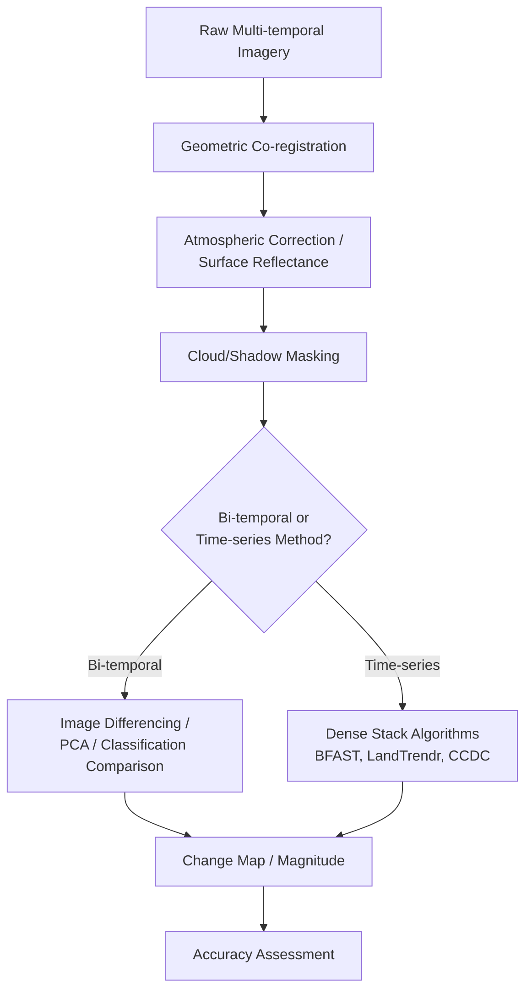
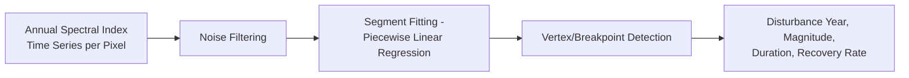

## Change Detection and Monitoring Techniques


### Overview

Change detection is the process of identifying and quantifying differences in land surface state between two or more time periods using remotely sensed or geospatial data. Techniques range from simple bi-temporal image differencing to complex dense time-series algorithms capable of detecting subtle, gradual, or abrupt changes. Method selection depends on the type of change targeted (abrupt disturbance vs. gradual degradation), data availability (bi-temporal vs. dense time series), and required output (binary change map, categorical from-to transitions, or continuous change magnitude/date).

**Key Points**

- Change detection methods are broadly classified as bi-temporal (two-date comparison) or time-series-based (dense stacks, often near-continuous).
- Radiometric and geometric co-registration between dates is a prerequisite; misalignment or uncorrected illumination/atmospheric differences produce false change signals.
- Choice of method depends on whether the goal is detecting *abrupt* change (deforestation, fire, urban conversion) or *gradual* change (degradation, phenological shift, slow greening/browning trends).

### Preprocessing Requirements

Before any change detection algorithm is applied, several preprocessing steps are essential to avoid spurious change signals:

- **Geometric co-registration**: sub-pixel alignment between image dates, critical since misregistration alone can produce apparent change at feature edges.
- **Radiometric normalization / atmospheric correction**: converting to surface reflectance (e.g., via Sen2Cor for Sentinel-2, LEDAPS/LaSRC for Landsat) to remove atmospheric and illumination differences unrelated to true surface change.
- **Cloud and shadow masking**: removing contaminated pixels (e.g., via Fmask) prior to comparison, particularly important for dense time-series methods.
- **Consistent sensor/band selection**: when combining sensors (e.g., Landsat and Sentinel-2), spectral band harmonization is required due to differing spectral response functions.



### Bi-Temporal Change Detection Methods

#### 1. Image Differencing

Subtracts spectral values (or an index) between two dates; thresholding identifies significant change.

$$\Delta X = X_{t2} - X_{t1}$$

Commonly applied to vegetation indices:

$$\Delta NDVI = NDVI_{t2} - NDVI_{t1}$$

**Example**

```python
import rasterio
import numpy as np

with rasterio.open("ndvi_t1.tif") as src1, rasterio.open("ndvi_t2.tif") as src2:
    ndvi_t1 = src1.read(1)
    ndvi_t2 = src2.read(1)

delta_ndvi = ndvi_t2 - ndvi_t1
change_mask = np.abs(delta_ndvi) > 0.2  # threshold-based binary change
```

**Caution**: threshold selection is often empirical and scene-dependent; a common approach is statistical thresholding using the mean ± $k$ standard deviations of the difference image, assuming no-change pixels dominate and follow an approximately normal distribution.

#### 2. Image Ratioing

$$R = \frac{X_{t2}}{X_{t1}}$$

Less sensitive to multiplicative illumination differences than simple differencing but requires careful handling of near-zero denominators.

#### 3. Change Vector Analysis (CVA)

Treats each pixel's multi-band reflectance as a vector in spectral space; change is quantified by vector magnitude and direction between two dates:

$$\text{Magnitude} = \sqrt{\sum_{b=1}^{n} (X_{b,t2} - X_{b,t1})^2}$$

The direction component allows differentiation of change *type* (e.g., vegetation loss vs. moisture increase) in addition to change presence, making CVA more informative than single-band differencing.

#### 4. Principal Component Analysis (PCA) of Stacked Bi-Temporal Images

Stacking bands from both dates and running PCA typically concentrates unchanged (correlated) information into early components, while change-related (decorrelated) information loads onto later components, which can then be thresholded to isolate change areas.

#### 5. Post-Classification Comparison

Independently classifies each date's imagery into land cover classes, then compares classified outputs pixel-by-pixel to generate a from-to transition matrix.

**Key Points**

- Advantage: directly yields categorical "from class A to class B" change information, not just a binary change flag.
- Disadvantage: classification errors in each date compound in the comparison step—if each date's classifier has 85% accuracy, joint from-to accuracy can be substantially lower, since errors are not independent but still reduce reliability.

**Example: From-to transition matrix**

```python
import pandas as pd

transition = pd.crosstab(class_t1.flatten(), class_t2.flatten(),
                          rownames=["Class_T1"], colnames=["Class_T2"])
print(transition)
```

### Time-Series-Based Change Detection

For applications requiring detection of gradual trends, seasonal decomposition, or precise change timing, dense time-series methods using stacks of many images (often all available Landsat/Sentinel-2 scenes) outperform simple bi-temporal comparison.

#### 1. LandTrendr (Landsat-based Detection of Trends in Disturbance and Recovery)

Fits temporal segmentation to per-pixel spectral trajectories using a piecewise linear regression approach, identifying breakpoints (vertices) that represent disturbance or recovery events. Commonly implemented in Google Earth Engine.



**Example (Google Earth Engine JavaScript)**

```javascript
var lt = ee.Algorithms.TemporalSegmentation.LandTrendr({
  timeSeries: annualNBRCollection,
  maxSegments: 6,
  spikeThreshold: 0.9,
  vertexCountOvershoot: 3,
  recoveryThreshold: 0.25
});
```

#### 2. BFAST (Breaks For Additive Season and Trend)

Decomposes a time series into seasonal, trend, and remainder components, then applies statistical tests to detect structural breaks in the trend and/or seasonal components—well suited for data with strong seasonality (e.g., agricultural monitoring).

$$Y_t = T_t + S_t + e_t$$

where $T_t$ is trend, $S_t$ is seasonal component, and $e_t$ is residual noise.

#### 3. CCDC (Continuous Change Detection and Classification)

Fits harmonic regression models continuously to time-series observations, flagging change when new observations deviate significantly from the model's prediction beyond a defined threshold across consecutive observations—enables near-real-time monitoring rather than only retrospective analysis.

$$\hat{y}(t) = a_0 + a_1 t + \sum_{k=1}^{K} \left[ a_{2k} \cos\left(\frac{2\pi k t}{T}\right) + a_{2k+1} \sin\left(\frac{2\pi k t}{T}\right) \right]$$

#### 4. Comparison of Time-Series Methods

| Method | Primary Strength | Typical Application |
| --- | --- | --- |
| LandTrendr | Clear disturbance/recovery trajectory segmentation | Forest disturbance, harvest, fire recovery |
| BFAST | Explicit seasonal/trend decomposition with statistical breakpoint tests | Cropland monitoring, phenology-sensitive change |
| CCDC | Near-continuous monitoring, supports near-real-time alerts | Operational deforestation alert systems (e.g., basis for GLAD alerts) |

### Change Detection with SAR (Radar) Data

Synthetic Aperture Radar (SAR) offers cloud-penetrating, day/night acquisition capability, making it valuable for change detection in persistently cloud-covered regions.

- **Log-ratio differencing**: commonly used instead of simple subtraction due to the multiplicative speckle noise characteristic of SAR, converting it to additive noise in log space:

$$LR = \ln\left(\frac{X_{t2}}{X_{t1}}\right)$$

- **Coherence-based change detection**: interferometric coherence loss between acquisition pairs indicates surface disturbance (e.g., structural collapse, deforestation, flooding), since coherence depends on scene stability between passes.
- Speckle filtering (e.g., Lee filter, Refined Lee) is typically required before change detection due to SAR's inherent speckle noise.

### Object-Based Change Detection

For high-resolution imagery, pixel-based methods can produce noisy, "salt-and-pepper" change maps. Object-based change detection (OBCD) first segments imagery into homogeneous objects (via multiresolution segmentation), then compares object-level attributes (mean spectral value, shape, texture) between dates, reducing noise and better matching real-world feature boundaries (e.g., individual buildings, tree crowns, field parcels).

### Accuracy Assessment for Change Detection

Change detection accuracy assessment requires a **stratified random sample** design, typically stratifying by change class due to the rarity of change pixels relative to no-change pixels in most landscapes—simple random sampling would undersample rare change classes and produce unreliable accuracy estimates for them.

**Key Points**

- Standard metrics: overall accuracy, user's accuracy (commission error), producer's accuracy (omission error), per change class.
- The **Olofsson et al. (2014)** stratified estimator is widely adopted for unbiased area and accuracy estimation from stratified reference samples in change detection studies.
- Reference data collection typically relies on high-resolution imagery interpretation (e.g., via TimeSync or similar tools) or independent field validation.

$$\hat{p}_{ij} = \sum_{h} W_h \frac{n_{ij,h}}{n_h}$$

where $W_h$ is the mapped area proportion of stratum $h$, and $n_{ij,h}/n_h$ is the sample proportion of reference class $j$ within mapped class $i$ in stratum $h$.

### Practical Workflow Summary

1. Co-register and radiometrically normalize all input imagery to surface reflectance.
2. Mask clouds, shadows, and other contaminated pixels.
3. Choose method based on change type: bi-temporal differencing/CVA for simple two-date abrupt change; LandTrendr/BFAST/CCDC for gradual or precisely-timed change from dense time series.
4. For high-resolution data, consider object-based segmentation to reduce pixel-level noise.
5. For persistently cloudy regions, supplement or substitute optical data with SAR-based coherence or log-ratio methods.
6. Design a stratified random accuracy assessment sample, emphasizing adequate representation of rare change classes.
7. Report area and accuracy estimates using an unbiased stratified estimator (e.g., Olofsson et al. approach).

**Related Topics**

- Land Cover Classification Schemes
- Google Earth Engine for Time-Series Analysis
- SAR Interferometry and Coherence Analysis
- Deep Learning for Change Detection (Siamese Networks, U-Net)
- Deforestation Alert Systems (GLAD, RADD)
- Stratified Random Sampling for Accuracy Assessment
- Phenological Trend Analysis and Time-Series Decomposition
- Object-Based Image Analysis (OBIA)