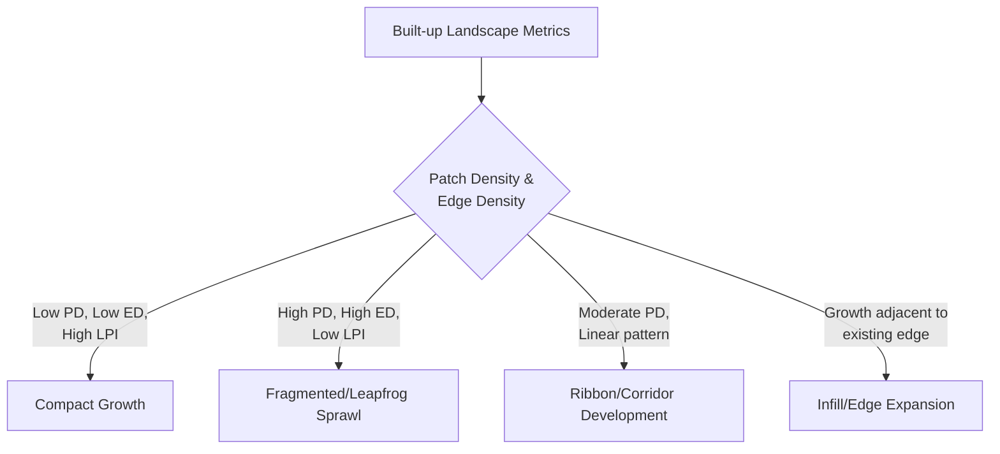
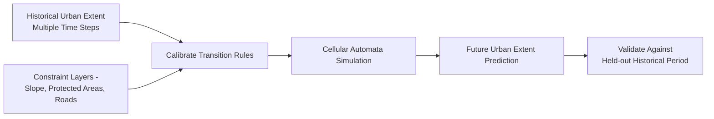

## Urbanization and Sprawl Analysis

### Overview

Urbanization and sprawl analysis applies geospatial methods to quantify, characterize, and model the spatial expansion and structural transformation of built-up land over time. It combines remote sensing-based built-up area detection, landscape metrics, and spatial statistical models to measure growth rate, spatial pattern (compact vs. dispersed), and drivers of urban expansion. Sprawl specifically refers to low-density, fragmented, often leapfrogging urban growth patterns, distinguished from compact or infill development through quantifiable spatial metrics rather than subjective assessment.

**Key Points**

- Urbanization is measured through both *rate* (how fast built-up area grows) and *pattern* (compact, dispersed, linear, leapfrog).
- Sprawl is operationally defined via landscape metrics (density, fragmentation, edge complexity) rather than a single universal threshold.
- Multi-temporal built-up extraction (from optical or nighttime lights imagery) is the primary data source; cellular automata and spatial regression models are the primary predictive tools.

### Detecting Built-Up / Urban Extent

#### Spectral Indices for Built-Up Areas

- **NDBI (Normalized Difference Built-up Index)**:

$$NDBI = \frac{SWIR - NIR}{SWIR + NIR}$$

- **UI (Urban Index)**, **NDVI-based masking** (built-up areas typically show suppressed NDVI relative to vegetation), and combined indices such as **IBI (Index-based Built-up Index)**, which integrates NDBI, SAVI, and MNDWI to reduce confusion with bare soil.

**Caution**: NDBI alone frequently confuses built-up areas with bare soil and dry riverbeds due to overlapping spectral response in the SWIR/NIR region; combined-index or classifier-based approaches typically improve separability. [Inference: the degree of confusion is scene- and season-dependent.]

#### Classification-Based Extraction

Supervised classification (random forest, SVM, or deep learning) trained on built-up vs. non-built-up labels, often using multi-source input stacks (optical bands, indices, texture, nighttime lights) for improved accuracy over single-index thresholding.

#### Nighttime Lights (NTL) Data

**Example**

VIIRS Day/Night Band (DNB) and its predecessor DMSP-OLS provide a proxy for urbanization intensity and are widely used for large-area, long-term urban growth trend analysis, especially where cloud cover limits optical imagery availability.

```python
import rasterio
import numpy as np

with rasterio.open("viirs_dnb_2024.tif") as src:
    ntl = src.read(1)

urban_proxy = ntl > 5  # radiance threshold, empirically calibrated per region
```

**Key Points**

- NTL saturation in very bright urban cores limits differentiation of internal density variation at the highest brightness levels.
- NTL resolution (typically ~500m for VIIRS) is coarser than optical-derived built-up maps, making it better suited to regional/national trend analysis than parcel-level mapping.

#### Global Built-Up Products

| Product | Source | Resolution | Temporal Coverage |
| --- | --- | --- | --- |
| GHSL (Global Human Settlement Layer) | JRC/EC, Landsat + Sentinel-2 | 10–1000m | 1975–present (multi-epoch) |
| World Settlement Footprint (WSF) | DLR, Sentinel-1/2 | 10m | Annual since 2015 (WSF Evolution) |
| GAIA (Global Artificial Impervious Area) | Landsat | 30m | Annual 1985–present |
| NLCD Developed Classes | USGS/MRLC | 30m | US only, multi-epoch |

### Quantifying Urban Growth Rate

#### Annual Urban Expansion Rate

$$UGR = \left(\sqrt[\Delta t]{\frac{A_{t2}}{A_{t1}}} - 1\right) \times 100$$

where $A_{t1}$ and $A_{t2}$ are built-up areas at the start and end years, and $\Delta t$ is the number of years between them—analogous to compound annual growth rate (CAGR) applied to spatial extent.

#### Urban Expansion Intensity Index (UEII)

Normalizes expansion rate by the total available (non-built) land area in the surrounding region, enabling comparison across cities/regions of different sizes.

### Measuring Sprawl: Landscape Pattern Metrics

Sprawl is characterized through a combination of density, fragmentation, and shape-based landscape metrics, typically computed from classified built-up rasters using tools such as FRAGSTATS or Python's `pylandstats`.

| Metric | What It Measures | Sprawl Signature |
| --- | --- | --- |
| Number of Patches (NP) | Count of discrete built-up patches | High = fragmented growth |
| Patch Density (PD) | Patches per unit area | High = dispersed development |
| Largest Patch Index (LPI) | % of built-up area in the largest patch | Low = decentralized/polycentric growth |
| Edge Density (ED) | Total edge length per unit area | High = irregular, sprawling boundaries |
| Mean Shape Index (MSI) | Patch shape complexity relative to a circle/square | High = irregular, non-compact patches |
| Contagion Index | Degree of clumping/aggregation of built-up cells | Low = scattered/leapfrog pattern |

**Example**

```python
import pylandstats as pls

ls = pls.Landscape("builtup_2024.tif", nodata_val=0)
metrics = ls.compute_class_metrics_df(classes=[1])  # class 1 = built-up
print(metrics[["patch_density", "edge_density", "largest_patch_index"]])
```

#### Sprawl Typology from Landscape Metrics



### Spatial Growth Pattern Classification

A commonly used typology (based on Xu et al. and related urban growth pattern literature) classifies new urban patches relative to existing built-up area as of the earlier date:

- **Infill**: new development entirely surrounded by existing built-up area.
- **Edge-expansion**: new development contiguous with, and extending from, existing built-up edges.
- **Leapfrog (outlying)**: new development spatially isolated from existing built-up area, a hallmark signature of sprawl.

**Example**

```python
from scipy import ndimage

# Buffer existing t1 built-up area
existing_buffered = ndimage.binary_dilation(builtup_t1, iterations=buffer_pixels)

new_growth = builtup_t2 & ~builtup_t1
infill = new_growth & builtup_t1_holes_filled & ~existing_buffered  # simplified logic
edge_expansion = new_growth & existing_buffered
leapfrog = new_growth & ~existing_buffered
```

### Modeling and Predicting Urban Growth

#### Cellular Automata (CA) Models

Simulate urban growth as a grid of cells that transition states (non-urban → urban) based on transition rules typically derived from neighborhood density, proximity to roads/existing urban area, and land suitability/constraint layers (slope, protected areas). SLEUTH is a widely used CA-based urban growth model calibrated using historical urban extent data.



#### Logistic Regression / Machine Learning Growth Models

Model probability of a cell transitioning to urban as a function of driver variables (distance to roads, distance to existing urban area, slope, distance to city center, population density):

$$P(urban) = \frac{1}{1 + e^{-(\beta_0 + \beta_1 X_1 + \beta_2 X_2 + \dots)}}$$

Random forest and gradient boosting classifiers are increasingly used in place of logistic regression for improved handling of nonlinear driver interactions, at the cost of reduced coefficient interpretability. [Inference: relative performance gains vary by study region and available driver variables and should be benchmarked per application.]

#### Agent-Based Models (ABM)

Simulate urban growth as the outcome of individual decision-making agents (households, developers) responding to land price, zoning, and accessibility—useful for policy scenario testing (e.g., impact of a new transit line on sprawl) but require more extensive behavioral calibration data than CA models. [Unverified: calibration data requirements vary substantially by implementation and study context.]

### Common Drivers and Explanatory Variables

**Key Points**

- **Accessibility**: distance to roads, highways, transit stations—strongly associated with sprawl in car-dependent regions.
- **Topography**: slope constrains buildable land and channels growth along valleys/flat terrain.
- **Land price and zoning**: economic and regulatory constraints shape density and location of new development.
- **Population growth and migration**: fundamental demand driver, often sourced from census/administrative data joined spatially to growth models.
- **Proximity to existing urban core**: the basis of monocentric urban growth models, though polycentric patterns are increasingly common in large metropolitan regions.

### Practical Workflow Summary

1. Extract multi-temporal built-up extent using spectral indices, classification, or global built-up products (GHSL, WSF, NLCD).
2. Compute urban growth rate (UGR) between time periods.
3. Compute landscape pattern metrics (patch density, edge density, LPI, shape index) to characterize compactness vs. sprawl.
4. Classify new growth into infill, edge-expansion, and leapfrog categories relative to prior built-up extent.
5. Identify driver variables (accessibility, slope, zoning, population) for explanatory or predictive modeling.
6. Select a modeling approach—CA (SLEUTH-style) for scenario simulation, logistic/ML regression for driver attribution, ABM for policy-sensitive behavioral simulation.
7. Validate predictions against a held-out historical period before using the model for future-year projection.

**Related Topics**

- Land Cover Classification Schemes
- Change Detection and Monitoring Techniques
- Cellular Automata Urban Growth Modeling (SLEUTH)
- Nighttime Lights Remote Sensing Applications
- Landscape Fragmentation Metrics (FRAGSTATS/pylandstats)
- Transportation Accessibility and Network Analysis
- Population Density Mapping and Dasymetric Modeling
- Agent-Based Modeling for Urban Policy Scenarios