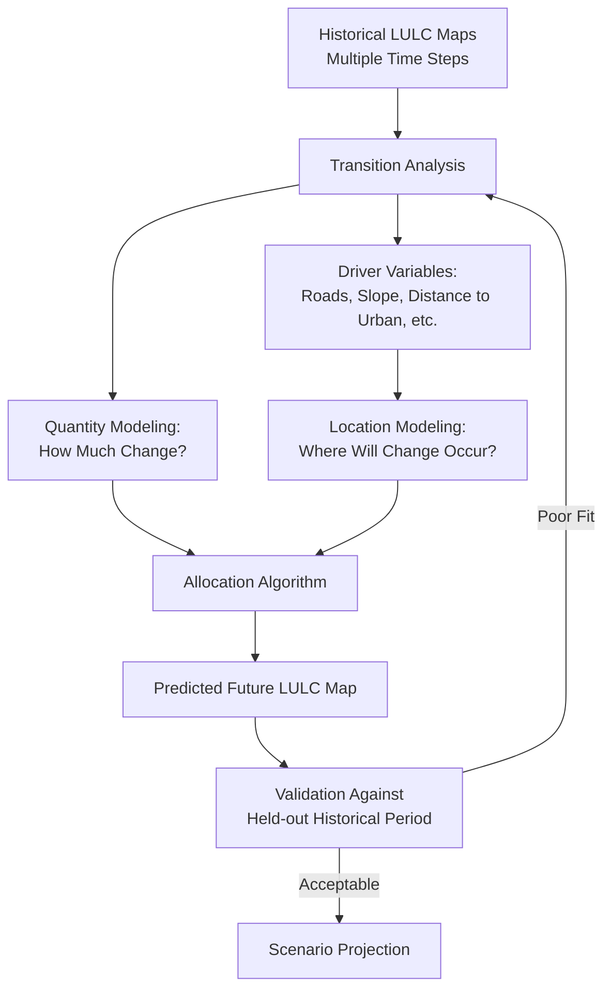
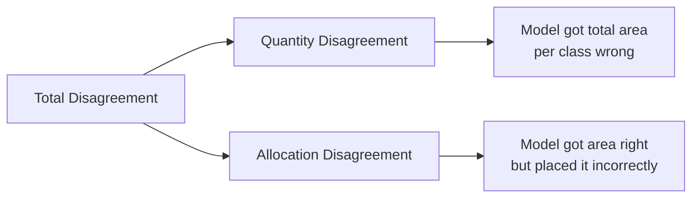

## Land Change Modeling and Prediction

### Overview

Land change modeling and prediction encompasses the quantitative methods used to project future land use/land cover (LULC) states based on historical change patterns, driver variables, and spatial transition rules. These models serve applications ranging from deforestation risk mapping to urban planning scenario analysis and climate impact assessment. Approaches range from empirical statistical models to complex spatially explicit simulation frameworks, generally combining a **quantity component** (how much change will occur) with a **location/allocation component** (where that change will occur).

**Key Points**

- Land change models decompose into two subproblems: predicting the *amount* of change (demand modeling) and predicting its *spatial allocation* (location modeling).
- Model validation requires comparing predictions against a held-out historical period (hindcasting) before trusting future-year projections.
- Model outputs are inherently probabilistic/scenario-based, not deterministic forecasts—results should be communicated as conditional projections dependent on driver assumptions continuing.

### Conceptual Framework



### Quantity Modeling: Estimating How Much Change Occurs

#### Markov Chain Analysis

Estimates transition probabilities between land cover classes based on observed change between two historical dates, producing a transition probability matrix used to project total area in each class at a future date.

$$P_{ij} = \frac{n_{ij}}{n_i}$$

where $n_{ij}$ is the number of cells transitioning from class $i$ to class $j$, and $n_i$ is the total cells in class $i$ at time 1.

$$S_{t+1} = S_t \cdot P$$

where $S_t$ is the state vector (area per class) and $P$ is the transition probability matrix.

**Key Points**

- Markov chain analysis assumes transition probabilities remain constant over the projection period, which is a simplification—actual transition rates often change due to evolving policy, economic, or biophysical conditions. [Inference: the validity of this stationarity assumption is time-horizon dependent and generally weakens for longer projection periods.]
- Markov models alone provide only the *quantity* of change per class, not spatial location—they are typically paired with a spatial allocation method (e.g., CA-Markov, MOLUSCE).

**Example**

```python
import numpy as np

# Transition matrix rows = from-class, columns = to-class
P = np.array([
    [0.85, 0.10, 0.05],  # Forest
    [0.05, 0.90, 0.05],  # Agriculture
    [0.00, 0.02, 0.98],  # Urban
])

S_t = np.array([50000, 30000, 20000])  # current area per class (ha)
S_t1 = S_t @ P  # projected area at t+1
```

#### Regression-Based Demand Modeling

Total future land demand (e.g., hectares of new urban land) can alternatively be projected from socioeconomic drivers—population growth, GDP, historical per-capita land consumption rates—using regression or time-series extrapolation, often used in urban planning contexts (e.g., UN-Habitat urban expansion projections).

### Location Modeling: Allocating Change Spatially

#### Logistic Regression

Models the probability of a specific transition (e.g., forest → agriculture) as a function of spatial driver variables:

$$\ln\left(\frac{P}{1-P}\right) = \beta_0 + \beta_1 X_1 + \beta_2 X_2 + \dots + \beta_n X_n$$

Common driver variables include distance to roads, distance to existing land use edge, slope, elevation, soil suitability, and proximity to rivers/water.

#### Cellular Automata (CA)

Applies local neighborhood transition rules iteratively across a grid, where each cell's transition probability depends on the state of surrounding cells plus suitability layers—captures spatial contagion (new change tends to occur near existing change) inherently, unlike pure regression approaches.

**CA-Markov** combines Markov chain quantity estimation with CA-based spatial allocation, a widely used hybrid approach implemented in software such as IDRISI/TerrSet and QGIS's MOLUSCE plugin.

#### Multi-Criteria Evaluation (MCE) / Weighted Overlay

Combines multiple suitability layers (each normalized to a common scale, e.g., 0–255) using weighted summation to produce a composite suitability surface guiding where change is most likely to occur:

$$S = \sum_{i=1}^{n} w_i \cdot X_i$$

subject to $\sum w_i = 1$, where weights are commonly derived via expert judgment or Analytic Hierarchy Process (AHP) pairwise comparison.

#### Machine Learning-Based Allocation

Random forest, gradient boosting, and artificial neural networks (ANN) are increasingly used to model transition probability surfaces, offering improved handling of nonlinear driver interactions compared to logistic regression, at the cost of reduced interpretability of individual driver contributions.

**Example**

```python
from sklearn.ensemble import RandomForestClassifier

# Features: distance to road, distance to urban, slope, soil suitability
X = driver_stack[["dist_road", "dist_urban", "slope", "soil_suit"]]
y = transitioned_to_urban  # binary label from historical transition

clf = RandomForestClassifier(n_estimators=300, class_weight="balanced")
clf.fit(X, y)

transition_probability = clf.predict_proba(future_driver_stack)[:, 1]
```

### Integrated Modeling Frameworks

| Framework | Core Method | Notable Feature |
| --- | --- | --- |
| CA-Markov (TerrSet/IDRISI) | Markov quantity + CA allocation | Long-standing standard, GUI-driven |
| Dyna-CLUE | CLUE-S conversion rules + spatial competition | Multi-land-use competitive allocation |
| MOLUSCE (QGIS plugin) | ANN/CA/Markov/logistic regression, open-source | Free, integrated into QGIS |
| SLEUTH | CA calibrated via brute-force coefficient search | Purpose-built for urban growth |
| FLUS (Future Land Use Simulation) | ANN suitability + CA with roulette-wheel selection | Handles multiple competing land use types |
| LUCC/Agent-Based Models | Behavioral agent decision rules | Captures individual actor decision-making |

### Model Calibration and Validation

#### Hindcasting Validation

The standard validation approach withholds the most recent historical transition and projects it from an earlier baseline, then compares the projected map against the actual observed map for that period using measures such as the Kappa statistic or Figure of Merit.

$$\text{Figure of Merit} = \frac{B}{A + B + C + D}$$

where $B$ is correctly predicted change, and $A$, $C$, $D$ represent various error categories (false change, missed change, wrongly predicted persistence)—Figure of Merit is often preferred over overall accuracy or Kappa in change modeling because it specifically isolates performance on the (typically rare) change class rather than being dominated by the abundant persistence class.

**Key Points**

- **Kappa statistic** and overall percent agreement can be misleadingly high in land change validation because most pixels persist unchanged between dates; models that predict "no change everywhere" can achieve high overall accuracy while providing no useful change information.
- Pontius et al.'s budget-based validation framework decomposes error into *quantity disagreement* (wrong total area per class) and *allocation disagreement* (right total area but wrong location), which is now widely adopted as more diagnostic than a single aggregate accuracy score.



### Scenario-Based Projection

Because driver relationships and policy conditions are uncertain over long projection horizons, land change models are typically run under multiple **scenarios** rather than producing a single deterministic forecast:

- **Business-as-usual (BAU)**: extrapolates historical trends and transition rates unchanged.
- **Policy intervention scenarios**: modify suitability/constraint layers (e.g., new protected area, new transit corridor) to test intervention effects.
- **Climate/socioeconomic scenario alignment**: land change models are sometimes coupled with Shared Socioeconomic Pathways (SSPs) for integration with climate impact assessments.

**Caution**: projections beyond the calibration period's driver conditions (e.g., a road network that expands well beyond historical extent) extrapolate outside the model's trained relationships and carry substantially higher uncertainty. [Inference: the practical safe extrapolation horizon depends on how much driver conditions diverge from the calibration period and is not a fixed universal duration.]

### Practical Workflow Summary

1. Assemble at least two (preferably three, for validation) historical LULC maps on a consistent classification scheme.
2. Compute historical transition matrices and identify dominant land change trajectories.
3. Select a quantity modeling approach (Markov chain, regression-based demand) to project total future area per class.
4. Assemble driver/suitability variables (roads, slope, distance to existing edge, protected status) for spatial allocation.
5. Select an allocation method (CA, logistic regression, ML classifier, MCE) matched to project complexity and interpretability needs.
6. Calibrate and validate via hindcasting, using Figure of Merit and quantity/allocation disagreement decomposition rather than relying solely on overall accuracy.
7. Run scenario-based projections (BAU plus policy alternatives) and communicate results as conditional, not deterministic, forecasts.

**Related Topics**

- Change Detection and Monitoring Techniques
- Urbanization and Sprawl Analysis
- Cellular Automata Urban Growth Modeling (SLEUTH)
- Multi-Criteria Evaluation and Analytic Hierarchy Process (AHP)
- Deforestation Risk Mapping
- Shared Socioeconomic Pathways (SSPs) and Climate Scenario Integration
- Random Forest and ANN-Based Spatial Suitability Modeling
- Pontius Quantity/Allocation Disagreement Framework