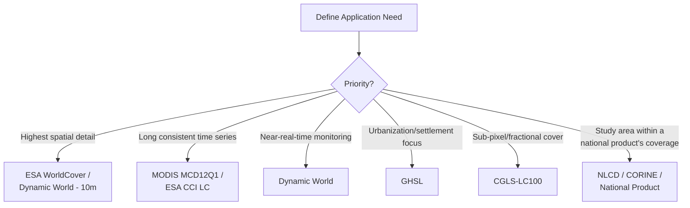

## Global Land Cover Datasets

### Overview

Global land cover datasets are satellite-derived, wall-to-wall products providing consistent land cover classification across the entire Earth's terrestrial surface, enabling global-scale environmental monitoring, climate modeling, and cross-national comparability. These datasets vary substantially in spatial resolution, temporal coverage, classification scheme, and underlying sensor/methodology, making dataset selection dependent on the specific application (e.g., global carbon modeling vs. local deforestation monitoring).

**Key Points**

- Trade-offs among global land cover products center on spatial resolution, temporal frequency/depth, thematic detail, and accuracy—no single product is optimal across all use cases.
- Most modern global products (post-2015) rely on either Landsat (30m), Sentinel-2 (10m), or MODIS (250m–500m) as their primary sensor input, with increasing use of Sentinel-1 SAR for cloud-persistent regions.
- Validation accuracy is reported per product but varies substantially by biome/region; users should consult the product-specific validation reports rather than relying solely on headline global accuracy figures.

### Major Global Land Cover Products

#### 1. ESA WorldCover

Produced by the European Space Agency using Sentinel-1 and Sentinel-2 data at 10m resolution, using an 11-class simplified legend. WorldCover 2020 and 2021 versions are the primary releases, generated via a machine-learning classification pipeline (gradient boosting) trained on a global reference dataset.

**Key Points**

- Reported overall accuracy for WorldCover 2020 is approximately 74–75% based on independent validation, though accuracy varies substantially by class and biome. [Unverified: exact figures should be checked against the current official validation report, as methodology and figures may be updated in later releases.]
- Highest spatial resolution among fully global products (10m), making it well-suited to local/regional analysis despite the simplified legend.

#### 2. Copernicus Global Land Cover (CGLS-LC100)

100m resolution product based on PROBA-V imagery, using a modular legend allowing both discrete classification and fractional cover layers (e.g., percent tree cover, percent bare ground per pixel) rather than forcing hard class boundaries—useful for applications needing sub-pixel land cover heterogeneity information (e.g., savanna-woodland gradients).

#### 3. MODIS Land Cover (MCD12Q1)

500m resolution, annual product since 2001, using multiple selectable classification legends including IGBP (17 classes), University of Maryland (UMD), and PFT (Plant Functional Type) schemes within the same product—valuable for its long, consistent annual time series, widely used in climate and Earth system modeling (e.g., as land surface model inputs).

#### 4. ESA CCI Land Cover

300m resolution, annual coverage from 1992–2020 (later extended), designed specifically for climate model consistency requirements under the Climate Change Initiative, using the FAO LCCS classification framework, providing one of the longest continuous consistent annual global time series available.

#### 5. Global Human Settlement Layer (GHSL)

Produced by the EU Joint Research Centre, focused specifically on built-up/settlement extent and population distribution rather than full land cover, derived from Landsat and Sentinel-2 at resolutions from 10m to 1km, with multi-epoch historical coverage extending back to 1975 using declassified historical imagery—the primary global reference for long-term urbanization analysis.

#### 6. National Land Cover Database (NLCD) and Regional Equivalents

While not global, region-specific high-accuracy products (NLCD for the US, CORINE for Europe, Africover for parts of Africa) often provide substantially higher thematic and spatial accuracy than global products for their respective regions and are preferred when the study area falls entirely within their coverage.

#### 7. Dynamic World (Google/WRI)

A near-real-time, 10m resolution global land cover product generated from Sentinel-2 imagery using a deep learning model, updated continuously (per Sentinel-2 revisit, roughly every 2–5 days depending on latitude and cloud cover) rather than as an annual composite, providing probabilistic class outputs (per-pixel probability for each of 9 classes) rather than a single hard classification.

```python
import ee

dw = ee.ImageCollection("GOOGLE/DYNAMICWORLD/V1") \
    .filterDate("2024-01-01", "2024-12-31") \
    .filterBounds(aoi)

composite = dw.select("label").mode()  # most frequent class per pixel over period
```

### Comparative Summary

| Product | Resolution | Temporal Coverage | Classes | Primary Sensor | Best Suited For |
| --- | --- | --- | --- | --- | --- |
| ESA WorldCover | 10m | 2020, 2021 | 11 | Sentinel-1/2 | Local/regional detail, recent snapshot |
| Dynamic World | 10m | Near-continuous, 2015–present | 9 (probabilistic) | Sentinel-2 | Near-real-time monitoring |
| CGLS-LC100 | 100m | Annual, 2015–2019 | Modular/fractional | PROBA-V | Fractional cover analysis |
| MODIS MCD12Q1 | 500m | Annual, 2001–present | 17 (IGBP) or alt. legends | MODIS | Long time series, climate modeling |
| ESA CCI LC | 300m | Annual, 1992–2020+ | FAO LCCS-based | AVHRR/SPOT/PROBA-V/Sentinel-3 | Climate model consistency, longest record |
| GHSL | 10m–1km | Multi-epoch, 1975–present | Built-up focused | Landsat/Sentinel-2 | Long-term urbanization trends |

### Selecting an Appropriate Global Dataset



### Accessing Global Land Cover Data

**Example**

Most modern global products are accessible via cloud platforms rather than requiring direct file downloads:

```python
# Google Earth Engine access pattern
import ee
ee.Initialize()

worldcover = ee.ImageCollection("ESA/WorldCover/v200").first()
modis_lc = ee.ImageCollection("MODIS/061/MCD12Q1") \
    .filterDate("2023-01-01", "2023-12-31").first()

# Clip to area of interest
aoi = ee.Geometry.Rectangle([120.9, 14.5, 121.1, 14.7])
clipped = worldcover.clip(aoi)
```

- **STAC catalogs**: ESA WorldCover and other products are also accessible via STAC-compliant APIs (e.g., Microsoft Planetary Computer, Element84's Earth Search).
- **Direct download portals**: most agencies (ESA, Copernicus, USGS) provide bulk download access for offline/local processing workflows.

### Known Limitations and Considerations

**Key Points**

- **Class definition inconsistency across products** complicates direct comparison; a pixel labeled "shrubland" in one product may be labeled "grassland" or "sparse forest" in another due to differing thresholds—explicit crosswalks are required for multi-product integration (see Land Cover Classification Schemes).
- **Snapshot products** (WorldCover 2020/2021) cannot support change detection alone and must be paired with time-series products (MODIS, CCI, Dynamic World) if temporal trend analysis is required.
- **Accuracy heterogeneity across biomes**: global accuracy figures often mask substantially lower accuracy in complex or transitional landscapes (e.g., savanna-woodland boundaries, wetland-cropland mosaics) compared to more spectrally distinct classes (e.g., open water, dense forest). [Inference: exact regional accuracy variation should be checked against product-specific validation reports rather than assumed uniform.]
- **Resolution-driven omission of small features**: coarser products (250m–1km) systematically omit or generalize small settlements, narrow riparian corridors, and fragmented agricultural parcels—resolution should be matched to the minimum feature size relevant to the application.

### Practical Workflow Summary

1. Define the application's spatial resolution, temporal frequency, and thematic detail requirements.
2. Select a product matched to those requirements from the comparative table (or a national product if the study area is fully covered by one).
3. Check the product-specific accuracy/validation report for the region and classes of interest before treating outputs as ground truth.
4. Access data via cloud APIs (Google Earth Engine, Microsoft Planetary Computer, STAC catalogs) for scalable, reproducible workflows rather than manual downloads where feasible.
5. If integrating multiple products or comparing against local classification schemes, build an explicit legend crosswalk.
6. For change analysis, use multi-temporal products (MODIS, CCI, Dynamic World) rather than single-epoch snapshots.

**Related Topics**

- Land Cover Classification Schemes
- Change Detection and Monitoring Techniques
- Google Earth Engine for Global-Scale Analysis
- STAC (SpatioTemporal Asset Catalog) Specification
- Accuracy Assessment and Confusion Matrix Analysis
- Global Human Settlement Layer (GHSL) Applications
- Deep Learning for Land Cover Classification (Dynamic World Methodology)
- Data Sharing, Licensing, and Governance