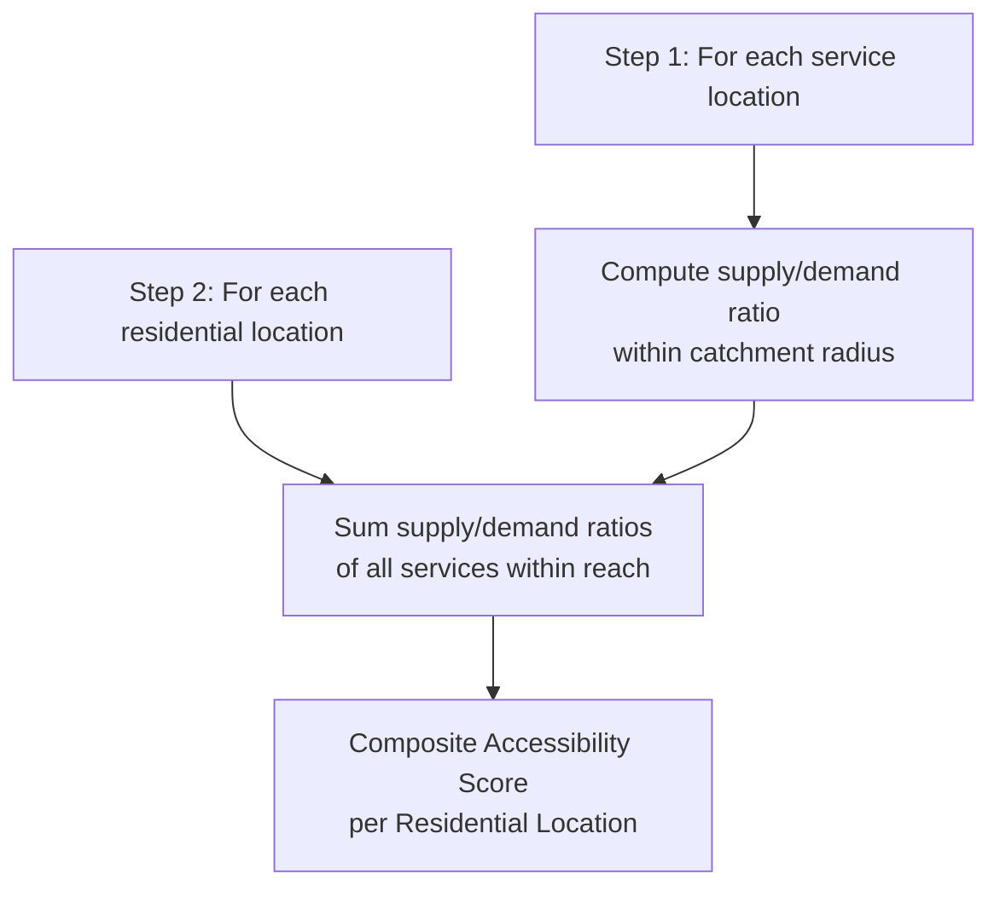

## Urban Spatial Analysis Fundamentals


### Overview

Urban spatial analysis fundamentals encompass the core quantitative methods used to describe, measure, and model the spatial structure and organization of cities—density patterns, accessibility, land use distribution, and spatial interaction. These techniques form the analytical foundation of urban and regional planning GIS work, providing the tools to characterize existing urban form and evaluate planning interventions before implementation.

**Key Points**

- Urban spatial analysis operates at multiple scales: parcel-level, neighborhood-level, city-level, and metropolitan/regional-level, with different methods appropriate to each.
- Core analytical themes include density and intensity measurement, spatial distribution/clustering, accessibility and connectivity, and spatial interaction between locations.
- Most techniques rely on vector (parcel, building, network) and raster (population, land value surface) data integration within a common GIS framework.

### Density and Intensity Measures

#### Population and Employment Density

$$D = \frac{P}{A}$$

where $P$ is population (or employment) count and $A$ is area, typically reported per square kilometer or hectare.

**Key Points**

- **Gross density**: total population divided by total land area, including non-residential land (roads, parks, commercial).
- **Net density**: population divided only by residential land area, excluding non-residential uses—generally a more meaningful measure of residential intensity.
- **Floor Area Ratio (FAR)**: ratio of total building floor area to lot area, a key zoning and density regulation metric:

$$FAR = \frac{\text{Total Floor Area}}{\text{Lot Area}}$$

#### Dasymetric Mapping

Refines coarse administrative-unit population data (e.g., census tract totals) to finer spatial resolution using ancillary data (land cover, building footprints, nighttime lights) as weighting surfaces, producing more spatially accurate density estimates than simple areal interpolation.

```python
import geopandas as gpd
import rasterio
import numpy as np

# Weight population by residential built-up area within each tract
residential_mask = rasterio.open("residential_landcover.tif").read(1)
tract_pop = gpd.read_file("census_tracts.shp")

# Simplified dasymetric redistribution logic
for idx, tract in tract_pop.iterrows():
    residential_pixels_in_tract = extract_pixels(residential_mask, tract.geometry)
    per_pixel_pop = tract["population"] / residential_pixels_in_tract.sum()
```

### Spatial Distribution and Clustering Analysis

#### Point Pattern Analysis

**Nearest Neighbor Index (NNI)** compares observed mean nearest-neighbor distance to the expected distance under a random (Poisson) distribution:

$$NNI = \frac{\bar{D}_{observed}}{\bar{D}_{expected}}$$

where $NNI < 1$ indicates clustering, $NNI \approx 1$ indicates randomness, and $NNI > 1$ indicates dispersion/uniformity.

**Ripley's K-function** extends nearest-neighbor analysis across multiple distance bands simultaneously, identifying the spatial scales at which clustering or dispersion occurs:

$$K(r) = \frac{A}{n^2} \sum_{i \neq j} I(d_{ij} < r)$$

where $A$ is study area, $n$ is point count, and $I(\cdot)$ is an indicator function for point pairs within distance $r$.

#### Hot Spot Analysis (Getis-Ord Gi*)

Identifies statistically significant spatial clusters of high values (hot spots) or low values (cold spots) for a given attribute (e.g., crime density, land value):

$$G_i^* = \frac{\sum_{j} w_{ij} x_j - \bar{X}\sum_{j} w_{ij}}{S\sqrt{\frac{n\sum_j w_{ij}^2 - (\sum_j w_{ij})^2}{n-1}}}$$

Resulting z-scores identify statistically significant clusters (commonly displayed with 90%, 95%, 99% confidence bins), widely used in crime analysis, retail site selection, and public health mapping.

**Example**

```python
from esda.getisord import G_local
from libpysal.weights import Queen

w = Queen.from_dataframe(gdf)
w.transform = "r"

gi_star = G_local(gdf["land_value"], w, star=True)
gdf["gi_zscore"] = gi_star.Zs
gdf["significant_hotspot"] = (gi_star.Zs > 1.96) & (gi_star.p_sim < 0.05)
```

### Accessibility Analysis

#### Distance-Based Accessibility

Simple Euclidean or network-distance measures to key destinations (transit stops, schools, hospitals, grocery stores), often visualized as isochrone/service-area buffers.

#### Gravity-Based Accessibility

Weights accessibility by both distance decay and destination size/attractiveness, reflecting that larger or more attractive destinations exert influence over greater distances:

$$A_i = \sum_{j} \frac{S_j}{d_{ij}^\beta}$$

where $S_j$ is the size/attractiveness of destination $j$, $d_{ij}$ is distance/travel time, and $\beta$ is the distance decay exponent (empirically calibrated, commonly ranging from 1 to 2 for many urban trip types). [Inference: the appropriate decay exponent is context- and mode-specific and should be calibrated against observed travel behavior data rather than assumed universal.]

#### Two-Step Floating Catchment Area (2SFCA)

Widely used for measuring healthcare and service accessibility, combining supply-to-demand ratios within a catchment with demand-to-supply weighting at each residential location—addresses the limitation of simple distance measures by accounting for competition among residents for limited service capacity.



#### Network-Based Service Areas

Computed via network analysis (shortest-path/isochrone algorithms) rather than straight-line buffers, reflecting actual travel routes along street networks—essential since Euclidean buffers systematically overestimate accessibility in areas with barriers (rivers, highways, cul-de-sac street patterns).

```python
import osmnx as ox
import networkx as nx

G = ox.graph_from_place("Quezon City, Philippines", network_type="walk")
center_node = ox.distance.nearest_nodes(G, X=lon, Y=lat)

isochrone_subgraph = nx.ego_graph(G, center_node, radius=1000, distance="length")
```

### Spatial Interaction Models

#### Gravity Model of Spatial Interaction

Models flow (trips, migration, commuting) between origin-destination pairs as a function of mass/attractiveness and distance decay, adapted from Newtonian gravity:

$$T_{ij} = k \cdot \frac{P_i P_j}{d_{ij}^\beta}$$

where $T_{ij}$ is interaction flow between zones $i$ and $j$, $P_i, P_j$ are population/mass at each zone, $d_{ij}$ is distance/travel cost, and $k$ is a calibration constant.

#### Huff Model (Retail Gravity Model)

A probabilistic variant estimating the probability that a consumer at location $i$ patronizes retail location $j$, based on relative attractiveness (e.g., store size) and distance:

$$P_{ij} = \frac{S_j / d_{ij}^\lambda}{\sum_{k} S_k / d_{ik}^\lambda}$$

Widely used in retail site selection and trade-area delineation.

### Urban Form Metrics

**Key Points**

- **Compactness indices**: shape-based metrics (e.g., Polsby-Popper) applied to urban extent boundaries to characterize sprawl vs. compact form.
- **Centrality/polycentricity measures**: identifying single-center (monocentric) vs. multi-center (polycentric) employment/activity distribution, often via density gradient analysis or local peak detection in employment surfaces.
- **Mixed-use index**: entropy-based measures of land use diversity within a given area:

$$E = \frac{-\sum_{k=1}^{n} p_k \ln p_k}{\ln n}$$

where $p_k$ is the proportion of land area in use category $k$, normalized by the maximum possible entropy ($\ln n$) to produce a 0–1 index.

- **Street network connectivity**: measured via intersection density, connected node ratio, or average block length—higher connectivity generally associated with more walkable, permeable urban form.

### Zoning and Land Use Overlay Analysis

Standard GIS overlay operations (intersect, union, spatial join) applied to zoning districts, parcels, and constraint layers (floodplains, environmental buffers) to assess development capacity, zoning compliance, and suitability for proposed land use changes.

**Example**

```python
import geopandas as gpd

parcels = gpd.read_file("parcels.shp")
zoning = gpd.read_file("zoning_districts.shp")
floodplain = gpd.read_file("floodplain.shp")

# Identify parcels zoned for development but within floodplain constraint
overlay = gpd.overlay(parcels, zoning, how="intersection")
constrained = gpd.overlay(overlay, floodplain, how="intersection")
```

### Practical Workflow Summary

1. Define the spatial scale of analysis (parcel, neighborhood, city, region) appropriate to the planning question.
2. Compute relevant density/intensity metrics (gross/net density, FAR) using dasymetric refinement where administrative-unit data is too coarse.
3. Apply point pattern or hot spot analysis to identify significant spatial clustering in the phenomenon of interest.
4. Select an accessibility method appropriate to the question—simple network distance for basic proximity, gravity-based or 2SFCA for demand-weighted accessibility.
5. Apply spatial interaction models (gravity, Huff) where flow or trade-area estimation is required.
6. Quantify urban form (compactness, mixed-use entropy, connectivity) to characterize existing conditions or compare planning scenarios.
7. Integrate zoning/constraint overlays to assess development capacity and regulatory compliance.

**Related Topics**

- Urbanization and Sprawl Analysis
- Transportation Network Analysis and Accessibility Modeling
- Spatial Autocorrelation (Moran's I, Getis-Ord Gi*)
- Dasymetric Population Mapping
- Retail Site Selection and Trade Area Analysis
- Zoning and Land Use Suitability Modeling
- Walkability and Street Network Connectivity Metrics
- GIS-Based Multi-Criteria Site Suitability Analysis