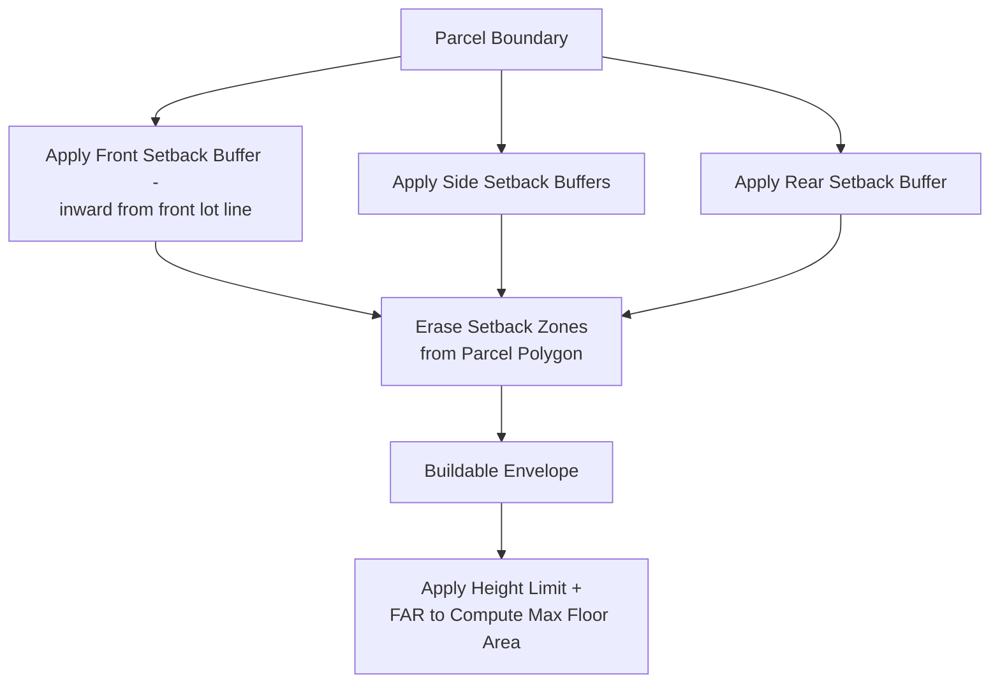
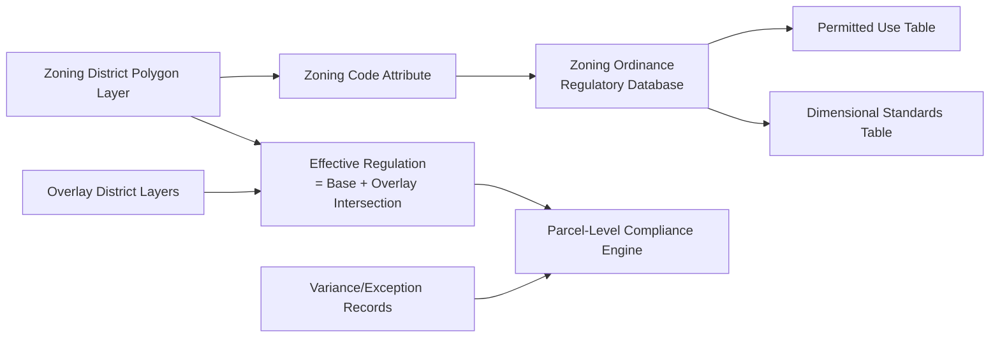

## Zoning and Land Use Planning


### Overview

Zoning and land use planning is the regulatory and analytical framework through which jurisdictions control the type, intensity, and location of development. Within a GIS context, zoning analysis involves managing zoning district geometries, applying regulatory attributes (permitted uses, density limits, setbacks), evaluating development proposals against code compliance, and conducting suitability analysis to inform future land use policy. This discipline sits at the intersection of legal/regulatory frameworks and spatial data management.

**Key Points**

- Zoning regulates *how land may be used and developed*, distinct from land use planning, which sets broader *long-term policy direction* (comprehensive/master plans) that zoning is intended to implement.
- Zoning districts are maintained as authoritative vector polygon layers, typically linked to a regulatory attribute table (permitted uses, density, height, setback requirements) via a zoning code/ordinance database.
- GIS-based zoning analysis commonly involves overlay operations, buildable area calculation, and suitability modeling for rezoning or comprehensive plan updates.

### Zoning vs. Comprehensive/Master Planning

| Aspect | Comprehensive/Master Plan | Zoning Ordinance |
| --- | --- | --- |
| Time horizon | Long-term (10–20+ years) | Immediate, legally binding |
| Legal status | Policy guidance document | Legally enforceable regulation |
| Content | Broad land use categories, goals | Specific permitted uses, dimensional standards |
| Update frequency | Periodic (every 5–10+ years) | As needed via amendment process |
| GIS representation | General future land use polygons | Precise parcel-level zoning district boundaries |

### Core Zoning Regulatory Components

#### Use Regulations

Define permitted, conditional, and prohibited land uses per zoning district (e.g., residential, commercial, industrial, mixed-use, agricultural, conservation), commonly structured as a use table cross-referencing zoning districts against use categories.

#### Dimensional/Bulk Standards

| Standard | Description |
| --- | --- |
| Minimum lot size | Smallest permissible parcel area for a use |
| Floor Area Ratio (FAR) | Total floor area / lot area, controls building bulk |
| Height limit | Maximum building height (often in feet/meters or stories) |
| Setbacks | Minimum distance from lot lines to structures (front, side, rear) |
| Lot coverage | Maximum % of lot area that may be covered by buildings |
| Density (units/area) | Maximum dwelling units per unit area, for residential zones |

$$FAR = \frac{\text{Total Floor Area}}{\text{Lot Area}}$$

**Example**

```python
import geopandas as gpd

parcels = gpd.read_file("parcels.shp")
zoning_rules = {
    "R-1": {"max_far": 0.5, "min_lot_sqm": 500, "max_height_m": 10},
    "C-2": {"max_far": 2.0, "min_lot_sqm": 200, "max_height_m": 25},
}

def check_compliance(row):
    rules = zoning_rules.get(row["zone_code"], {})
    max_allowed_floor_area = row["lot_area_sqm"] * rules.get("max_far", 0)
    return row["floor_area_sqm"] <= max_allowed_floor_area

parcels["far_compliant"] = parcels.apply(check_compliance, axis=1)
```

### Buildable Area and Setback Analysis

Calculating the legally buildable envelope on a parcel requires subtracting setback buffers from the parcel boundary—a standard GIS geoprocessing workflow combining buffer and overlay operations.



```python
from shapely.ops import unary_union

# Simplified buildable envelope via negative buffer (uniform setback approximation)
parcel_geom = parcels.geometry.iloc[0]
buildable_envelope = parcel_geom.buffer(-setback_distance_m)
buildable_area_sqm = buildable_envelope.area
```

**Caution**: uniform negative buffering approximates setbacks only for simple rectangular lots; irregular lot shapes and differentiated front/side/rear setback distances require directional setback construction (line-offset per lot-line segment) rather than a single uniform buffer. [Inference: the degree of approximation error depends on lot geometry irregularity and is generally larger for highly irregular or corner lots.]

### Overlay Districts and Regulatory Layering

Overlay zones apply additional regulations on top of base zoning without replacing it—common examples include historic districts, floodplain overlays, airport height restriction zones, and transit-oriented development (TOD) overlays. GIS representation requires maintaining overlay layers independently from base zoning and computing the *effective* regulation as the intersection/most-restrictive combination of applicable layers.

```python
base_zoning = gpd.read_file("base_zoning.shp")
flood_overlay = gpd.read_file("flood_overlay.shp")
historic_overlay = gpd.read_file("historic_district.shp")

# Determine all applicable regulatory layers per parcel
combined = gpd.overlay(base_zoning, flood_overlay, how="union")
combined = gpd.overlay(combined, historic_overlay, how="union")
```

### Land Use Suitability Analysis

Used to inform rezoning decisions, comprehensive plan updates, and identification of areas appropriate for future development or conservation, typically via weighted multi-criteria overlay.

$$S = \sum_{i=1}^{n} w_i \cdot X_i$$

where $X_i$ are normalized criteria layers (e.g., slope, proximity to infrastructure, soil quality, distance to environmentally sensitive areas) and $w_i$ are weights summing to 1, often derived via Analytic Hierarchy Process (AHP) pairwise comparison among stakeholders/planners.

**Example**

```python
import numpy as np
import rasterio

slope = rasterio.open("slope_suitability.tif").read(1)  # normalized 0-1, lower slope = higher suitability
infra_proximity = rasterio.open("infra_proximity.tif").read(1)
env_constraint = rasterio.open("environmental_constraint.tif").read(1)  # 0 = excluded

weights = {"slope": 0.3, "infra": 0.4, "env": 0.3}
suitability = (weights["slope"] * slope +
               weights["infra"] * infra_proximity +
               weights["env"] * env_constraint)

# Apply hard constraint mask (e.g., protected wetlands = unsuitable regardless of score)
suitability_masked = np.where(env_constraint == 0, 0, suitability)
```

### Zoning Compliance and Permit Review Workflows

**Key Points**

- **Automated compliance checking**: GIS-integrated permit systems can flag proposed developments against zoning rules automatically (setback violations, FAR overages, use restrictions) before human review, reducing manual lookup time.
- **Non-conforming use tracking**: parcels with existing uses that predate current zoning and no longer conform require explicit flagging in the zoning database, since they are typically legally permitted to continue but restricted from expansion.
- **Variance and special exception tracking**: GIS layers recording approved variances (deviations from standard zoning requirements) must be maintained separately from base zoning to preserve an accurate as-approved regulatory record per parcel.

### Upzoning, Downzoning, and Rezoning Analysis

- **Upzoning**: increasing permitted density/intensity (e.g., single-family to multi-family), commonly analyzed via capacity modeling—estimating potential new housing units or floor area under the proposed zoning change.
- **Downzoning**: decreasing permitted density/intensity, often analyzed for potential non-conforming use creation among existing structures.
- **Spot zoning risk assessment**: GIS analysis can help identify potential spot zoning (a small parcel zoned inconsistently with its surrounding context), a practice often legally vulnerable to challenge in many jurisdictions, by comparing a proposed parcel's zoning against neighboring parcel zoning patterns. [Inference: legal standards for spot zoning vary by jurisdiction; GIS pattern analysis supports but does not substitute for legal review.]

**Example: Development capacity under proposed upzoning**

```python
parcels["current_max_units"] = (parcels["lot_area_sqm"] / current_min_lot_per_unit)
parcels["proposed_max_units"] = (parcels["lot_area_sqm"] / proposed_min_lot_per_unit)
parcels["capacity_increase"] = parcels["proposed_max_units"] - parcels["current_max_units"]

total_new_capacity = parcels["capacity_increase"].sum()
```

### Data Model Considerations for Zoning GIS



**Key Points**

- Maintaining zoning code as a normalized relational attribute (linking geometry to a separate ordinance database table) rather than embedding all rule text directly in the spatial layer improves maintainability when ordinance text is amended independently of district boundaries.
- Effective date and amendment history tracking (temporal versioning of zoning boundaries) is important for historical compliance review, since a parcel's applicable zoning at the time of a past development approval may differ from current zoning.

### Practical Workflow Summary

1. Maintain zoning district geometries as an authoritative polygon layer linked to a normalized ordinance/regulatory attribute database.
2. Layer overlay districts (flood, historic, TOD, airport) independently and compute effective combined regulation via intersection.
3. Calculate buildable envelopes per parcel using directional setback construction rather than uniform buffering for irregular lots.
4. Build automated compliance checks (FAR, height, use, setback) for permit review workflows.
5. Conduct multi-criteria suitability analysis, with hard environmental/regulatory constraints applied as exclusion masks, to inform rezoning or comprehensive plan updates.
6. Model development capacity impacts (unit/floor area change) for proposed upzoning or downzoning scenarios.
7. Maintain temporal/version history of zoning changes for accurate historical compliance review.

**Related Topics**

- Urban Spatial Analysis Fundamentals
- GIS-Based Multi-Criteria Site Suitability Analysis
- Analytic Hierarchy Process (AHP) for Planning Decisions
- Floodplain and Environmental Constraint Mapping
- Parcel Data Models and Cadastral GIS
- Transit-Oriented Development (TOD) Overlay Analysis
- Housing Capacity and Density Modeling
- Land Change Modeling and Prediction