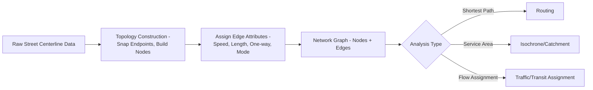
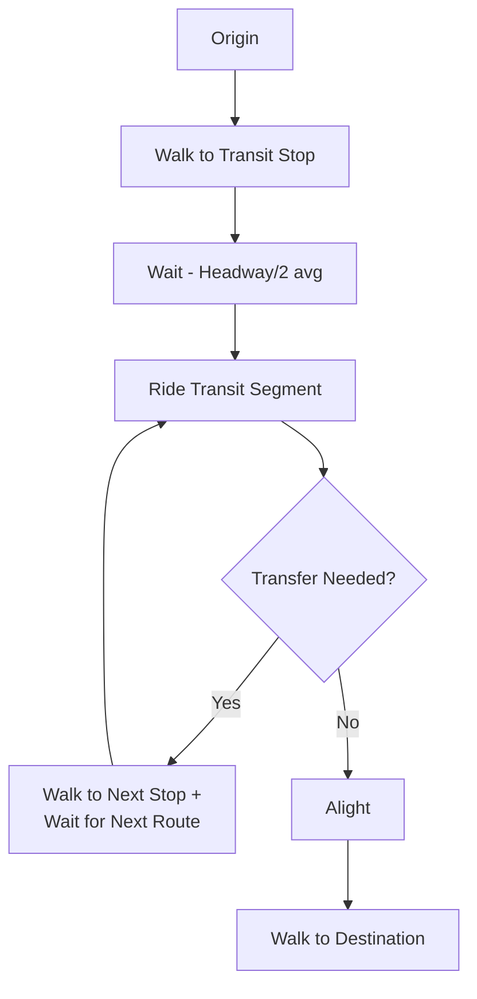

## Transportation and Accessibility Planning


### Overview

Transportation and accessibility planning applies GIS-based network analysis to evaluate, design, and optimize movement systems—road networks, transit systems, pedestrian/cycling infrastructure—and to measure how effectively people can reach destinations (jobs, services, amenities) across a region. This discipline combines network science, travel demand modeling, and accessibility metrics to inform infrastructure investment, transit service planning, and equity-focused policy analysis.

**Key Points**

- Transportation analysis operates on **network data models** (nodes and edges with attributes like speed, capacity, mode restrictions) rather than simple Euclidean distance.
- Accessibility (the ease of reaching destinations) is distinct from mobility (the ease of movement itself)—a highly mobile system can still produce poor accessibility if destinations are far or poorly connected.
- Multimodal analysis (walk, bike, transit, drive) requires network models specific to each mode, since travel speed, permitted paths, and cost structures differ substantially.

### Network Data Models

#### Graph Representation

Transportation networks are represented as directed or undirected graphs $G = (V, E)$, where $V$ is the set of nodes (intersections, transit stops) and $E$ is the set of edges (road segments, transit links), each edge carrying attributes such as length, speed limit, travel time, capacity, and mode permissions.



**Example**

```python
import osmnx as ox
import networkx as nx

G = ox.graph_from_place("Manila, Philippines", network_type="drive")
G = ox.add_edge_speeds(G)
G = ox.add_edge_travel_times(G)

origin_node = ox.distance.nearest_nodes(G, X=lon_o, Y=lat_o)
dest_node = ox.distance.nearest_nodes(G, X=lon_d, Y=lat_d)

route = nx.shortest_path(G, origin_node, dest_node, weight="travel_time")
route_length_m = nx.shortest_path_length(G, origin_node, dest_node, weight="length")
```

#### Impedance and Cost Functions

Edges are weighted by an **impedance** value representing the cost of traversal—commonly travel time, but also distance, monetary cost, or a composite generalized cost:

$$C_{ij} = \alpha \cdot t_{ij} + \beta \cdot d_{ij} + \gamma \cdot f_{ij}$$

where $t_{ij}$ is travel time, $d_{ij}$ is distance, $f_{ij}$ is fare/toll cost, and $\alpha, \beta, \gamma$ are weighting coefficients calibrated to reflect traveler behavior. [Inference: coefficient values are context- and mode-specific and are typically derived from stated-preference or revealed-preference survey data rather than fixed universal constants.]

### Shortest Path and Routing Algorithms

| Algorithm | Characteristic | Typical Use |
| --- | --- | --- |
| Dijkstra's Algorithm | Guarantees optimal shortest path, non-negative weights | Standard routing, single-source shortest path |
| A* (A-star) | Heuristic-guided, faster than Dijkstra for point-to-point | Real-time routing applications |
| Bellman-Ford | Handles negative edge weights | Rare in transportation; used in specific cost-modeling cases |
| Contraction Hierarchies | Precomputed hierarchy for very fast repeated queries | Large-scale routing engines (e.g., OSRM) |

$$d(v) = \min_{u \in \text{predecessors}(v)} \left[ d(u) + w(u,v) \right]$$

### Service Area (Isochrone) Analysis

Computes the reachable area from an origin within a given travel time or distance threshold, using network-constrained rather than Euclidean buffering—critical since straight-line buffers systematically overestimate reachability where barriers (rivers, highways, one-way streets) constrain actual travel paths.

```python
subgraph = nx.ego_graph(G, origin_node, radius=900, distance="travel_time")  # 15-min isochrone
nodes, edges = ox.graph_to_gdfs(subgraph)
isochrone_polygon = nodes.unary_union.convex_hull  # simplified boundary construction
```

**Key Points**

- Proper isochrone construction typically uses an alpha shape or concave hull rather than a convex hull, since convex hulls overestimate reachable area by including unreachable pockets between network branches. [Inference: the degree of overestimation depends on network density and sparsity of the surrounding area.]
- Isochrones are commonly generated for multiple time thresholds (5, 10, 15, 30 minutes) to visualize accessibility gradients from a given origin.

### Accessibility Metrics

#### Cumulative Opportunity Accessibility

Counts the number of opportunities (jobs, amenities) reachable within a given travel time threshold:

$$A_i = \sum_{j} O_j \cdot I(t_{ij} \leq T)$$

where $O_j$ is opportunities at destination $j$, and $I(\cdot)$ is an indicator function equal to 1 if travel time $t_{ij}$ is within threshold $T$.

#### Gravity-Based Accessibility

Weights opportunities by a distance-decay function rather than a hard cutoff, better reflecting the diminishing but non-zero value of more distant opportunities:

$$A_i = \sum_{j} O_j \cdot f(t_{ij})$$

Common decay functions include negative exponential ($f(t) = e^{-\beta t}$) or inverse power ($f(t) = t^{-\beta}$).

#### Two-Step Floating Catchment Area (2SFCA)

Widely used for measuring accessibility to constrained-capacity services (healthcare, childcare), incorporating both travel cost and competition for limited supply among demand locations within overlapping catchments.

### Transit Network Analysis

#### GTFS (General Transit Feed Specification)

The standard open data format for transit schedules and network structure, consisting of relational text files (stops.txt, routes.txt, trips.txt, stop_times.txt, calendar.txt) defining the complete transit network topology and timetable.

**Example**

```python
import gtfs_kit as gk

feed = gk.read_feed("transit_gtfs.zip", dist_units="km")
feed.validate()

stops = feed.stops
trip_stats = feed.compute_trip_stats()
```

#### Transit Accessibility Considerations

- **Headway-based impedance**: unlike driving, transit travel time must account for waiting time (often modeled as half the average headway), transfer penalties, and schedule-specific arrival times rather than continuous free-flow speed.
- **Multimodal trip chains**: walk-to-transit-to-walk journeys require linking pedestrian network segments to transit stop nodes, forming a combined multimodal graph.
- **Frequency and coverage trade-offs**: transit planning analysis commonly evaluates the trade-off between high-frequency service on fewer routes versus broader geographic coverage with lower frequency, using accessibility metrics to quantify the impact of alternative service designs.



### Traffic and Transit Assignment

For network-wide flow modeling (as opposed to single origin-destination routing), **traffic assignment** distributes trip demand across the network based on route choice behavior:

- **All-or-nothing assignment**: assigns all trips between an OD pair to the single shortest path—simple but unrealistic under congestion.
- **User equilibrium (Wardrop's principle)**: assumes travelers choose routes such that no individual can reduce their travel time by unilaterally switching routes, resulting in equal travel times across all used routes between an OD pair.
- **Stochastic user equilibrium**: incorporates imperfect traveler information/route choice variability rather than assuming perfect route knowledge.

$$\sum_{a} \int_0^{x_a} t_a(w) \, dw \rightarrow \text{minimized at equilibrium}$$

(the Beckmann formulation, minimized subject to flow conservation constraints)

### Equity-Focused Accessibility Analysis

**Key Points**

- Accessibility metrics are increasingly disaggregated by demographic group (income, race/ethnicity, vehicle ownership, disability status) to identify transportation equity gaps—commonly computed by joining accessibility scores to census block-group demographic data.
- **Transit deserts**: areas with high transit-dependent population (low car ownership) but low transit accessibility, identifiable by overlaying accessibility surfaces with demographic and vehicle-ownership data.
- **Job accessibility by mode**: comparing accessibility to employment opportunities across driving, transit, and active transportation modes reveals mode-specific accessibility gaps, often significant given that transit and walk/bike accessibility typically cover substantially smaller areas within the same time threshold than driving. [Inference: the magnitude of this gap is highly city- and network-specific.]

### Practical Workflow Summary

1. Build or acquire a topologically correct network graph (OSM via OSMnx, or authoritative local street/transit data) with appropriate edge attributes (speed, mode permissions, one-way restrictions).
2. Select an impedance/cost function appropriate to the analysis (travel time for most planning applications, generalized cost for mode-choice-sensitive studies).
3. Choose a routing algorithm matched to scale (Dijkstra/A* for individual queries, contraction hierarchies for large-scale repeated routing).
4. Generate isochrones using network-constrained methods with concave hull/alpha shape boundary construction, not simple buffers.
5. Select an accessibility metric (cumulative opportunity, gravity-based, or 2SFCA) matched to the destination type (unconstrained amenities vs. capacity-constrained services).
6. For transit analysis, incorporate GTFS data and headway-based waiting time impedance rather than treating transit as continuous free-flow travel.
7. Disaggregate accessibility results by demographic group to surface equity gaps, particularly transit deserts and mode-specific accessibility disparities.

**Related Topics**

- Urban Spatial Analysis Fundamentals
- GTFS Transit Data Processing and Analysis
- Network Routing Algorithms (Dijkstra, A*, Contraction Hierarchies)
- Traffic Assignment and Travel Demand Modeling
- Transportation Equity and Transit Desert Mapping
- Isochrone and Service Area Analysis
- Multimodal Network Data Integration
- Two-Step Floating Catchment Area (2SFCA) Methods