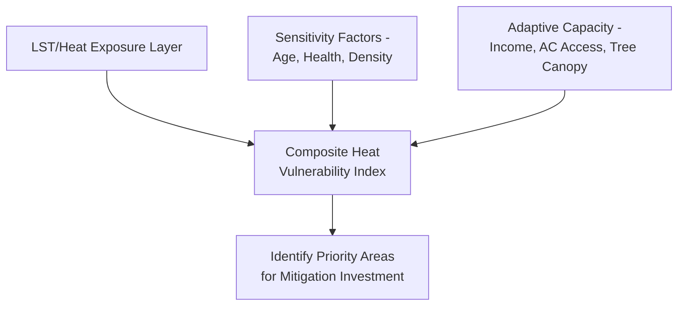

## Urban Heat Island Analysis

### Overview

Urban Heat Island (UHI) analysis quantifies and maps the phenomenon in which urban areas exhibit significantly higher temperatures than surrounding rural or vegetated areas, primarily due to impervious surface heat absorption, reduced vegetation, anthropogenic heat emissions, and urban canyon geometry effects on radiative heat loss. Geospatial UHI analysis combines thermal remote sensing, land surface temperature (LST) retrieval, and spatial statistical methods to characterize UHI intensity, identify vulnerable populations, and evaluate mitigation strategies (green infrastructure, cool roofs, tree canopy expansion).

**Key Points**

- UHI is typically characterized through two related but distinct measures: **surface UHI (SUHI)**, derived from satellite thermal imagery (land surface temperature), and **atmospheric/canopy-layer UHI**, measured via near-surface air temperature (station or mobile sensor data)—these do not always correlate perfectly in magnitude or spatial pattern.
- SUHI intensity is commonly quantified as the LST difference between urban and adjacent rural reference areas.
- UHI mitigation planning increasingly integrates equity analysis, since heat exposure often disproportionately affects lower-income and historically underserved neighborhoods with less tree canopy and more impervious surface.

### Surface vs. Atmospheric Urban Heat Island

| Aspect | Surface UHI (SUHI) | Atmospheric/Canopy UHI |
| --- | --- | --- |
| Data source | Thermal satellite imagery (Landsat TIRS, MODIS, ECOSTRESS) | Weather stations, mobile transects, IoT sensor networks |
| Spatial resolution | 30m–1km (sensor dependent) | Point-based, interpolated |
| Temporal resolution | Satellite overpass time (typically once or twice daily) | Continuous, if sensor network available |
| Typical magnitude | Often larger during daytime | Often larger at night (canopy layer heat retention) |
| Primary driver | Surface material albedo/emissivity | Heat storage release, reduced nighttime cooling, anthropogenic heat |

### Land Surface Temperature (LST) Retrieval

#### Single-Channel Algorithm (Landsat Thermal Bands)

LST is retrieved from thermal infrared brightness temperature after atmospheric and emissivity correction:

$$LST = \frac{T_B}{1 + \left(\frac{\lambda T_B}{\rho}\right) \ln \epsilon}$$

where $T_B$ is brightness temperature, $\lambda$ is the effective wavelength of the thermal band, $\rho = hc/\sigma$ (Planck's constant, speed of light, Boltzmann constant), and $\epsilon$ is land surface emissivity, typically derived from NDVI-based emissivity estimation methods.

**Key Points**

- Landsat 8/9 TIRS (Thermal Infrared Sensor) provides 100m native thermal resolution, resampled to 30m in standard products, offering the finest widely available thermal resolution suitable for intra-urban UHI analysis.
- MODIS LST products (1km resolution) provide twice-daily global coverage, better suited to regional-scale temporal trend analysis than fine-scale intra-city mapping.
- ECOSTRESS (ISS-mounted) provides variable-time-of-day thermal imagery at ~70m resolution, useful for capturing diurnal LST variation beyond fixed satellite overpass times.

**Example**

```python
import rasterio
import numpy as np

with rasterio.open("landsat_band10_TIRS.tif") as src:
    thermal_dn = src.read(1)

# Convert DN to radiance, then to brightness temperature (simplified)
radiance = ML * thermal_dn + AL  # ML, AL from Landsat metadata (MTL file)
K1, K2 = 774.8853, 1321.0789  # Landsat 8 Band 10 thermal constants
brightness_temp_k = K2 / np.log((K1 / radiance) + 1)
brightness_temp_c = brightness_temp_k - 273.15
```

#### Emissivity Correction via NDVI Thresholding

A common approach (NDVI Threshold Method / NDVITHM) classifies emissivity based on NDVI ranges: bare soil, mixed vegetation-soil, and full vegetation cover each assigned characteristic emissivity values, with a fraction-of-vegetation-cover weighting for mixed pixels:

$$P_V = \left(\frac{NDVI - NDVI_{min}}{NDVI_{max} - NDVI_{min}}\right)^2$$


$$\epsilon = \epsilon_v P_V + \epsilon_s (1 - P_V)$$

where $P_V$ is proportion of vegetation, and $\epsilon_v$, $\epsilon_s$ are vegetation and soil emissivity constants respectively.

### Quantifying UHI Intensity

#### Urban-Rural LST Differential

$$UHI_{intensity} = LST_{urban} - LST_{rural}$$

where $LST_{rural}$ is typically computed as the mean LST within a defined rural reference buffer or non-urban land cover mask surrounding the study area.

**Example**

```python
import geopandas as gpd
import rasterstats

urban_mask = gpd.read_file("urban_boundary.shp")
rural_ref = gpd.read_file("rural_reference_buffer.shp")

urban_lst = rasterstats.zonal_stats(urban_mask, "lst.tif", stats=["mean"])[0]["mean"]
rural_lst = rasterstats.zonal_stats(rural_ref, "lst.tif", stats=["mean"])[0]["mean"]

uhi_intensity = urban_lst - rural_lst
```

#### Zonal/Gradient Analysis

Transect-based or concentric-buffer analysis measures LST as a function of distance from the urban core, characterizing the spatial gradient/decay of the heat island effect outward from city center.


### Land Cover Drivers of UHI

**Key Points**

- **Impervious surface fraction**: strong positive correlation with LST; derived via spectral unmixing or classification of impervious surface percentage per pixel.
- **Tree canopy cover / NDVI**: strong negative correlation with LST due to evapotranspirative cooling and shading—commonly the primary mitigation lever in UHI reduction planning.
- **Albedo**: surface reflectivity affects absorbed solar radiation; dark surfaces (asphalt, dark roofing) absorb more energy and re-emit more longwave radiation, contributing to elevated LST relative to high-albedo surfaces.
- **Building density/urban canyon geometry**: affects sky view factor and radiative heat trapping, particularly relevant to nighttime atmospheric UHI persistence, though this driver is harder to derive from optical/thermal satellite data alone and often requires building footprint/height data (e.g., LiDAR-derived digital surface models).

#### Regression Analysis of UHI Drivers

$$LST = \beta_0 + \beta_1 \cdot NDVI + \beta_2 \cdot NDBI + \beta_3 \cdot \text{ImperviousFraction} + \epsilon$$

Geographically Weighted Regression (GWR) is commonly applied instead of global OLS regression to capture spatial non-stationarity in driver relationships—the strength of NDVI's cooling effect, for instance, often varies across a city depending on surrounding land use context. [Inference: the degree of spatial non-stationarity varies by study area and should be tested empirically, e.g., via comparison of GWR local R² against global OLS R².]

### Heat Vulnerability and Equity Analysis

Combines LST/UHI mapping with demographic and socioeconomic data to identify populations at elevated heat health risk:

**Key Points**

- **Heat vulnerability index (HVI)**: composite index typically combining LST/exposure, sensitivity factors (age, pre-existing health conditions, population density), and adaptive capacity factors (income, air conditioning access, tree canopy access) into a single spatial risk score.
- Studies in numerous US cities have documented that historically redlined neighborhoods (per 1930s HOLC maps) frequently exhibit measurably higher present-day LST than non-redlined areas, linked to disparities in tree canopy investment and impervious surface coverage. [Unverified: magnitude and consistency of this relationship vary by specific city and study methodology; consult current peer-reviewed literature for city-specific findings.]
- Nighttime heat exposure is particularly relevant to health outcomes since reduced nighttime cooling limits physiological heat recovery; atmospheric/canopy UHI data (rather than daytime SUHI alone) is more directly relevant to this dimension.



### UHI Mitigation Analysis

**Key Points**

- **Tree canopy targeting**: LST and vulnerability layers combined with available planting space (vacant lot, right-of-way analysis) to prioritize tree planting locations for maximum cooling and equity benefit.
- **Cool roof/pavement scenario modeling**: albedo modification scenarios can be simulated by substituting alternative albedo values into LST/energy balance models to estimate potential temperature reduction, though full physical energy balance modeling (e.g., via urban canopy models like ENVI-met or UWG) provides more rigorous quantification than simple albedo substitution.
- **Green infrastructure siting**: park and green space placement analysis often combines LST cooling potential with accessibility analysis (see Urban Spatial Analysis Fundamentals) to maximize both thermal and recreational/accessibility benefits from limited investment.

### Practical Workflow Summary

1. Acquire thermal satellite imagery appropriate to required spatial/temporal resolution (Landsat TIRS for intra-city detail, MODIS for regional trends, ECOSTRESS for diurnal variation).
2. Retrieve land surface temperature via brightness temperature conversion and NDVI-based emissivity correction.
3. Compute UHI intensity as urban-rural LST differential, and/or conduct gradient/transect analysis from urban core outward.
4. Regress LST against land cover drivers (NDVI, NDBI, impervious fraction), using GWR where spatial non-stationarity is suspected.
5. Combine LST/exposure data with demographic sensitivity and adaptive capacity data to construct a heat vulnerability index.
6. Identify mitigation priority areas by overlaying vulnerability index with available intervention opportunities (plantable space, cool roof candidate buildings).
7. Where atmospheric/nighttime heat exposure is the primary health concern, supplement satellite-derived SUHI with ground-based sensor or mobile transect data.

**Related Topics**

- Land Cover Classification Schemes
- Thermal Remote Sensing and LST Retrieval Methods
- Geographically Weighted Regression (GWR)
- Heat Vulnerability Index Construction
- Urban Tree Canopy Analysis and Green Infrastructure Planning
- Historical Redlining and Environmental Justice Mapping
- NDVI and Vegetation Index Applications
- Urban Spatial Analysis Fundamentals