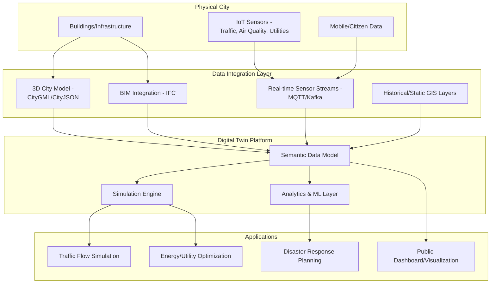
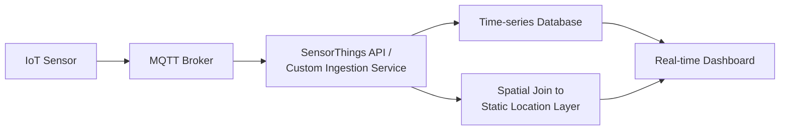

## Smart City and Digital Twin Applications


### Overview

Smart city and digital twin applications integrate real-time sensor data, 3D city models, and IoT infrastructure with geospatial platforms to create dynamic, queryable representations of urban systems for monitoring, simulation, and decision support. A digital twin extends beyond static 3D visualization by maintaining a live, bidirectional link between the physical city and its digital representation, enabling simulation of interventions before physical implementation. This domain draws on 3D GIS, sensor networks, BIM (Building Information Modeling) integration, and semantic data standards to unify traditionally siloed urban datasets.

**Key Points**

- A digital twin is distinguished from a conventional 3D city model by its **live data connection** and **bidirectional feedback loop**—a static 3D model shows form; a digital twin reflects current state and supports what-if simulation.
- Standard 3D city data exchange relies primarily on CityGML/CityJSON for semantic 3D geometry and IFC for building-level BIM integration.
- Smart city platforms typically layer real-time IoT sensor streams (traffic, air quality, utility usage) atop a static 3D/semantic base model, requiring both geospatial and time-series data infrastructure.

### Digital Twin Architecture



### 3D City Model Standards

#### CityGML

An OGC standard for representing 3D city models with semantic attribution (not just geometry), defining objects (buildings, vegetation, transportation, water bodies) at multiple **Levels of Detail (LOD)**:

| LOD | Description |
| --- | --- |
| LOD0 | 2D footprint/regional overview |
| LOD1 | Block-shaped extrusion (flat roof, no detail) |
| LOD2 | Differentiated roof structures |
| LOD3 | Architectural detail (windows, doors, facades) |
| LOD4 | Interior spaces included |

**Key Points**

- CityGML's semantic model allows attributes beyond geometry (building energy demand class, construction year, usage type) to be encoded directly in the model, supporting analytical queries not possible with purely visual 3D mesh formats.
- CityJSON is a more compact, developer-friendly JSON-based encoding of the same semantic data model, increasingly preferred over XML-based CityGML for web-based and programmatic workflows due to simpler parsing and smaller file sizes.

**Example**

```python
import cjio

model = cjio.cityjson.load("city_model.city.json")
buildings = model.get_cityobjects(type="Building")

for bid, building in buildings.items():
    height = building.attributes.get("measuredHeight")
    year_built = building.attributes.get("yearOfConstruction")
```

#### IFC (Industry Foundation Classes) and BIM Integration

IFC is the standard schema for Building Information Models, providing detailed individual-building geometry and systems data (structural, mechanical, electrical) typically at a finer granularity than city-scale CityGML models. Digital twin platforms increasingly integrate IFC (building-level detail) with CityGML/CityJSON (city-scale context) via conversion pipelines or federated data models, since neither format alone spans both the individual-building fidelity of BIM and the city-wide semantic context of urban GIS.

### Real-Time Sensor Integration

#### IoT Data Ingestion Architecture

**Key Points**

- **Message brokers** (MQTT, Apache Kafka) handle high-frequency sensor data ingestion from distributed IoT devices (traffic counters, air quality monitors, smart utility meters), decoupling data producers from consuming analytics/storage systems.
- **Time-series databases** (InfluxDB, TimescaleDB) store high-frequency sensor readings efficiently, typically linked to static spatial location via a foreign key/spatial join to the 3D/GIS base layer rather than storing geometry directly in the time-series record.
- **OGC SensorThings API** provides a standardized REST/MQTT interface specifically designed for IoT sensor observation data in a spatially and semantically interoperable format, increasingly adopted as the OGC standard bridge between IoT platforms and geospatial systems.



**Example: OGC SensorThings API query pattern**

```python
import requests

response = requests.get(
    "https://smartcity.example.gov/SensorThingsAPI/v1.1/Things",
    params={"$expand": "Locations,Datastreams/Observations"}
)
sensors = response.json()["value"]
```

### Simulation and Analytics Applications

#### Traffic Flow Simulation

Digital twins integrate live traffic sensor data (loop detectors, camera-based counts, GPS probe data) with network simulation models (see Transportation and Accessibility Planning) to simulate congestion propagation, evaluate signal timing changes, or model the impact of road closures before physical implementation—commonly implemented via microscopic traffic simulators (SUMO, VISSIM) fed by live and historical sensor data.

#### Energy and Utility Optimization

Building-level energy consumption data (from smart meters) combined with CityGML building attributes (construction year, floor area, usage type) enables district-scale energy demand modeling and identification of retrofit priority buildings—a common application domain sometimes termed "urban energy digital twins."

#### Disaster Response and Resilience Planning

3D digital twins combined with hazard models (flood inundation, seismic shake maps, wildfire spread) enable pre-event scenario simulation and, during active events, real-time situational awareness by overlaying live sensor/incident data onto the 3D base model for emergency operations centers.

$$\text{Flood Depth}(x,y) = \max(0, \, WSE(x,y) - DEM(x,y))$$

where $WSE$ is water surface elevation from a hydraulic model and $DEM$ is the digital elevation model, a standard approach for deriving flood extent/depth rasters combinable with the 3D building model to assess structure-level flood exposure.

### Data Platform Architecture Patterns

**Key Points**

- **Federated vs. centralized data models**: many smart city platforms federate data from multiple agency-owned systems (transportation, utilities, planning) via API integration rather than centralizing all data into a single database, reducing data duplication and governance friction but requiring robust API standardization (see Data Sharing, Licensing, and Governance).
- **Digital twin platforms** (examples include Cesium ion, ESRI ArcGIS Urban/CityEngine workflows, and open-source stacks combining CesiumJS with PostGIS/GeoServer) provide the rendering and query layer atop the underlying semantic and sensor data infrastructure.
- **Web-based 3D rendering**: CesiumJS and similar WebGL-based engines render large-scale 3D city models and terrain in-browser using tiled 3D formats (3D Tiles, an OGC community standard) optimized for streaming massive geometry datasets without requiring full local download.

```python
# Example: converting CityJSON to 3D Tiles for web streaming (conceptual pipeline)
# Typical tools: py3dtiles, Cesium ion asset pipeline, or FME-based conversion
```

### Privacy and Governance Considerations

**Key Points**

- Sensor networks capturing pedestrian/vehicle movement data raise privacy considerations requiring aggregation, anonymization, or differential privacy techniques before public dashboard exposure, particularly for camera-derived or mobile-device-derived location data.
- Digital twin platforms integrating multiple agency data sources inherit the licensing and governance complexity discussed under Data Sharing, Licensing, and Governance—access tiering (public dashboard vs. internal planning access) is a common architectural requirement rather than an afterthought.
- Long-term platform sustainability (funding for sensor maintenance, data pipeline upkeep) is a recognized practical challenge distinct from the technical architecture itself. [Inference: the scale of this sustainability challenge varies significantly by municipal budget and governance capacity and is not uniformly documented across implementations.]

### Practical Workflow Summary

1. Establish a 3D semantic base model using CityGML or CityJSON at the LOD appropriate to application needs (LOD1/2 for city-scale visualization, LOD3/4 or IFC integration for building-specific analysis).
2. Design an IoT ingestion pipeline using message brokers (MQTT/Kafka) and, where standardization is prioritized, the OGC SensorThings API.
3. Store high-frequency sensor observations in a time-series database, spatially linked to the static base model via location reference rather than embedded geometry.
4. Select or build a web-based 3D rendering platform (CesiumJS/3D Tiles or commercial equivalent) for public/internal visualization.
5. Layer simulation capabilities (traffic, flood, energy) atop the integrated data model for scenario testing and decision support.
6. Apply appropriate privacy safeguards (aggregation, anonymization) to any sensor data capturing individual movement patterns before public exposure.
7. Define access tiers and governance policy for multi-agency data federation, consistent with broader data governance practice.

**Related Topics**

- Data Sharing, Licensing, and Governance
- Transportation and Accessibility Planning
- 3D GIS and CityGML/CityJSON Data Modeling
- OGC SensorThings API and IoT Standards
- Flood Modeling and Hazard Mapping
- BIM-GIS Integration (IFC to CityGML Workflows)
- Web-Based 3D Visualization (CesiumJS, 3D Tiles)
- Urban Heat Island Analysis