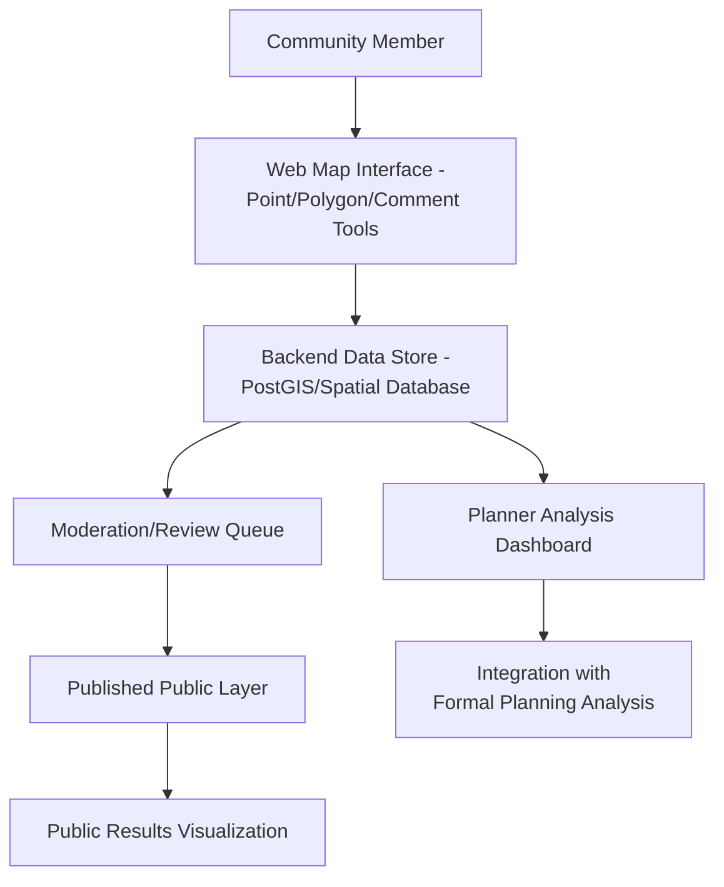
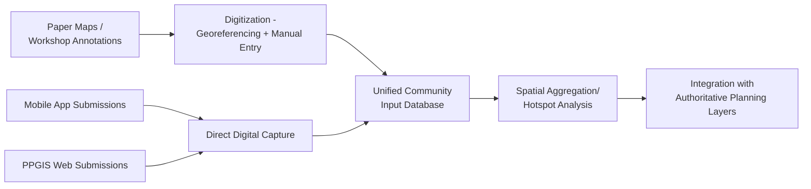

## Participatory GIS in Planning

### Overview

Participatory GIS (PGIS) integrates community input, local knowledge, and stakeholder engagement directly into geospatial data collection, analysis, and decision-making processes for urban and regional planning. Unlike conventional top-down GIS analysis conducted solely by technical experts, PGIS explicitly designs workflows to capture non-expert spatial knowledge—lived experience, place attachment, perceived safety, informal land use—that is often absent from authoritative administrative datasets, and to make planning analysis accessible and interpretable to the communities it affects.

**Key Points**

- PGIS is distinguished from standard "public engagement" by its explicit focus on *spatial* data collection and representation, not just general opinion gathering—outputs are maps, not only survey summaries.
- Common technical implementations include public participation GIS (PPGIS) web mapping tools, mobile crowdsourced data collection, and community mapping workshops using both digital and paper-based methods.
- A recurring methodological concern is the **digital divide**: online-only PGIS tools systematically underrepresent populations with limited internet access, smartphone ownership, or digital literacy, requiring hybrid digital/in-person methods for representative participation.

### PGIS vs. Conventional Planning GIS

| Aspect | Conventional Planning GIS | Participatory GIS |
| --- | --- | --- |
| Data source | Authoritative administrative/survey data | Community-contributed spatial knowledge |
| Analyst role | Technical expert-driven | Facilitated, community co-produced |
| Typical inputs | Parcels, zoning, census, infrastructure | Perceived safety, informal uses, place values, local hazards |
| Output audience | Planners, technical staff | Planners AND community members (bidirectional) |
| Validation approach | Positional/attribute accuracy standards | Community consensus, ground-truthing with lived experience |

### Public Participation GIS (PPGIS) Web Platforms

#### Core Architecture



**Key Points**

- PPGIS platforms typically allow participants to place point markers, draw areas, or annotate existing map features with categorized attributes (e.g., "feels unsafe," "wants more trees," "informal gathering space") plus free-text comments.
- A moderation/review layer is standard practice before public display, to filter spam, off-topic submissions, or personally identifying information, while preserving the substantive spatial input.
- Common open-source and commercial platforms include Maptionnaire, Bang the Table/EngagementHQ, ArcGIS Hub/StoryMaps participatory widgets, and custom Leaflet/Mapbox GL-based tools.

**Example: Simplified PPGIS submission schema**

```python
# PostGIS table schema for community input
"""
CREATE TABLE community_input (
    id SERIAL PRIMARY KEY,
    geom GEOMETRY(Point, 4326),
    category VARCHAR(50),  -- e.g., 'safety_concern', 'green_space_request'
    comment TEXT,
    submitted_at TIMESTAMP DEFAULT NOW(),
    moderation_status VARCHAR(20) DEFAULT 'pending'
);
"""
```

### Mobile and Field-Based Data Collection

**Key Points**

- Mobile data collection apps (e.g., ESRI Survey123, KoboToolbox, Fulcrum, OpenDataKit/ODK) enable structured, geotagged field data collection by community members or trained local surveyors, particularly valuable for informal settlement mapping and rapid participatory hazard assessment.
- **Community-led mapping** initiatives (notably associated with the Missing Maps/Humanitarian OpenStreetMap Team model) train local volunteers to map their own neighborhoods directly into OpenStreetMap, producing both usable planning data and local capacity building as co-benefits.
- Offline-capable data collection tools are important in areas with unreliable connectivity, syncing collected data once connectivity is available rather than requiring continuous internet access during fieldwork.

### Community Mapping Workshops

Facilitated in-person sessions where participants collaboratively produce maps using paper base maps with overlay annotation, sticky-note/marker exercises, or tablet-based digital tools guided by a facilitator—valuable for reaching populations underserved by purely digital PPGIS tools and for enabling richer, discussion-based knowledge capture than asynchronous online submission alone.

**Example workshop techniques:**

- **Mental mapping**: participants freehand-sketch their neighborhood from memory, revealing perceived boundaries, landmarks, and cognitive spatial structure that may differ from administrative boundaries.
- **Asset and concern mapping**: participants place markers on printed base maps indicating valued community assets versus areas of concern (safety, maintenance, environmental hazard).
- **Transect walks**: guided walking routes through a neighborhood with structured observation and annotation at defined stops, combining direct observation with spatial data capture.

### Digitizing and Integrating Community Input



**Example**

```python
import geopandas as gpd
from shapely.geometry import Point

# Merge community input from multiple collection channels into unified schema
ppgis_data = gpd.read_file("ppgis_web_submissions.geojson")
mobile_data = gpd.read_file("kobotoolbox_export.geojson")
digitized_workshop = gpd.read_file("workshop_digitized.geojson")

unified = gpd.GeoDataFrame(
    pd.concat([ppgis_data, mobile_data, digitized_workshop], ignore_index=True)
)
unified["source_type"] = unified["source_type"].fillna("unspecified")
```

### Analyzing Participatory Data

#### Aggregation and Hotspot Identification

Point-based community input (e.g., safety concerns) can be aggregated via kernel density estimation or hot spot analysis (Getis-Ord Gi*, see Urban Spatial Analysis Fundamentals) to identify areas of concentrated community concern, providing a spatially explicit complement to purely qualitative comment review.

#### Sentiment and Category Analysis

Free-text comments accompanying spatial submissions are commonly coded into categories (manually or via text classification) to allow quantitative summarization alongside the spatial pattern, and may be cross-tabulated against submission location to identify geographically clustered themes.

**Caution**: aggregating and mapping community-submitted concerns without corroborating validation can risk amplifying vocal minority viewpoints or unrepresentative participation patterns as if they reflect broader community consensus; sample representativeness relative to the underlying population should be assessed, not assumed. [Inference: the degree of representativeness bias depends heavily on outreach methodology and participation barriers specific to each engagement effort.]

### Equity and Representativeness Considerations

**Key Points**

- **Digital divide bias**: online PPGIS participation typically skews toward younger, higher-income, and more digitally literate populations unless deliberately supplemented with in-person and non-digital outreach channels.
- **Language accessibility**: multilingual interface and outreach materials are necessary for representative participation in linguistically diverse communities, and are frequently identified as a gap in PGIS tool design. [Unverified: the extent of this gap varies substantially by platform and jurisdiction; assess against current platform capabilities.]
- **Trust and prior engagement history**: communities with historical experience of extractive or non-responsive government engagement (input collected but not visibly acted upon) may show lower participation rates; PGIS practice increasingly emphasizes closing the feedback loop—visibly showing how community input informed final planning decisions—to sustain long-term trust and participation.
- **Power dynamics in facilitation**: workshop-based methods require attentive facilitation to avoid dominant voices overshadowing quieter participants, a recognized methodological concern in participatory research more broadly, not unique to the spatial data collection component.

### Integrating PGIS Output into Formal Planning Analysis

**Key Points**

- Community-identified spatial concerns are commonly overlaid with authoritative planning layers (zoning, infrastructure condition, demographic data) to identify where community-perceived issues align with or diverge from technical/administrative assessments—divergence itself is often analytically valuable, highlighting gaps in official data.
- PGIS-derived data can supplement conventional suitability analysis (see Zoning and Land Use Planning) as an additional weighted criterion layer, though methodologically this requires converting qualitative/categorical community input into a comparably scaled quantitative layer, a non-trivial step requiring documented, transparent methodology.
- Reporting back results to participating communities (dashboards, public meetings, published summary maps) is considered standard good practice for maintaining engagement legitimacy, distinct from the technical data collection and analysis steps themselves.

### Practical Workflow Summary

1. Design a multi-channel data collection strategy (PPGIS web platform, mobile field collection, in-person workshops) to mitigate digital divide bias.
2. Establish a moderation and privacy review process before publishing community-submitted spatial data.
3. Digitize and unify inputs from all collection channels into a common spatial schema.
4. Apply spatial aggregation methods (KDE, hot spot analysis) to identify concentration patterns in community input, alongside qualitative comment coding.
5. Assess participation representativeness relative to the study area's demographic composition before treating results as broadly representative community consensus.
6. Integrate community input as an explicit layer in formal suitability or planning analysis, documenting the methodology for converting qualitative input into comparable spatial criteria.
7. Close the feedback loop by reporting back to participants how their input informed final planning outcomes.

**Related Topics**

- Urban Spatial Analysis Fundamentals
- Zoning and Land Use Planning
- Data Sharing, Licensing, and Governance
- Crowdsourced Geospatial Data Quality Assessment
- OpenStreetMap and Humanitarian Mapping (HOT)
- Environmental Justice and Equity Mapping
- Mobile Field Data Collection Tools (ODK, KoboToolbox, Survey123)
- Smart City and Digital Twin Applications