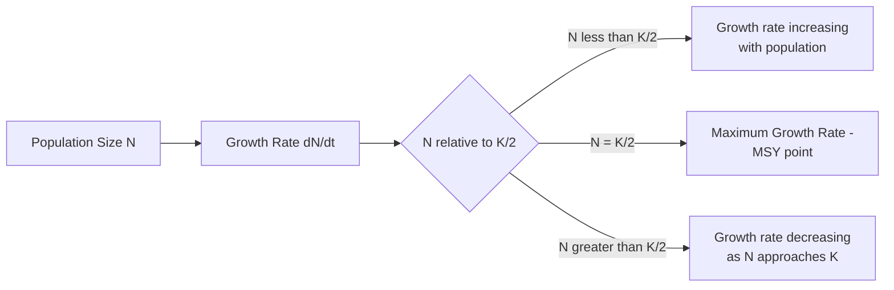
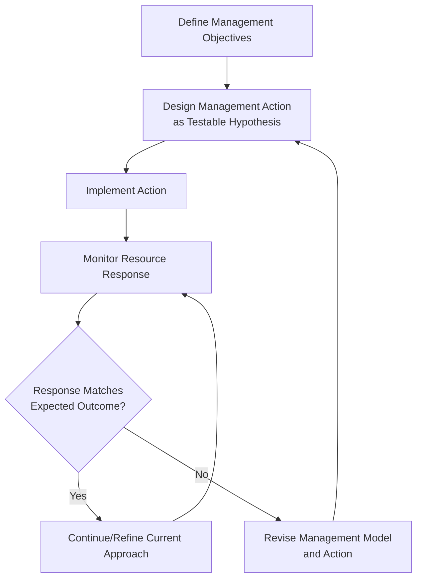

## Principles of Sustainable Resource Management


### Overview

Sustainable resource management is the framework and practice of using natural resources (forests, water, fisheries, minerals, soil, rangeland) at rates and in ways that maintain their long-term availability, ecological function, and productive capacity for present and future use. It integrates ecological carrying capacity, economic valuation, and governance systems to balance extraction/use against regeneration or replenishment rates. Geospatial tools underpin nearly all modern sustainable resource management by enabling spatial monitoring of resource stocks, extraction patterns, and ecosystem condition over time.

**Key Points**

- Sustainability in resource management is formally defined through the concept of **Maximum Sustainable Yield (MSY)** and its extensions, balancing harvest/extraction rate against natural regeneration rate.
- Resources are classified as renewable, non-renewable, or flow resources, each requiring fundamentally different management logic.
- Modern sustainable resource management increasingly incorporates **ecosystem services valuation** and **adaptive management** frameworks rather than static fixed-yield targets, reflecting recognition that ecological systems are dynamic and imperfectly understood.

### Resource Classification

| Type | Definition | Examples | Management Implication |
| --- | --- | --- | --- |
| Renewable (flow-limited) | Regenerates over human timescales if not overexploited | Forests, fisheries, groundwater, wildlife | Harvest must not exceed regeneration rate |
| Non-renewable | Finite stock, effectively no regeneration on human timescales | Minerals, fossil fuels | Management focuses on efficient use, substitution, recycling |
| Flow resources | Continuously available regardless of use rate | Solar radiation, wind, tidal energy | Management focuses on capture efficiency, not depletion |
| Common-pool resources | Non-excludable, subtractable (rivalrous) | Open-ocean fisheries, groundwater aquifers, grazing commons | Prone to overexploitation absent governance (see below) |

### Maximum Sustainable Yield (MSY) Theory

For renewable resources following logistic population growth, MSY represents the theoretical harvest rate that can be sustained indefinitely without depleting the resource stock, occurring at the population size where growth rate is maximized:

$$\frac{dN}{dt} = rN\left(1 - \frac{N}{K}\right) - H$$

where $N$ is stock size, $r$ is intrinsic growth rate, $K$ is carrying capacity, and $H$ is harvest rate. MSY occurs at $N = K/2$ under this simple logistic model, yielding:

$$MSY = \frac{rK}{4}$$

**Key Points**

- MSY theory has well-documented limitations: it assumes a stable, well-characterized single-species population dynamic, ignores multi-species interactions, environmental stochasticity, and age/size structure effects—real-world fisheries and wildlife management increasingly use more complex age-structured or ecosystem-based models rather than pure logistic MSY. [Inference: the degree to which simple MSY is still used operationally varies substantially by jurisdiction and resource type; many fisheries management bodies have shifted toward more conservative or precautionary reference points partly in response to these known limitations.]
- **Precautionary approach**: given uncertainty in $r$ and $K$ estimation, many management frameworks now target harvest levels below theoretical MSY (e.g., a defined percentage buffer) to reduce collapse risk from parameter estimation error.



### Common-Pool Resource Governance

#### The Tragedy of the Commons

Garrett Hardin's classical framing describes the tendency for individually rational resource users to overexploit a shared, non-excludable resource, since each user captures the full benefit of their own extraction while bearing only a fraction of the collective depletion cost.

**Key Points**

- Elinor Ostrom's subsequent empirical research (leading to her 2009 Nobel Memorial Prize in Economic Sciences) documented numerous real-world cases where communities successfully self-governed common-pool resources without either privatization or centralized state control, identifying a set of institutional design principles associated with successful long-term common-pool resource governance (clearly defined boundaries, congruence between rules and local conditions, collective-choice arrangements, monitoring, graduated sanctions, conflict resolution mechanisms, and nested governance).
- Geospatial tools support common-pool resource governance by enabling boundary definition/monitoring (a foundational Ostrom design principle), remote monitoring of extraction/compliance, and shared visualization of resource condition among stakeholder groups.

### Ecosystem Services Framework

Sustainable resource management increasingly incorporates the broader value of ecosystem services beyond direct extractive resource value, following the Millennium Ecosystem Assessment categorization:

| Category | Examples | Geospatial Assessment Method |
| --- | --- | --- |
| Provisioning | Timber, fish, freshwater, food crops | Yield mapping, resource stock assessment |
| Regulating | Carbon sequestration, water filtration, flood control | Land cover-based modeling (e.g., InVEST models) |
| Supporting | Soil formation, nutrient cycling, pollination | Habitat quality/connectivity modeling |
| Cultural | Recreation, spiritual/aesthetic value | Social values mapping, visitor use surveys |

**Example**

```python
# Conceptual InVEST-style ecosystem service valuation workflow
import numpy as np
import rasterio

with rasterio.open("landcover.tif") as src:
    landcover = src.read(1)

# Assign carbon storage coefficients per land cover class (t C/ha)
carbon_coefficients = {1: 120, 2: 45, 3: 5, 4: 0}  # forest, shrub, cropland, urban
carbon_map = np.vectorize(carbon_coefficients.get)(landcover)
total_carbon_tons = np.nansum(carbon_map) * pixel_area_ha
```

### Adaptive Management Framework

Given inherent uncertainty in ecological dynamics, adaptive management treats resource management decisions as testable hypotheses within an iterative monitoring-and-adjustment cycle rather than fixed prescriptions.



**Key Points**

- Adaptive management explicitly requires a monitoring program capable of detecting management-relevant change, which is where remote sensing time-series (see Change Detection and Monitoring Techniques) frequently provides the operational monitoring backbone.
- **Passive adaptive management** adjusts based on observed outcomes of standard practice; **active adaptive management** deliberately structures management interventions (sometimes including controlled variation across management units) explicitly to generate learning, though active approaches are more resource- and risk-intensive to implement. [Inference: the relative prevalence of active vs. passive adaptive management approaches varies by agency capacity and resource type and is not uniformly documented.]

### Spatial Resource Assessment Methods

#### Carrying Capacity Estimation

For rangeland/grazing management, forestry, and wildlife management, carrying capacity is commonly estimated by combining productivity models (e.g., NPP from remote sensing, see Principles of Ecology) with species-specific resource requirement coefficients:

$$K = \frac{\text{Available Forage/Resource Production}}{\text{Per-capita Resource Requirement}}$$

#### Stock Assessment via Remote Sensing and Field Sampling Integration

**Key Points**

- Forest inventory increasingly combines wall-to-wall remote sensing (LiDAR-derived canopy height/biomass models, satellite-derived forest type classification) with statistically designed field plot sampling to calibrate and validate biomass/volume estimates—a hybrid approach generally providing more reliable estimates than either method alone. [Inference: the relative accuracy gain from hybrid approaches versus field-only inventory is study- and forest-type-specific.]
- Fisheries stock assessment traditionally relies on catch data, survey trawls, and population models rather than direct remote sensing (since fish stocks are not directly observable from satellites), though satellite-derived sea surface temperature, chlorophyll concentration, and vessel tracking (AIS data) increasingly supplement traditional assessment as environmental and effort covariates.

### Multi-Criteria and Trade-off Analysis

Sustainable resource management frequently requires balancing competing objectives (economic yield, biodiversity conservation, community livelihood, carbon storage) rather than optimizing a single metric, commonly addressed via multi-objective optimization or scenario comparison:

$$U = \sum_{i=1}^{n} w_i \cdot O_i$$

where $O_i$ represents normalized outcome scores across objectives (yield, biodiversity, carbon, etc.) and $w_i$ are stakeholder-derived weights, conceptually similar to the multi-criteria suitability framework used in land use planning (see Zoning and Land Use Planning) but applied to management scenario comparison rather than site selection.

### Certification and Standards-Based Management

**Key Points**

- Third-party certification systems (Forest Stewardship Council/FSC for forestry, Marine Stewardship Council/MSC for fisheries) establish standardized sustainability criteria verified through independent auditing, increasingly requiring geospatial documentation (management unit boundaries, harvest block mapping, high-conservation-value area delineation) as part of the certification evidence base.
- Chain-of-custody tracking (verifying certified resource origin through supply chains) increasingly relies on geospatial traceability tools, including satellite-based monitoring of harvest locations against certified management unit boundaries to detect potential non-compliant sourcing. [Inference: the specific technical implementation and rigor of geospatial chain-of-custody verification varies across certification bodies and supply chains.]

### Practical Workflow Summary

1. Classify the resource type (renewable, non-renewable, flow, common-pool) to determine the appropriate management framework.
2. Where applicable, estimate sustainable yield/carrying capacity using productivity data, incorporating precautionary buffers given parameter uncertainty.
3. Assess common-pool governance requirements (boundary definition, monitoring capacity, sanctioning mechanisms) if the resource is non-excludable and rivalrous.
4. Incorporate ecosystem services valuation beyond direct extractive value where feasible, using established modeling frameworks (e.g., InVEST).
5. Design a monitoring program capable of detecting management-relevant change, integrating remote sensing time-series with field validation.
6. Structure management as an adaptive, iterative process with explicit hypothesis testing and monitoring feedback rather than a fixed static prescription.
7. Where relevant, align management documentation with certification standards requiring geospatial traceability and management unit mapping.

**Related Topics**

- Change Detection and Monitoring Techniques
- Principles of Ecology
- Forest Biomass and Carbon Stock Estimation (LiDAR-based)
- Ecosystem Services Modeling (InVEST Framework)
- Fisheries Stock Assessment and Marine Spatial Planning
- Watershed and Water Resource Management
- Common-Pool Resource Governance (Ostrom Design Principles)
- Rangeland and Grazing Capacity Modeling