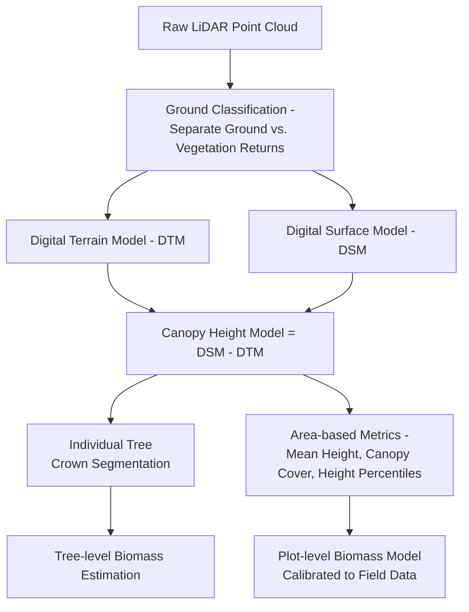
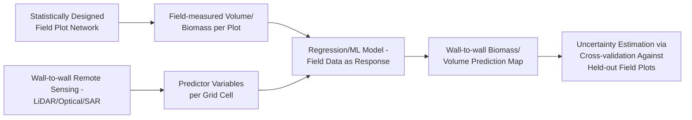

## Forest Resource Assessment

### Overview

Forest resource assessment is the systematic measurement and estimation of forest attributes—area extent, species composition, biomass, volume, growth rate, and health condition—using a combination of field inventory and remote sensing methods. Modern forest assessment integrates traditional plot-based statistical sampling with wall-to-wall remote sensing data (optical, LiDAR, SAR) to produce spatially explicit, statistically defensible estimates supporting timber management, carbon accounting, biodiversity monitoring, and disturbance tracking.

**Key Points**

- Forest assessment combines two complementary approaches: **field inventory** (statistically sampled plots providing ground-truth measurements) and **remote sensing** (wall-to-wall spatial coverage), each compensating for the other's core limitation—field plots are accurate but spatially sparse; remote sensing is spatially complete but requires calibration against ground measurements.
- Core forest metrics include stand area, tree density, basal area, volume, biomass/carbon stock, canopy height, and species composition.
- LiDAR (airborne and increasingly spaceborne) has become the primary remote sensing tool for structural forest attributes (height, canopy structure, biomass) due to its direct 3D measurement capability, complementing optical imagery's strength in species/cover classification.

### Field Inventory Methods

#### Sampling Design

Forest inventories rely on statistically designed sampling rather than exhaustive field measurement, most commonly using systematic or stratified random sampling of fixed-area or variable-radius plots across the forest management unit.

| Design | Description | Typical Use |
| --- | --- | --- |
| Simple random sampling | Plots randomly located across the study area | Small, homogeneous stands |
| Systematic sampling | Plots on a regular grid | Most common operational approach |
| Stratified random sampling | Plots allocated proportionally within pre-defined strata (e.g., forest type, age class) | Heterogeneous forests, improves precision |
| Two-phase (double) sampling | Large remote-sensing-based sample, small field-measured subsample for calibration | Modern hybrid inventory (used with LiDAR) |

#### Core Plot Measurements

**Key Points**

- **Diameter at Breast Height (DBH)**: tree diameter measured at 1.3m (or 1.37m in some national standards) above ground, the fundamental input to most volume and biomass equations.
- **Tree height**: measured via clinometer, hypsometer, or increasingly LiDAR-derived canopy height models for individual tree extraction.
- **Basal area**: cross-sectional area of a tree trunk at breast height, commonly summed per unit area as a stand density measure:

$$BA = \frac{\pi \cdot DBH^2}{4}$$

expressed per hectare as $m^2/ha$ when summed across all trees in a plot and scaled by plot area.

#### Volume and Biomass Equations

Tree-level volume is estimated via allometric equations relating DBH (and often height) to stem volume, typically species-specific and regionally calibrated:

$$V = a \cdot DBH^b \cdot H^c$$

where $a$, $b$, $c$ are empirically fitted species-specific coefficients, and $H$ is tree height.

Above-ground biomass (AGB) follows a similar allometric approach, commonly using pantropical or regional allometric equations (e.g., Chave et al. equations widely used for tropical forests):

$$AGB = \exp\left(a + b \ln(DBH) + c \ln(H) + d \ln(\rho)\right)$$

where $\rho$ is wood density, a species-specific input parameter.

**Caution**: allometric equations are calibrated on specific species, size ranges, and geographic regions; applying an equation outside its calibration range (e.g., a temperate equation to tropical species, or extrapolating beyond the measured DBH range) introduces potentially substantial bias. [Inference: the magnitude of extrapolation bias is equation- and context-specific and is best assessed against the original calibration study's documented valid range.]

### Remote Sensing-Based Forest Assessment

#### Optical Remote Sensing

Multispectral and hyperspectral imagery supports forest type classification, canopy cover estimation, and health/stress monitoring via vegetation indices (NDVI, EVI, and specialized indices like the Normalized Burn Ratio for fire damage assessment).

```python
import rasterio
import numpy as np

with rasterio.open("sentinel2_nir.tif") as nir_src, rasterio.open("sentinel2_red.tif") as red_src:
    nir = nir_src.read(1).astype(float)
    red = red_src.read(1).astype(float)

ndvi = (nir - red) / (nir + red)
canopy_cover_proxy = np.clip((ndvi - 0.2) / (0.8 - 0.2), 0, 1)  # simplified linear scaling
```

#### LiDAR-Based Structural Assessment

Airborne LiDAR provides direct 3D point cloud measurement of canopy structure, enabling derivation of canopy height models (CHM), individual tree crown delineation, and structurally-based biomass estimation without requiring purely allometric extrapolation from 2D imagery.



**Example**

```python
import laspy
import numpy as np

las = laspy.read("forest_plot.las")
ground_mask = las.classification == 2  # standard LAS ground classification code

# Simplified canopy height calculation
ground_z = np.median(las.z[ground_mask])
canopy_heights = las.z[~ground_mask] - ground_z
canopy_height_95th = np.percentile(canopy_heights, 95)
```

**Key Points**

- **Area-based approach (ABA)**: derives statistical metrics (height percentiles, canopy cover, point density ratios) from LiDAR point clouds within grid cells or plot footprints, then regresses these metrics against field-measured biomass/volume from a subsample of ground plots to build a predictive model applicable across the full LiDAR coverage—the dominant operational approach for large-area LiDAR-based forest inventory.
- **Individual Tree Detection (ITD)**: segments individual tree crowns directly from the point cloud or canopy height model, providing tree-level (rather than plot-average) estimates, but with accuracy that typically degrades in dense, multi-layered canopy conditions where crown delineation becomes ambiguous. [Inference: ITD accuracy is strongly forest-structure-dependent and is generally reported as higher in even-aged coniferous stands than in complex multi-layered tropical or mixed forests.]

#### Spaceborne LiDAR

**Example**

NASA's GEDI (Global Ecosystem Dynamics Investigation) mission, mounted on the International Space Station, provides spaceborne full-waveform LiDAR sampling (not wall-to-wall coverage, but a dense sample of footprints) specifically designed for large-scale canopy height and biomass estimation between approximately 51.6°N and 51.6°S latitude, widely used as a calibration/extension data source for regional and global biomass mapping when combined with wall-to-wall optical or SAR data.

#### SAR-Based Biomass Estimation

Radar backscatter, particularly at longer wavelengths (L-band, P-band), correlates with forest biomass due to signal penetration and interaction with woody structure, though this relationship tends to saturate at higher biomass levels (backscatter becomes insensitive to further biomass increases beyond a threshold), limiting SAR's standalone utility in dense, high-biomass forests without combination with LiDAR or optical data. [Inference: the specific saturation threshold varies by wavelength, forest type, and structural characteristics and should be verified against current mission-specific literature, e.g., for newer missions such as NISAR and BIOMASS designed to address this limitation.]

### Forest Health and Disturbance Assessment

**Key Points**

- **Normalized Burn Ratio (NBR)**: used for fire severity assessment, comparing pre- and post-fire NIR/SWIR reflectance:

$$NBR = \frac{NIR - SWIR}{NIR + SWIR}$$


$$dNBR = NBR_{pre-fire} - NBR_{post-fire}$$

with higher dNBR values indicating greater burn severity, commonly classified into standard severity classes (unburned, low, moderate, high) following USGS/Forest Service thresholds.

- **Bark beetle and disease detection**: hyperspectral and multi-temporal optical time series can detect early-stage canopy stress (red-edge shifts, reduced chlorophyll signal) sometimes preceding visible crown discoloration, supporting earlier intervention than visual aerial survey alone. [Unverified: detection lead-time claims vary across specific studies, pest species, and sensor configurations; consult current peer-reviewed literature for specific performance figures.]
- **Defoliation and canopy gap mapping**: time-series NDVI or LiDAR canopy cover comparison between dates identifies canopy loss consistent with insect defoliation, wind-throw, or other non-stand-replacing disturbance distinct from clear-cut harvest signatures.

### Forest Inventory Data Standards and Reporting

| Framework | Purpose |
| --- | --- |
| National Forest Inventory (NFI) programs | Country-level statistically designed systematic inventory (e.g., US Forest Inventory and Analysis/FIA program) |
| FAO Forest Resources Assessment (FRA) | Global forest reporting framework, aggregating national data for international comparison |
| REDD+ MRV (Measurement, Reporting, Verification) | Carbon-focused forest monitoring framework under UNFCCC, requiring biomass/carbon stock change estimation with defined uncertainty reporting |

### Integrating Field and Remote Sensing Data



**Example**

```python
from sklearn.ensemble import RandomForestRegressor
from sklearn.model_selection import cross_val_score

# Predictors from LiDAR area-based metrics; response from field-measured biomass
X = lidar_metrics[["height_p95", "canopy_cover", "height_mean", "point_density_ratio"]]
y = field_plots["biomass_mg_ha"]

model = RandomForestRegressor(n_estimators=500)
scores = cross_val_score(model, X, y, cv=10, scoring="neg_root_mean_squared_error")
model.fit(X, y)

wall_to_wall_biomass = model.predict(full_coverage_lidar_grid)
```

### Practical Workflow Summary

1. Design a statistically defensible field plot sampling scheme (systematic, stratified, or two-phase) appropriate to forest heterogeneity and assessment objectives.
2. Collect core field measurements (DBH, height, species) and apply appropriate, regionally/species-calibrated allometric equations for volume and biomass.
3. Acquire remote sensing data matched to assessment needs—LiDAR for structural/biomass estimation, optical for classification and health monitoring, SAR for regions with LiDAR access constraints (with awareness of biomass saturation limits).
4. Derive wall-to-wall predictor variables from remote sensing (LiDAR area-based metrics, vegetation indices) and calibrate against field plot measurements via regression or machine learning.
5. Validate wall-to-wall predictions using cross-validation against held-out field plots, reporting uncertainty alongside point estimates.
6. Apply forest health/disturbance-specific indices (dNBR for fire, time-series NDVI/canopy cover for defoliation) as needed for monitoring objectives.
7. Align reporting with applicable standards (NFI protocols, FAO FRA, REDD+ MRV) where results feed into national or international forest reporting frameworks.

**Related Topics**

- Principles of Sustainable Resource Management
- Change Detection and Monitoring Techniques
- LiDAR Point Cloud Processing Fundamentals
- Carbon Accounting and REDD+ MRV Frameworks
- Fire Severity Mapping and Burn Ratio Analysis
- Spaceborne LiDAR Missions (GEDI) and Biomass Mapping
- SAR Remote Sensing for Vegetation Structure
- Allometric Equations and Biomass Modeling