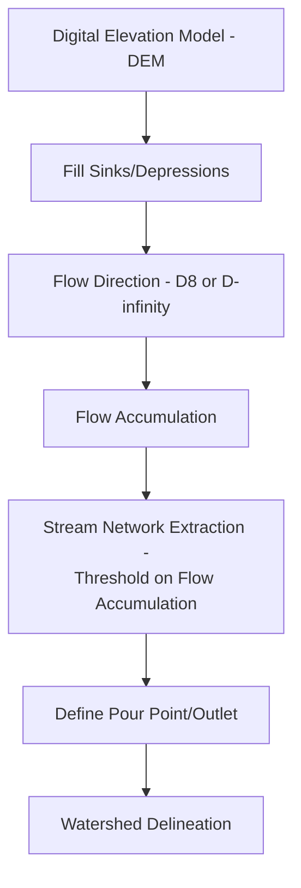
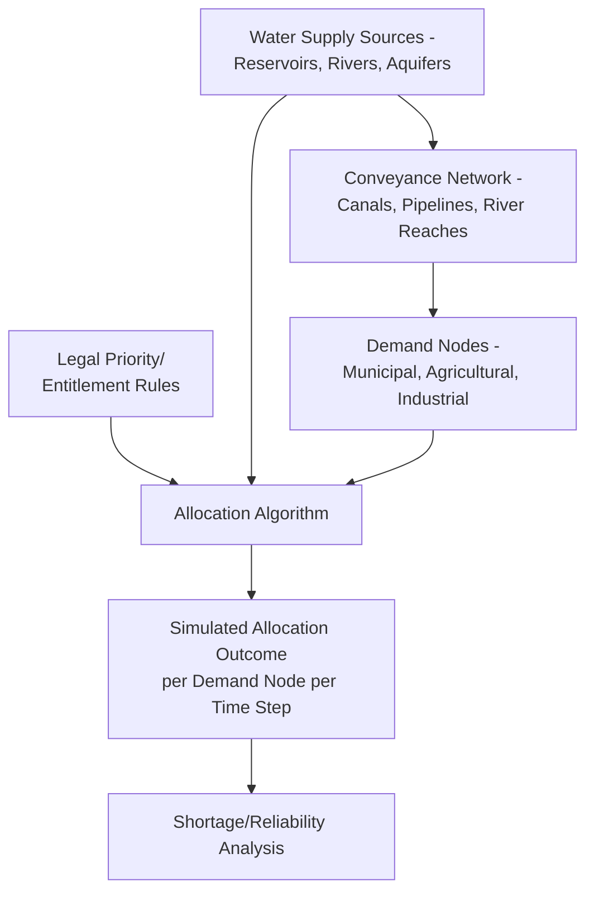

## Water Resource Allocation and Planning


### Overview

Water resource allocation and planning is the process of assessing water availability, demand, and distribution across competing uses (agricultural, municipal, industrial, environmental) within a defined hydrological unit, typically a watershed or river basin, to ensure sustainable and equitable access over time. It integrates hydrological modeling, water rights/legal frameworks, and spatial demand analysis to guide infrastructure investment, drought response, and long-term basin management. Geospatial methods provide the foundation for delineating hydrological units, modeling water balance, and spatially matching supply to demand.

**Key Points**

- Water resource planning operates at the scale of hydrologically defined units (watersheds, river basins, aquifers), not administrative boundaries, requiring cross-jurisdictional coordination when hydrological and political boundaries diverge.
- The foundational analytical framework is the **water balance equation**, tracking inflows, outflows, and storage change within a defined boundary.
- Allocation planning must reconcile competing legal/institutional frameworks (prior appropriation, riparian rights, permit systems) with hydrological reality, since legal entitlements can exceed physically available supply, particularly in over-allocated basins.

### Watershed Delineation and Hydrological Units

#### Delineation from Digital Elevation Models

Watershed boundaries are derived computationally from a DEM through a standard hydrological processing sequence: fill sinks, compute flow direction, compute flow accumulation, then delineate watershed boundaries from a specified pour point (outlet).



**Example**

```python
from pysheds.grid import Grid

grid = Grid.from_raster("dem.tif")
dem = grid.read_raster("dem.tif")

filled_dem = grid.fill_depressions(dem)
inflated_dem = grid.resolve_flats(filled_dem)
flow_dir = grid.flowdir(inflated_dem)
flow_acc = grid.accumulation(flow_dir)

catchment = grid.catchment(x=pour_point_x, y=pour_point_y, fdir=flow_dir)
```

**Key Points**

- **D8 flow direction** assigns flow from each cell to one of eight neighbors (steepest descent); **D-infinity** and multiple-flow-direction algorithms distribute flow across multiple downslope neighbors, generally producing more realistic flow patterns on flat or divergent terrain such as alluvial fans. [Inference: the practical accuracy difference between algorithms is terrain-dependent and most pronounced in low-relief or complex terrain.]
- Standardized hydrological unit systems (e.g., USGS Hydrologic Unit Codes/HUC in the United States) provide nested, pre-delineated watershed boundaries at multiple scales, commonly used as a standard reporting/analysis framework rather than requiring re-delineation for every study.

### Water Balance Modeling

#### Basic Water Balance Equation

$$P = ET + Q + \Delta S$$

where $P$ is precipitation, $ET$ is evapotranspiration, $Q$ is runoff (surface plus subsurface discharge), and $\Delta S$ is change in storage (soil moisture, groundwater, surface water).

#### Evapotranspiration Estimation

ET is commonly the most difficult water balance component to measure directly and is frequently estimated via remote sensing-based energy balance models or empirical formulas:

- **Penman-Monteith equation**: physically based, combining energy balance and aerodynamic resistance terms, widely regarded as the reference standard method where sufficient meteorological input data is available.
- **Remote sensing energy balance models** (e.g., METRIC, SEBAL): estimate actual ET from satellite thermal imagery by solving the surface energy balance equation, using land surface temperature as a key input—valuable for spatially distributed ET estimation over large agricultural areas without dense ground station networks.

$$R_n = G + H + \lambda ET$$

where $R_n$ is net radiation, $G$ is soil heat flux, $H$ is sensible heat flux, and $\lambda ET$ is latent heat flux (the energy balance residual used to solve for actual ET).

**Example**

```python
import rasterio
import numpy as np

# Simplified energy balance residual approach (conceptual)
with rasterio.open("net_radiation.tif") as rn_src, \
     rasterio.open("soil_heat_flux.tif") as g_src, \
     rasterio.open("sensible_heat_flux.tif") as h_src:
    Rn = rn_src.read(1)
    G = g_src.read(1)
    H = h_src.read(1)

latent_heat_flux = Rn - G - H
lambda_vaporization = 2.45e6  # J/kg
et_mm_per_day = (latent_heat_flux * 86400) / (lambda_vaporization * 1000)
```

### Water Demand Assessment

#### Sectoral Demand Estimation

| Sector | Typical Estimation Method |
| --- | --- |
| Municipal/domestic | Per-capita consumption rate × population (often spatially disaggregated via dasymetric population mapping) |
| Agricultural/irrigation | Crop water requirement models (FAO Penman-Monteith crop coefficients) × irrigated area |
| Industrial | Facility-specific water use records or sector-average intensity factors |
| Environmental flow | Minimum instream flow requirements to sustain aquatic ecosystem function |

#### Crop Water Requirement Modeling

$$ET_c = K_c \times ET_0$$

where $ET_0$ is reference evapotranspiration (standardized grass reference) and $K_c$ is a crop-specific coefficient varying by growth stage, following FAO-56 methodology, the widely adopted standard framework for agricultural water demand estimation.

**Example**

```python
import geopandas as gpd

irrigated_parcels = gpd.read_file("irrigated_agriculture.shp")
crop_coefficients = {"corn": 1.2, "wheat": 1.05, "alfalfa": 0.95}  # mid-season Kc, simplified

irrigated_parcels["Kc"] = irrigated_parcels["crop_type"].map(crop_coefficients)
irrigated_parcels["etc_mm"] = irrigated_parcels["Kc"] * reference_et_mm
irrigated_parcels["water_demand_m3"] = (
    irrigated_parcels["etc_mm"] / 1000 * irrigated_parcels.geometry.area
)
```

### Environmental Flow Requirements

**Key Points**

- Environmental (instream) flow requirements represent water reserved to maintain aquatic ecosystem health, fish passage, and downstream ecological function, and are increasingly incorporated as a formal allocation category alongside human consumptive uses rather than treated only as "leftover" water after other demands are met.
- Common methods range from simple hydrological indices (e.g., percentage of mean annual flow) to more complex habitat-simulation approaches (e.g., Instream Flow Incremental Methodology/IFIM) linking flow regime to physical habitat availability for target species.
- Environmental flow science increasingly emphasizes preserving natural flow **variability** (seasonal high/low flow timing, flood pulse), not just a fixed minimum flow threshold, recognizing that many aquatic and riparian ecological processes depend on natural flow regime dynamics rather than flow magnitude alone. [Inference: the specific flow regime components prioritized vary by river system and target ecological objectives.]

### Water Allocation Frameworks

#### Legal/Institutional Systems

| System | Core Principle | Typical Context |
| --- | --- | --- |
| Prior appropriation ("first in time, first in right") | Earlier water rights holders have priority during shortage | Western United States |
| Riparian rights | Water use rights tied to land adjacent to the water body | Eastern United States, many common law jurisdictions |
| Permit/licensing systems | Government-issued allocation permits, often with defined terms/renewal | Many national and EU frameworks |
| Customary/traditional allocation | Community-based, often informal allocation norms | Various traditional irrigation systems globally |

#### Spatial Allocation Modeling

Water allocation models spatially route available supply (from reservoirs, river reaches, groundwater sources) to demand nodes according to priority rules, physical conveyance constraints (canal/pipeline capacity), and legal entitlement hierarchies—commonly implemented via network-based hydrologic-economic models (e.g., WEAP - Water Evaluation and Planning system, or MODSIM).



### Groundwater Considerations

**Key Points**

- Groundwater allocation planning requires aquifer-specific hydrogeological data (transmissivity, storage coefficient, recharge rate) distinct from surface water hydrology, often modeled via numerical groundwater flow models (e.g., MODFLOW) rather than the surface water balance framework alone.
- **Conjunctive use management**—coordinated management of surface water and groundwater as an integrated system—is increasingly standard practice, since groundwater pumping and surface water availability are often hydraulically connected, meaning groundwater extraction can reduce streamflow with a time lag not captured by surface-water-only accounting. [Inference: the strength and lag time of this surface-groundwater connection is highly aquifer- and geology-specific.]
- GRACE/GRACE-FO satellite gravimetry provides large-scale (typically regional, hundreds of km resolution) estimates of total water storage change including groundwater, useful for identifying long-term regional aquifer depletion trends though too coarse for local well-field-scale management decisions.

### Drought and Scarcity Analysis

**Key Points**

- Standardized drought indices (Standardized Precipitation Index/SPI, Standardized Precipitation Evapotranspiration Index/SPEI, Palmer Drought Severity Index) provide comparable drought severity metrics across regions and time periods, commonly mapped spatially to identify drought extent and severity gradients.
- **Water stress index**: ratio of total water withdrawal to renewable water availability within a basin, widely used (e.g., in the WRI Aqueduct framework) to identify basins at high risk of scarcity-driven allocation conflict.

$$\text{Water Stress Ratio} = \frac{\text{Total Withdrawal}}{\text{Renewable Water Supply}}$$

### Practical Workflow Summary

1. Delineate the relevant hydrological unit (watershed/basin/aquifer) from DEM-based hydrological processing or standardized hydrologic unit datasets.
2. Establish the water balance for the unit, estimating evapotranspiration via remote sensing energy balance models where ground station density is insufficient.
3. Assess sectoral water demand (municipal, agricultural via crop water requirement modeling, industrial) spatially disaggregated to relevant demand nodes.
4. Define environmental flow requirements as a formal allocation category, considering flow variability, not just minimum threshold flow.
5. Map the applicable legal/institutional allocation framework and entitlement priority structure for the basin.
6. Build or apply a spatial allocation model (e.g., WEAP-style network model) to simulate supply-demand matching under current and scenario conditions.
7. Incorporate groundwater-surface water connectivity into allocation planning where conjunctive use dynamics are significant.
8. Monitor drought/scarcity indices and water stress ratios to inform adaptive allocation adjustments over time.

**Related Topics**

- Principles of Sustainable Resource Management
- Watershed Delineation and Hydrological Modeling
- Remote Sensing-Based Evapotranspiration Estimation
- Groundwater Flow Modeling (MODFLOW)
- Drought Indices and Water Stress Assessment
- Environmental Flow Requirements and River Ecology
- Agricultural Water Demand and FAO-56 Crop Coefficients
- Water Rights and Common-Pool Resource Governance