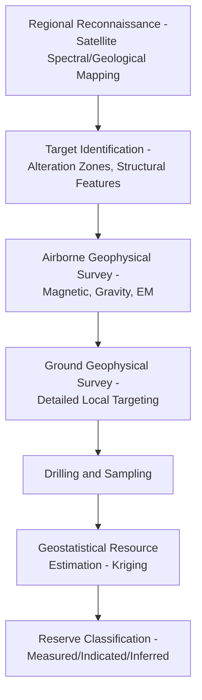

## Mineral and Energy Resource Mapping

### Overview

Mineral and energy resource mapping applies geospatial and remote sensing methods to identify, characterize, and quantify subsurface mineral deposits and energy resources (oil, gas, geothermal, uranium, and increasingly critical minerals for renewable energy technologies). This domain integrates geological mapping, geophysical surveying, remote sensing spectral analysis, and geostatistical resource estimation to support exploration targeting, resource quantification, and environmental impact assessment across the resource extraction lifecycle.

**Key Points**

- Mineral exploration mapping proceeds through a funnel from regional-scale reconnaissance (satellite-based alteration mapping) to local-scale detailed geophysical survey and finally drill-based confirmation, with cost and spatial resolution increasing at each stage.
- Remote sensing contributes primarily to the early reconnaissance stage by identifying surface mineralogical alteration patterns and structural features associated with mineralization, while subsurface characterization ultimately requires geophysical and drilling data.
- Resource estimation (converting exploration data into quantified reserves) relies on geostatistical methods, particularly kriging-based interpolation, to produce defensible tonnage and grade estimates.

### Exploration Workflow Overview



### Remote Sensing for Mineral Exploration

#### Spectral Mineral Mapping

Different minerals exhibit characteristic spectral absorption features across the visible, near-infrared (VNIR), and shortwave infrared (SWIR) portions of the electromagnetic spectrum, enabling identification of hydrothermal alteration minerals commonly associated with ore deposits (e.g., clays, iron oxides, sulfates).

**Key Points**

- **Iron oxide mapping**: band ratios exploiting the characteristic absorption features of iron oxides (e.g., Landsat/Sentinel-2 band ratios such as Red/Blue or SWIR-based ratios) highlight zones of oxidized/gossan material often associated with sulfide mineralization at depth.
- **Hyperspectral sensors** (e.g., AVIRIS, PRISMA, EnMAP, and the more recent spaceborne hyperspectral missions) provide much finer spectral resolution than multispectral sensors, enabling discrimination between specific clay/alteration mineral species (e.g., kaolinite vs. illite vs. alunite) that multispectral band ratios cannot reliably distinguish.
- **ASTER** (Advanced Spaceborne Thermal Emission and Reflection Radiometer) has been widely used historically for mineral exploration due to its combination of VNIR, SWIR, and thermal infrared bands specifically useful for alteration mineral and silica/carbonate mapping, though the SWIR sensor experienced a known malfunction after 2008, limiting SWIR data availability in more recent archives. [Unverified: current data availability status should be verified against the current USGS/NASA ASTER data policy, as archive access details may have changed.]

**Example**

```python
import rasterio
import numpy as np

with rasterio.open("swir_band6.tif") as b6, rasterio.open("swir_band8.tif") as b8:
    swir6 = b6.read(1).astype(float)
    swir8 = b8.read(1).astype(float)

# Simplified clay/alteration band ratio (conceptual, sensor-specific in practice)
clay_ratio = swir6 / swir8
alteration_zones = clay_ratio > threshold_value  # empirically calibrated threshold
```

#### Structural and Lineament Mapping

Fault and fracture systems, frequently associated with mineral emplacement pathways, are mapped from DEM-derived hillshade/slope analysis and satellite imagery texture/edge detection, identifying linear geomorphological features (lineaments) that may correspond to structural controls on mineralization.

```python
import numpy as np
from scipy import ndimage

# Simplified lineament enhancement via directional edge filtering
dem = rasterio.open("dem.tif").read(1)
sobel_x = ndimage.sobel(dem, axis=0)
sobel_y = ndimage.sobel(dem, axis=1)
edge_magnitude = np.hypot(sobel_x, sobel_y)
```

### Geophysical Survey Methods

| Method | Measures | Typical Target |
| --- | --- | --- |
| Magnetic survey | Variations in rock magnetic susceptibility | Iron-rich deposits, structural mapping |
| Gravity survey | Density variations in subsurface rock | Massive sulfide deposits, basin structure |
| Electromagnetic (EM) survey | Subsurface electrical conductivity | Conductive sulfide bodies, groundwater |
| Induced Polarization (IP) | Chargeability, related to disseminated sulfide content | Porphyry copper and disseminated deposits |
| Radiometric survey | Natural gamma radiation (K, U, Th) | Uranium exploration, lithological mapping |
| Seismic reflection/refraction | Subsurface layering via acoustic wave reflection | Oil and gas exploration, structural mapping |

**Key Points**

- Geophysical surveys are typically conducted airborne (fixed-wing or helicopter-mounted) for regional coverage, transitioning to ground-based survey for detailed local target refinement—directly analogous to the funnel progression in optical remote sensing exploration.
- Geophysical anomalies indicate physical property contrasts, not direct mineral identification; anomalies require integration with geological context and eventual drilling to confirm economic mineralization, since many geophysical anomaly sources are non-economic (e.g., barren pyrite producing an IP anomaly similar to economically significant sulfide mineralization).

### Oil and Gas Exploration Mapping

#### Seismic Reflection Interpretation

Seismic surveys generate subsurface structural images by measuring reflected acoustic wave travel times from subsurface geological interfaces, interpreted to identify potential hydrocarbon-trapping structures (anticlines, fault traps, stratigraphic pinch-outs).

$$d = \frac{v \cdot t}{2}$$

where $d$ is depth to a reflecting interface, $v$ is seismic wave velocity in the overlying medium, and $t$ is two-way travel time.

#### Direct Hydrocarbon Indicators and Remote Sensing

**Key Points**

- Surface hydrocarbon seep detection via satellite SAR has been used to identify offshore oil seepage (natural or spill-related) based on characteristic dampening of ocean surface capillary waves by surface oil films, producing detectable dark patches in SAR backscatter imagery.
- Thermal and multispectral remote sensing has more limited direct application to onshore hydrocarbon detection compared to hard-rock mineral exploration, since hydrocarbon reservoirs are typically deeply buried without direct surface spectral expression; onshore oil/gas exploration relies primarily on seismic and well-log data rather than optical remote sensing. [Inference: some studies report subtle surface soil/vegetation spectral anomalies associated with hydrocarbon microseepage, but this remains a more specialized and less operationally standard technique compared to seismic methods.]

### Geostatistical Resource Estimation

#### Kriging-Based Grade Estimation

Ore grade (concentration of the target commodity) at unsampled locations is estimated via kriging, an interpolation method that uses the spatial autocorrelation structure of sample data (characterized by a variogram) to produce statistically optimal (minimum estimation variance) unbiased estimates.

$$\hat{Z}(x_0) = \sum_{i=1}^{n} \lambda_i Z(x_i)$$

where $\lambda_i$ are kriging weights derived from the variogram model, subject to the unbiasedness constraint $\sum \lambda_i = 1$ for ordinary kriging.

**Variogram model**:

$$\gamma(h) = \frac{1}{2N(h)} \sum_{i=1}^{N(h)} [Z(x_i) - Z(x_i + h)]^2$$

where $\gamma(h)$ is semivariance at separation distance $h$, characterizing how sample similarity decreases with distance—the foundational input to the kriging weighting system.

**Example**

```python
import numpy as np
from pykrige.ok import OrdinaryKriging

# Drill hole assay data: x, y coordinates and grade values
ok = OrdinaryKriging(
    x_coords, y_coords, grade_values,
    variogram_model="spherical",
    verbose=False
)

grid_x = np.linspace(x_min, x_max, 200)
grid_y = np.linspace(y_min, y_max, 200)
grade_estimate, estimation_variance = ok.execute("grid", grid_x, grid_y)
```

**Key Points**

- **Ordinary kriging** assumes a locally constant but unknown mean; **simple kriging** requires a known, typically globally constant mean; **universal kriging** accommodates an underlying trend surface—method selection depends on the data's spatial trend characteristics, tested via exploratory variogram analysis rather than assumed by default.
- Kriging inherently produces both an estimate and its associated estimation variance/uncertainty at each location, a key advantage over deterministic interpolation methods (e.g., inverse distance weighting) which do not natively provide a statistically grounded uncertainty measure.

#### Reserve/Resource Classification

Following international reporting codes (e.g., JORC Code, NI 43-101, SME Guide), mineral resources are classified by confidence level based on data density and geological continuity:

| Classification | Confidence Level | Typical Basis |
| --- | --- | --- |
| Measured | Highest confidence | Closely spaced sampling, well-established continuity |
| Indicated | Moderate confidence | Wider spaced sampling, reasonably assumed continuity |
| Inferred | Lowest confidence | Limited sampling, geological inference-based continuity |
| Reserve (Proven/Probable) | Resource with demonstrated economic viability | Requires additional economic, technical, legal, and environmental modifying factors beyond geological estimation |

### Energy Resource-Specific Applications

**Key Points**

- **Geothermal exploration** combines thermal remote sensing (surface thermal anomaly detection), structural/fault mapping (fluid pathway indicators), and geochemical surface sampling to identify prospective geothermal reservoir targets before drilling confirmation.
- **Critical minerals mapping** (lithium, cobalt, rare earth elements, and other minerals essential to renewable energy and battery technology) has seen increased geospatial exploration investment, often applying the same hyperspectral and geophysical toolset as traditional mineral exploration but targeting different mineralogical signatures (e.g., lithium-bearing pegmatites, laterite-hosted nickel-cobalt deposits).
- **Uranium exploration** relies heavily on airborne radiometric (gamma-ray spectrometry) survey as a primary direct-detection tool, since uranium decay products produce a directly measurable gamma signature, unlike most other commodities which require indirect geophysical or spectral proxies.

### Environmental and Land Use Integration

**Key Points**

- Mineral resource mapping increasingly integrates environmental constraint layers (protected areas, water resources, indigenous land claims) early in the exploration targeting process, both for regulatory compliance and social license considerations, rather than treating environmental assessment as a separate later-stage process.
- Post-extraction land reclamation planning and monitoring increasingly uses the same remote sensing change detection methods applied elsewhere in land cover monitoring (see Change Detection and Monitoring Techniques) to track site rehabilitation progress against regulatory requirements.

### Practical Workflow Summary

1. Conduct regional reconnaissance using satellite spectral mineral mapping (multispectral band ratios or hyperspectral analysis) and structural lineament mapping to identify exploration targets.
2. Layer environmental and land use constraints (protected areas, water resources, land claims) early in the targeting process.
3. Conduct airborne geophysical survey (magnetic, gravity, EM, radiometric as appropriate to target commodity) over identified target areas.
4. Refine targets via ground-based geophysical survey before committing to drilling.
5. Collect drill hole/sample assay data and compute an experimental variogram to characterize spatial grade continuity.
6. Apply kriging-based interpolation to estimate grade and tonnage across the deposit, with accompanying estimation uncertainty.
7. Classify resources according to applicable reporting codes (JORC, NI 43-101) based on data density and geological confidence.
8. Integrate reclamation monitoring via remote sensing change detection through the post-extraction lifecycle phase.

**Related Topics**

- Change Detection and Monitoring Techniques
- Geostatistics and Kriging Interpolation Methods
- Hyperspectral Remote Sensing Fundamentals
- Structural Geology and Lineament Mapping
- Data Sharing, Licensing, and Governance
- Environmental Impact Assessment for Resource Extraction
- SAR Remote Sensing for Oil Spill/Seep Detection
- Watershed Delineation and Hydrological Modeling