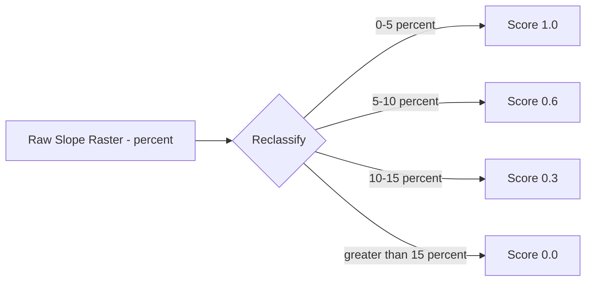
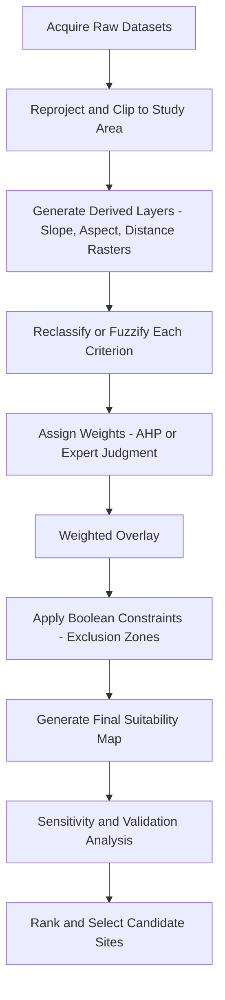

## Renewable Energy Site Suitability Analysis


### Overview

Renewable Energy Site Suitability Analysis is a geospatial decision-support process that identifies optimal locations for renewable energy infrastructure (solar farms, wind turbines, hydropower, geothermal, biomass facilities) by integrating multiple spatial criteria through GIS-based multi-criteria decision analysis (MCDA). The output is typically a suitability surface or ranked set of candidate sites, balancing technical feasibility, economic viability, environmental impact, and social acceptance.

### Core Methodology

#### Multi-Criteria Decision Analysis (MCDA) Workflow

The dominant methodological framework combines several sequential stages:

1. **Criteria identification** — selecting relevant physical, environmental, economic, and social factors
2. **Data acquisition and preprocessing** — sourcing raster/vector layers and standardizing projections, resolutions, and extents
3. **Constraint mapping** — applying exclusion zones (Boolean masks) where development is prohibited
4. **Factor standardization** — rescaling heterogeneous criteria to a common comparable scale
5. **Weight assignment** — determining relative importance of each factor
6. **Overlay/aggregation** — combining weighted factors into a composite suitability index
7. **Validation and sensitivity analysis** — testing result robustness against weight/parameter changes

#### Weighted Linear Combination (WLC)

The most widely used aggregation method. Each standardized factor raster is multiplied by its weight and summed:

$$S = \sum_{i=1}^{n} w_i x_i \times \prod_{j=1}^{m} c_j$$

Where $S$ is the composite suitability score, $w_i$ is the weight of factor $i$, $x_i$ is the standardized score of factor $i$, and $c_j$ is a Boolean constraint layer (0 = excluded, 1 = permitted).

**Key Points**

- Weights must sum to 1 (or 100) for normalized interpretation
- Standardized factor scores commonly use a 0–1 or 1–9/1–10 scale
- Constraint layers are multiplicative (hard exclusions), not part of the weighted sum
- WLC assumes full trade-off (compensatory) between criteria — a low score in one factor can be offset by a high score in another

#### Analytic Hierarchy Process (AHP)

AHP, developed by Thomas Saaty, derives factor weights through pairwise comparison rather than direct assignment, reducing subjective bias.

**Procedure:**

1. Structure criteria into a hierarchy (goal → criteria → sub-criteria)
2. Build a pairwise comparison matrix using Saaty's 1–9 scale (1 = equal importance, 9 = extreme importance)
3. Normalize the matrix and compute the principal eigenvector to derive weights
4. Calculate the Consistency Ratio (CR) to validate judgment coherence:

$$CR = \frac{CI}{RI}, \quad CI = \frac{\lambda_{max} - n}{n - 1}$$

Where $\lambda_{max}$ is the principal eigenvalue, $n$ is the matrix size, and $RI$ is a random consistency index (tabulated per matrix size). A $CR \leq 0.10$ is generally considered acceptable; higher values require revising the pairwise judgments.

#### Fuzzy Overlay and Other Approaches

- **Fuzzy Set Theory** — handles imprecise/gradational boundaries (e.g., "moderately suitable slope") using fuzzy membership functions instead of crisp Boolean cutoffs
- **TOPSIS** (Technique for Order Preference by Similarity to Ideal Solution) — ranks alternatives by geometric distance to ideal/anti-ideal solutions
- **Ordered Weighted Averaging (OWA)** — allows control over the degree of trade-off and risk (from AND-like to OR-like aggregation) via order weights

### Criteria by Energy Type

#### Solar Photovoltaic (PV) Site Selection

| Criterion | Typical Data Source | Suitability Direction |
| --- | --- | --- |
| Global Horizontal Irradiance (GHI) | NASA POWER, PVGIS, Solargis | Higher is better |
| Slope | DEM (SRTM, ASTER GDEM, LiDAR) | Lower (typically <5–10%) preferred |
| Aspect | Derived from DEM | South-facing (Northern Hemisphere) preferred |
| Land cover/use | Landsat, Sentinel-2 classification | Barren/degraded land favored over cropland/forest |
| Distance to transmission lines | OpenStreetMap, utility GIS data | Closer preferred (cost) |
| Distance to roads | OSM, national road networks | Closer preferred (access) |
| Proximity to substations | Utility infrastructure data | Closer preferred |
| Distance to water bodies (buffer/exclusion) | Hydrography layers | Buffer for ecological protection |
| Protected areas | WDPA, national park boundaries | Excluded |
| Population/settlement buffer | Census/settlement layers | Buffer for land-use conflict avoidance |

#### Wind Energy Site Selection

| Criterion | Typical Data Source | Suitability Direction |
| --- | --- | --- |
| Wind speed at hub height | Global Wind Atlas, reanalysis (ERA5) | Higher is better (typically >6–7 m/s) |
| Wind Power Density (WPD) | Derived from wind speed/air density | Higher is better |
| Terrain roughness/slope | DEM | Lower preferred for turbine foundations |
| Distance to airports/radar | Aviation authority data | Buffer exclusion |
| Distance to residential areas | Settlement layers | Buffer for noise/shadow flicker |
| Bird migration corridors | Ornithological/conservation datasets | Excluded/heavily weighted against |
| Distance to grid infrastructure | Utility data | Closer preferred |
| Land cover | Remote sensing classification | Exclude forests, wetlands |

#### Hydropower Site Selection

Key criteria include stream order and discharge (hydrology data), head/elevation drop (DEM-derived), catchment area, distance to grid, and exclusion of protected riparian zones and fish migration routes. Run-of-river vs. reservoir-based projects have distinct suitability profiles, with reservoir projects requiring reservoir capacity modeling and inundation impact assessment.

#### Geothermal Site Selection

Relies on geothermal gradient maps, fault line proximity (permeability indicator), heat flow data, and depth to resource, typically combined with seismic risk and protected area exclusions.

### Standardization (Fuzzification) Techniques

Raw criteria values must be transformed to a common suitability scale before weighting. Common functions:

- **Linear rescaling**: $x' = \frac{x - x_{min}}{x_{max} - x_{min}}$
- **Sigmoidal (fuzzy) membership**: smooth S-curve transitions between unsuitable and fully suitable, avoiding artificial hard breaks
- **User-defined breakpoints**: piecewise linear functions based on domain expert thresholds (e.g., slope 0–5% = 1.0, 5–15% = declining, >15% = 0.0)

**Example**

Slope standardization for solar PV using a decreasing linear function:



### Typical GIS Workflow (Software-Agnostic)



### Implementation Examples

#### Python (using `rasterio`, `numpy`, and `geopandas`)

```python
import rasterio
import numpy as np
import geopandas as gpd
from rasterio.features import rasterize

# Load standardized factor rasters (already rescaled 0-1)
with rasterio.open("ghi_standardized.tif") as src:
    ghi = src.read(1).astype(float)
    profile = src.profile

with rasterio.open("slope_standardized.tif") as src:
    slope = src.read(1).astype(float)

with rasterio.open("dist_transmission_standardized.tif") as src:
    dist_grid = src.read(1).astype(float)

with rasterio.open("landcover_standardized.tif") as src:
    landcover = src.read(1).astype(float)

# AHP-derived weights (example, summing to 1.0)
weights = {
    "ghi": 0.40,
    "slope": 0.20,
    "dist_grid": 0.25,
    "landcover": 0.15
}

# Weighted Linear Combination
suitability = (
    ghi * weights["ghi"] +
    slope * weights["slope"] +
    dist_grid * weights["dist_grid"] +
    landcover * weights["landcover"]
)

# Apply Boolean constraint mask (e.g., protected areas excluded)
with rasterio.open("constraints_mask.tif") as src:
    mask = src.read(1)  # 1 = allowed, 0 = excluded

final_suitability = suitability * mask

# Write output
profile.update(dtype=rasterio.float32, count=1)
with rasterio.open("final_suitability.tif", "w", **profile) as dst:
    dst.write(final_suitability.astype(rasterio.float32), 1)
```

#### AHP Weight Derivation (Python)

```python
import numpy as np

# Pairwise comparison matrix (4 criteria: GHI, Slope, Grid Distance, Land Cover)
# Saaty scale values entered by domain expert
matrix = np.array([
    [1,   3,   2,   4],
    [1/3, 1,   1/2, 2],
    [1/2, 2,   1,   3],
    [1/4, 1/2, 1/3, 1]
])

# Normalize columns
col_sums = matrix.sum(axis=0)
normalized = matrix / col_sums

# Derive weights (average of normalized rows)
weights = normalized.mean(axis=1)

# Consistency check
eigvals, eigvecs = np.linalg.eig(matrix)
lambda_max = np.max(eigvals.real)
n = matrix.shape[0]
CI = (lambda_max - n) / (n - 1)
RI_table = {4: 0.90}  # Random Index for n=4
CR = CI / RI_table[n]

print("Weights:", weights)
print("Consistency Ratio:", CR, "-> Acceptable" if CR <= 0.10 else "-> Revise judgments")
```

#### QGIS Processing (PyQGIS)

```python
from qgis import processing

# Reclassify slope raster using standardized value table
processing.run("native:reclassifybytable", {
    'INPUT_RASTER': 'slope.tif',
    'RASTER_BAND': 1,
    'TABLE': [0, 5, 1.0, 5, 10, 0.6, 10, 15, 0.3, 15, 999, 0.0],
    'NO_DATA': -9999,
    'RANGE_BOUNDARIES': 0,
    'OUTPUT': 'slope_reclass.tif'
})

# Weighted raster calculation
processing.run("qgis:rastercalculator", {
    'EXPRESSION': '"ghi_std@1" * 0.4 + "slope_reclass@1" * 0.2 + "grid_dist_std@1" * 0.25 + "landcover_std@1" * 0.15',
    'LAYERS': ['ghi_std', 'slope_reclass', 'grid_dist_std', 'landcover_std'],
    'OUTPUT': 'suitability_raw.tif'
})
```

### Sensitivity and Validation Analysis

Since weights and standardization functions are often subjective, robustness testing is essential:

- **One-at-a-time (OAT) sensitivity analysis** — vary one weight incrementally while holding others proportionally constant; observe rank/score stability
- **Monte Carlo simulation** — randomly sample weight combinations within plausible ranges across many iterations to assess output variance
- **Ground-truthing** — comparing model output against existing operational renewable energy facilities to assess predictive validity
- **ROC/AUC validation** — when historical site data exists, suitability scores can be validated similarly to species distribution models

[Inference] The choice between AHP, fuzzy overlay, or simple WLC often depends less on theoretical superiority and more on data quality, stakeholder consultation needs, and the presence of domain experts available for pairwise comparisons.

### Common Exclusion (Constraint) Layers

- Protected areas and national parks (IUCN categories I–VI)
- Water bodies and defined riparian buffers
- Wetlands and floodplains
- Urban/built-up areas and defined setback buffers
- Steep slopes exceeding engineering thresholds
- Seismic fault zones (for geothermal and large infrastructure)
- Archaeological/cultural heritage sites
- Military and restricted airspace zones
- Prime agricultural land (jurisdiction-dependent)

### Software and Platform Ecosystem

| Tool | Role |
| --- | --- |
| QGIS | Open-source GIS with native MCDA/weighted overlay tools and AHP plugins |
| ArcGIS Pro (Suitability Modeler, Weighted Overlay) | Commercial GIS with dedicated site-suitability workflows |
| Google Earth Engine | Cloud-based processing for large-scale irradiance/land-cover analysis |
| PostGIS | Spatial database for constraint querying and vector overlay |
| Python (rasterio, geopandas, whitebox, scikit-learn) | Scripting, automation, and integration with ML-based suitability models |
| R (raster/terra, sf) | Statistical and spatial modeling workflows |
| PVGIS / Global Wind Atlas / NASA POWER | Primary resource-specific climatological data sources |

### Emerging Approaches

- **Machine learning-enhanced suitability modeling** — random forests, gradient boosting, or neural networks trained on existing plant locations to predict suitability probability, potentially capturing nonlinear interactions that WLC/AHP miss
- **Multi-objective optimization** — using genetic algorithms (e.g., NSGA-II) to simultaneously optimize for cost, energy yield, and environmental impact rather than a single composite score
- **Digital twin integration** — combining suitability outputs with real-time energy demand and grid capacity simulation for dynamic siting decisions
- **Cumulative/co-location suitability** — analyzing hybrid site potential (e.g., agrivoltaics, wind-solar co-location) using stacked suitability layers

[Unverified] Specific performance benchmarks comparing ML-based versus traditional MCDA suitability models vary significantly by study region and dataset quality, and should be verified against current peer-reviewed literature for any specific application.

### Simplified Suitability Model Architecture (SVG)

<svg xmlns="http://www.w3.org/2000/svg" viewBox="0 0 800 420" font-family="sans-serif">
<text x="400" y="25" font-size="16" font-weight="bold" text-anchor="middle">Renewable Energy Site Suitability Model Architecture (svg_diagram)</text>
<rect x="20" y="60" width="150" height="50" rx="6" fill="#dbeafe" stroke="#1e40af" />
<text x="95" y="90" font-size="12" text-anchor="middle">Irradiance/Wind Data</text>
<rect x="20" y="130" width="150" height="50" rx="6" fill="#dbeafe" stroke="#1e40af" />
<text x="95" y="160" font-size="12" text-anchor="middle">DEM (Slope/Aspect)</text>
<rect x="20" y="200" width="150" height="50" rx="6" fill="#dbeafe" stroke="#1e40af" />
<text x="95" y="230" font-size="12" text-anchor="middle">Infrastructure Distance</text>
<rect x="20" y="270" width="150" height="50" rx="6" fill="#dbeafe" stroke="#1e40af" />
<text x="95" y="300" font-size="12" text-anchor="middle">Land Cover</text>
<rect x="230" y="60" width="150" height="260" rx="6" fill="#fef3c7" stroke="#92400e" />
<text x="305" y="190" font-size="12" text-anchor="middle">Standardization (Fuzzy/Linear)</text>
<rect x="440" y="60" width="150" height="260" rx="6" fill="#fce7f3" stroke="#9d174d" />
<text x="515" y="190" font-size="12" text-anchor="middle">Weighted Overlay (AHP Weights)</text>
<rect x="650" y="100" width="130" height="60" rx="6" fill="#dcfce7" stroke="#166534" />
<text x="715" y="125" font-size="12" text-anchor="middle">Constraint Mask</text>
<text x="715" y="140" font-size="10" text-anchor="middle">(Boolean Exclusion)</text>
<rect x="650" y="220" width="130" height="60" rx="6" fill="#e0e7ff" stroke="#3730a3" />
<text x="715" y="245" font-size="12" text-anchor="middle">Final Suitability</text>
<text x="715" y="260" font-size="10" text-anchor="middle">Map / Ranked Sites</text>
<line x1="170" y1="85" x2="230" y2="150" stroke="#333" marker-end="url(#arrow)" />
<line x1="170" y1="155" x2="230" y2="170" stroke="#333" marker-end="url(#arrow)" />
<line x1="170" y1="225" x2="230" y2="190" stroke="#333" marker-end="url(#arrow)" />
<line x1="170" y1="295" x2="230" y2="210" stroke="#333" marker-end="url(#arrow)" />
<line x1="380" y1="190" x2="440" y2="190" stroke="#333" marker-end="url(#arrow)" />
<line x1="590" y1="150" x2="650" y2="130" stroke="#333" marker-end="url(#arrow)" />
<line x1="715" y1="160" x2="715" y2="220" stroke="#333" marker-end="url(#arrow)" />
<line x1="590" y1="230" x2="650" y2="240" stroke="#333" marker-end="url(#arrow)" />
</svg>

### Conclusion

Renewable energy site suitability analysis synthesizes climatological, topographic, infrastructural, environmental, and regulatory data into a defensible spatial decision framework. While Weighted Linear Combination remains the most accessible method, AHP-derived weighting improves defensibility through structured stakeholder input, and fuzzy/ML-based approaches address the rigidity of crisp threshold-based models. Robust practice always pairs suitability mapping with sensitivity analysis and, where possible, empirical validation against operational sites.

**Related Topics**

- Multi-Criteria Decision Analysis (MCDA) in Environmental Planning
- Analytic Hierarchy Process (AHP) and Pairwise Comparison Methods
- Digital Elevation Models and Terrain Analysis
- Land Use/Land Cover Classification from Remote Sensing
- Environmental Impact Assessment (EIA) Integration with GIS
- Grid Infrastructure and Transmission Network Modeling
- Agrivoltaics and Co-located Renewable Systems
- Cumulative Environmental Impact Analysis
- Species Distribution Modeling (methodological parallels)
- Genetic Algorithms for Multi-Objective Spatial Optimization