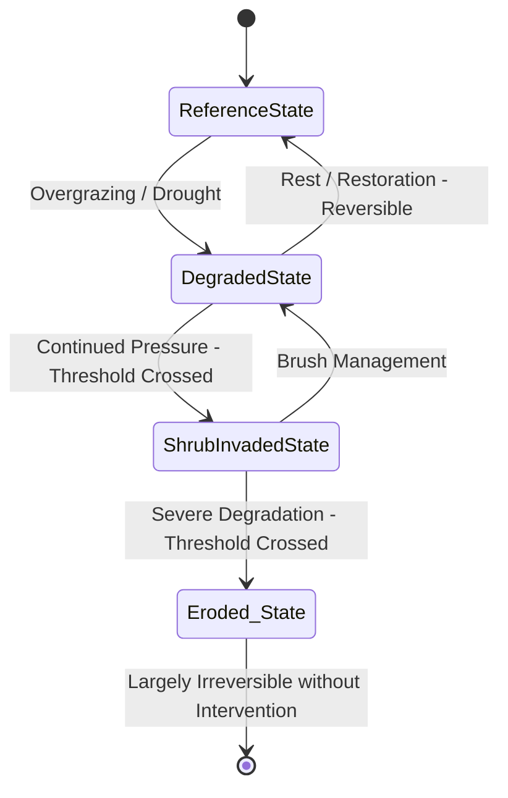
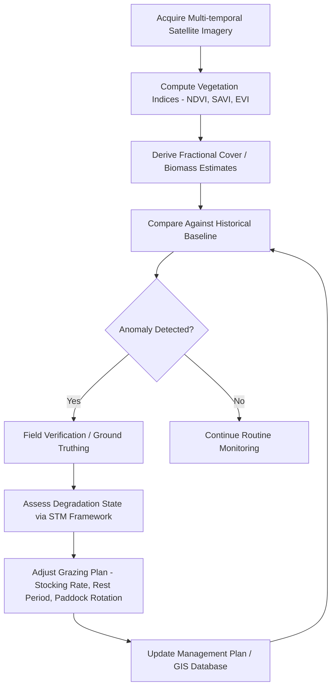

## Rangeland and Grassland Management


### Overview

Rangeland and Grassland Management is the applied science of monitoring, planning, and regulating grazing lands, savannas, prairies, and other herbaceous/shrub-dominated ecosystems to sustain forage productivity, biodiversity, soil health, and hydrological function while supporting livestock production and/or wildlife habitat. Geospatial technologies underpin modern rangeland management through vegetation monitoring, carrying capacity estimation, grazing planning, and degradation/desertification assessment.

### Core Concepts

#### Rangeland Ecological Sites and State-and-Transition Models

Rangeland is classified into **ecological sites** — land units with distinct soil, climate, and vegetation potential capable of producing a characteristic plant community. Management relies on **State-and-Transition Models (STMs)**, which describe discrete vegetation "states" (e.g., native grassland, shrub-invaded, eroded state) and the transitions/thresholds between them, often triggered by grazing pressure, fire, drought, or invasive species.



**Key Points**

- Transitions within a state are generally reversible through management
- Transitions across a threshold (into a new state) often require active restoration and significant investment to reverse, if reversible at all
- STMs are the conceptual basis for the USDA NRCS Ecological Site Description (ESD) system

#### Carrying Capacity and Stocking Rate

**Carrying capacity** is the maximum stocking rate possible without inducing resource degradation, expressed in Animal Unit Months (AUM) — the amount of forage required by one animal unit (typically a 1,000 lb/454 kg cow) for one month.

$$\text{Stocking Rate (AUM/ha)} = \frac{\text{Available Forage (kg/ha)} \times \text{Utilization Rate}}{\text{Forage Demand per AUM (kg)}}$$

A conservative utilization rate ("take half, leave half") of 40–50% is commonly applied to maintain plant vigor and root reserves.

**Example**

For a site producing 2,000 kg/ha of usable forage, a 50% utilization rate, and a forage demand of 350 kg/AUM:

$$\text{Stocking Rate} = \frac{2000 \times 0.5}{350} \approx 2.86 \text{ AUM/ha}$$

### Remote Sensing and Vegetation Monitoring

#### Vegetation Indices for Rangeland Assessment

| Index | Formula | Application |
| --- | --- | --- |
| NDVI | $\frac{NIR - Red}{NIR + Red}$ | General biomass/greenness proxy; forage quantity trends |
| SAVI | $\frac{(NIR - Red)(1 + L)}{NIR + Red + L}$ | Corrects for soil background reflectance in sparse cover (L typically 0.5) |
| EVI | $2.5 \times \frac{NIR - Red}{NIR + 6Red - 7.5Blue + 1}$ | Reduces atmospheric/canopy background noise; better in dense vegetation |
| NDWI | $\frac{Green - NIR}{Green + NIR}$ | Surface water/moisture stress detection |
| BSI (Bare Soil Index) | $\frac{(Red+SWIR)-(NIR+Blue)}{(Red+SWIR)+(NIR+Blue)}$ | Identifies bare ground/degradation extent |
| RAP fractional cover | ML-derived | Percent cover of annual/perennial forb & grass, shrub, tree, bare ground (US-specific) |

**Key Points**

- Time-series NDVI (e.g., MODIS 16-day composites, Landsat 30m, Sentinel-2 10m) is used to compute phenological metrics: green-up date, peak greenness, senescence, and growing season length
- Anomaly detection compares current NDVI against a multi-year historical baseline (Z-score or percentile departure) to flag drought stress or degradation
- Fractional cover products (e.g., USDA/NASA's Rangeland Analysis Platform in the US) decompose pixel reflectance into cover-type percentages using regression/ML trained on field plots

#### Standardized Precipitation Index (SPI) and Drought Monitoring

$$SPI = \frac{P_i - \bar{P}}{\sigma_P}$$

Where $P_i$ is precipitation for the period, $\bar{P}$ is the long-term mean, and $\sigma_P$ is the standard deviation. SPI is frequently paired with NDVI anomalies (Vegetation Condition Index/Vegetation Drought Response Index) to distinguish climate-driven from management-driven forage decline.

### Grazing Management Systems

| System | Description | Spatial/Temporal Pattern |
| --- | --- | --- |
| Continuous grazing | Livestock access entire pasture for extended period | No spatial rotation |
| Rotational grazing | Pasture divided into paddocks; herd rotates on a schedule | Fixed spatial units, planned time cycle |
| Rest-rotation grazing | One or more paddocks fully rested each cycle | Rotating rest period |
| Deferred rotation | Grazing timing varies by season across years to avoid repeated stress on same plants at same phenological stage | Temporal variation, fixed paddocks |
| Adaptive Multi-Paddock (AMP)/Holistic grazing | High-density, short-duration grazing with long recovery; responsive to real-time forage/weather conditions | Highly variable, data-driven |

**Paddock/grazing cell design** in GIS typically incorporates:

- Water point accessibility buffers (livestock generally graze within ~1–3 km of water, with heavier utilization near water — the "piosphere" effect)
- Slope constraints (cattle avoid slopes >30–45%; sheep/goats tolerate steeper terrain)
- Distance-decay utilization modeling from water/shade points
- Fencing infrastructure and topographic barriers

### Degradation and Desertification Assessment

#### Land Degradation Indicators

- **Bare ground percentage increase** (from fractional cover time series)
- **Soil erosion risk** via RUSLE (Revised Universal Soil Loss Equation):

$$A = R \times K \times LS \times C \times P$$

Where $A$ = annual soil loss, $R$ = rainfall erosivity, $K$ = soil erodibility, $LS$ = slope length-steepness factor, $C$ = cover-management factor, $P$ = support practice factor.

- **Piosphere degradation gradients** around water points and settlements
- **Shrub encroachment mapping** via multi-temporal classification (woody cover increase over grass-dominated baseline)
- **Land Degradation Neutrality (LDN)** indicators (UNCCD framework): trends in land cover, land productivity (NPP), and soil organic carbon

#### Desertification Risk Mapping (MEDALUS-type Approach)

Composite Environmentally Sensitive Area Index combining soil, climate, vegetation, and management quality sub-indices:

$$ESAI = \sqrt[4]{SQ \times CQ \times VQ \times MQ}$$

Where each sub-index (Soil Quality, Climate Quality, Vegetation Quality, Management Quality) is itself a geometric mean of weighted parameter scores (typically 1.0–2.0 scale).

### Implementation Examples

#### Google Earth Engine — NDVI Time Series and Anomaly Detection

```javascript
// Define rangeland study area and date range
var aoi = ee.Geometry.Rectangle([36.5, -1.5, 37.5, -0.5]);
var current = ee.ImageCollection('MODIS/061/MOD13Q1')
  .filterDate('2026-01-01', '2026-08-31')
  .filterBounds(aoi)
  .select('NDVI');

var historical = ee.ImageCollection('MODIS/061/MOD13Q1')
  .filterDate('2010-01-01', '2025-12-31')
  .filterBounds(aoi)
  .select('NDVI');

// Compute long-term mean and standard deviation
var histMean = historical.mean();
var histStd = historical.reduce(ee.Reducer.stdDev());

// Current season composite
var currentMean = current.mean();

// NDVI anomaly (Z-score)
var anomaly = currentMean.subtract(histMean).divide(histStd).rename('NDVI_zscore');

var visParams = {min: -3, max: 3, palette: ['red', 'white', 'green']};
Map.centerObject(aoi, 8);
Map.addLayer(anomaly.clip(aoi), visParams, 'NDVI Anomaly (Z-score)');

// Export for further analysis
Export.image.toDrive({
  image: anomaly.clip(aoi),
  description: 'rangeland_ndvi_anomaly',
  scale: 250,
  region: aoi
});
```

#### Python — Stocking Rate and Utilization Modeling

```python
import numpy as np
import rasterio

def calculate_stocking_capacity(biomass_raster_path, utilization_rate=0.5, 
                                   forage_demand_per_aum=350):
    """
    Calculate spatially explicit stocking capacity (AUM/ha) from a
    forage biomass raster (kg/ha).
    """
    with rasterio.open(biomass_raster_path) as src:
        biomass = src.read(1).astype(float)
        profile = src.profile
        nodata = src.nodata

    valid_mask = biomass != nodata if nodata is not None else np.ones_like(biomass, dtype=bool)

    usable_forage = biomass * utilization_rate
    stocking_capacity = np.where(
        valid_mask,
        usable_forage / forage_demand_per_aum,
        np.nan
    )

    total_aum = np.nansum(stocking_capacity)  # sum across pixels; multiply by pixel area/ha as needed
    mean_capacity = np.nanmean(stocking_capacity)

    profile.update(dtype=rasterio.float32, count=1, nodata=np.nan)
    with rasterio.open("stocking_capacity_aum_per_ha.tif", "w", **profile) as dst:
        dst.write(stocking_capacity.astype(rasterio.float32), 1)

    return {"mean_aum_per_ha": mean_capacity, "total_aum": total_aum}

result = calculate_stocking_capacity("forage_biomass.tif")
print(f"Mean stocking capacity: {result['mean_aum_per_ha']:.2f} AUM/ha")
```

#### Piosphere Distance-Decay Utilization Model

```python
import numpy as np
from scipy.ndimage import distance_transform_edt

def piosphere_utilization(water_points_raster, pixel_size_m, max_grazing_radius_m=3000, 
                            decay_exponent=1.5):
    """
    Model grazing utilization intensity as a function of distance to water,
    following an inverse power decay (piosphere effect).
    water_points_raster: binary array, 1 = water point, 0 = elsewhere
    """
    # Euclidean distance transform (in pixels), converted to meters
    dist_px = distance_transform_edt(1 - water_points_raster)
    dist_m = dist_px * pixel_size_m

    # Normalize distance to 0-1 within max grazing radius
    dist_norm = np.clip(dist_m / max_grazing_radius_m, 0, 1)

    # Inverse power decay: utilization highest near water, decaying outward
    utilization = (1 - dist_norm) ** decay_exponent
    utilization = np.where(dist_m > max_grazing_radius_m, 0, utilization)

    return utilization, dist_m
```

### Field Monitoring Integration

Remote sensing outputs are calibrated and validated against ground-based methods:

- **Line-Point Intercept (LPI)** — systematic point sampling along transects to estimate cover by species/functional group
- **Dry-Weight-Rank method** — visual estimation of species contribution to standing biomass
- **Grazing exclosure cages** — paired grazed/ungrazed plots to isolate grazing impact from climate effects on biomass
- **Landscape Appearance method / Photo-monitoring** — repeat photography at fixed points for qualitative trend assessment

[Inference] The accuracy of satellite-derived fractional cover and biomass estimates is generally dependent on local field-plot calibration density; sparse calibration networks in remote rangelands can reduce model transferability across ecological sites.

### Rangeland Management GIS Workflow



### Policy and Institutional Frameworks

- **UNCCD Land Degradation Neutrality (LDN)** — global framework using NPP, land cover, and soil organic carbon trend indicators
- **USDA NRCS Ecological Site Descriptions (ESD) and National Resources Inventory (NRI)**
- **Rangeland Analysis Platform (RAP)** — US-based open data platform providing annual 30m fractional cover and biomass (1986–present) built on Landsat time series and field plot training data
- **FAO Rangeland/Pastureland Monitoring** — global grassland productivity and grazing pressure assessments, often integrated with pastoralist mobility data in arid/semi-arid regions

### Common Analytical Pitfalls

- Treating NDVI decline solely as management-driven without controlling for precipitation variability (requires rainfall-use efficiency analysis: NDVI/precipitation ratio)
- Ignoring the piosphere effect when calculating uniform stocking rates across a paddock (utilization is rarely spatially uniform)
- Applying carrying capacity estimates from mesic (wetter) reference conditions to semi-arid/arid systems, where forage production has substantially higher interannual variability [Unverified — variability coefficients differ by region and should be derived from local long-term climate records]
- Overlooking state-and-transition thresholds, where continued grazing pressure near a threshold can trigger largely irreversible shifts (e.g., grass-to-shrubland conversion)

### Conclusion

Effective rangeland and grassland management integrates ecological site classification, remote sensing-derived vegetation and drought monitoring, spatially explicit stocking capacity modeling, and adaptive grazing system design. The shift from static carrying-capacity assumptions toward dynamic, satellite-informed, state-and-transition-based decision frameworks reflects the field's move toward climate-responsive and degradation-preventive management.

**Related Topics**

- State-and-Transition Models and Ecological Site Descriptions
- Drought Monitoring Indices (SPI, VCI, VHI)
- Soil Erosion Modeling (RUSLE/USLE)
- Land Degradation Neutrality and UNCCD Indicators
- Remote Sensing Vegetation Indices and Phenology
- Pastoral Mobility and Transhumance Mapping
- Fire Ecology and Prescribed Burning in Grasslands
- Riparian Buffer Zone Management
- Machine Learning for Fractional Vegetation Cover Estimation
- Precision Livestock Farming and GPS Collar Tracking