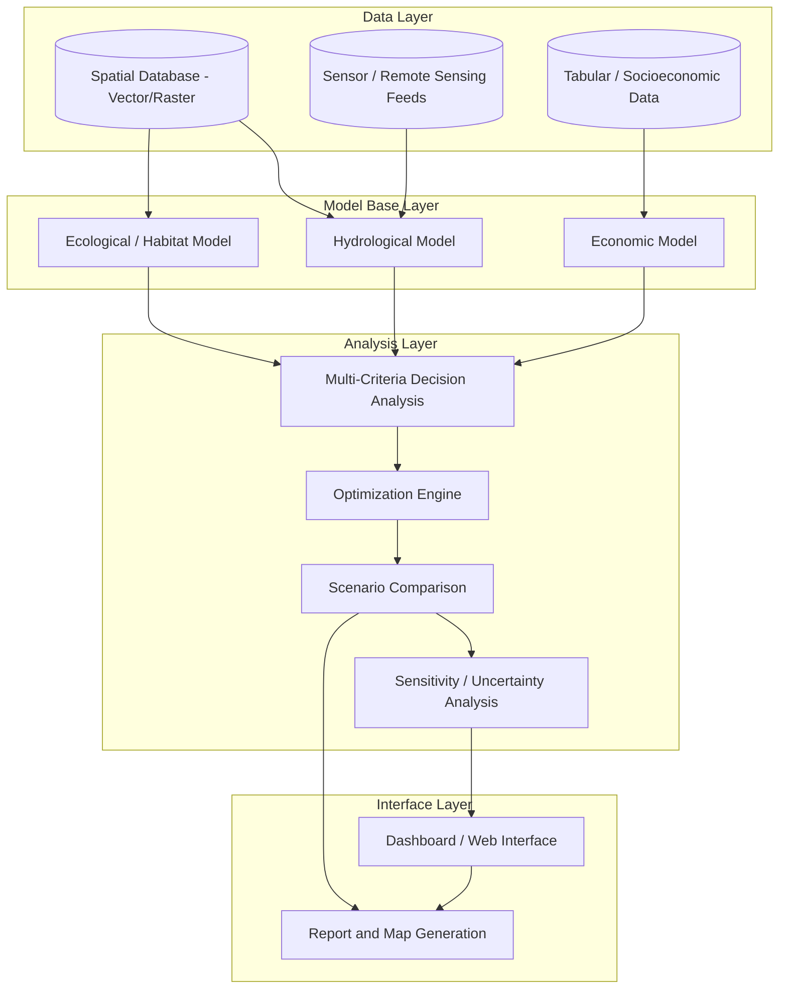
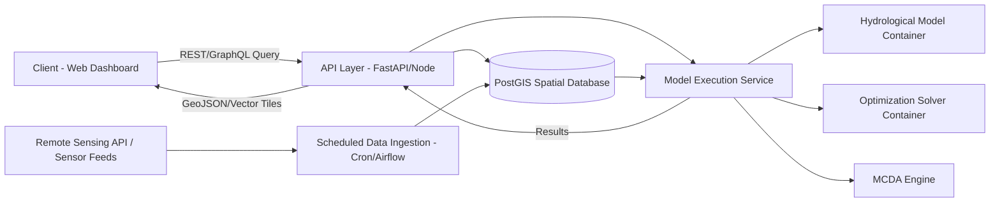
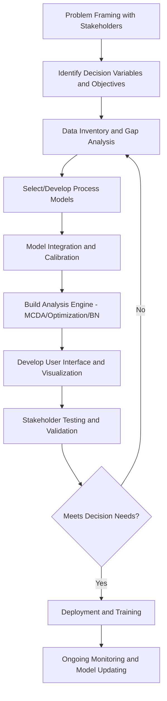

## Resource Management Decision Support Systems


### Overview

A Decision Support System (DSS) for natural resource management is an integrated software framework that combines spatial data, analytical/simulation models, and structured decision-making tools to help resource managers evaluate trade-offs, forecast outcomes, and select optimal management actions under uncertainty. Unlike a standalone GIS, a resource management DSS typically couples geospatial data infrastructure with process models (hydrological, ecological, economic), optimization or scenario-comparison engines, and a stakeholder-facing interface.

### Core Architecture

#### Component Layers

A typical Spatial Decision Support System (SDSS) is organized into four interacting layers:

1. **Data Management Layer** — spatial database (vector/raster), tabular data, sensor/monitoring feeds, remote sensing archives
2. **Model Base Layer** — simulation, process, and predictive models (hydrology, habitat suitability, growth-yield, economic)
3. **Analysis/Evaluation Layer** — multi-criteria decision analysis (MCDA), optimization algorithms, scenario comparison, uncertainty/sensitivity analysis
4. **Interface/Dialogue Layer** — user interaction, visualization dashboards, report generation, stakeholder engagement tools



**Key Points**

- The distinction between a generic DSS and a *Spatial* DSS (SDSS) is the explicit integration of geographic location and spatial relationships into every analytical stage
- Model coupling can be **loose** (models run independently, outputs exchanged via files) or **tight** (models share a common data structure and execute within a unified framework)
- Modern systems increasingly adopt **web-based/cloud architectures** to support multi-stakeholder access and real-time data ingestion

### Decision Analysis Frameworks Embedded in DSS

#### Multi-Criteria Decision Analysis (MCDA) Integration

Most resource management DSS platforms embed MCDA methods (Weighted Linear Combination, AHP, TOPSIS, ELECTRE, PROMETHEE) as the core mechanism for translating multiple, often conflicting, objectives into comparable rankings. See related suitability-analysis methodology for full mathematical treatment of WLC and AHP.

#### Optimization-Based Decision Support

For problems with combinatorial or continuous decision spaces (e.g., harvest scheduling, reservoir operation, land allocation), DSS platforms often embed:

- **Linear/Integer Programming** — for resource allocation under linear constraints (e.g., timber harvest scheduling to maximize yield subject to habitat/adjacency constraints)
- **Genetic Algorithms / NSGA-II** — for multi-objective optimization where trade-off (Pareto) frontiers are needed rather than a single solution
- **Dynamic Programming** — for sequential decisions over time (e.g., reservoir release scheduling, adaptive harvest strategies)
- **Simulated Annealing / Tabu Search** — metaheuristics for large combinatorial spatial allocation problems (e.g., reserve design)

A generalized multi-objective land/resource allocation problem:

$$\max_{x} \; F(x) = [f_1(x), f_2(x), \ldots, f_k(x)]$$


$$\text{subject to} \quad g_j(x) \leq 0, \; j = 1,\ldots,m$$

Where $x$ represents the decision vector (e.g., land parcel allocations), $f_i(x)$ are competing objectives (economic return, habitat quality, carbon storage), and $g_j(x)$ are resource/regulatory constraints. Because objectives typically conflict, the output is a **Pareto-optimal frontier** rather than a single optimum, and stakeholders select among non-dominated trade-off solutions.

#### Bayesian Networks and Belief Networks

Bayesian Networks (BNs) are widely used in ecological/resource DSS to represent probabilistic cause-effect relationships under uncertainty, particularly useful when empirical data is sparse and expert elicitation supplements quantitative data.

$$P(A|B) = \frac{P(B|A)P(A)}{P(B)}$$

BNs allow managers to propagate uncertainty through a causal network (e.g., land use → sediment load → water quality → fish habitat quality) and update posterior probabilities as new monitoring data arrives.

### Domain-Specific DSS Examples

| Domain | Example System Type | Core Models Integrated |
| --- | --- | --- |
| Water resources | Reservoir operation DSS | Hydrological routing, demand forecasting, optimization |
| Forestry | Harvest scheduling DSS | Growth-yield models, spatial adjacency constraints, LP/IP optimization |
| Fisheries | Stock assessment DSS | Population dynamics models, harvest control rules |
| Agriculture | Precision farming DSS | Crop growth models, soil/climate data, yield prediction |
| Conservation planning | Systematic reserve design DSS (e.g., Marxan-type) | Species distribution models, cost-efficiency optimization |
| Wildfire management | Fire risk/response DSS | Fire spread simulation, weather/fuel models, resource dispatch optimization |
| Watershed management | Integrated watershed DSS | SWAT/hydrological models, land use scenario simulation, pollutant loading |

### Implementation Examples

#### Python — Simple Multi-Objective Land Allocation DSS Core

```python
import numpy as np
from scipy.optimize import linprog

def land_allocation_dss(parcel_areas, economic_value_per_ha, habitat_value_per_ha,
                          carbon_value_per_ha, weights, max_total_area):
    """
    Simplified weighted-objective land allocation optimizer.
    Decision variable: fraction of each parcel allocated to conservation (0-1)
    Objective: maximize weighted combination of economic + habitat + carbon value
    lost/gained under conservation allocation, subject to area constraint.
    """
    n = len(parcel_areas)

    # Composite objective coefficients per parcel (to maximize -> minimize negative)
    composite_value = (
        weights['economic'] * economic_value_per_ha +
        weights['habitat'] * habitat_value_per_ha +
        weights['carbon'] * carbon_value_per_ha
    )
    c = -composite_value * parcel_areas  # negative for maximization via minimize

    # Constraint: total conserved area <= max_total_area
    A_ub = [parcel_areas]
    b_ub = [max_total_area]

    bounds = [(0, 1) for _ in range(n)]  # allocation fraction per parcel

    result = linprog(c, A_ub=A_ub, b_ub=b_ub, bounds=bounds, method='highs')

    allocation = result.x
    total_value = -result.fun
    return {"allocation_fractions": allocation, "total_weighted_value": total_value}

# Example usage
parcels = np.array([120, 85, 200, 60, 150])       # hectares
econ_val = np.array([800, 650, 400, 900, 300])    # $/ha
habitat_val = np.array([300, 500, 850, 150, 700])  # habitat index/ha
carbon_val = np.array([40, 60, 90, 25, 75])        # tons CO2/ha

weights = {'economic': 0.3, 'habitat': 0.4, 'carbon': 0.3}
result = land_allocation_dss(parcels, econ_val, habitat_val, carbon_val, weights, max_total_area=400)
print("Allocation fractions:", result['allocation_fractions'])
print("Total weighted value:", result['total_weighted_value'])
```

#### Bayesian Network for Watershed Risk (using `pgmpy`)

```python
from pgmpy.models import DiscreteBayesianNetwork
from pgmpy.factors.discrete import TabularCPD
from pgmpy.inference import VariableElimination

# Define causal structure: LandUse -> Sediment -> WaterQuality -> FishHabitat
model = DiscreteBayesianNetwork([
    ('LandUse', 'Sediment'),
    ('Sediment', 'WaterQuality'),
    ('WaterQuality', 'FishHabitat')
])

# LandUse: 0=Forested, 1=Agricultural, 2=Urban
cpd_landuse = TabularCPD('LandUse', 3, [[0.5], [0.3], [0.2]])

# Sediment | LandUse: 0=Low, 1=High
cpd_sediment = TabularCPD('Sediment', 2,
    [[0.9, 0.5, 0.2],   # P(Low)
     [0.1, 0.5, 0.8]],  # P(High)
    evidence=['LandUse'], evidence_card=[3])

# WaterQuality | Sediment: 0=Good, 1=Poor
cpd_waterquality = TabularCPD('WaterQuality', 2,
    [[0.85, 0.3],
     [0.15, 0.7]],
    evidence=['Sediment'], evidence_card=[2])

# FishHabitat | WaterQuality: 0=Suitable, 1=Unsuitable
cpd_fishhabitat = TabularCPD('FishHabitat', 2,
    [[0.8, 0.2],
     [0.2, 0.8]],
    evidence=['WaterQuality'], evidence_card=[2])

model.add_cpds(cpd_landuse, cpd_sediment, cpd_waterquality, cpd_fishhabitat)
assert model.check_model()

inference = VariableElimination(model)
result = inference.query(variables=['FishHabitat'], evidence={'LandUse': 1})  # Agricultural
print(result)
```

#### Web-Based SDSS Architecture Pattern (PostGIS + API + Frontend)



Modern SDSS deployments commonly containerize model execution (Docker) to isolate dependency environments (e.g., a legacy Fortran hydrological model alongside a Python optimization service), orchestrated via a workflow engine (Apache Airflow, Prefect) for scheduled model re-runs as new data arrives.

### Uncertainty and Sensitivity Analysis in DSS

Because resource management decisions carry ecological and economic consequences, DSS platforms formally propagate uncertainty rather than presenting single deterministic outputs:

- **Monte Carlo simulation** — repeated model runs with parameters sampled from probability distributions to generate output confidence intervals
- **Scenario analysis** — comparing discrete plausible futures (e.g., climate change scenarios, policy alternatives) rather than continuous probability distributions
- **Global sensitivity analysis (Sobol indices, Morris method)** — quantifying which input parameters contribute most to output variance, guiding data collection priorities
- **Robust decision-making (RDM)** — identifying management strategies that perform adequately across a wide range of plausible futures rather than optimizing for a single predicted future

[Inference] Systems that only present a single "optimal" output without uncertainty bounds are generally considered less credible for high-stakes natural resource decisions, since real-world ecological and climatic variability routinely exceeds model calibration assumptions.

### Stakeholder Participation and Participatory GIS (PGIS)

Effective natural resource DSS design typically incorporates structured stakeholder engagement:

- **Participatory GIS (PGIS)** — community members contribute spatial knowledge (e.g., traditional land use, resource access points) directly into the DSS data layer
- **Group MCDA workshops** — collaborative weight elicitation (e.g., group AHP sessions) to build consensus-based criteria weights
- **Scenario planning workshops** — stakeholders co-develop and evaluate alternative management scenarios before final DSS-assisted selection
- **Serious games/role-playing simulations** (e.g., Companion Modeling/ComMod approach) — used in some participatory water and rangeland management contexts to surface stakeholder mental models

### DSS Development Workflow



### Common Implementation Challenges

- **Model coupling complexity** — reconciling different spatial/temporal resolutions across integrated models (e.g., daily hydrological time steps vs. annual land-use change models)
- **Data latency** — real-time decision support requires reliable sensor/remote sensing data pipelines; gaps degrade decision timeliness
- **Stakeholder trust and transparency** — "black box" optimization outputs without interpretable reasoning face lower adoption; explainable AI/decision-tree surrogate models are increasingly used to address this
- **Institutional/organizational adoption barriers** — technically sound DSS platforms frequently fail to achieve sustained use without ongoing institutional support, training, and integration into existing decision workflows [Unverified — adoption rates vary substantially by institutional context and are best assessed through implementation-specific case studies]
- **Software/maintenance sustainability** — many academically-developed DSS platforms lack long-term maintenance funding after initial research grants conclude

### Conclusion

Resource Management Decision Support Systems formalize the translation of spatial data and process models into actionable management choices by embedding MCDA, optimization, and probabilistic reasoning within a structured, often participatory, software framework. Their effectiveness depends less on modeling sophistication alone and more on successful integration of uncertainty communication, stakeholder engagement, and institutional adoption pathways alongside the underlying geospatial and analytical architecture.

**Related Topics**

- Multi-Criteria Decision Analysis (MCDA) Methods
- Bayesian Networks for Environmental Risk Assessment
- Participatory GIS and Community-Based Mapping
- Optimization Algorithms for Spatial Resource Allocation
- Scenario Planning and Robust Decision-Making
- Systematic Conservation Planning (Marxan and Related Tools)
- Watershed Modeling (SWAT, HEC-HMS)
- Web-Based Geospatial Application Architecture (PostGIS, REST APIs)
- Uncertainty and Sensitivity Analysis in Environmental Models
- Adaptive Management Frameworks