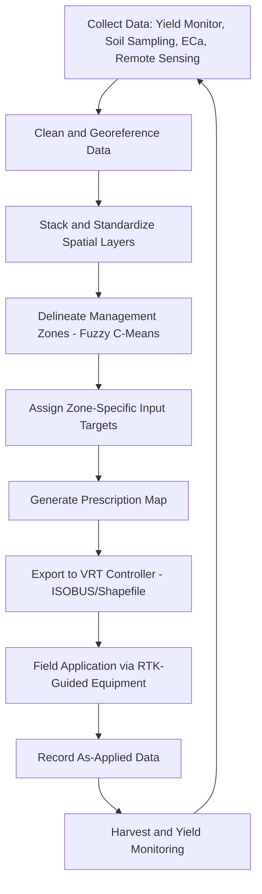

## Precision Agriculture Fundamentals


### Overview

Precision Agriculture (PA) is a management approach that uses site-specific spatial and temporal data to optimize field-level agronomic decisions — inputs (seed, fertilizer, water, pesticide), timing, and equipment operations — matched to observed within-field variability rather than treating a field as a homogeneous unit. It integrates GNSS positioning, remote sensing, geostatistics, variable rate technology (VRT), and increasingly machine learning to increase yield, resource use efficiency, and profitability while reducing environmental impact.

### Core Principles

#### The Right Input, Right Place, Right Time, Right Rate

Precision agriculture is commonly framed around the "4R Nutrient Stewardship" concept (originally developed for fertilizer management but generalized across PA practice):

- **Right Source** — matching input type/formulation to crop and soil needs
- **Right Rate** — applying the quantity matched to local requirement (not a blanket field average)
- **Right Time** — timing applications to crop phenological stage and environmental conditions
- **Right Place** — spatially targeting application to where it is needed

**Key Points**

- PA fundamentally addresses **within-field spatial variability** in soil properties, topography, and crop performance that field-average management ignores
- The economic rationale rests on the principle that marginal input response varies spatially — applying uniform rates over-applies in low-response zones and under-applies in high-response zones
- PA is distinguished from traditional precision by its explicit **georeferencing** of every management action and observation

### Core Technology Stack

#### GNSS and Positioning

| Correction Level | Typical Accuracy | Use Case |
| --- | --- | --- |
| Autonomous GPS | 3–5 m | General field mapping |
| SBAS (WAAS/EGNOS) | 0.5–1 m | Basic guidance |
| DGPS | 0.3–1 m | Guidance, moderate-precision tasks |
| RTK (Real-Time Kinematic) | 1–2.5 cm | Auto-steer, planting, strip-till, controlled traffic |
| PPP (Precise Point Positioning) | 2–10 cm (post-convergence) | Guidance without local base station |

RTK correction requires either a fixed local base station (typically <10–15 km range) or a network RTK subscription service (e.g., NTRIP-based correction streams) delivering centimeter-level accuracy essential for auto-steer, controlled traffic farming (CTF), and seed-level planting precision.

#### Remote and Proximal Sensing

- **Satellite imagery** — Sentinel-2 (10m, 5-day revisit), Landsat 8/9 (30m, 16-day revisit), and commercial constellations (Planet, ~3m daily) for vegetation index time series
- **UAV/drone imagery** — sub-decimeter to few-cm resolution, multispectral/thermal/RGB sensors, flexible revisit timing independent of cloud cover, primarily limited by flight endurance and regulatory (airspace) constraints
- **Proximal/ground sensors** — canopy reflectance sensors (e.g., active optical sensors measuring NDVI at close range independent of ambient light), soil electrical conductivity (EC) sensors, penetrometers for compaction mapping
- **Yield monitors** — combine-mounted mass flow and moisture sensors generating georeferenced yield maps at harvest, foundational for identifying management zones

#### Variable Rate Technology (VRT)

VRT equipment adjusts application rate in real time based on a prescription map or real-time sensor feedback:

- **Map-based VRT** — rate controller follows a pre-built prescription map (typically a shapefile/raster with rate attribute) referenced against RTK/GNSS position
- **Sensor-based VRT** — rate adjusts in real time from an onboard sensor (e.g., optical canopy sensor triggering nitrogen rate changes on-the-go, without a pre-built map)
- Applies to seeding rate, fertilizer (dry/liquid), lime, pesticide, and irrigation (variable rate irrigation, VRI)

### Management Zone Delineation

Management zones subdivide a field into relatively homogeneous sub-units for differentiated management, typically delineated through unsupervised clustering of multiple stacked data layers.

#### Common Input Layers

- Multi-year yield map data (normalized across years to remove weather-year effects)
- Soil apparent electrical conductivity (ECa, correlated with texture/water-holding capacity)
- Elevation and derived terrain attributes (slope, curvature, topographic wetness index)
- Multi-temporal NDVI/vegetation index composites
- Soil sample grid or zone-based nutrient data

#### Clustering Approach

Fuzzy c-means clustering is the most widely applied method for management zone delineation, preferred over hard (crisp) clustering (e.g., k-means) because it captures the naturally gradational nature of soil/yield transitions rather than imposing sharp boundaries:

$$J_m = \sum_{i=1}^{N}\sum_{j=1}^{C} u_{ij}^m \|x_i - v_j\|^2$$

Where $u_{ij}$ is the membership degree of data point $i$ in cluster $j$, $v_j$ is the cluster centroid, $m$ is the fuzziness exponent (typically 1.5–2.5), $N$ is the number of data points, and $C$ is the number of clusters.

Cluster validity indices commonly used to select the optimal number of zones ($C$):

- **Fuzzy Performance Index (FPI)** — measures degree of fuzziness (lower is better, more distinct zones)
- **Normalized Classification Entropy (NCE)** — measures disorganization in classification (lower is better)

### Yield Data Processing

Raw yield monitor data requires cleaning before analysis due to characteristic sensor artifacts:

**Common Yield Data Errors**

- Header-raise/lower artifacts at pass boundaries producing spurious spikes
- Combine acceleration/deceleration lag (time-offset between sensor reading and true grain flow location)
- Overlap errors from imprecise pass-to-pass swathing
- Moisture sensor drift/miscalibration
- Edge-of-field turning errors and low-speed artifacts

**Example**

Standard yield cleaning workflow removes points outside plausible statistical bounds (e.g., outside 3 standard deviations of local neighborhood mean), points with abnormal harvester speed (<1.5 km/h or >12 km/h thresholds are common defaults, adjustable by crop/equipment), and boundary buffer zones (typically 1–2 pass-widths from field edge).

### Implementation Examples

#### Python — Management Zone Delineation via Fuzzy C-Means

```python
import numpy as np
import rasterio
from skfuzzy.cluster import cmeans

def delineate_management_zones(layers_dict, n_clusters=3, fuzziness=2.0):
    """
    Delineate management zones using fuzzy c-means clustering on
    stacked, standardized input layers (e.g., yield, ECa, elevation, NDVI).
    layers_dict: dict of {name: 2D numpy array}, all same shape/alignment
    """
    shape = next(iter(layers_dict.values())).shape
    stacked = np.stack([arr.flatten() for arr in layers_dict.values()], axis=0)

    # Standardize each layer (z-score) to prevent scale dominance
    means = np.nanmean(stacked, axis=1, keepdims=True)
    stds = np.nanstd(stacked, axis=1, keepdims=True)
    standardized = (stacked - means) / stds

    # Handle NaNs by masking
    valid_mask = ~np.any(np.isnan(standardized), axis=0)
    valid_data = standardized[:, valid_mask]

    # Fuzzy c-means clustering
    cntr, u, u0, d, jm, p, fpc = cmeans(
        valid_data, c=n_clusters, m=fuzziness, error=0.005, maxiter=1000
    )

    # Assign each point to zone of highest membership
    zone_assignment = np.full(stacked.shape[1], -1, dtype=int)
    zone_assignment[valid_mask] = np.argmax(u, axis=0)
    zone_map = zone_assignment.reshape(shape)

    return zone_map, fpc  # fpc = fuzzy partition coefficient (validity metric)

# Example usage
layers = {
    "yield": yield_array,       # 2D array, multi-year normalized yield
    "eca": eca_array,           # 2D array, apparent electrical conductivity
    "elevation": elev_array,    # 2D array, DEM
    "ndvi": ndvi_composite      # 2D array, multi-temporal NDVI mean
}
zones, fpc_score = delineate_management_zones(layers, n_clusters=4)
print(f"Fuzzy Partition Coefficient: {fpc_score:.3f}")  # closer to 1 = more distinct zones
```

#### Yield Data Cleaning (Python/GeoPandas)

```python
import geopandas as gpd
import numpy as np

def clean_yield_data(yield_gdf, speed_col='speed_kmh', yield_col='yield_bu_ac',
                       min_speed=1.5, max_speed=12.0, std_threshold=3.0,
                       edge_buffer_passes=1, pass_width_m=9.0):
    """
    Standard yield monitor data cleaning pipeline.
    """
    df = yield_gdf.copy()
    initial_count = len(df)

    # Remove implausible speed readings (header raise/turning artifacts)
    df = df[(df[speed_col] >= min_speed) & (df[speed_col] <= max_speed)]

    # Remove statistical outliers (global pass; local neighborhood pass recommended for production)
    mean_yield = df[yield_col].mean()
    std_yield = df[yield_col].std()
    lower_bound = mean_yield - std_threshold * std_yield
    upper_bound = mean_yield + std_threshold * std_yield
    df = df[(df[yield_col] >= lower_bound) & (df[yield_col] <= upper_bound)]

    # Remove field boundary buffer
    field_boundary = df.unary_union.convex_hull
    buffer_distance = edge_buffer_passes * pass_width_m
    interior_boundary = field_boundary.buffer(-buffer_distance)
    df = df[df.within(interior_boundary)]

    removed_pct = (initial_count - len(df)) / initial_count * 100
    print(f"Removed {removed_pct:.1f}% of points during cleaning")

    return df
```

#### Prescription Map Generation (Nitrogen VRT)

```python
import numpy as np
import rasterio

def generate_nitrogen_prescription(zone_map, yield_potential_by_zone, 
                                      n_use_efficiency=0.6, target_protein_factor=1.0):
    """
    Generate variable rate nitrogen prescription based on management zones
    and zone-specific yield potential (simplified yield-goal method).
    n_use_efficiency: fraction of applied N taken up by crop
    """
    n_demand_per_bu = 1.2  # lbs N per bushel (crop-specific coefficient)

    rate_map = np.zeros_like(zone_map, dtype=float)
    for zone_id, yield_potential in yield_potential_by_zone.items():
        n_required = yield_potential * n_demand_per_bu * target_protein_factor
        applied_rate = n_required / n_use_efficiency
        rate_map[zone_map == zone_id] = applied_rate

    return rate_map  # lbs N/acre by zone, ready for VRT controller export
```

### Precision Agriculture Data Workflow



### Data Standards and Interoperability

- **ISOBUS (ISO 11783)** — standardized communication protocol between tractor, implement, and rate controller, enabling cross-manufacturer VRT compatibility
- **Shapefile/AGCO/John Deere proprietary formats** — common prescription map exchange formats, though industry has moved toward more open standards
- **ADAPT (Agricultural Data Application Programming Toolkit)** — open-source framework (AgGateway) for translating between proprietary precision ag data formats
- **ISO-XML** — task data format used for ISOBUS-compatible prescription and as-applied data exchange

### Economic and Environmental Rationale

#### Site-Specific Crop Management (SSCM) Economic Logic

The core economic argument for PA rests on spatially variable marginal response functions. A simplified profit-maximization framework for input rate at location $(x,y)$:

$$\pi(x,y) = P_c \cdot Y(N, x, y) - P_n \cdot N(x,y)$$

Where $P_c$ is crop price, $Y(N,x,y)$ is the location-specific yield response function to nitrogen rate $N$, and $P_n$ is input price. The economically optimal rate at each location is found where marginal yield response equals the input-to-output price ratio:

$$\frac{\partial Y}{\partial N}\bigg|_{(x,y)} = \frac{P_n}{P_c}$$

Because $\frac{\partial Y}{\partial N}$ varies spatially with soil and yield potential, a single field-average rate is generally suboptimal relative to zone- or point-specific rates. [Inference] The magnitude of economic benefit from VRT over uniform rate application is highly field- and input-specific, and published return-on-investment figures should be interpreted as context-dependent rather than universally applicable.

### Common Implementation Pitfalls

- Insufficient multi-year yield data before zone delineation, leading to zones that reflect a single anomalous weather year rather than persistent spatial patterns
- Ignoring spatial autocorrelation/edge effects when validating classification or interpolation accuracy
- Applying management zones derived from one crop's yield response to a rotated crop with different soil-yield relationships
- GNSS accuracy mismatches between planting (RTK) and harvest/sensing equipment (lower-grade correction), causing spatial misalignment when overlaying multi-source layers
- Over-reliance on NDVI-only zone delineation without ground-truthing soil constraints (NDVI saturates at high biomass and cannot distinguish all yield-limiting factors)

### Conclusion

Precision agriculture operationalizes within-field spatial variability into differentiated management through a technology stack spanning GNSS positioning, remote/proximal sensing, geostatistical zone delineation, and variable rate application, closing the loop from data collection through prescription generation to as-applied verification. Its practical effectiveness depends on data quality (particularly yield monitor cleaning), appropriate clustering methodology, and interoperable data standards across the equipment ecosystem.

**Related Topics**

- GNSS/RTK Positioning and Correction Services
- UAV/Drone-Based Multispectral and Thermal Imaging
- Geostatistics and Spatial Interpolation (Kriging)
- Soil Electrical Conductivity Mapping and Apparent EC Sensors
- Variable Rate Irrigation (VRI) Systems
- Crop Growth Modeling and Yield Prediction
- ISOBUS and Agricultural Data Interoperability Standards
- Machine Learning for Yield Prediction and Anomaly Detection
- Controlled Traffic Farming (CTF) and Soil Compaction Management
- Digital Twin and IoT Integration in Smart Farming