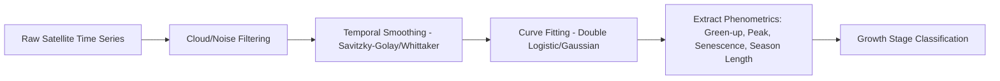
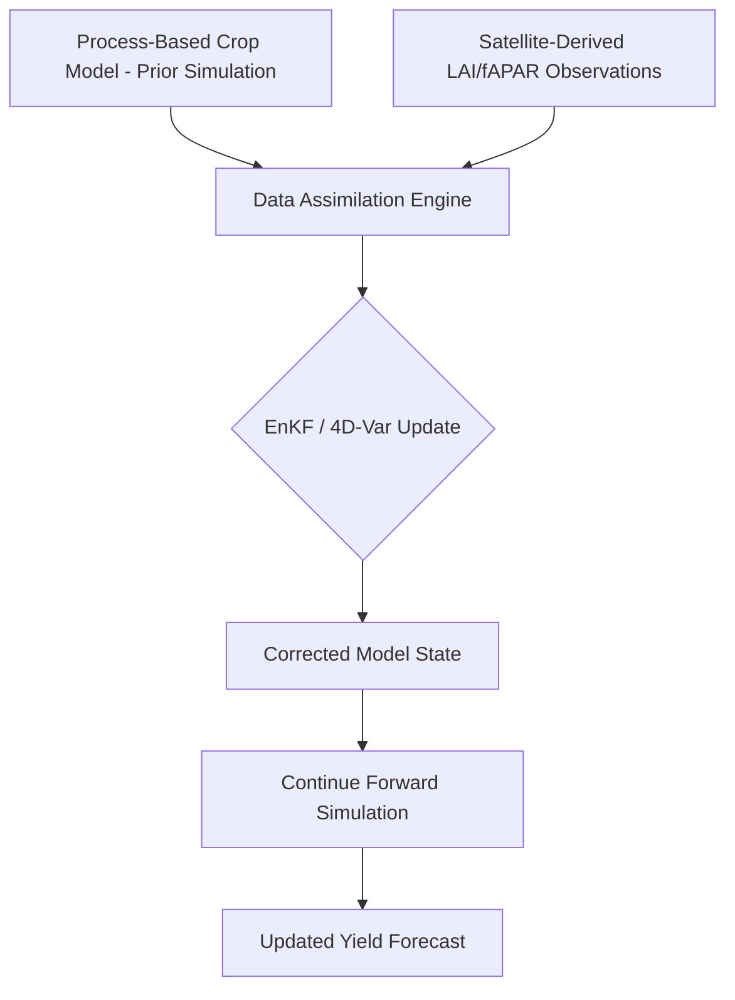
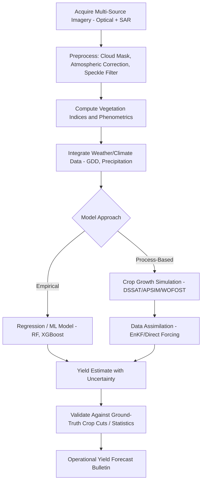

## Crop Monitoring and Yield Estimation


### Overview

Crop Monitoring and Yield Estimation encompasses the remote sensing, ground-based, and modeling techniques used to track crop growth status throughout the season and predict final yield before harvest. These methods range from empirical vegetation index regression to physically-based crop growth simulation and, increasingly, machine learning approaches that fuse multi-source data. Accurate, timely yield estimation supports farm-level input decisions, insurance/finance risk assessment, and regional/national food security monitoring.

### Crop Growth Monitoring Fundamentals

#### Phenological Stage Tracking

Crop monitoring is anchored to phenological development stages, since spectral response, water demand, and yield-formation processes differ fundamentally across growth stages. Common staging systems include:

- **BBCH scale** — decimal-coded system applicable across crop species (0 = germination, 9 = senescence), widely used in Europe and increasingly standardized globally
- **Crop-specific scales** — e.g., Zadoks scale for cereals, Feekes scale for wheat, V/R staging for maize (vegetative V1-Vn, reproductive R1-R6) and soybean

**Key Points**

- Yield-critical growth stages (e.g., flowering/silking in maize, grain fill in wheat) are the periods of highest sensitivity to water/heat stress and require closest monitoring
- Remote sensing-derived phenological metrics (green-up date, peak NDVI timing, senescence onset) can be extracted directly from dense time-series imagery without ground observation, using curve-fitting to seasonal NDVI/EVI trajectories

#### Time-Series Vegetation Index Trajectories

Crop growth produces a characteristic seasonal vegetation index curve. Standard curve-fitting approaches (double logistic, asymmetric Gaussian, Savitzky-Golay smoothing) extract phenological metrics from noisy satellite time series:

$$VI(t) = VI_{min} + (VI_{max} - VI_{min}) \times \left[\frac{1}{1+e^{-a(t-b)}} - \frac{1}{1+e^{-c(t-d)}}\right]$$

A double-logistic function where the first sigmoid captures green-up and the second captures senescence, with $a,b,c,d$ fitted parameters controlling curve timing and steepness.



### Yield Estimation Methodologies

#### Empirical Regression-Based Methods

The simplest and most widely deployed approach relates a vegetation index (typically at or near peak growth or integrated across the season) to historical yield observations via statistical regression.

$$Yield = \beta_0 + \beta_1 \cdot NDVI_{peak} + \beta_2 \cdot GDD + \varepsilon$$

**Common Predictor Variables**

- Peak-season or integrated (cumulative) NDVI/EVI
- Growing Degree Days (GDD) accumulation
- Cumulative precipitation or water deficit index during critical growth stages
- Land Surface Temperature (LST) anomalies during grain fill

**Key Points**

- Simple linear regression is field/region/year-specific and typically requires recalibration across different agroecological zones
- **Random forest and gradient boosting models** (e.g., XGBoost, LightGBM) generally outperform simple linear regression by capturing nonlinear interactions between spectral, climate, and soil predictors, at the cost of reduced interpretability
- Model transferability across years is limited when weather anomalies shift the underlying NDVI-yield relationship (e.g., drought years often violate calibration-period assumptions)

#### Process-Based Crop Growth Models

Unlike empirical regression, process-based (mechanistic) models simulate the physiological processes of crop growth — photosynthesis, respiration, phenological development, biomass partitioning, water/nutrient uptake — using daily weather, soil, and management inputs.

| Model | Origin/Framework | Primary Crops | Key Application |
| --- | --- | --- | --- |
| DSSAT (CSM) | Decision Support System for Agrotechnology Transfer | Maize, wheat, rice, soybean, 40+ crops | Yield gap analysis, climate impact studies |
| APSIM | Agricultural Production Systems slMulator | Wide range, strong cropping-system focus | Farming systems, rotation modeling |
| WOFOST | World Food Studies | Wheat, maize, potato, and others | Regional yield forecasting (EU MARS system) |
| AquaCrop | FAO | Water-limited crop production | Water productivity, irrigation scheduling |
| STICS | INRAE (France) | Wide range | Soil-crop-atmosphere continuum modeling |

**Simplified Radiation Use Efficiency (RUE) Biomass Accumulation**

A foundational concept underlying many process-based and remote-sensing-integrated yield models:

$$Biomass = \sum_{t} RUE \times fAPAR_t \times PAR_t$$

Where $RUE$ is radiation use efficiency (g biomass per MJ intercepted PAR, crop- and stress-dependent), $fAPAR_t$ is the fraction of Absorbed Photosynthetically Active Radiation on day $t$ (derivable from NDVI via empirical relationships), and $PAR_t$ is incident Photosynthetically Active Radiation on day $t$. Final yield is derived by applying a **Harvest Index (HI)** — the ratio of harvestable yield to total aboveground biomass — to accumulated biomass:

$$Yield = Biomass_{total} \times HI$$

#### Data Assimilation: Coupling Remote Sensing with Crop Models

Data assimilation techniques merge remotely sensed observations (typically LAI or fAPAR retrieved from satellite reflectance) into process-based model simulations, correcting for model drift due to unmodeled local stress factors.

- **Ensemble Kalman Filter (EnKF)** — propagates an ensemble of model states, updating them probabilistically as new satellite observations arrive
- **4D-Var (four-dimensional variational assimilation)** — computationally intensive, optimizes model trajectory over an assimilation window to best match observations
- **Direct forcing/re-initialization** — simpler approach: crop model's LAI trajectory is directly replaced/reset using satellite-derived LAI at each observation date



### Multi-Source Data Fusion for Yield Estimation

Modern operational yield forecasting systems (e.g., national/regional agricultural monitoring programs) fuse multiple data streams:

- **Optical imagery** — Sentinel-2, Landsat, MODIS for vegetation index time series
- **SAR (Synthetic Aperture Radar)** — Sentinel-1, cloud-penetrating capability critical in persistently cloudy regions; sensitive to canopy structure and biomass, particularly useful for rice paddy monitoring
- **Weather/climate reanalysis** — ERA5, CHIRPS precipitation, providing GDD and water balance inputs
- **Soil data** — SoilGrids, national soil surveys for water-holding capacity parameters
- **Sub-seasonal/seasonal climate forecasts** — for early-season yield outlook before full-season imagery is available

### Implementation Examples

#### Python — Phenological Metric Extraction via Double Logistic Fitting

```python
import numpy as np
from scipy.optimize import curve_fit

def double_logistic(t, vi_min, vi_max, a, b, c, d):
    """Double logistic function for seasonal vegetation index curve."""
    green_up = 1 / (1 + np.exp(-a * (t - b)))
    senescence = 1 / (1 + np.exp(-c * (t - d)))
    return vi_min + (vi_max - vi_min) * (green_up - senescence)

def extract_phenometrics(doy, ndvi_values):
    """
    Fit double logistic curve to NDVI time series and extract
    key phenological metrics.
    doy: day-of-year array
    ndvi_values: corresponding NDVI observations (cloud-filtered)
    """
    # Initial parameter guesses
    p0 = [np.min(ndvi_values), np.max(ndvi_values), 0.1, 120, 0.1, 250]

    popt, _ = curve_fit(double_logistic, doy, ndvi_values, p0=p0, maxfev=5000)
    vi_min, vi_max, a, b, c, d = popt

    # Generate smooth fitted curve
    doy_smooth = np.arange(1, 366)
    ndvi_fitted = double_logistic(doy_smooth, *popt)

    # Extract metrics
    green_up_doy = b       # inflection point of green-up sigmoid
    senescence_doy = d     # inflection point of senescence sigmoid
    peak_doy = doy_smooth[np.argmax(ndvi_fitted)]
    peak_ndvi = np.max(ndvi_fitted)
    season_length = senescence_doy - green_up_doy

    return {
        "green_up_doy": green_up_doy,
        "peak_doy": peak_doy,
        "peak_ndvi": peak_ndvi,
        "senescence_doy": senescence_doy,
        "season_length_days": season_length,
        "fitted_curve": ndvi_fitted
    }
```

#### Python — Random Forest Yield Prediction with Multi-Source Features

```python
import numpy as np
import pandas as pd
from sklearn.ensemble import RandomForestRegressor
from sklearn.model_selection import cross_val_score, KFold
from sklearn.metrics import mean_absolute_error, r2_score

def train_yield_model(features_df, yield_col='observed_yield_t_ha'):
    """
    Train random forest yield prediction model using multi-source
    remote sensing and climate features.
    Expected columns: peak_ndvi, cumulative_ndvi, gdd_accum,
    cumulative_precip, water_deficit_days, soil_awc, planting_doy
    """
    feature_cols = [
        'peak_ndvi', 'cumulative_ndvi', 'gdd_accum',
        'cumulative_precip', 'water_deficit_days',
        'soil_awc', 'planting_doy'
    ]

    X = features_df[feature_cols]
    y = features_df[yield_col]

    model = RandomForestRegressor(
        n_estimators=500,
        max_depth=12,
        min_samples_leaf=5,
        random_state=42,
        n_jobs=-1
    )

    # Spatial/temporal cross-validation (K-fold; leave-one-year-out preferred in production)
    kf = KFold(n_splits=5, shuffle=True, random_state=42)
    cv_scores = cross_val_score(model, X, y, cv=kf, scoring='neg_mean_absolute_error')

    model.fit(X, y)

    feature_importance = pd.Series(
        model.feature_importances_, index=feature_cols
    ).sort_values(ascending=False)

    print(f"Cross-validated MAE: {-cv_scores.mean():.3f} ± {cv_scores.std():.3f} t/ha")
    print("Feature importance:\n", feature_importance)

    return model, feature_importance
```

#### RUE-Based Biomass and Yield Estimation

```python
import numpy as np

def rue_biomass_yield_model(ndvi_series, par_series, rue=1.8, hi=0.45,
                               fapar_intercept=-0.05, fapar_slope=1.25):
    """
    Estimate cumulative biomass and yield using Radiation Use Efficiency approach.
    ndvi_series: daily/periodic NDVI observations (interpolated to daily if needed)
    par_series: daily incident PAR (MJ/m2/day)
    rue: radiation use efficiency (g biomass/MJ intercepted PAR) - crop specific
    hi: harvest index - crop specific
    fapar params: empirical NDVI-to-fAPAR conversion (crop/region calibrated)
    """
    # Convert NDVI to fAPAR via empirical linear relationship, clipped to [0,1]
    fapar = np.clip(fapar_intercept + fapar_slope * ndvi_series, 0, 1)

    # Daily biomass increment
    daily_biomass = rue * fapar * par_series  # g/m2/day

    cumulative_biomass = np.cumsum(daily_biomass)  # g/m2
    final_biomass_t_ha = cumulative_biomass[-1] * 0.01  # convert g/m2 to t/ha

    estimated_yield_t_ha = final_biomass_t_ha * hi

    return {
        "final_biomass_t_ha": final_biomass_t_ha,
        "estimated_yield_t_ha": estimated_yield_t_ha,
        "biomass_trajectory": cumulative_biomass * 0.01
    }
```

### SAR-Based Monitoring for Cloud-Persistent Regions

Optical monitoring in tropical and monsoon-affected cropping systems (notably paddy rice) is frequently compromised by persistent cloud cover during critical growth stages. SAR backscatter, unaffected by cloud cover, provides an alternative monitoring channel:

**Key Points**

- VH/VV backscatter ratio time series from Sentinel-1 shows characteristic signatures for flooded rice transplanting, vegetative growth, and harvest
- SAR-optical fusion (combining Sentinel-1 and Sentinel-2) generally improves both classification accuracy and gap-filling of cloud-obscured optical time series compared to either sensor alone [Inference — degree of improvement is dataset and crop-type dependent]
- Coherence-based InSAR techniques can additionally detect structural changes (lodging, harvest timing) though this is a more specialized/niche application

### Ground-Truth Data Collection

Remote sensing-based yield estimation requires ground calibration/validation data:

- **Crop cuts** — manual harvest of small, standardized plot areas (e.g., 5m × 5m quadrats) to obtain direct yield measurement for model calibration
- **LAI (Leaf Area Index) measurement** — ceptometers or hemispherical photography to directly measure canopy light interception, used to validate satellite-derived LAI/fAPAR products
- **Yield monitor data** (where available) — combine-harvester georeferenced yield data, offering high spatial density but requiring the cleaning procedures used in general precision agriculture workflows
- **Crowdsourced/citizen observation networks** — increasingly used in large-scale agricultural monitoring initiatives (e.g., GEOGLAM) to supplement sparse official statistics

### Operational Yield Forecasting Workflow



### Uncertainty Sources in Yield Estimation

- **Spatial resolution mismatch** — moderate-resolution pixels (10-30m) mix multiple fields/land covers at field boundaries, introducing mixed-pixel error, particularly acute in smallholder/fragmented landscapes
- **Saturation effects** — NDVI saturates at high leaf area index (LAI > ~3-4), reducing sensitivity during peak canopy closure; EVI and SAR backscatter are less prone to saturation
- **Atmospheric and cloud contamination residuals** — imperfect cloud masking introduces noise into optical time series
- **Model transfer limitations** — empirical models calibrated in one region/season often show reduced accuracy when applied outside the calibration domain
- **Harvest index variability** — HI is treated as a fixed crop coefficient in many simplified models but varies with water/heat stress timing in reality [Inference — the magnitude of this error source depends on how much stress deviates from calibration-period conditions]

### Conclusion

Crop monitoring and yield estimation combines phenological tracking, empirical and process-based modeling, and increasingly data assimilation and machine learning to convert multi-source remote sensing observations into actionable, spatially explicit yield forecasts. The field continues to evolve toward tighter integration of optical-SAR fusion, mechanistic crop models, and ground-truth networks to reduce the persistent uncertainty gaps inherent in any single data source or modeling approach.

**Related Topics**

- Crop Growth Simulation Models (DSSAT, APSIM, WOFOST)
- Data Assimilation Techniques (Ensemble Kalman Filter, 4D-Var)
- SAR Remote Sensing for Agriculture
- Leaf Area Index and fAPAR Retrieval
- Machine Learning for Agricultural Time Series
- GEOGLAM and Global Agricultural Monitoring Initiatives
- Crop Water Stress Detection (Thermal Remote Sensing)
- Yield Gap Analysis
- Phenological Modeling and Growing Degree Days
- Agricultural Statistics and Crop Insurance Applications