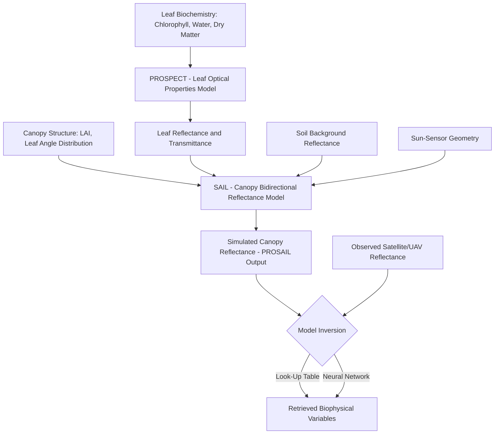
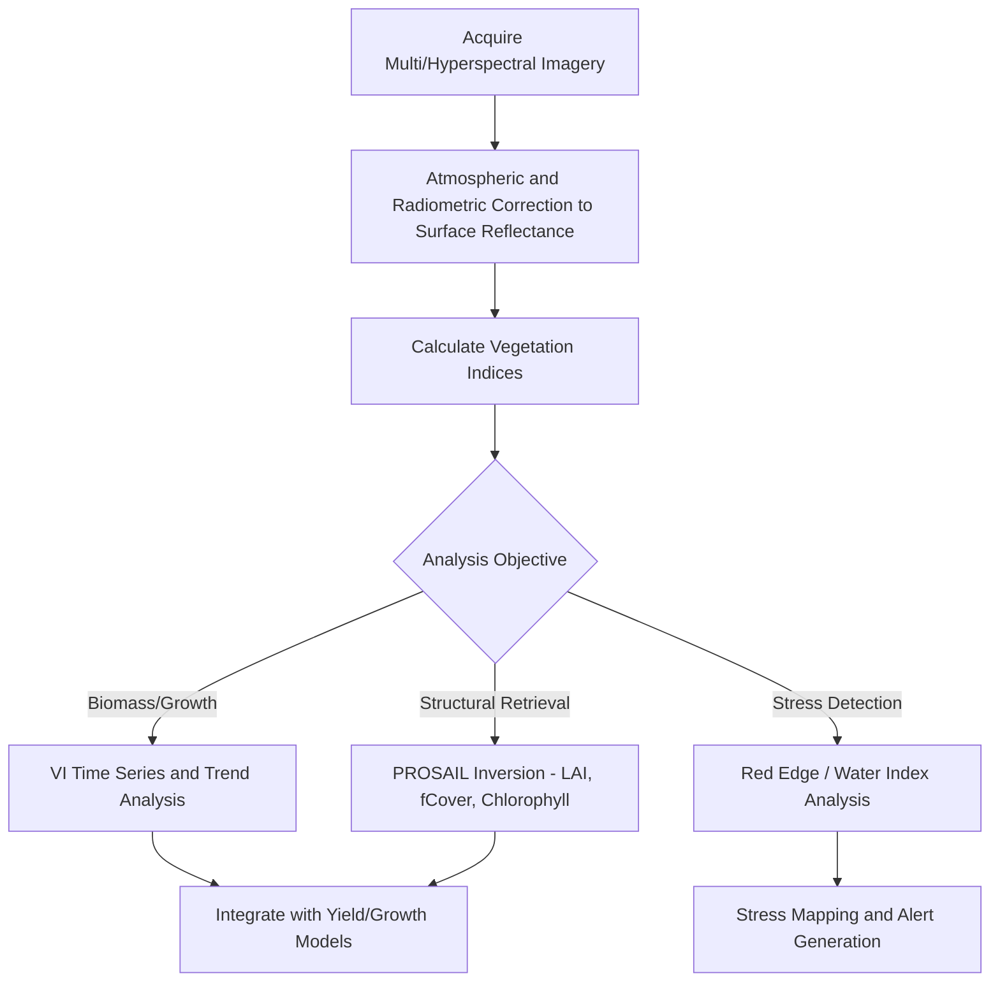

## Vegetation Indices and Canopy Analysis


### Overview

Vegetation indices (VIs) are mathematical combinations of spectral bands — most commonly exploiting the contrast between visible light absorption (chlorophyll) and near-infrared (NIR) reflection (mesophyll cell structure) — used to quantify vegetation presence, density, health, and biophysical/biochemical properties from remote sensing imagery. Canopy analysis extends this into structural and functional characterization: leaf area, canopy architecture, light interception, and stress detection, forming the spectral foundation for crop monitoring, precision agriculture, and ecosystem assessment.

### Spectral Basis of Vegetation Reflectance

#### The Vegetation Reflectance Signature

Healthy green vegetation exhibits a characteristic reflectance curve driven by leaf biochemistry and structure:

- **Visible region (400–700 nm)** — low reflectance due to strong chlorophyll absorption, with a small "green peak" (~550 nm) responsible for perceived leaf color
- **Red edge (680–750 nm)** — steep reflectance increase transitioning from chlorophyll absorption to NIR scattering; highly sensitive to chlorophyll content and often used for stress detection before visible symptoms appear
- **Near-infrared plateau (750–1300 nm)** — high reflectance from internal leaf mesophyll cell structure and air-water interfaces; largely insensitive to pigment concentration but highly sensitive to leaf structure/canopy density
- **Shortwave infrared (1300–2500 nm)** — dominated by leaf/canopy water content absorption features (~1450 nm, ~1940 nm)

**Key Points**

- The fundamental basis for most greenness indices is the strong NIR-red contrast unique to live, structurally intact vegetation
- Senescent or stressed vegetation shows reduced NIR reflectance and increased red reflectance, collapsing the NIR-red contrast that indices exploit
- The red edge position (inflection point wavelength) shifts toward shorter wavelengths ("blue shift") under chlorophyll degradation/stress, forming the basis of red-edge-based stress indices

### Major Vegetation Index Categories

#### Ratio-Based Indices

| Index | Formula | Notes |
| --- | --- | --- |
| Simple Ratio (SR) | $\frac{NIR}{Red}$ | Earliest VI; sensitive but unbounded, nonlinear response to LAI |
| NDVI | $\frac{NIR - Red}{NIR + Red}$ | Most widely used; bounded [-1,1]; saturates at high biomass |
| GNDVI (Green NDVI) | $\frac{NIR - Green}{NIR + Green}$ | More sensitive to chlorophyll concentration than NDVI |
| NDRE (Red Edge NDVI) | $\frac{NIR - RedEdge}{NIR + RedEdge}$ | Reduced saturation at high canopy density; sensitive to nitrogen status |

#### Soil-Adjusted and Atmospherically Resistant Indices

| Index | Formula | Purpose |
| --- | --- | --- |
| SAVI | $\frac{(NIR-Red)(1+L)}{NIR+Red+L}$ | Minimizes soil background influence; $L$=0.5 typical (canopy-density dependent) |
| MSAVI2 | $\frac{2NIR+1-\sqrt{(2NIR+1)^2-8(NIR-Red)}}{2}$ | Self-adjusting soil correction, no fixed $L$ parameter needed |
| ARVI | $\frac{NIR-(2Red-Blue)}{NIR+(2Red-Blue)}$ | Atmospherically resistant, corrects for aerosol scattering |
| EVI | $2.5\times\frac{NIR-Red}{NIR+6Red-7.5Blue+1}$ | Combines soil and atmospheric correction; improved sensitivity in dense canopy |
| EVI2 | $2.5\times\frac{NIR-Red}{NIR+2.4Red+1}$ | Two-band EVI variant, no blue band required (useful for sensors lacking blue) |

#### Chlorophyll and Nitrogen-Sensitive Indices

| Index | Formula | Application |
| --- | --- | --- |
| MCARI | $[(RedEdge-Red)-0.2(RedEdge-Green)]\times\frac{RedEdge}{Red}$ | Chlorophyll content, resistant to non-photosynthetic material |
| TCARI | $3[(RedEdge-Red)-0.2(RedEdge-Green)\frac{RedEdge}{Red}]$ | Similar chlorophyll targeting, often paired with OSAVI as TCARI/OSAVI |
| CIred-edge | $\frac{NIR}{RedEdge}-1$ | Chlorophyll Index, strong linear relationship with canopy chlorophyll content |
| PRI (Photochemical Reflectance Index) | $\frac{R_{531}-R_{570}}{R_{531}+R_{570}}$ | Xanthophyll cycle activity; proxy for photosynthetic light use efficiency |

#### Water and Moisture Indices

| Index | Formula | Application |
| --- | --- | --- |
| NDWI (Gao) | $\frac{NIR-SWIR}{NIR+SWIR}$ | Vegetation water content |
| NDWI (McFeeters) | $\frac{Green-NIR}{Green+NIR}$ | Surface water body delineation (distinct formula, same acronym — common source of confusion) |
| NDMI | $\frac{NIR-SWIR}{NIR+SWIR}$ | Functionally equivalent to Gao's NDWI; canopy moisture stress |
| WI (Water Index) | $\frac{R_{900}}{R_{970}}$ | Narrowband water absorption feature ratio |

**Key Points**

- The two "NDWI" formulas are unrelated in application despite the identical acronym; always verify which band combination a source is using
- SWIR-based moisture indices detect canopy water status changes days before visible wilting, useful for early drought stress detection

### Canopy Structural Analysis

#### Leaf Area Index (LAI)

LAI — the one-sided green leaf area per unit ground area (m²/m²) — is the primary structural variable linking canopy architecture to light interception, transpiration, and photosynthetic capacity.

**Measurement Methods**

- **Destructive sampling** — direct leaf area measurement from harvested plants (ground truth standard, labor-intensive)
- **Optical/indirect methods** — hemispherical (fisheye) photography, ceptometers (e.g., AccuPAR), and LAI-2200 plant canopy analyzers, which infer LAI from light transmission through canopy gaps using gap-fraction theory (Beer-Lambert-type light extinction)
- **Remote sensing empirical/physical retrieval** — VI-to-LAI regression or radiative transfer model inversion (e.g., PROSAIL)

**Beer-Lambert Light Extinction Model**

$$\frac{I}{I_0} = e^{-k \cdot LAI}$$

Where $I/I_0$ is the fraction of incident light transmitted through the canopy, and $k$ is the canopy extinction coefficient (species/canopy-architecture dependent, typically 0.3–0.8).

#### fAPAR and fCover

- **fAPAR (fraction of Absorbed Photosynthetically Active Radiation)** — the proportion of incoming PAR (400–700 nm) absorbed by green vegetation, directly linking canopy status to potential photosynthesis/biomass accumulation (see Radiation Use Efficiency models)
- **fCover (fractional vegetation cover)** — the fraction of ground area covered by vegetation in vertical projection, distinct from LAI (fCover saturates near 1.0 well before LAI reaches its maximum, since additional leaf layers add to LAI without changing the ground-projected cover fraction)

Empirical NDVI-fCover relationship (commonly used approximation):

$$fCover = \left(\frac{NDVI - NDVI_{soil}}{NDVI_{veg} - NDVI_{soil}}\right)^k$$

Where $NDVI_{soil}$ and $NDVI_{veg}$ are the NDVI values of bare soil and full vegetation cover endpoints respectively, and $k$ is an empirical shape parameter (often set to 1 for a linear mixing assumption).

### Radiative Transfer Modeling

Physically-based canopy analysis uses radiative transfer models (RTMs) to simulate canopy reflectance from first principles, enabling model inversion to retrieve biophysical variables without empirical VI-based calibration.

- **PROSPECT** — leaf-level optical properties model, simulating leaf reflectance/transmittance from biochemical parameters (chlorophyll content, water content, dry matter, leaf structure parameter N)
- **SAIL (Scattering by Arbitrarily Inclined Leaves)** — canopy-level model simulating bidirectional reflectance from LAI, leaf angle distribution, soil background, and illumination geometry
- **PROSAIL** — the coupled PROSPECT+SAIL model, widely used for both forward simulation (generating training data for ML retrieval algorithms) and inversion (retrieving LAI, chlorophyll, etc. from observed reflectance via look-up table matching or neural network inversion)



### Implementation Examples

#### Python — Vegetation Index Calculation Suite (rasterio/numpy)

```python
import numpy as np
import rasterio

def calculate_vegetation_indices(red, nir, green=None, blue=None, red_edge=None, swir=None):
    """
    Calculate a suite of vegetation indices from spectral bands.
    All bands expected as reflectance values (0-1) as numpy arrays.
    """
    eps = 1e-10  # avoid division by zero
    indices = {}

    # NDVI
    indices['NDVI'] = (nir - red) / (nir + red + eps)

    # SAVI (L=0.5)
    L = 0.5
    indices['SAVI'] = ((nir - red) * (1 + L)) / (nir + red + L + eps)

    # MSAVI2
    indices['MSAVI2'] = (2 * nir + 1 - np.sqrt(
        np.clip((2 * nir + 1) ** 2 - 8 * (nir - red), 0, None)
    )) / 2

    # EVI2 (no blue band required)
    indices['EVI2'] = 2.5 * (nir - red) / (nir + 2.4 * red + 1 + eps)

    if green is not None:
        indices['GNDVI'] = (nir - green) / (nir + green + eps)

    if blue is not None:
        # Full EVI
        indices['EVI'] = 2.5 * (nir - red) / (nir + 6 * red - 7.5 * blue + 1 + eps)
        # ARVI
        rb = 2 * red - blue
        indices['ARVI'] = (nir - rb) / (nir + rb + eps)

    if red_edge is not None:
        indices['NDRE'] = (nir - red_edge) / (nir + red_edge + eps)
        indices['CIrededge'] = (nir / (red_edge + eps)) - 1

    if swir is not None:
        indices['NDMI'] = (nir - swir) / (nir + swir + eps)

    return indices

# Example usage with a multi-band raster
with rasterio.open("multispectral_scene.tif") as src:
    blue = src.read(1).astype(float) / 10000  # scale factor for typical Sentinel-2 L2A
    green = src.read(2).astype(float) / 10000
    red = src.read(3).astype(float) / 10000
    red_edge = src.read(4).astype(float) / 10000
    nir = src.read(5).astype(float) / 10000
    swir = src.read(6).astype(float) / 10000
    profile = src.profile

vi_results = calculate_vegetation_indices(red, nir, green, blue, red_edge, swir)

profile.update(dtype=rasterio.float32, count=1)
for name, array in vi_results.items():
    with rasterio.open(f"{name}.tif", "w", **profile) as dst:
        dst.write(array.astype(rasterio.float32), 1)
```

#### Python — NDVI-to-LAI and fCover Empirical Conversion

```python
import numpy as np

def ndvi_to_fcover(ndvi, ndvi_soil=0.05, ndvi_veg=0.90, k=1.0):
    """
    Convert NDVI to fractional vegetation cover using empirical
    linear mixing model between bare soil and full vegetation endpoints.
    """
    fcover = ((ndvi - ndvi_soil) / (ndvi_veg - ndvi_soil)) ** k
    return np.clip(fcover, 0, 1)

def ndvi_to_lai_exponential(ndvi, lai_max=6.0, extinction_k=0.6):
    """
    Empirical NDVI-to-LAI conversion using inverted Beer-Lambert relationship.
    Note: This is a simplified empirical approximation; PROSAIL-based
    look-up table inversion is preferred for rigorous LAI retrieval.
    """
    # Saturating exponential response typical of NDVI-LAI relationships
    lai = -np.log(1 - np.clip(ndvi, 0, 0.99)) / extinction_k
    return np.clip(lai, 0, lai_max)
```

#### Red Edge Inflection Point (REIP) Calculation

```python
import numpy as np

def calculate_reip(r670, r700, r740, r780):
    """
    Calculate Red Edge Inflection Point using the four-band linear
    interpolation method (Guyot & Baret, 1988).
    Bands correspond to reflectance at approximately 670, 700, 740, 780 nm.
    Sensitive early indicator of chlorophyll/nitrogen stress.
    """
    r_re = (r670 + r780) / 2
    reip = 700 + 40 * ((r_re - r700) / (r740 - r700))
    return reip  # wavelength in nm; healthy vegetation typically 720-730nm,
                 # shifts toward shorter wavelengths under stress
```

### Canopy Analysis Workflow



### Index Selection Considerations

**Key Points**

- **Saturation behavior** — NDVI saturates at moderate-to-high LAI (typically LAI > 3); red-edge-based and SWIR-incorporating indices maintain sensitivity at higher biomass levels, making them preferable for dense canopy monitoring
- **Soil background sensitivity** — early-season monitoring with sparse canopy cover benefits substantially from soil-adjusted indices (SAVI/MSAVI2) over raw NDVI
- **Atmospheric sensitivity** — indices incorporating the blue band (EVI, ARVI) provide improved atmospheric aerosol correction but require higher-quality atmospheric correction of the blue band itself, which is more susceptible to scattering noise
- **Sensor band availability** — red-edge indices require sensors with a dedicated red-edge band (Sentinel-2, RapidEye, many UAV multispectral sensors); not available on standard RGB+NIR or Landsat-class sensors

### Hyperspectral Canopy Analysis

Beyond multispectral broadband indices, hyperspectral imaging (narrow, contiguous bands, often 5-10nm width across 400-2500nm) enables:

- **Continuum removal analysis** — normalizing absorption features against a spectral continuum baseline to isolate specific biochemical absorption signatures (e.g., cellulose, lignin, nitrogen)
- **Derivative spectroscopy** — first/second derivative transforms to sharpen subtle absorption features and reduce baseline/illumination effects
- **Partial Least Squares Regression (PLSR)** — standard chemometric approach for relating full-spectrum hyperspectral data to biochemical/biophysical target variables, handling the high collinearity between adjacent narrow bands
- **Narrowband index optimization** — systematic band-combination search (e.g., all possible two-band NDVI-type ratios) to identify optimal wavelength pairs for a specific biochemical target, since standard broadband indices may not use optimal wavelengths for a given hyperspectral sensor

[Unverified] The specific performance gains of hyperspectral over multispectral indices for a given biochemical/structural target vary considerably by canopy type, growth stage, and atmospheric conditions, and should be evaluated against current sensor-specific validation studies rather than assumed uniformly superior.

### Conclusion

Vegetation indices and canopy analysis translate spectral reflectance measurements into quantitative, interpretable descriptors of vegetation status — from simple ratio-based greenness proxies through soil/atmosphere-corrected indices to physically-based radiative transfer model inversion. Effective application requires matching index selection to canopy density regime, sensor band availability, and target biophysical/biochemical variable, with increasing operational reliance on red-edge and SWIR-based indices to overcome the saturation limitations of foundational indices like NDVI.

**Related Topics**

- Radiative Transfer Modeling (PROSPECT, SAIL, PROSAIL)
- Hyperspectral Remote Sensing and Chemometrics
- Leaf Area Index Retrieval Methods
- Crop Water Stress Detection via Thermal and SWIR Sensing
- UAV Multispectral and Hyperspectral Sensor Systems
- Atmospheric Correction Techniques for Optical Imagery
- Machine Learning for Biophysical Variable Retrieval
- Crop Monitoring and Yield Estimation
- Plant Nitrogen Status Remote Sensing
- Time-Series Phenological Curve Fitting