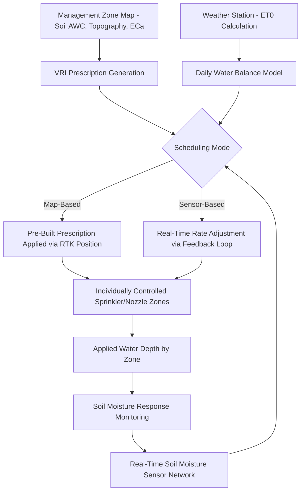

## Soil and Irrigation Management Technologies


### Overview

Soil and Irrigation Management Technologies encompass the sensing, modeling, and control systems used to characterize soil physical/chemical properties and deliver water to crops with spatial and temporal precision. This spans soil sampling and mapping methodologies, soil moisture sensing networks, evapotranspiration-based irrigation scheduling, variable rate irrigation (VRI) systems, and the digital soil mapping techniques that translate point observations into continuous spatial predictions.

### Soil Sampling and Characterization

#### Traditional Grid and Zone Sampling

- **Grid sampling** — soil samples collected at regular intervals (commonly 1–2.5 ha grid cells) across a field, providing unbiased spatial coverage but potentially missing localized variability between grid points
- **Zone sampling** — samples targeted within pre-delineated management zones (derived from yield history, ECa, or imagery), reducing sample count while capturing zone-representative variability, but dependent on the quality of prior zone delineation
- **Directed/adaptive sampling** — sample locations selected using conditioned Latin Hypercube Sampling (cLHS) or similar algorithms to optimally represent the full range of covariate (e.g., terrain, ECa) variability with minimal samples

#### Proximal Soil Sensing

| Sensor Type | Measures | Principle |
| --- | --- | --- |
| Electromagnetic induction (EMI) | Apparent electrical conductivity (ECa) | Correlates with texture, moisture, salinity, cation exchange capacity |
| Electrical resistivity (ER) | Soil resistivity/conductivity profile | Direct-contact electrode arrays; depth-resolved |
| Visible-NIR spectroscopy | Organic matter, texture, moisture (via spectral signature) | Diffuse reflectance spectroscopy, chemometric calibration |
| Gamma-ray spectrometry | K, Th, U radioisotope concentrations | Correlates with parent material and clay content |
| Penetrometer (cone index) | Soil compaction/bulk density proxy | Mechanical resistance to probe insertion |

**Key Points**

- ECa is not a direct soil property but an integrated proxy signal responding to multiple co-varying factors (texture, moisture, salinity); interpretation requires field-specific calibration against ground-truth soil samples
- Proximal sensors enable dense, continuous spatial coverage (thousands of readings per field) compared to discrete lab-sample grids, forming a primary input layer for management zone delineation

### Digital Soil Mapping (DSM)

Digital Soil Mapping predicts continuous soil property surfaces from point observations using environmental covariates, following the **SCORPAN** framework (an extension of the classical soil-forming factors model):

$$S = f(s, c, o, r, p, a, n)$$

Where $S$ is the soil property/class to predict, and covariates are: $s$ = soil (other known soil properties), $c$ = climate, $o$ = organisms (vegetation/land use), $r$ = relief (terrain attributes), $p$ = parent material, $a$ = age (time), $n$ = spatial position (as a proxy for unaccounted spatially-structured variation).

#### Common DSM Predictive Approaches

- **Regression Kriging** — combines a deterministic regression on environmental covariates with kriging interpolation of the regression residuals, capturing both covariate-driven trend and spatially autocorrelated local variation
- **Random Forest / Gradient Boosting** — increasingly dominant approach (e.g., underlying SoilGrids global product), handling nonlinear covariate interactions without distributional assumptions, though typically requiring separate spatial residual correction if strong local autocorrelation remains
- **Cubist/regression trees** — piecewise linear regression models, historically popular for DSM due to interpretability

**Regression Kriging Formulation**

$$\hat{Z}(x_0) = \hat{m}(x_0) + \hat{e}(x_0)$$

Where $\hat{m}(x_0)$ is the predicted trend from regression on covariates at location $x_0$, and $\hat{e}(x_0)$ is the kriged interpolation of regression residuals from nearby sample points.

### Soil Moisture Sensing

#### Sensor Technologies

| Technology | Measurement Principle | Typical Depth Range | Notes |
| --- | --- | --- | --- |
| Capacitance/FDR (Frequency Domain Reflectometry) | Dielectric permittivity via capacitance | Point/profile (10-100cm probes) | Cost-effective, widely deployed in networks |
| TDR (Time Domain Reflectometry) | Dielectric permittivity via signal travel time | Point/profile | Higher accuracy than FDR, higher cost |
| Neutron probe | Hydrogen atom scattering (proxy for water content) | Profile, deep access tubes | Highly accurate reference method; radioactive source handling requirements |
| Tensiometer | Soil water tension (matric potential) directly | Point, shallow-moderate depth | Direct plant-available water stress indicator; limited range (near saturation to ~-85 kPa) |
| Gypsum/granular matrix blocks | Electrical resistance as proxy for matric potential | Point | Low-cost, lower precision, degrades over time |
| Satellite microwave (SMAP, ASCAT) | Passive/active microwave backscatter | Surface (top ~5cm) | Regional/global coverage, coarse resolution (9-40km) |

**Key Points**

- Volumetric water content (VWC, cm³/cm³) and matric potential (kPa/bar) are distinct measurement types; VWC-based sensors (FDR/TDR/neutron) must be converted via a soil-specific water retention curve to interpret plant water stress, while tensiometers measure stress-relevant potential directly
- Sensor placement depth should correspond to the active root zone of the target crop, with multi-depth profile installations preferred over single-depth point measurements for irrigation scheduling accuracy

### Irrigation Scheduling Methods

#### Soil Water Balance (Checkbook) Method

Tracks a running water balance using the FAO-56 Penman-Monteith reference evapotranspiration framework:

$$ET_c = K_c \times ET_0$$

Where $ET_c$ is crop evapotranspiration, $K_c$ is the crop coefficient (varies by growth stage — initial, development, mid-season, late-season), and $ET_0$ is reference evapotranspiration (calculated from weather station data: temperature, humidity, wind speed, solar radiation).

**FAO-56 Penman-Monteith Reference ET Equation**

$$ET_0 = \frac{0.408\Delta(R_n - G) + \gamma\frac{900}{T+273}u_2(e_s-e_a)}{\Delta+\gamma(1+0.34u_2)}$$

Where $\Delta$ is the slope of the saturation vapor pressure curve, $R_n$ is net radiation, $G$ is soil heat flux, $\gamma$ is the psychrometric constant, $T$ is air temperature, $u_2$ is wind speed at 2m, and $e_s - e_a$ is the vapor pressure deficit.

**Daily Water Balance Update**

$$D_r(i) = D_r(i-1) - P(i) - I(i) + ET_c(i) + RO(i) + DP(i)$$

Where $D_r$ is root zone depletion, $P$ is precipitation, $I$ is irrigation, $RO$ is runoff, and $DP$ is deep percolation, tracked daily against a Management Allowable Depletion (MAD) threshold that triggers irrigation.

#### Soil Moisture Sensor-Based Scheduling

Direct feedback control using real-time soil moisture data against crop-specific thresholds (field capacity, permanent wilting point, and a management-defined "trigger point" typically at 40-60% plant available water depletion).

#### Plant-Based Indicators

- **Stem/trunk water potential** (pressure chamber method) — direct plant water status measurement, considered a gold-standard reference in tree/vine crops
- **Canopy temperature/thermal remote sensing** — Crop Water Stress Index (CWSI) derived from canopy-minus-air temperature differential, since transpiring (well-watered) canopies remain cooler than ambient air while stressed canopies approach or exceed air temperature
- **Sap flow sensors** — direct transpiration rate measurement via heat pulse/heat balance methods on stems

**Crop Water Stress Index (CWSI)**

$$CWSI = \frac{(T_c - T_a) - (T_c - T_a)_{LL}}{(T_c - T_a)_{UL} - (T_c - T_a)_{LL}}$$

Where $T_c - T_a$ is measured canopy-air temperature differential, and $LL$/$UL$ are the empirically or theoretically derived lower and upper baselines representing well-watered (non-stressed) and non-transpiring (maximally stressed) reference conditions respectively.

### Variable Rate Irrigation (VRI) Systems

#### System Architecture

VRI retrofits or purpose-builds center pivot or linear-move irrigation systems with individually controllable sprinkler zones, enabling spatially differentiated water application matched to management zones (soil water-holding capacity, topography, crop stress patterns).



**Key Points**

- **Zone control** — pivot span divided into discrete control zones (individual sprinklers or sprinkler groups), each independently switched/throttled
- **Speed control** — simpler VRI approach varying only the pivot's travel speed sector-by-sector (angular zones), cannot vary rate along the radial dimension
- **Full VRI** — combines both zone (radial) and speed/timing (angular) control for true two-dimensional spatial application control

### Implementation Examples

#### Python — Soil Water Balance Irrigation Scheduling Model

```python
import numpy as np
import pandas as pd

def fao56_water_balance(weather_df, crop_coeff_by_stage, field_capacity_mm,
                          wilting_point_mm, root_depth_m, mad_fraction=0.5,
                          initial_depletion_mm=0):
    """
    Simplified FAO-56 style daily soil water balance for irrigation scheduling.
    weather_df: DataFrame with columns [date, et0_mm, precip_mm, growth_stage]
    crop_coeff_by_stage: dict mapping growth_stage -> Kc value
    """
    taw = (field_capacity_mm - wilting_point_mm) * root_depth_m  # Total Available Water
    raw = taw * mad_fraction  # Readily Available Water (irrigation trigger threshold)

    results = []
    depletion = initial_depletion_mm

    for _, row in weather_df.iterrows():
        kc = crop_coeff_by_stage.get(row['growth_stage'], 1.0)
        etc = kc * row['et0_mm']

        # Update depletion: increases with ETc, decreases with rain/irrigation
        depletion += etc - row['precip_mm']
        depletion = max(depletion, 0)  # cannot go below zero (excess drains)

        irrigation_needed = depletion >= raw
        irrigation_amount = min(depletion, taw) if irrigation_needed else 0

        if irrigation_needed:
            depletion -= irrigation_amount  # refill to field capacity

        results.append({
            'date': row['date'],
            'etc_mm': etc,
            'depletion_mm': depletion,
            'irrigation_trigger': irrigation_needed,
            'recommended_irrigation_mm': irrigation_amount
        })

    return pd.DataFrame(results)

# Example crop coefficient schedule (maize, FAO-56 typical values)
kc_schedule = {
    'initial': 0.3,
    'development': 0.7,
    'mid_season': 1.2,
    'late_season': 0.6
}
```

#### Python — Crop Water Stress Index from Thermal Imagery

```python
import numpy as np

def calculate_cwsi(canopy_temp, air_temp, vpd, 
                     cwsi_baseline_slope=-2.5, cwsi_baseline_intercept=1.5,
                     upper_limit_temp_diff=5.0):
    """
    Calculate CWSI using the empirical (non-water-stressed baseline) method.
    canopy_temp, air_temp: arrays in degrees C
    vpd: vapor pressure deficit (kPa), used for non-water-stressed baseline
    """
    dt_measured = canopy_temp - air_temp

    # Non-water-stressed baseline (lower limit): linear function of VPD
    dt_lower_limit = cwsi_baseline_intercept + cwsi_baseline_slope * vpd

    # Upper limit: non-transpiring canopy (theoretical or empirically determined)
    dt_upper_limit = np.full_like(dt_measured, upper_limit_temp_diff)

    cwsi = (dt_measured - dt_lower_limit) / (dt_upper_limit - dt_lower_limit)
    return np.clip(cwsi, 0, 1)
```

#### Digital Soil Mapping — Regression Kriging (Python/scikit-learn + pykrige)

```python
import numpy as np
from sklearn.ensemble import RandomForestRegressor
from pykrige.ok import OrdinaryKriging

def regression_kriging_soil_property(sample_coords, sample_values, 
                                        sample_covariates, grid_covariates,
                                        grid_coords):
    """
    Digital soil mapping via regression kriging: RF regression on
    covariates + kriging of residuals.
    sample_covariates: (n_samples, n_features) array (elevation, slope, NDVI, etc.)
    grid_covariates: (n_grid_points, n_features) array for prediction grid
    """
    # Step 1: Fit regression model on covariates
    rf = RandomForestRegressor(n_estimators=300, max_depth=10, random_state=42)
    rf.fit(sample_covariates, sample_values)

    # Step 2: Compute residuals at sample locations
    predicted_at_samples = rf.predict(sample_covariates)
    residuals = sample_values - predicted_at_samples

    # Step 3: Krige the residuals
    ok = OrdinaryKriging(
        sample_coords[:, 0], sample_coords[:, 1], residuals,
        variogram_model='spherical', verbose=False, enable_plotting=False
    )
    kriged_residuals, kriged_variance = ok.execute(
        'points', grid_coords[:, 0], grid_coords[:, 1]
    )

    # Step 4: Combine regression trend + kriged residuals
    trend_at_grid = rf.predict(grid_covariates)
    final_prediction = trend_at_grid + kriged_residuals

    return final_prediction, kriged_variance
```

### Salinity and Water Quality Management

- **Soil salinity mapping** — EMI-based ECa surveys combined with soil sampling to map spatial salinity distribution, critical in irrigated arid/semi-arid systems prone to secondary salinization
- **Leaching Requirement (LR)** calculation — determines additional irrigation water needed beyond crop ET to leach accumulated salts below the root zone:

$$LR = \frac{EC_w}{5 \times EC_e - EC_w}$$

Where $EC_w$ is irrigation water electrical conductivity and $EC_e$ is the target soil saturation extract EC threshold for the crop's salt tolerance.

- **Irrigation water quality indices** — Sodium Adsorption Ratio (SAR) for assessing sodicity hazard and potential soil structural degradation from irrigation water sodium content relative to calcium/magnesium

### Common Implementation Pitfalls

- Deploying soil moisture sensors without site-specific calibration against local soil texture, since factory-default calibration curves (typically calibrated on sand) can introduce substantial error in clay-dominant soils
- Using a single-depth soil moisture sensor without accounting for root distribution across the profile, missing deep-root water uptake or shallow-zone over-irrigation
- Applying generic crop coefficient (Kc) tables without local adjustment for planting density, cultivar, or regional climate deviation from FAO-56 reference conditions
- Ignoring spatial ECa-to-soil-property calibration transferability limits; ECa-based zone maps calibrated in one field/soil type generally require recalibration when applied elsewhere [Inference — the degree of transferability loss depends on how similar parent material and texture are between locations]

### Conclusion

Soil and irrigation management technologies form an integrated sensing-to-control pipeline: proximal and remote soil sensing feeds digital soil mapping and management zone delineation, which in turn informs spatially and temporally precise irrigation scheduling through water balance modeling, direct soil/plant sensing, and variable rate application hardware. Effective implementation depends on rigorous local calibration of both soil sensors and crop coefficients, since transferring generic parameters across soil types and climates introduces the largest source of scheduling error in practice.

**Related Topics**

- FAO-56 Penman-Monteith Evapotranspiration Modeling
- Electromagnetic Induction (EMI) Soil Surveying
- Regression Kriging and Geostatistical Interpolation
- Thermal Remote Sensing for Crop Water Stress
- Soil Salinity and Sodicity Management
- SoilGrids and Global Digital Soil Mapping Products
- Center Pivot and Linear-Move Irrigation Engineering
- Management Zone Delineation (Precision Agriculture Fundamentals)
- Soil Water Retention Curves and Pedotransfer Functions
- Remote Sensing-Based Soil Moisture Products (SMAP, ASCAT)