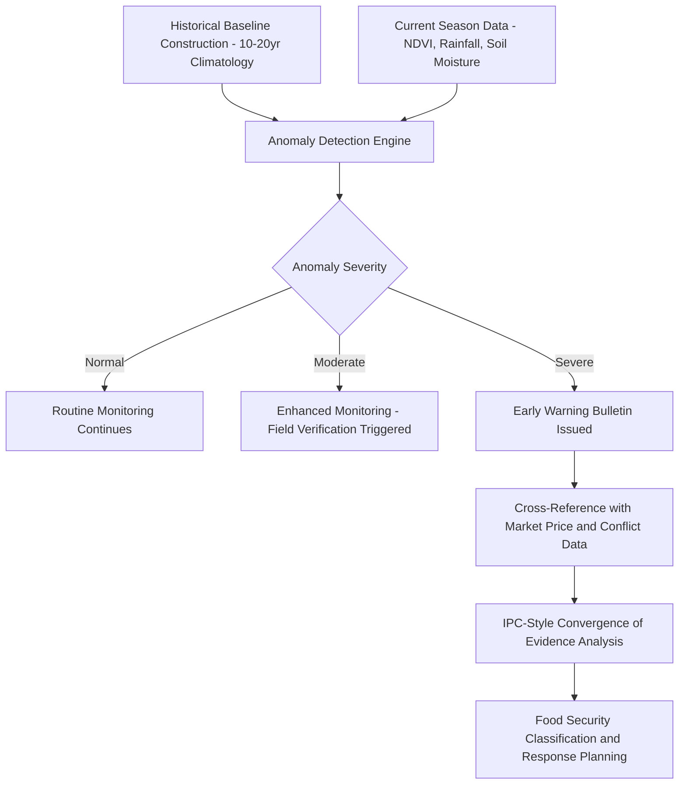
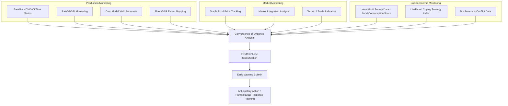

## Agricultural Risk and Food Security Assessment


### Overview

Agricultural Risk and Food Security Assessment applies geospatial monitoring, statistical modeling, and early warning systems to identify, quantify, and forecast threats to crop production and food access at farm, regional, and national scales. This integrates climate/weather risk analysis, crop failure and yield anomaly detection, drought/flood early warning, market and price monitoring, and multidimensional food security indicator frameworks used by humanitarian and government agencies for anticipatory action and response planning.

### Food Security Conceptual Framework

#### The Four Pillars of Food Security

The FAO framework defines food security across four interdependent dimensions, each requiring distinct assessment approaches:

1. **Availability** — sufficient quantities of food supplied through production, stocks, and trade (assessed via crop production estimates, yield forecasting, stock monitoring)
2. **Access** — physical and economic ability of households to obtain food (assessed via market price monitoring, income/livelihood analysis, purchasing power indices)
3. **Utilization** — adequate dietary intake, nutrient absorption, and food safety (assessed via nutrition surveys, dietary diversity scores, health/sanitation indicators)
4. **Stability** — consistency of the above three dimensions over time, resilient to shocks (assessed via vulnerability analysis, shock/hazard frequency mapping)

**Key Points**

- A geospatial risk assessment predominantly addresses the *Availability* and *Stability* pillars through production and hazard monitoring, while *Access* and *Utilization* require complementary socioeconomic and health data collection
- Food insecurity can arise from failure in any single pillar even when others remain adequate — e.g., sufficient national food availability coexisting with severe localized access failure due to conflict or market disruption

#### Integrated Food Security Phase Classification (IPC/CH)

The IPC (Integrated Food Security Phase Classification) is the dominant international standard for classifying food insecurity severity, using a 5-phase scale based on convergence of evidence across multiple indicators:

| Phase | Classification | General Description |
| --- | --- | --- |
| 1 | Minimal | Household food consumption adequate; no atypical coping strategies |
| 2 | Stressed | Minimally adequate consumption; stress-coping strategies employed |
| 3 | Crisis | Food consumption gaps with high/above-usual acute malnutrition |
| 4 | Emergency | Large food consumption gaps; excess mortality risk |
| 5 | Catastrophe/Famine | Extreme food gaps; starvation, death, destitution evident |

IPC classification synthesizes evidence from food consumption scores, livelihood coping strategy indices, acute malnutrition prevalence, and mortality data — deliberately combining multiple convergent data streams rather than relying on any single indicator.

### Agricultural Drought Monitoring and Early Warning

#### Drought Index Taxonomy

| Index | Category | Input Data | Typical Timescale |
| --- | --- | --- | --- |
| SPI (Standardized Precipitation Index) | Meteorological | Precipitation only | 1-48 months (multi-scale) |
| SPEI (Standardized Precipitation-Evapotranspiration Index) | Meteorological | Precipitation minus PET | 1-48 months |
| PDSI (Palmer Drought Severity Index) | Meteorological/Soil | Precipitation, temperature, soil water balance | Monthly, longer memory |
| VCI (Vegetation Condition Index) | Agricultural | NDVI relative to historical min/max | Dekadal/monthly |
| VHI (Vegetation Health Index) | Agricultural | Combines VCI and Temperature Condition Index | Dekadal/monthly |
| ESI (Evaporative Stress Index) | Agricultural | Actual-to-potential evapotranspiration ratio | Weekly-monthly |
| SMI (Soil Moisture Index) | Agricultural/Hydrological | Satellite or modeled soil moisture percentile | Sub-monthly |

**Vegetation Condition Index (VCI) Formula**

$$VCI = \frac{NDVI - NDVI_{min}}{NDVI_{max} - NDVI_{min}} \times 100$$

Where $NDVI_{min}$ and $NDVI_{max}$ are the historical minimum and maximum NDVI for that location and time-of-year across the reference climatology period, normalizing current vegetation condition against the location's own historical range rather than an absolute threshold.

**Key Points**

- Meteorological drought indices (SPI, SPEI) lead agricultural impact by weeks to months, useful for early warning before vegetation stress becomes visible
- Agricultural/vegetation-based indices (VCI, VHI) directly observe crop stress but lag the precipitation deficit that caused it, limiting their use for the earliest-possible warning
- Combining meteorological and vegetation indices in a composite drought monitor (e.g., US/Africa Drought Monitor-style classification) improves both lead time and confirmation robustness over either category alone

### Crop Failure and Anomaly Detection

#### Anomaly-Based Monitoring Approach

Operational agricultural monitoring systems compare current-season indicators against historical baselines to flag anomalous conditions requiring closer assessment:

$$Z_{anomaly} = \frac{X_{current} - \bar{X}_{historical}}{\sigma_{X,historical}}$$

Applied to NDVI, rainfall, soil moisture, or modeled yield, with typical alert thresholds at $Z < -1$ (below normal) or $Z < -2$ (severe anomaly), though threshold calibration is region and crop-specific.

#### Yield Gap and Loss Estimation

$$\text{Yield Gap} = Y_{potential} - Y_{actual}$$

Where $Y_{potential}$ is the water/nutrient-unlimited attainable yield (from crop simulation models or high-performing reference field benchmarks) and $Y_{actual}$ is observed/estimated yield, used to distinguish management-correctable losses from hard biophysical constraints.



### Flood Risk and Excess Water Monitoring

- **SAR-based flood mapping** — Sentinel-1 backscatter change detection identifies inundated areas (flooded surfaces show characteristically low, specular backscatter) independent of cloud cover, critical during monsoon-season flood events when optical imagery is unavailable
- **Optical water indices** — NDWI/MNDWI-based surface water extent mapping during cloud-free periods, complementing SAR for change confirmation
- **Hydrological/hydraulic modeling** — physically-based flood extent and depth simulation (e.g., HEC-RAS, LISFLOOD-FP) using DEM and streamflow/precipitation forcing, enabling forecast-based (rather than only observed) flood risk assessment
- **Crop-specific flood damage assessment** — overlaying flood extent with crop-type/growth-stage maps to estimate agricultural loss, since flood damage severity depends heavily on crop developmental stage at time of inundation

### Market and Price Risk Monitoring

Food security assessment integrates market functioning indicators alongside production risk, since production shocks translate to food insecurity partly through price transmission:

- **Price anomaly detection** — comparing current staple food market prices against seasonal historical patterns (similar Z-score/percentile approach to production anomalies)
- **Market integration analysis** — assessing whether price signals transmit normally between markets (disrupted integration, e.g., from conflict or infrastructure damage, can cause severe localized price spikes even with adequate regional supply)
- **Terms of trade** — ratio of livestock-to-cereal prices or wage-to-cereal prices, particularly critical in pastoralist and casual-labor-dependent livelihood zones where purchasing power (not own production) determines food access

### Implementation Examples

#### Python — Composite Drought/Anomaly Monitoring System

```python
import numpy as np
import xarray as xr

def calculate_vci(ndvi_current, ndvi_historical_stack):
    """
    Calculate Vegetation Condition Index from current NDVI and
    a historical stack of same-period NDVI observations.
    ndvi_historical_stack: array of shape (n_years, height, width)
    """
    ndvi_min = np.nanmin(ndvi_historical_stack, axis=0)
    ndvi_max = np.nanmax(ndvi_historical_stack, axis=0)

    vci = ((ndvi_current - ndvi_min) / (ndvi_max - ndvi_min + 1e-10)) * 100
    return np.clip(vci, 0, 100)

def calculate_composite_drought_index(spi_zscore, vci, weight_spi=0.5, weight_vci=0.5):
    """
    Combine meteorological (SPI) and agricultural (VCI) drought signals
    into a composite index. VCI rescaled to comparable z-score-like range.
    """
    vci_scaled = (vci - 50) / 25  # rough rescale to approximate z-score range

    composite = weight_spi * spi_zscore + weight_vci * vci_scaled

    # Classification thresholds (illustrative, region-calibration recommended)
    classification = np.select(
        [composite <= -2, composite <= -1.5, composite <= -1, composite <= 0],
        ['Extreme Drought', 'Severe Drought', 'Moderate Drought', 'Mild Dryness'],
        default='Normal/Wet'
    )
    return composite, classification

def flag_anomalies(current_values, historical_mean, historical_std, 
                     moderate_threshold=-1.0, severe_threshold=-2.0):
    """
    Generic anomaly flagging for any indicator time series
    (NDVI, rainfall, soil moisture, modeled yield).
    """
    z_scores = (current_values - historical_mean) / historical_std

    alert_level = np.select(
        [z_scores <= severe_threshold, z_scores <= moderate_threshold],
        ['Severe', 'Moderate'],
        default='Normal'
    )
    return z_scores, alert_level
```

#### Python — SAR-Based Flood Extent Detection

```python
import numpy as np
import rasterio

def detect_flood_extent_sar(vv_pre_flood, vv_post_flood, threshold_db=-3.0):
    """
    Detect flood extent using SAR backscatter change detection.
    Flooded surfaces show sharp backscatter decrease due to specular
    reflection away from the sensor (smooth water surface).
    vv_pre_flood, vv_post_flood: VV polarization backscatter in dB
    """
    backscatter_change = vv_post_flood - vv_pre_flood

    # Flood candidates: significant decrease in backscatter
    flood_candidate = backscatter_change <= threshold_db

    # Additional threshold: absolute low backscatter (water is typically < -17dB in VV)
    water_absolute_threshold = vv_post_flood <= -17.0

    flood_mask = flood_candidate & water_absolute_threshold

    return flood_mask.astype(np.uint8)

def calculate_crop_flood_loss(flood_mask, crop_type_raster, growth_stage_raster,
                                 vulnerability_table):
    """
    Estimate agricultural flood damage by overlaying flood extent with
    crop type and growth stage, applying stage-specific vulnerability factors.
    vulnerability_table: dict of {(crop_type, growth_stage): loss_fraction}
    """
    loss_fraction_map = np.zeros_like(flood_mask, dtype=float)

    for (crop, stage), loss_frac in vulnerability_table.items():
        mask = (crop_type_raster == crop) & (growth_stage_raster == stage) & (flood_mask == 1)
        loss_fraction_map[mask] = loss_frac

    return loss_fraction_map
```

#### Yield Gap Analysis

```python
import numpy as np

def calculate_yield_gap(actual_yield, potential_yield_model, water_limited_yield=None):
    """
    Decompose yield gap into water-limitation-explained and
    management-explained components.
    """
    total_gap = potential_yield_model - actual_yield

    if water_limited_yield is not None:
        # Gap explained by water limitation (biophysical, less correctable short-term)
        water_gap = potential_yield_model - water_limited_yield
        # Remaining gap attributable to management (more actionable)
        management_gap = water_limited_yield - actual_yield

        return {
            "total_yield_gap": total_gap,
            "water_limited_gap": water_gap,
            "management_gap": management_gap,
            "gap_closure_potential_pct": (management_gap / total_gap) * 100
        }

    return {"total_yield_gap": total_gap}
```

### Food Security Early Warning System Architecture



### Institutional Frameworks and Data Sources

- **FEWS NET (Famine Early Warning Systems Network)** — USAID-funded early warning system integrating remote sensing, market, and livelihood data for food insecurity forecasting, primarily in Africa, Central America, and parts of Asia
- **GEOGLAM (Group on Earth Observations Global Agricultural Monitoring)** — international initiative providing crop condition assessments and the Crop Monitor product for major producing/exporting countries
- **WFP VAM (Vulnerability Analysis and Mapping)** — World Food Programme's food security analysis unit combining household surveys with remote sensing indicators
- **IPC/CH Global Partnership** — the standard-setting body for the Integrated Food Security Phase Classification, coordinating multi-agency technical consensus processes
- **ASAP (Anomaly hot Spots of Agricultural Production)** — EU JRC system for early warning of agricultural production anomalies at global scale
- **CHIRPS (Climate Hazards InfraRed Precipitation with Station data)** — widely used satellite-gauge blended precipitation dataset for drought monitoring in data-sparse regions

### Vulnerability and Resilience Assessment

Beyond acute shock monitoring, longer-term vulnerability assessment identifies structural risk factors:

- **Livelihood zoning** — classifying geographic areas by dominant livelihood strategy (agro-pastoral, cereal cropping, fishing, wage labor), since shock sensitivity and coping capacity differ fundamentally by livelihood type
- **Exposure-sensitivity-adaptive capacity framework** — decomposing vulnerability into hazard exposure, biophysical/economic sensitivity to that hazard, and the adaptive capacity (assets, institutions, diversification) available to cope
- **Multi-hazard risk layering** — combining drought, flood, conflict, and market-disruption risk surfaces to identify compound-risk areas facing multiple simultaneous or sequential shock exposures

[Inference] Compound-risk areas — where multiple hazard types spatially overlap — generally show disproportionately worse food security outcomes than the sum of individual hazard impacts would suggest, since sequential shocks erode household coping capacity cumulatively, though the specific magnitude of this compounding effect is context-dependent and best assessed through localized vulnerability studies.

### Common Analytical Pitfalls

- Relying solely on production/availability indicators (NDVI, rainfall) without market/access data, potentially missing access-driven food crises in areas with adequate local production
- Using global/continental-scale historical baselines for anomaly detection without accounting for local microclimate or cropping calendar variation
- Conflating drought index severity directly with food security phase without convergence-of-evidence analysis, since coping capacity and market function substantially mediate the production-to-food-security pathway
- Failing to account for conflict-driven access constraints that remote sensing-based production monitoring cannot detect, requiring integration of conflict/displacement data streams

### Conclusion

Agricultural risk and food security assessment synthesizes meteorological, agricultural, hydrological, market, and socioeconomic monitoring streams into convergence-of-evidence frameworks like the IPC, recognizing that production shocks alone are insufficient predictors of food insecurity outcomes. Effective early warning systems combine remote sensing-based anomaly detection (drought indices, flood mapping, yield forecasting) with market and livelihood data, since the translation from biophysical production shock to household-level food insecurity is mediated by market access, conflict, and adaptive capacity factors that pure production monitoring cannot capture alone.

**Related Topics**

- Standardized Precipitation and Vegetation Condition Indices
- SAR-Based Flood Mapping and Change Detection
- IPC/CH Food Security Classification Methodology
- Livelihood Zoning and Vulnerability Assessment
- Crop Growth Simulation for Yield Forecasting
- Market Price Analysis and Terms of Trade
- Climate Hazard Datasets (CHIRPS, ERA5)
- Humanitarian GIS and Anticipatory Action Frameworks
- Conflict-Sensitive Food Security Monitoring
- Multi-Hazard Risk Mapping