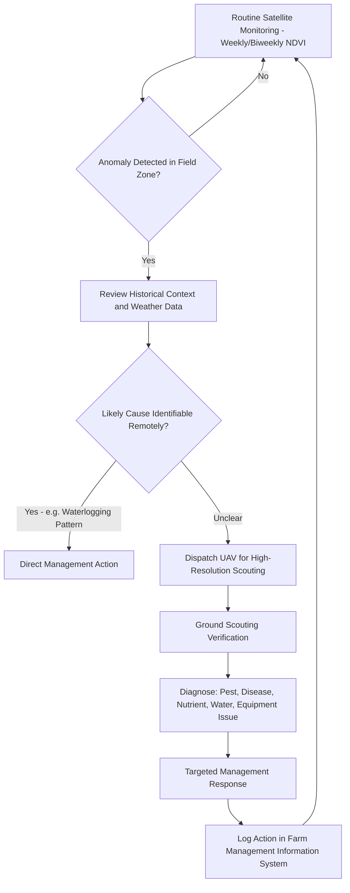
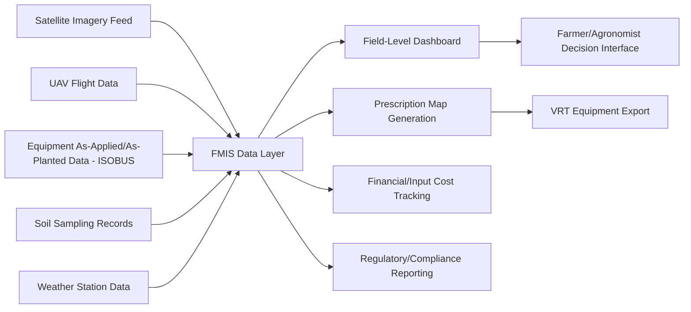

## Remote Sensing for Farm Management


### Overview

Remote Sensing for Farm Management encompasses the practical application of satellite, aerial, and UAV-based imagery to support day-to-day and season-long farm operational decisions — field scouting, input timing, equipment logistics, and record-keeping — distinct from the underlying biophysical retrieval science (vegetation indices, yield modeling) it draws upon. This topic focuses on the operational workflows, platform selection trade-offs, and farm management information system (FMIS) integration that translate remote sensing observations into actionable, timely farm decisions.

### Platform Selection for Farm-Level Monitoring

#### Satellite vs. UAV vs. Manned Aircraft Trade-offs

| Factor | Satellite | UAV/Drone | Manned Aircraft |
| --- | --- | --- | --- |
| Spatial resolution | 3-30m (commercial to free) | Sub-cm to few cm | 10cm-1m typical |
| Revisit frequency | Fixed orbital cycle (1-16 days) | On-demand, farmer-scheduled | On-demand, service-scheduled |
| Cloud cover dependency | High (optical); SAR unaffected | None (flies below cloud base) | Low (flies below cloud base) |
| Coverage per session | Large area, low marginal cost | Limited by battery/flight time (typically 20-400 ha/flight) | Large area, higher per-flight cost |
| Upfront cost | Low/free (public) to subscription (commercial) | Moderate hardware + ongoing operational cost | High per-service cost |
| Regulatory constraints | None (passive reception) | Airspace/registration/pilot certification requirements | Full aviation regulatory requirements |
| Typical use case | Season-long trend monitoring, large-acreage screening | Field-specific problem diagnosis, high-value crop scouting | Large-area high-resolution one-time surveys |

**Key Points**

- Satellite imagery is generally the most cost-effective choice for broad-acre, season-long trend monitoring across many fields, while UAVs excel at targeted, high-resolution investigation of specific in-field anomalies identified from coarser data
- A common operational pattern uses satellite imagery for routine whole-farm screening (weekly-to-biweekly NDVI anomaly checks) and dispatches UAV flights only to fields/zones flagged as anomalous, minimizing UAV operational cost while retaining high-resolution diagnostic capability
- SAR (Sentinel-1) provides the only reliable satellite option during persistently cloudy periods (early/late season in temperate climates, monsoon periods in tropical regions) when optical imagery may be unavailable for weeks

### Farm-Level Remote Sensing Workflow



### Field Scouting Applications

#### Anomaly-Driven Scouting

Satellite-derived NDVI/EVI anomaly maps (current imagery compared against field-specific historical baseline or within-field spatial statistics) identify zones warranting ground investigation, converting scouting from exhaustive field-walking to targeted verification.

**Common Anomaly Patterns and Likely Causes**

| Spatial Pattern | Likely Cause |
| --- | --- |
| Circular/patch-shaped low-NDVI zones | Waterlogging, disease hotspot, wildlife damage |
| Linear streaks following field pass direction | Equipment malfunction (planter row, sprayer boom, fertilizer spreader) |
| Field-edge decline | Herbicide drift, wildlife browsing, shading from adjacent trees |
| Gradual whole-field decline vs. neighboring fields | Nutrient deficiency, cultivar/variety difference, management timing difference |
| Elevation-correlated pattern | Topographically-driven water/nutrient variability (persistent across years) |

**Key Points**

- Distinguishing a **persistent** (recurring across multiple years, correlated with terrain/soil) anomaly from a **transient** (single-season, likely management or weather-driven) anomaly is critical for correctly prioritizing scouting response and long-term management zone design
- Multi-temporal comparison — not single-date imagery — is essential for reliable anomaly interpretation, since a single low-NDVI reading may simply reflect normal early-growth-stage low canopy cover rather than an actual problem

#### Disease and Pest Early Detection

Remote sensing-assisted disease/pest detection relies on the fact that many biotic stresses alter canopy reflectance (via chlorophyll degradation, canopy structure change, or leaf water content change) before symptoms become visible to the naked eye at typical scouting walking-pace observation distances:

- **Thermal imagery** — stomatal closure from pathogen infection (e.g., certain fungal pathogens affecting vascular function) can elevate canopy temperature before visible wilting
- **Red-edge/NDRE indices** — sensitive to chlorophyll degradation associated with many foliar diseases, often detecting stress days before visible symptom onset
- **Hyperspectral discrimination** — research-level applications distinguish specific pathogen signatures via narrowband spectral libraries, though this remains largely a specialized/research application rather than standard operational farm practice [Unverified — operational deployment maturity varies significantly by crop and pathogen, and current capability should be verified against current commercial product offerings]

### UAV Operations for Farm Management

#### Flight Planning Considerations

- **Ground Sample Distance (GSD)** selection — trade-off between flight altitude (coverage efficiency) and resolution needed for the diagnostic task (e.g., individual plant stand counting requires sub-cm GSD; general vigor mapping can use several-cm GSD)
- **Flight timing** — solar noon ± 2 hours generally preferred for consistent illumination in optical imagery; some applications (thermal stress detection) specifically require mid-afternoon timing when canopy-air temperature differentials are maximized
- **Overlap parameters** — typical 75-80% forward overlap and 60-70% side overlap for photogrammetric orthomosaic reconstruction via Structure-from-Motion (SfM)
- **Sensor calibration** — radiometric calibration panels (known-reflectance reference targets) photographed before/after flight enable conversion from raw digital numbers to calibrated reflectance, necessary for comparing imagery across flight dates

#### Common UAV Sensor Payloads

| Sensor Type | Application |
| --- | --- |
| RGB | Plant counting, canopy cover estimation, weed mapping, general visual scouting |
| Multispectral (typically RGB + red edge + NIR) | Vegetation index calculation, crop stress mapping |
| Thermal | Water stress detection (CWSI), irrigation system leak/malfunction detection |
| LiDAR | Canopy height/structure, biomass estimation in tree/vine crops, terrain mapping under canopy |
| Hyperspectral | Research-grade biochemical/disease discrimination (higher cost, more complex processing) |

### Field Boundary and Operational Mapping

- **Field boundary delineation** — semi-automated boundary extraction from satellite/UAV imagery using edge detection or segmentation, maintained as the foundational vector layer underlying all other farm GIS operations
- **As-planted/as-applied data integration** — overlaying equipment-logged planting, spraying, and harvest data (from ISOBUS-compatible equipment) with remote sensing observations to correlate management actions with observed crop response
- **Controlled traffic farming (CTF) mapping** — RTK-referenced permanent wheel-track mapping to minimize compaction by confining all equipment traffic to fixed lanes across seasons

### Implementation Examples

#### Python — Anomaly Screening Pipeline for Multi-Field Monitoring

```python
import numpy as np
import geopandas as gpd
import rasterio
from rasterio.mask import mask

def screen_fields_for_anomalies(field_boundaries_gdf, current_ndvi_path,
                                   historical_ndvi_paths, z_threshold=-1.5):
    """
    Screen multiple farm fields for NDVI anomalies by comparing
    current imagery against multi-year historical baseline, per field.
    field_boundaries_gdf: GeoDataFrame with field polygons and 'field_id' column
    historical_ndvi_paths: list of raster paths from prior years, same date-of-year
    """
    results = []

    with rasterio.open(current_ndvi_path) as src:
        current_crs = src.crs

    field_boundaries_gdf = field_boundaries_gdf.to_crs(current_crs)

    for _, field in field_boundaries_gdf.iterrows():
        geom = [field.geometry.__geo_interface__]

        # Extract current NDVI for this field
        with rasterio.open(current_ndvi_path) as src:
            current_data, _ = mask(src, geom, crop=True, nodata=np.nan)
            current_mean = np.nanmean(current_data)

        # Extract historical NDVI stack for this field
        historical_values = []
        for hist_path in historical_ndvi_paths:
            with rasterio.open(hist_path) as src:
                hist_data, _ = mask(src, geom, crop=True, nodata=np.nan)
                historical_values.append(np.nanmean(hist_data))

        hist_mean = np.mean(historical_values)
        hist_std = np.std(historical_values)

        z_score = (current_mean - hist_mean) / hist_std if hist_std > 0 else 0
        flagged = z_score <= z_threshold

        results.append({
            'field_id': field['field_id'],
            'current_ndvi': current_mean,
            'historical_mean_ndvi': hist_mean,
            'z_score': z_score,
            'flagged_for_scouting': flagged
        })

    return gpd.GeoDataFrame(results)
```

#### Python — UAV Orthomosaic Radiometric Calibration

```python
import numpy as np
import rasterio

def radiometric_calibrate_uav_imagery(raw_band_path, panel_dn_value, 
                                         panel_known_reflectance, output_path):
    """
    Convert raw UAV multispectral digital numbers to calibrated reflectance
    using a known-reflectance calibration panel reference.
    panel_dn_value: mean digital number measured on the calibration panel
    panel_known_reflectance: manufacturer-specified panel reflectance (e.g., 0.5 for 50% panel)
    """
    with rasterio.open(raw_band_path) as src:
        raw_dn = src.read(1).astype(float)
        profile = src.profile

    # Calibration coefficient: reflectance per unit DN
    calibration_factor = panel_known_reflectance / panel_dn_value

    calibrated_reflectance = raw_dn * calibration_factor
    calibrated_reflectance = np.clip(calibrated_reflectance, 0, 1)

    profile.update(dtype=rasterio.float32, count=1)
    with rasterio.open(output_path, "w", **profile) as dst:
        dst.write(calibrated_reflectance.astype(rasterio.float32), 1)

    return calibrated_reflectance
```

#### Field Boundary Extraction from Satellite Imagery

```python
import numpy as np
from skimage import segmentation, measure
import geopandas as gpd
from shapely.geometry import shape
import rasterio
from rasterio.features import shapes

def extract_field_boundaries(ndvi_array, transform, crs, min_area_ha=1.0,
                                pixel_size_m=10):
    """
    Semi-automated field boundary extraction using SLIC superpixel
    segmentation followed by polygon vectorization.
    """
    # Normalize NDVI to 0-1 range for segmentation input
    ndvi_norm = (ndvi_array - np.nanmin(ndvi_array)) / (np.nanmax(ndvi_array) - np.nanmin(ndvi_array))
    ndvi_norm = np.nan_to_num(ndvi_norm, nan=0)

    # SLIC superpixel segmentation
    segments = segmentation.slic(ndvi_norm, n_segments=500, compactness=0.1, channel_axis=None)

    # Vectorize segments to polygons
    polygons = []
    for geom, value in shapes(segments.astype(np.int32), transform=transform):
        poly = shape(geom)
        area_ha = poly.area / 10000  # assuming projected CRS in meters
        if area_ha >= min_area_ha:
            polygons.append({'geometry': poly, 'segment_id': int(value), 'area_ha': area_ha})

    return gpd.GeoDataFrame(polygons, crs=crs)
```

### Farm Management Information System (FMIS) Integration

Remote sensing outputs achieve operational value primarily through integration into a broader FMIS that consolidates field records, input applications, equipment data, and financial tracking:



**Key Points**

- Interoperability between remote sensing platforms, equipment telematics, and FMIS software remains an active friction point industry-wide, with data standards like ADAPT (AgGateway) and ISO-XML working to reduce proprietary format lock-in
- Cloud-based FMIS platforms increasingly offer native satellite imagery integration (automated field-boundary-clipped imagery delivery), reducing the manual GIS processing burden previously required for routine monitoring

### Multi-Year and Multi-Field Analytics

Beyond single-field, single-date analysis, farm-scale remote sensing supports:

- **Cross-field benchmarking** — comparing performance across fields with similar soil/climate conditions to identify management-driven (rather than biophysical) yield or vigor differences
- **Cultivar/hybrid trial evaluation** — comparing remote sensing-derived vigor/yield proxies between variety trial strips under controlled conditions
- **Historical archive mining** — leveraging multi-year satellite archives (e.g., Landsat back to 1984, Sentinel-2 since 2015) to establish long-term field productivity trends independent of any single season's weather anomaly
- **Whole-farm zone consistency analysis** — verifying that management zones derived for precision agriculture inputs remain stable/valid across multiple years rather than reflecting a single anomalous season

### Common Implementation Pitfalls

- Over-interpreting single-date imagery without accounting for normal phenological stage variation, mistaking early growth stage low vigor for an actual problem
- UAV flight scheduling without radiometric calibration panels, preventing valid quantitative comparison between flight dates (though qualitative within-flight relative comparison remains valid)
- Treating satellite-derived field-average statistics as representative when significant within-field spatial heterogeneity exists, masking localized problems in an averaged whole-field value
- Underestimating cloud-cover data gaps in optical-only monitoring programs during critical growth stage windows, particularly in humid/tropical climates where SAR supplementation may be necessary for continuous monitoring

### Conclusion

Remote sensing for farm management operationalizes the broader science of vegetation and yield remote sensing into practical, timely farm decision workflows — combining satellite-based routine screening with targeted UAV diagnostic flights, integrated through farm management information systems that consolidate imagery with equipment, soil, and weather data. Its practical value depends less on any single sensor's technical capability and more on the workflow design connecting anomaly detection to timely ground verification and management response.

**Related Topics**

- UAV Photogrammetry and Structure-from-Motion Processing
- Farm Management Information Systems (FMIS) Architecture
- Vegetation Indices and Canopy Analysis
- Crop Monitoring and Yield Estimation
- SAR Remote Sensing for Agriculture
- Thermal Remote Sensing for Crop Water Stress
- ISOBUS and Agricultural Data Interoperability
- Precision Agriculture Fundamentals
- Field Boundary Detection and Segmentation
- Radiometric Calibration of UAV Sensor Payloads