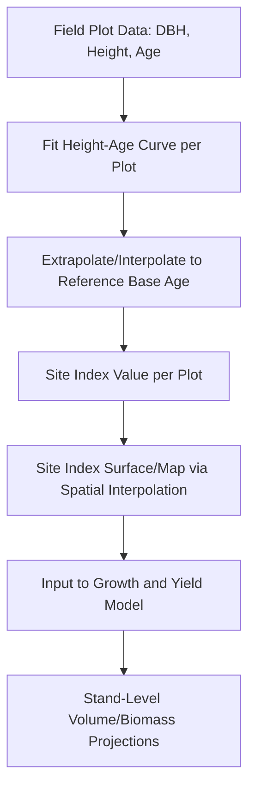
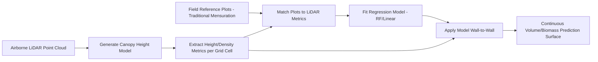

## Forest Inventory and Mensuration


### Overview

Forest Inventory and Mensuration is the science of measuring, sampling, and estimating forest resource quantities — tree dimensions, stand volume, biomass, growth rates, and stocking — to support timber management, carbon accounting, and ecosystem monitoring. It spans individual-tree measurement techniques, statistical sampling design for stand- and landscape-level estimation, and increasingly, remote sensing and LiDAR-based inventory methods that supplement or replace traditional field plot-based approaches.

### Individual Tree Measurement (Dendrometry)

#### Core Tree Metrics

| Metric | Measurement Method | Typical Instrument |
| --- | --- | --- |
| Diameter at Breast Height (DBH) | Circumference or direct diameter at 1.3m (US/most countries) or 1.4m (some European standards) above ground | Diameter tape, caliper |
| Total height | Trigonometric or direct measurement from base to apex | Clinometer, hypsometer, laser rangefinder |
| Merchantable height | Height to a specified minimum top diameter (utilization limit) | Same as total height, with upper-stem diameter estimation |
| Basal area | Cross-sectional area at breast height, derived from DBH | Calculated: $BA = \frac{\pi}{4}DBH^2$ |
| Crown diameter/width | Horizontal crown extent | Tape measurement, aerial photo/LiDAR delineation |
| Bark thickness | Radial bark depth | Bark gauge |
| Age | Ring count (destructive) or increment core (non-destructive) | Increment borer |

**Key Points**

- DBH measurement height standardization matters for cross-study/cross-country comparability; always verify the reference height convention (1.3m is most common internationally, but not universal)
- Trigonometric height measurement requires either a known/measured horizontal distance to the tree or a laser rangefinder providing distance directly, combined with angle-to-top and angle-to-base measurements

#### Trigonometric Height Formula

$$H = D(\tan\theta_{top} + \tan\theta_{base})$$

Where $H$ is tree height, $D$ is horizontal distance from observer to tree, $\theta_{top}$ is the angle of elevation to the tree top, and $\theta_{base}$ is the angle of depression to the tree base (added when standing below the base elevation of the tree; subtracted if standing above it, depending on sign convention).

### Volume Estimation

#### Tree Volume Equations

Individual tree volume is rarely measured directly (except destructively) and is instead estimated using **volume equations** or **taper equations** fitted to DBH, height, and sometimes form class, calibrated per species/region from destructively-sampled calibration trees.

**Simple Volume Equation Forms**

- **Combined variable (constant form factor) equation**: $V = b_0 + b_1(DBH^2 \times H)$
- **Logarithmic (Schumacher-Hall) equation**: $\ln(V) = b_0 + b_1\ln(DBH) + b_2\ln(H)$

**Taper Equations**

Taper equations model stem diameter as a continuous function of height along the bole, enabling volume integration to any merchantable top diameter limit rather than a single fixed total-volume estimate. Common forms include segmented polynomial taper models (e.g., Max & Burkhart) and variable-exponent taper models (e.g., Kozak), which divide the stem into neiloid (base), paraboloid (mid-bole), and conoid (upper-bole) geometric sections to better fit the characteristic stem shape than a single geometric solid assumption.

#### Volume Table and Form Factor Approaches

- **Local volume tables** — DBH-only lookup, calibrated for a specific region assuming typical height-DBH relationships hold
- **Standard volume tables** — DBH and height two-entry lookup, more broadly applicable across sites with varying height-DBH relationships
- **Form factor method** — expresses tree volume as a fraction of the volume of a cylinder with the same DBH and height:

$$V_{tree} = F \times \frac{\pi}{4}DBH^2 \times H$$

Where $F$ is the form factor (typically 0.4–0.5 for many species, reflecting the taper from cylindrical to conical stem shape).

### Sampling Design for Stand and Landscape Inventory

#### Plot-Based Sampling Methods

| Method | Description | Key Characteristic |
| --- | --- | --- |
| Fixed-area plot | Circular/rectangular plot of known area; all trees within counted/measured | Simple, unbiased area-based expansion |
| Point sampling (variable radius/Bitterlich) | Trees counted "in" if their DBH subtends an angle greater than a fixed basal area factor (BAF) gauge angle | Probability proportional to tree size; larger trees more likely selected |
| Line intersect sampling | Used for downed woody debris; pieces intersecting a transect line are tallied | Efficient for elongated/linear objects |
| Nested/subplot design | Larger plot for large trees, smaller nested subplot for regeneration/small trees | Balances measurement effort against small-tree density |

**Point Sampling (Horizontal Point Sampling / Bitterlich Method)**

A tree is counted "in" the sample if $DBH \geq D_{critical}$, where the critical diameter depends on distance from plot center and the Basal Area Factor (BAF) of the angle gauge/prism used:

$$D_{critical} = \text{Distance} \times \frac{2}{\sqrt{BAF} \times k}$$

(constant $k$ depends on unit system). Each "in" tree represents a basal area per hectare/acre equal to the BAF value, making point sampling probability-proportional-to-size — larger trees are inherently more likely to be selected than smaller trees at the same distance, which is statistically efficient for basal area/volume estimation since those are the quantities of primary interest.

**Key Points**

- Point sampling generally requires substantially less field time per plot than fixed-area plots for equivalent statistical precision in basal area/volume estimation, though it provides less direct information on stem density (trees per unit area) without additional calculation
- Nested plot designs address the practical problem that a plot size appropriate for measuring large overstory trees is inefficient for enumerating dense small-tree regeneration, and vice versa

#### Sampling Design Statistical Framework

Stand-level inventory relies on standard survey sampling theory to expand plot-level measurements to population (stand/forest) estimates with quantified precision:

$$\bar{X} = \frac{1}{n}\sum_{i=1}^{n} x_i, \quad SE(\bar{X}) = \frac{s}{\sqrt{n}}\sqrt{1-\frac{n}{N}}$$

Where $\bar{X}$ is the mean per-plot value (e.g., volume/ha), $s$ is the sample standard deviation, $n$ is the number of plots sampled, and $N$ is the total number of possible plot locations (finite population correction term, often negligible for large forest areas with small sampling fractions).

**Common Sampling Designs**

- **Simple random sampling** — plots randomly located across the inventory area; simplest but potentially inefficient if stand conditions are spatially heterogeneous
- **Systematic sampling** — plots on a regular grid; easier field logistics, generally provides good spatial coverage but standard error estimation is technically biased (systematic sampling variance is typically approximated using simple random sampling formulas as a conservative proxy)
- **Stratified sampling** — inventory area divided into strata (e.g., by forest type, age class, or pre-stratification from remote sensing) with independent sampling within each stratum, generally improving precision when strata are internally more homogeneous than the overall population
- **Multi-stage/cluster sampling** — used in large national forest inventories (e.g., clusters of subplots within a primary sampling unit), balancing statistical efficiency against field crew travel logistics

### Growth and Yield Modeling

#### Stand-Level Growth Models

- **Whole-stand models** — predict aggregate stand metrics (volume/ha, basal area/ha) directly as a function of stand age, site index, and density, without tracking individual trees
- **Size-class distribution models** — predict the distribution of trees across diameter classes over time (e.g., via diameter distribution functions like the Weibull distribution), providing more product-class detail than whole-stand aggregate output
- **Individual-tree models** — simulate growth of each tree based on its size, competition status (e.g., competition indices from neighboring tree distances/sizes), and site conditions, then aggregate to stand level; computationally intensive but captures within-stand heterogeneity and management response (e.g., differential thinning effects) that whole-stand models cannot

#### Site Index and Site Productivity

**Site Index** quantifies site productivity by the expected dominant/co-dominant tree height at a specified reference (base) age (commonly 25, 50, or 100 years depending on species/region convention), serving as the standard input variable for growth and yield models since height growth is relatively insensitive to stand density compared to diameter/volume growth.



### Remote Sensing and LiDAR-Based Inventory

#### Area-Based Approach (ABA)

The dominant operational method for LiDAR-assisted forest inventory, relating LiDAR-derived canopy height/density metrics to field-plot-measured volume/biomass via regression, then predicting across the full LiDAR coverage extent:

1. Acquire wall-to-wall airborne LiDAR point cloud over inventory area
2. Derive canopy height model (CHM) and extract height percentile metrics (e.g., $H_{mean}$, $H_{max}$, $H_{95}$) and canopy density metrics (proportion of returns above height thresholds) per grid cell
3. Establish field reference plots with matched LiDAR metrics and traditionally-measured volume/biomass
4. Fit regression (commonly random forest or other ML methods in current practice) relating LiDAR metrics to field-measured volume/biomass
5. Apply fitted model across the full wall-to-wall LiDAR coverage to generate continuous volume/biomass prediction surfaces



#### Individual Tree Detection (ITD)

Higher-density LiDAR (or UAV photogrammetric point clouds) enables detection and measurement of individual tree crowns rather than area-based aggregate prediction:

- **Local maxima filtering** — identifying tree apex candidates as local maxima in the canopy height model, followed by crown segmentation (e.g., watershed segmentation) around each detected apex
- **Point cloud segmentation** — direct 3D clustering of LiDAR returns into individual tree crowns without first rasterizing to a CHM, generally more effective in complex, multi-layered canopy structures
- **Key limitation**: ITD accuracy degrades substantially in dense, multi-story, or overlapping-crown canopy conditions, where smaller/suppressed trees are frequently missed (omission error) since their crowns are obscured beneath the dominant canopy layer

**Key Points**

- Area-based approaches are generally preferred for operational timber cruising/volume estimation at stand-to-landscape scale due to better-established statistical calibration frameworks and robustness in complex canopies
- Individual tree detection is preferred when tree-level attributes (species, exact stem count, individual crown metrics) are specifically required, such as precision forestry or ecological structural diversity studies

### Implementation Examples

#### Python — Point Sampling (Bitterlich) Volume Estimation

```python
import numpy as np

def point_sample_basal_area(tree_dbh_list, baf):
    """
    Estimate basal area per hectare from point-sampled ("in") trees.
    In point sampling, each 'in' tree represents exactly BAF units
    of basal area per hectare, regardless of its actual size.
    tree_dbh_list: DBH values (cm) of trees counted as 'in' at this point
    baf: Basal Area Factor of the angle gauge/prism used (m2/ha per tree)
    """
    n_in_trees = len(tree_dbh_list)
    basal_area_per_ha = n_in_trees * baf
    return basal_area_per_ha

def combined_variable_volume(dbh_cm, height_m, b0, b1):
    """
    Estimate individual tree volume using combined-variable equation.
    Coefficients (b0, b1) must be species/region-calibrated.
    """
    volume = b0 + b1 * (dbh_cm ** 2 * height_m)
    return max(volume, 0)

def stand_inventory_summary(plot_data, plot_area_ha):
    """
    Summarize fixed-area plot inventory data to stand-level estimates
    with sampling error.
    plot_data: list of dicts, each {'plot_id': ..., 'volume_m3': total plot volume}
    """
    volumes_per_plot = np.array([p['volume_m3'] for p in plot_data])
    volumes_per_ha = volumes_per_plot / plot_area_ha

    n = len(volumes_per_ha)
    mean_vol_ha = np.mean(volumes_per_ha)
    std_vol_ha = np.std(volumes_per_ha, ddof=1)
    se_vol_ha = std_vol_ha / np.sqrt(n)

    # 95% confidence interval (t-distribution for small samples)
    from scipy import stats
    t_crit = stats.t.ppf(0.975, df=n-1)
    ci_half_width = t_crit * se_vol_ha

    return {
        'mean_volume_m3_per_ha': mean_vol_ha,
        'standard_error': se_vol_ha,
        'ci_95_lower': mean_vol_ha - ci_half_width,
        'ci_95_upper': mean_vol_ha + ci_half_width,
        'coefficient_of_variation_pct': (std_vol_ha / mean_vol_ha) * 100
    }
```

#### Python — LiDAR Area-Based Approach Metric Extraction

```python
import numpy as np
import laspy

def extract_lidar_height_metrics(las_file_path, ground_height_threshold=2.0):
    """
    Extract standard height and density metrics from a LiDAR point cloud
    for area-based forest inventory (ABA) regression modeling.
    Assumes point cloud is already height-normalized (Z = height above ground).
    """
    las = laspy.read(las_file_path)
    heights = np.array(las.z)

    # Filter to vegetation returns above threshold (exclude ground/low noise)
    veg_heights = heights[heights >= ground_height_threshold]

    if len(veg_heights) == 0:
        return None

    metrics = {
        'h_mean': np.mean(veg_heights),
        'h_max': np.max(veg_heights),
        'h_stddev': np.std(veg_heights),
        'h_p25': np.percentile(veg_heights, 25),
        'h_p50': np.percentile(veg_heights, 50),
        'h_p75': np.percentile(veg_heights, 75),
        'h_p95': np.percentile(veg_heights, 95),
        'canopy_relief_ratio': (np.mean(veg_heights) - np.min(veg_heights)) / 
                                 (np.max(veg_heights) - np.min(veg_heights) + 1e-6),
    }

    # Canopy density: proportion of all returns above threshold
    metrics['canopy_density'] = len(veg_heights) / len(heights)

    return metrics

def fit_aba_volume_model(training_metrics_df, field_volume_col='volume_m3_ha'):
    """
    Fit random forest regression relating LiDAR metrics to field-measured
    volume for area-based approach (ABA) forest inventory.
    """
    from sklearn.ensemble import RandomForestRegressor
    from sklearn.model_selection import cross_val_score

    feature_cols = ['h_mean', 'h_max', 'h_stddev', 'h_p25', 'h_p50', 
                     'h_p75', 'h_p95', 'canopy_relief_ratio', 'canopy_density']

    X = training_metrics_df[feature_cols]
    y = training_metrics_df[field_volume_col]

    model = RandomForestRegressor(n_estimators=500, max_depth=10, random_state=42)
    scores = cross_val_score(model, X, y, cv=5, scoring='r2')
    model.fit(X, y)

    print(f"Cross-validated R²: {scores.mean():.3f} ± {scores.std():.3f}")
    return model
```

#### Individual Tree Detection via Local Maxima (Python)

```python
import numpy as np
from scipy.ndimage import maximum_filter, label
from skimage.segmentation import watershed

def detect_individual_trees(chm_array, min_height_m=3.0, window_size_px=5):
    """
    Detect individual tree apexes from a Canopy Height Model using
    local maxima filtering, followed by watershed crown segmentation.
    """
    # Mask out non-forest/low vegetation
    chm_masked = np.where(chm_array >= min_height_m, chm_array, 0)

    # Local maxima detection
    local_max = maximum_filter(chm_masked, size=window_size_px) == chm_masked
    local_max &= (chm_masked > 0)

    # Label individual tree apex candidates
    markers, n_trees = label(local_max)

    # Watershed segmentation for crown delineation (inverted CHM as elevation surface)
    crown_labels = watershed(-chm_masked, markers, mask=(chm_masked > 0))

    tree_locations = []
    for tree_id in range(1, n_trees + 1):
        tree_mask = crown_labels == tree_id
        if np.any(tree_mask):
            tree_height = np.max(chm_masked[tree_mask])
            crown_area_px = np.sum(tree_mask)
            tree_locations.append({
                'tree_id': tree_id,
                'height_m': tree_height,
                'crown_area_px': crown_area_px
            })

    return tree_locations, crown_labels
```

### National and Large-Area Forest Inventory Programs

- **USDA Forest Inventory and Analysis (FIA)** — US national program using a systematic hexagonal grid sampling design with permanent plots remeasured on a rotating panel cycle, forming the statistical backbone for national forest resource reporting
- **National Forest Inventories (NFIs)** — analogous systematic programs in most forested nations, increasingly incorporating satellite/LiDAR remote sensing to supplement field plot networks and improve spatial resolution between plots
- **REDD+ MRV (Measurement, Reporting, Verification)** — international framework requiring forest carbon stock estimation, driving substantial investment in LiDAR/satellite-based biomass mapping methodologies in tropical forest nations

### Common Implementation Pitfalls

- Mixing DBH measurement height conventions (1.3m vs. 1.4m) when combining historical or multi-source datasets without standardization
- Treating systematic sampling variance estimates (calculated via simple random sampling formulas) as exact rather than approximate/conservative
- Applying volume/taper equations outside their calibration region (species, diameter range, geographic area) without validation, since these are empirical fits that do not extrapolate reliably
- Using area-based LiDAR volume models calibrated in one forest type/structure and applying them unmodified to structurally different stands (e.g., transferring a single-species plantation model to mixed natural forest) [Inference — the degree of transfer error depends on how different the target stand structure is from the calibration dataset, and local recalibration is generally advisable]
- Individual tree detection accuracy claims from vendor/research literature often reflect performance in relatively open-canopy conditions; expect higher omission rates for suppressed/understory trees in dense multi-layered canopies

### Conclusion

Forest inventory and mensuration combines individual-tree measurement science, statistically rigorous sampling design, and increasingly LiDAR/remote-sensing-based area-based and individual-tree-detection methods to estimate forest volume, biomass, and growth across scales from single stands to national programs. While remote sensing has substantially expanded spatial coverage and reduced field sampling intensity requirements, field-measured reference plots remain the essential calibration and validation foundation underlying all remote sensing-based inventory approaches.

**Related Topics**

- LiDAR Point Cloud Processing and Canopy Height Models
- Forest Biomass and Carbon Stock Estimation
- Growth and Yield Modeling (Individual-Tree and Whole-Stand)
- Site Index and Forest Productivity Assessment
- National Forest Inventory Sampling Design (FIA-style Programs)
- REDD+ MRV and Tropical Forest Carbon Monitoring
- UAV Photogrammetry for Forest Structure
- Statistical Sampling Theory for Natural Resources
- Individual Tree Crown Detection and Segmentation
- Forest Stand Dynamics and Competition Modeling