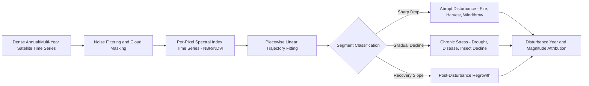
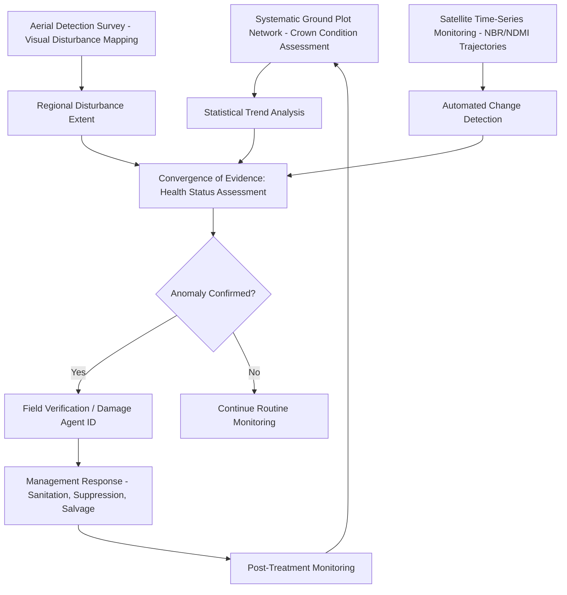

## Forest Health Monitoring


### Overview

Forest Health Monitoring is the systematic assessment of forest condition to detect, quantify, and track biotic (pest, disease, invasive species) and abiotic (drought, wind, fire, pollution) stressors and their impacts on tree vigor, mortality, and ecosystem function. It combines ground-based crown condition assessment protocols, remote sensing-based disturbance detection, and long-term ecological monitoring networks to distinguish normal background mortality/stress from anomalous decline events requiring management intervention.

### Ground-Based Health Assessment

#### Crown Condition Indicators

Individual tree crown condition serves as the primary visual proxy for overall tree vigor and is the foundation of most national forest health monitoring protocols:

| Indicator | Description | Assessment Method |
| --- | --- | --- |
| Crown dieback | Percentage of crown volume with recently dead branches, from the top/outer crown inward | Visual estimation in 5-10% classes |
| Foliage transparency | Amount of skylight visible through the live crown, inversely related to foliage density | Visual estimation against reference photos |
| Crown density/fullness | Amount of branch and foliage material relative to a full, healthy crown | Visual estimation |
| Crown vigor class | Composite ordinal rating (e.g., healthy/declining/dead) integrating multiple visual cues | Categorical field assessment |
| Discoloration | Foliage color deviation from expected healthy green (chlorotic, necrotic patterns) | Visual estimation with pattern description |

**Key Points**

- Crown condition assessment is inherently observer-subjective; national programs invest heavily in field crew calibration/certification and standardized reference photo guides to maintain inter-observer consistency
- Crown dieback and transparency together are generally considered the most reliable/repeatable indicators across observers, while more subjective composite vigor classes show greater inter-rater variability [Inference — the degree of inter-rater agreement varies by program methodology and training intensity, and should be evaluated against program-specific quality assurance data]

#### Damage Agent Identification and Coding

Standardized damage agent coding systems (e.g., USDA Forest Service Forest Health Monitoring damage agent codes) classify observed symptoms by causal category, enabling systematic tracking of specific pest/disease/abiotic agents across large monitoring networks:

- **Insects** — defoliators (e.g., gypsy moth, spruce budworm), bark beetles, wood borers
- **Diseases** — root diseases (e.g., Armillaria, Heterobasidion), foliar diseases, stem cankers, vascular wilts (e.g., Dutch elm disease, oak wilt)
- **Abiotic** — drought stress, wind/ice damage, fire scarring, flooding, frost/freeze damage, air pollution/ozone injury
- **Human-caused** — mechanical injury, herbicide damage, construction impact

### National and International Monitoring Networks

- **USDA Forest Health Monitoring (FHM) / Forest Inventory and Analysis (FIA) integration** — US national program combining systematic crown condition plots with the FIA inventory grid, providing statistically-based trend estimation across ownership and forest type strata
- **ICP Forests (International Co-operative Programme on Assessment and Monitoring of Air Pollution Effects on Forests)** — European long-term monitoring network, historically focused on air pollution/acid deposition impacts, now broadly tracking forest condition including climate stress
- **Detection Surveys / Aerial Detection Survey (ADS)** — annual or periodic aerial (fixed-wing) visual surveys mapping large-scale, visually distinctive damage (bark beetle red-attack, defoliation) across broad forest landscapes, providing rapid regional-scale disturbance extent mapping complementary to intensive ground plots

### Remote Sensing for Forest Disturbance Detection

#### Change Detection Approaches

| Method | Approach | Best Suited For |
| --- | --- | --- |
| Bi-temporal differencing | Direct subtraction/ratio of vegetation index between two dates | Simple, abrupt disturbances (clearcut, fire) |
| Spectral trajectory/time-series segmentation | Analyzing full time-series trajectory per pixel to identify breakpoints (e.g., LandTrendr, CCDC algorithms) | Both abrupt and gradual/chronic disturbance |
| Post-classification comparison | Independently classify each date, then compare classifications | When classes themselves (not just index values) are of interest |
| Object-based change detection | Segment imagery into objects, compare object-level attributes over time | Reducing pixel-level noise, ecologically meaningful units |

**LandTrendr-Style Temporal Segmentation Concept**

Time-series segmentation algorithms fit piecewise linear trajectories to per-pixel spectral index time series (typically NDVI, NBR, or a disturbance-sensitive tasseled cap component), decomposing the trajectory into segments representing stable, gradual change (e.g., growth, chronic decline), and abrupt disturbance events:



#### Disturbance-Sensitive Spectral Indices

| Index | Formula | Application |
| --- | --- | --- |
| NBR (Normalized Burn Ratio) | $\frac{NIR-SWIR2}{NIR+SWIR2}$ | Fire severity, burned area mapping |
| dNBR | $NBR_{pre} - NBR_{post}$ | Burn severity classification (USGS classification thresholds commonly applied) |
| NDMI | $\frac{NIR-SWIR1}{NIR+SWIR1}$ | Canopy moisture stress, drought/beetle mortality detection |
| Tasseled Cap Wetness | Linear transform of multiple bands | Disturbance detection, generally robust across sensor calibration differences |
| RdNBR (Relative dNBR) | $\frac{dNBR}{\sqrt{ | NBR_{pre} |

### Bark Beetle and Insect Outbreak Detection

Bark beetle-caused mortality (e.g., mountain pine beetle, spruce beetle, southern pine beetle) exhibits a characteristic multi-stage spectral signature exploited for remote detection:

1. **Green attack** — trees recently attacked but still photosynthetically active; spectrally near-indistinguishable from healthy trees using standard broadband indices, though narrowband/hyperspectral or subtle red-edge shifts can sometimes detect this stage before visible symptoms
2. **Red attack** — foliage has died and turned red/reddish-brown, typically 8-12 months post-attack depending on species/climate; the most reliably and widely detected stage via standard optical remote sensing (distinctive red-brown color signature)
3. **Gray attack** — needles have fully dropped, leaving standing dead gray/bare stems; spectrally distinct from both healthy and red-attack stages, often confused with other bare-canopy conditions if not analyzed in temporal context

**Key Points**

- The "green attack" detection gap — the inability to reliably detect the earliest infestation stage before visible red-attack symptoms — remains the primary operational limitation for using satellite remote sensing in proactive (rather than reactive) bark beetle management, since by the time red-attack is detectable the tree is already dead and infestation may have spread further
- Aerial detection surveys remain the operational standard for red-attack mapping in many management programs due to established workflows, though satellite-based automated detection is increasingly supplementing/replacing manual aerial sketch-mapping in some regions

### Drought Stress and Mortality Detection

- **NDMI/NDWI time series decline** — canopy moisture stress precedes visible mortality, providing potential early-warning capability distinct from post-mortality red/brown color change
- **Thermal-based stress detection** — elevated canopy temperature from reduced transpiration (stomatal closure under water stress), analogous to agricultural Crop Water Stress Index applications but adapted for forest canopy structure
- **SPI/SPEI correlation with forest mortality events** — regional drought severity indices used to contextualize observed mortality patterns and identify drought-vulnerability hotspots (often correlated with site factors: shallow soils, south-facing slopes, high stand density/competition)

### Wildfire Severity and Post-Fire Monitoring

#### Burn Severity Classification

dNBR/RdNBR thresholds (commonly following USGS/composite burn index calibration) classify burned area into severity classes:

| dNBR Range (approximate, sensor/region-dependent) | Severity Class |
| --- | --- |
| Below regeneration threshold | Unburned/Very Low |
| Low positive values | Low Severity |
| Moderate positive values | Moderate Severity |
| High positive values | High Severity |

[Unverified] Exact dNBR threshold values for severity class boundaries vary by ecosystem, pre-fire vegetation density, and sensor, and operational classifications typically require local field calibration (Composite Burn Index ground plots) rather than applying universal fixed thresholds.

#### Post-Fire Recovery Monitoring

Time-series NDVI/NBR trajectory analysis following fire tracks vegetation recovery trajectory, useful for identifying areas of delayed or failed regeneration requiring active reforestation intervention versus areas recovering naturally within expected timeframes for the given ecosystem/fire severity combination.

### Implementation Examples

#### Python — dNBR Burn Severity Classification

```python
import numpy as np
import rasterio

def calculate_dnbr(pre_fire_nir, pre_fire_swir2, post_fire_nir, post_fire_swir2):
    """
    Calculate delta Normalized Burn Ratio for burn severity assessment.
    """
    eps = 1e-10
    nbr_pre = (pre_fire_nir - pre_fire_swir2) / (pre_fire_nir + pre_fire_swir2 + eps)
    nbr_post = (post_fire_nir - post_fire_swir2) / (post_fire_nir + post_fire_swir2 + eps)

    dnbr = nbr_pre - nbr_post
    return dnbr, nbr_pre, nbr_post

def classify_burn_severity(dnbr, thresholds=None):
    """
    Classify dNBR into severity classes. Default thresholds are
    illustrative USGS-style values; local calibration via field
    Composite Burn Index plots is recommended for operational use.
    """
    if thresholds is None:
        thresholds = {
            'unburned': (-np.inf, 0.10),
            'low': (0.10, 0.27),
            'moderate_low': (0.27, 0.44),
            'moderate_high': (0.44, 0.66),
            'high': (0.66, np.inf)
        }

    severity_map = np.full(dnbr.shape, 'unclassified', dtype=object)
    for label, (low, high) in thresholds.items():
        mask = (dnbr >= low) & (dnbr < high)
        severity_map[mask] = label

    return severity_map
```

#### Python — Simplified Temporal Segmentation for Disturbance Detection

```python
import numpy as np
import ruptures as rpt

def detect_disturbance_breakpoints(time_series_values, dates, penalty=3):
    """
    Detect abrupt disturbance events in a per-pixel spectral index
    time series using change point detection (simplified LandTrendr-style
    concept using the ruptures library's PELT algorithm).
    time_series_values: 1D array of index values (e.g., NBR) ordered by date
    """
    # Handle missing/cloud-masked values via linear interpolation
    valid_mask = ~np.isnan(time_series_values)
    if valid_mask.sum() < 3:
        return None

    interpolated = np.interp(
        np.arange(len(time_series_values)),
        np.where(valid_mask)[0],
        time_series_values[valid_mask]
    )

    # PELT change point detection
    algo = rpt.Pelt(model="rbf").fit(interpolated)
    breakpoints = algo.predict(pen=penalty)

    # Characterize each segment
    segments = []
    start_idx = 0
    for bp in breakpoints:
        segment_values = interpolated[start_idx:bp]
        if len(segment_values) > 1:
            magnitude = segment_values[-1] - segment_values[0]
            segments.append({
                'start_date': dates[start_idx],
                'end_date': dates[min(bp, len(dates)-1)],
                'magnitude': magnitude,
                'type': 'disturbance' if magnitude < -0.1 else 
                        'recovery' if magnitude > 0.1 else 'stable'
            })
        start_idx = bp

    return segments
```

#### Bark Beetle Red-Attack Detection

```python
import numpy as np

def detect_red_attack(red_band, green_band, nir_band, red_threshold_ratio=1.15):
    """
    Simplified red-attack bark beetle mortality detection using
    red-to-green band ratio combined with reduced NIR (loss of healthy
    canopy reflectance signature).
    """
    eps = 1e-10
    red_green_ratio = red_band / (green_band + eps)

    # Red attack candidates: elevated red relative to green (reddish-brown foliage)
    red_attack_candidate = red_green_ratio > red_threshold_ratio

    # Reduced NDVI confirms loss of healthy vegetation signal
    ndvi = (nir_band - red_band) / (nir_band + red_band + eps)
    low_vigor = ndvi < 0.3  # threshold requires local calibration

    red_attack_mask = red_attack_candidate & low_vigor
    return red_attack_mask
```

### Forest Health Monitoring Workflow



### Long-Term Ecological Context

- **Baseline/reference condition establishment** — long-term monitoring plots (often decades-long records) provide the essential historical context distinguishing anomalous decline from natural background mortality and successional dynamics
- **Climate-forest health interaction** — increasing integration of climate projection data with forest health monitoring to anticipate shifting pest/disease range and drought stress risk under changing climate conditions
- **Cumulative/interacting stressor analysis** — forest decline frequently results from interacting stressors (e.g., drought-weakened trees becoming more susceptible to bark beetle attack) rather than single causal agents, complicating simple single-indicator monitoring approaches

[Inference] Attribution of forest decline to a single primary causal agent becomes increasingly difficult as interacting stress complexes become more common under changing climate conditions, and monitoring programs increasingly emphasize multi-indicator convergence-of-evidence approaches over single-cause diagnosis.

### Common Implementation Pitfalls

- Relying solely on red/brown color-change detection for bark beetle or drought mortality, missing the earlier green-attack/pre-visible-symptom stage entirely
- Applying fixed dNBR severity thresholds across ecosystems with substantially different pre-fire vegetation density without local field calibration
- Interpreting a single-date NDVI/NBR anomaly as confirmed disturbance without temporal trajectory context, since single dates cannot distinguish transient phenological variation from genuine decline
- Insufficient ground crew calibration in crown condition assessment programs, introducing inter-observer variability that can obscure genuine trend signals in long-term monitoring datasets

### Conclusion

Forest health monitoring integrates standardized ground-based crown condition assessment, aerial detection surveys, and increasingly automated satellite time-series change detection to identify and track biotic and abiotic forest stressors across scales from individual stands to national/continental networks. The persistent challenge across all approaches is the trade-off between early detection (before damage is severe but often before it is spectrally/visually distinguishable) and detection reliability (which typically improves only once damage has progressed to visually or spectrally unambiguous stages).

**Related Topics**

- Fire Severity Mapping and Burn Ratio Indices
- Time-Series Change Detection Algorithms (LandTrendr, CCDC)
- Bark Beetle and Forest Insect Outbreak Dynamics
- Drought Stress Detection via Remote Sensing
- Forest Inventory and Mensuration
- Post-Disturbance Forest Regeneration Monitoring
- Aerial Detection Survey Methodology
- Climate Change Impacts on Forest Pest/Disease Range
- Long-Term Ecological Monitoring Network Design
- Thermal Remote Sensing for Vegetation Stress