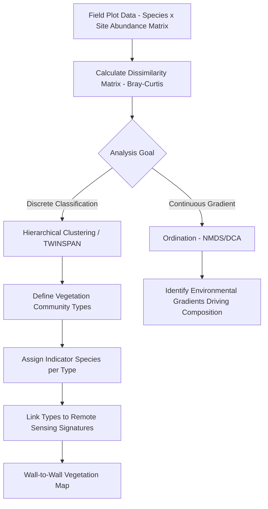

## Vegetation Classification and Mapping


### Overview

Vegetation Classification and Mapping is the discipline of categorizing and spatially delineating vegetation communities, land cover types, and species assemblages using field survey, remote sensing classification, and hierarchical taxonomic systems. It underpins habitat mapping, land cover change monitoring, conservation planning, and forest/rangeland management by translating continuous ecological variation into discrete, mappable, and repeatable classification units.

### Vegetation Classification Systems

#### Hierarchical Classification Frameworks

Vegetation classification systems organize communities hierarchically, from broad physiognomic (structural) categories down to fine floristic (species composition) detail:

| System | Origin/Scope | Hierarchy Basis |
| --- | --- | --- |
| National Vegetation Classification (NVC) | USA (FGDC standard) | Physiognomy (upper levels) → floristics (lower levels: alliance, association) |
| EUNIS Habitat Classification | Europe | Combines physiognomy, ecology, and floristics |
| IUCN Global Ecosystem Typology | Global | Ecological function and biotic/abiotic processes |
| UNESCO/IVC (International Vegetation Classification) | Global, floristic-physiognomic hybrid | Formation class → formation → alliance → association |
| Braun-Blanquet (Zurich-Montpellier) | Continental Europe origin, widely adopted | Purely floristic, statistically-defined plant associations |

**Key Points**

- **Physiognomic classification** (structure: forest, shrubland, grassland, based on growth form and canopy cover) is generally more readily mapped from remote sensing since structure correlates with spectral/structural signal, while **floristic classification** (species composition-based) typically requires field verification since closely related communities with different species composition can be spectrally near-identical
- Most modern operational classification systems are hybrid, using physiognomic criteria for upper hierarchy levels (mappable from remote sensing) and floristic criteria for finer levels (requiring field plot data), balancing mappability against ecological specificity

#### Land Cover vs. Land Use vs. Vegetation Community Classification

- **Land cover** — the observable biophysical material covering the land surface (forest, grassland, water, bare soil, impervious surface) — most directly mappable from remote sensing since it corresponds to spectral/structural properties
- **Land use** — the human functional/socioeconomic purpose of the land (agriculture, residential, conservation reserve) — often requires ancillary data beyond spectral signal alone (cadastral records, zoning, contextual reasoning) since the same land cover can serve multiple land use purposes
- **Vegetation community/type** — ecologically-defined assemblages based on species composition and environmental relationships, sitting conceptually between land cover (too coarse) and full floristic inventory (too fine-grained for wall-to-wall mapping) for most operational mapping purposes

### Field-Based Vegetation Survey Methods

#### Quadrat and Plot Sampling

- **Releve/plot sampling** — standardized plot (fixed area, e.g., 10m×10m for shrubland, up to 20m×20m or larger for forest) with full species inventory and cover-abundance estimation per species, forming the basic Braun-Blanquet-style data unit
- **Point-intercept/line-intercept sampling** — species presence recorded at systematic points or along transects, providing efficient, statistically robust cover estimates with lower per-plot effort than full quadrat inventory
- **Nested plot design** — multiple plot sizes within a single sample location, capturing species-area relationship information and accommodating different growth forms (trees at large plot scale, herbs/bryophytes at small subplot scale) at appropriate spatial resolution

#### Cover-Abundance Scales

Standardized ordinal scales convert visually-estimated percent cover into consistent categorical classes for statistical classification, most notably the **Braun-Blanquet scale** (r = rare/solitary, + = sparse/low cover, 1 = 1-5% cover... up to 5 = 75-100% cover), enabling comparison across surveyors and studies despite the inherent subjectivity of visual cover estimation.

### Statistical Vegetation Classification (Numerical Ecology)

#### Cluster Analysis for Community Type Definition

Floristic plot data (species × plot matrices of cover/abundance) is classified into discrete vegetation types using multivariate statistical clustering:

- **Hierarchical agglomerative clustering** (e.g., Ward's method, average linkage) — most common approach in vegetation science, producing a dendrogram from which the analyst selects a cut-level defining discrete community types
- **TWINSPAN (Two-Way Indicator Species Analysis)** — divisive polythetic classification specifically designed for ecological species-abundance data, simultaneously classifying both sites and identifying indicator species characterizing each resulting group
- **Dissimilarity/distance metrics** — Bray-Curtis dissimilarity is the standard choice for vegetation abundance data (as opposed to Euclidean distance, which performs poorly with the typically zero-inflated, compositional nature of species abundance matrices)

**Bray-Curtis Dissimilarity**

$$BC_{jk} = \frac{\sum_i |x_{ij} - x_{ik}|}{\sum_i (x_{ij} + x_{ik})}$$

Where $x_{ij}$ and $x_{ik}$ are the abundance of species $i$ in plots $j$ and $k$ respectively.

#### Ordination for Gradient Analysis

Complementary to discrete classification, ordination methods represent continuous compositional gradients rather than forcing discrete boundaries:

- **NMDS (Non-metric Multidimensional Scaling)** — preserves rank-order dissimilarity relationships in reduced dimensional space, robust to non-linear species response curves, widely preferred in current vegetation ecology practice
- **DCA (Detrended Correspondence Analysis)** — historically popular unimodal-response ordination method, addressing the "arch effect" distortion of simple correspondence analysis
- **CCA/RDA (Canonical Correspondence/Redundancy Analysis)** — constrained ordination directly relating compositional variation to measured environmental gradients (soil, climate, terrain variables)



### Remote Sensing-Based Vegetation Mapping

#### Classification Approaches

| Approach | Method | Best Suited For |
| --- | --- | --- |
| Pixel-based supervised classification | Random Forest, SVM, Maximum Likelihood on per-pixel spectral values | General land cover, coarse-to-moderate resolution |
| Object-Based Image Analysis (OBIA) | Segment into homogeneous objects first, then classify object-level attributes | High-resolution imagery, reducing salt-and-pepper noise, capturing spatial/textural context |
| Time-series/phenology-based classification | Classify using full-season spectral trajectory rather than single-date snapshot | Distinguishing spectrally similar but phenologically distinct vegetation types |
| Deep learning (CNN/semantic segmentation) | Convolutional neural networks learning spatial-spectral patterns directly | High-resolution imagery, complex spatial pattern recognition, increasingly standard for fine-scale mapping |

**Key Points**

- Object-Based Image Analysis is generally preferred over pixel-based classification for high-resolution imagery (sub-meter to few-meter) since individual pixels at this resolution capture sub-object spectral noise (e.g., individual leaves/shadows within a single tree crown) that segmentation into object-level units averages out
- Phenology-based (multi-temporal) classification frequently outperforms single-date classification for distinguishing vegetation types with similar peak-season spectral signatures but different phenological timing (e.g., deciduous vs. evergreen forest, C3 vs. C4 grass species, spring-ephemeral vs. summer-active understory)

#### Object-Based Image Analysis (OBIA) Workflow


#### Multi-Sensor and Multi-Temporal Data Fusion

- **Optical + SAR fusion** — combining spectral (optical) and structural (SAR backscatter) information, particularly valuable for distinguishing vegetation types with similar spectral signatures but different canopy/biomass structure
- **LiDAR structural integration** — canopy height and vertical structure metrics (from Forest Inventory and Mensuration methods) as classification features, enabling discrimination of structurally distinct but spectrally similar vegetation types (e.g., tall shrubland vs. young forest)
- **Multi-seasonal composite classification** — stacking imagery from multiple phenological windows (spring green-up, peak summer, fall senescence) as a multi-band classification input, substantially improving discrimination of vegetation types with distinct phenological signatures

### Accuracy Assessment

#### Confusion Matrix and Standard Accuracy Metrics

$$\text{Overall Accuracy} = \frac{\sum_{i} n_{ii}}{N}$$

Where $n_{ii}$ is the number of correctly classified samples for class $i$ (diagonal of confusion matrix) and $N$ is the total number of reference samples.

**Class-Specific Accuracy Metrics**

- **Producer's Accuracy (Omission Error complement)**: $\frac{n_{ii}}{\text{column total}_i}$ — the probability a reference sample of class $i$ is correctly classified
- **User's Accuracy (Commission Error complement)**: $\frac{n_{ii}}{\text{row total}_i}$ — the probability a pixel classified as class $i$ is actually that class on the ground

**Kappa Coefficient**

$$\kappa = \frac{p_o - p_e}{1 - p_e}$$

Where $p_o$ is observed accuracy and $p_e$ is expected accuracy by chance agreement, adjusting for the possibility that some agreement between classification and reference occurs by random chance alone. [Inference — Kappa remains widely reported in vegetation mapping accuracy assessments though some methodological literature has raised concerns about its sensitivity to class prevalence imbalance; current best practice recommendations should be checked against recent accuracy assessment methodology literature for specific applications]

**Key Points**

- Reference/validation data must be independent of training data and ideally collected via a probability-based sampling design (stratified random sampling is common) rather than convenience sampling, to support statistically valid accuracy and area estimates
- Producer's and User's accuracy should always be reported per-class alongside overall accuracy, since overall accuracy can mask substantial performance disparities between classes (particularly for rare/minority vegetation types)

### Implementation Examples

#### Python — Hierarchical Clustering for Vegetation Community Classification

```python
import numpy as np
import pandas as pd
from scipy.spatial.distance import pdist, squareform
from scipy.cluster.hierarchy import linkage, fcluster, dendrogram

def classify_vegetation_communities(species_abundance_matrix, n_clusters=None, 
                                       distance_threshold=None):
    """
    Classify vegetation plots into community types using Bray-Curtis
    dissimilarity and Ward's hierarchical clustering.
    species_abundance_matrix: DataFrame, rows=plots, columns=species, values=cover/abundance
    """
    # Bray-Curtis dissimilarity (standard for abundance/compositional data)
    bc_dist = pdist(species_abundance_matrix.values, metric='braycurtis')
    bc_dist_square = squareform(bc_dist)

    # Ward's linkage hierarchical clustering
    Z = linkage(bc_dist, method='ward')

    if n_clusters is not None:
        clusters = fcluster(Z, n_clusters, criterion='maxclust')
    elif distance_threshold is not None:
        clusters = fcluster(Z, distance_threshold, criterion='distance')
    else:
        raise ValueError("Specify either n_clusters or distance_threshold")

    result = pd.DataFrame({
        'plot_id': species_abundance_matrix.index,
        'community_type': clusters
    })

    return result, Z, bc_dist_square

def identify_indicator_species(species_abundance_matrix, cluster_assignments, top_n=5):
    """
    Identify characteristic/indicator species per community type
    using simple mean-abundance-within-cluster approach.
    (For rigorous indicator species analysis, use dedicated methods
    like Indicator Value/IndVal analysis.)
    """
    indicators = {}
    for cluster_id in np.unique(cluster_assignments):
        plots_in_cluster = species_abundance_matrix.index[cluster_assignments == cluster_id]
        mean_abundance = species_abundance_matrix.loc[plots_in_cluster].mean(axis=0)
        top_species = mean_abundance.nlargest(top_n)
        indicators[cluster_id] = top_species.to_dict()

    return indicators
```

#### Python — Object-Based Image Analysis Segmentation and Classification

```python
import numpy as np
from skimage.segmentation import felzenszwalb
from skimage.measure import regionprops
from sklearn.ensemble import RandomForestClassifier

def obia_segment_and_classify(multiband_image, training_samples, scale=100, 
                                 sigma=0.5, min_size=20):
    """
    Object-based image analysis: segment imagery, extract object features,
    classify segments using a trained random forest.
    multiband_image: (bands, height, width) array
    training_samples: list of (segment_features, label) tuples for training
    """
    # Use first 3 bands (or PCA-reduced) for segmentation
    rgb_like = np.transpose(multiband_image[:3], (1, 2, 0))
    rgb_normalized = (rgb_like - rgb_like.min()) / (rgb_like.max() - rgb_like.min())

    # Felzenszwalb segmentation
    segments = felzenszwalb(rgb_normalized, scale=scale, sigma=sigma, min_size=min_size)

    # Extract object-level features (mean spectral value per band per object)
    n_bands = multiband_image.shape[0]
    object_features = []
    object_ids = []

    for region in regionprops(segments + 1):  # +1 since regionprops needs positive labels
        mask = segments == (region.label - 1)
        mean_spectral = [np.mean(multiband_image[b][mask]) for b in range(n_bands)]
        std_spectral = [np.std(multiband_image[b][mask]) for b in range(n_bands)]

        features = mean_spectral + std_spectral + [region.area, region.eccentricity]
        object_features.append(features)
        object_ids.append(region.label - 1)

    object_features = np.array(object_features)

    # Train classifier on labeled training samples
    X_train = np.array([f for f, _ in training_samples])
    y_train = np.array([label for _, label in training_samples])

    clf = RandomForestClassifier(n_estimators=300, random_state=42)
    clf.fit(X_train, y_train)

    predictions = clf.predict(object_features)

    # Map predictions back to segment raster
    classified_map = np.zeros_like(segments)
    for obj_id, pred in zip(object_ids, predictions):
        classified_map[segments == obj_id] = pred

    return classified_map, segments
```

#### Accuracy Assessment (Confusion Matrix and Kappa)

```python
import numpy as np
from sklearn.metrics import confusion_matrix, cohen_kappa_score, classification_report

def assess_classification_accuracy(reference_labels, predicted_labels, class_names):
    """
    Standard accuracy assessment for vegetation/land cover classification.
    reference_labels: ground-truth labels from independent validation sample
    predicted_labels: classifier output for the same validation locations
    """
    cm = confusion_matrix(reference_labels, predicted_labels)

    overall_accuracy = np.trace(cm) / np.sum(cm)
    kappa = cohen_kappa_score(reference_labels, predicted_labels)

    # Producer's accuracy (per-class, column-normalized)
    producers_accuracy = np.diag(cm) / np.sum(cm, axis=0)
    # User's accuracy (per-class, row-normalized)
    users_accuracy = np.diag(cm) / np.sum(cm, axis=1)

    results = {
        'overall_accuracy': overall_accuracy,
        'kappa': kappa,
        'confusion_matrix': cm,
        'producers_accuracy': dict(zip(class_names, producers_accuracy)),
        'users_accuracy': dict(zip(class_names, users_accuracy))
    }

    print(f"Overall Accuracy: {overall_accuracy:.3f}")
    print(f"Kappa Coefficient: {kappa:.3f}")
    print("\nFull Classification Report:")
    print(classification_report(reference_labels, predicted_labels, target_names=class_names))

    return results
```

### Time-Series Phenology-Based Classification

```python
import numpy as np
from sklearn.ensemble import RandomForestClassifier

def phenology_based_classification(multi_temporal_ndvi_stack, training_pixels, training_labels):
    """
    Classify vegetation using full-season NDVI time series as features,
    exploiting phenological differences invisible in single-date imagery.
    multi_temporal_ndvi_stack: (n_dates, height, width) array
    training_pixels: list of (row, col) tuples for training locations
    """
    n_dates = multi_temporal_ndvi_stack.shape[0]

    # Extract phenological feature vectors for training pixels
    X_train = np.array([
        multi_temporal_ndvi_stack[:, r, c] for r, c in training_pixels
    ])

    clf = RandomForestClassifier(n_estimators=500, max_depth=15, random_state=42)
    clf.fit(X_train, training_labels)

    # Reshape full image stack for prediction
    h, w = multi_temporal_ndvi_stack.shape[1:]
    X_full = multi_temporal_ndvi_stack.reshape(n_dates, -1).T  # (pixels, n_dates)

    predictions = clf.predict(X_full)
    classified_map = predictions.reshape(h, w)

    return classified_map, clf.feature_importances_
```

### Standard Vegetation/Land Cover Products

- **National Land Cover Database (NLCD)** — US 30m resolution, Anderson-scheme-derived land cover classification, updated periodically
- **ESA WorldCover / Copernicus Global Land Cover** — global 10-100m resolution products from Sentinel data, widely used baseline for global-scale vegetation/land cover analysis
- **GlobeLand30** — global 30m land cover product
- **Dynamic World (Google/WRI)** — near-real-time 10m global land cover classification updated continuously from Sentinel-2, using deep learning classification

### Common Implementation Pitfalls

- Using Euclidean distance instead of Bray-Curtis (or similar compositional) dissimilarity for species abundance data, which distorts cluster structure due to the zero-inflated, compositional nature of typical vegetation plot data
- Selecting an arbitrary dendrogram cut-level for discrete classification without ecological or statistical justification (e.g., silhouette analysis, indicator species significance testing)
- Training and validating a classifier on spatially autocorrelated (spatially clustered) samples rather than a properly randomized/stratified independent validation set, inflating apparent accuracy
- Applying single-date classification to vegetation types that are only spectrally distinguishable during specific phenological windows, missing critical seasonal discrimination opportunities
- Reporting only overall accuracy without per-class producer's/user's accuracy, obscuring poor performance on rare or difficult-to-distinguish vegetation types

### Conclusion

Vegetation classification and mapping bridges field-based numerical ecology (statistical clustering and ordination of species composition data) with remote sensing classification (pixel, object, and phenology-based approaches) to produce spatially explicit, hierarchically organized vegetation maps. Robust practice requires matching classification approach to available imagery resolution and phenological distinctiveness of target classes, combined with statistically rigorous, independent accuracy assessment reporting both aggregate and per-class performance metrics.

**Related Topics**

- Numerical Ecology and Multivariate Community Analysis
- Object-Based Image Analysis (OBIA) Methodology
- Accuracy Assessment and Confusion Matrix Interpretation
- Phenology-Based and Time-Series Remote Sensing Classification
- Habitat Mapping and Conservation Planning
- Global Land Cover Products (WorldCover, Dynamic World, NLCD)
- Deep Learning for Semantic Segmentation of Imagery
- Multi-Sensor Data Fusion (Optical-SAR-LiDAR)
- Forest Inventory and Mensuration
- Plant Community Ecology and Indicator Species Analysis